
<style>
:root {
  --fg:#1f2328; --muted:#55606b; --bg:#ffffff; --bg-alt:#f6f8fa;
  --border:#d0d7de; --link:#004276; --accent:#b85450;
  --ok:#5fa55f; --warn:#e0b300;
  --prol-bg:#fff8e7; --prol-border:#e0b300; --prol-ink:#4a3500;
  --dd-bg:#eef7ee;  --dd-border:#5fa55f;  --dd-ink:#1a3d1a;
  --zh-bg:#f0f7ff;  --zh-border:#4a90e2;  --zh-ink:#1a3a5c;
  --std-bg:#fff5f0; --std-border:#b85450;
  --sm-bg:#f4faf4;  --sm-border:#5fa55f;
}
*{box-sizing:border-box}


.container{max-width:1040px;margin:0 auto;padding:28px 32px 80px}
header.masthead{border-bottom:1px solid var(--border);padding:34px 32px;max-width:1040px;margin:0 auto}
header.masthead .kicker{font-size:13px;letter-spacing:.12em;font-weight:600;color:var(--accent);text-transform:uppercase}
header.masthead h1{font-size:34px;margin:.3em 0 .25em;font-weight:700;line-height:1.25}
header.masthead .sub{color:var(--muted);font-size:15.5px;margin:4px 0 2px}
header.masthead .meta{color:var(--muted);font-size:13px;margin-top:10px}
header.masthead .meta a{color:var(--link);text-decoration:none}
header.masthead .meta a:hover{text-decoration:underline}
h2{font-size:24px;border-bottom:2px solid var(--border);padding-bottom:6px;margin:1.8em 0 .6em;scroll-margin-top:16px}
h3{font-size:19px;margin:1.4em 0 .4em;scroll-margin-top:16px}
h4{font-size:16px;margin:1em 0 .3em;color:#333}
p{margin:.5em 0 .8em}
a{color:var(--link)}
code{font-family:"SF Mono",ui-monospace,SFMono-Regular,Menlo,Consolas,monospace;font-size:86%;background:var(--bg-alt);padding:.12em .36em;border-radius:3px}
pre{background:var(--bg-alt);border:1px solid var(--border);border-radius:6px;padding:12px 14px;overflow-x:auto;font-size:12.5px;line-height:1.5}
pre code{background:none;padding:0;font-size:inherit}
blockquote{border-left:3px solid var(--border);margin:1em 0;padding:.2em 1em;color:var(--muted);background:var(--bg-alt)}
table{border-collapse:collapse;margin:.8em 0;font-size:14px;display:block;overflow-x:auto;max-width:100%}
th,td{border:1px solid var(--border);padding:6px 12px;vertical-align:top;text-align:left}
th{background:var(--bg-alt);font-weight:600}
tr:nth-child(even) td{background:#fafbfc}

/* Top bar for navigation */
nav.topbar{position:sticky;top:0;background:rgba(255,255,255,.95);backdrop-filter:saturate(180%) blur(6px);-webkit-backdrop-filter:saturate(180%) blur(6px);border-bottom:1px solid var(--border);z-index:100;padding:8px 0}
nav.topbar .inner{max-width:1040px;margin:0 auto;padding:0 32px;display:flex;gap:18px;font-size:13px;align-items:center;overflow-x:auto;white-space:nowrap}
nav.topbar a{color:var(--muted);text-decoration:none;flex-shrink:0}
nav.topbar a:hover{color:var(--link)}
nav.topbar .brand{font-weight:700;color:var(--accent);flex-shrink:0}

/* Prologue */
.prologue{background:var(--prol-bg);border:1px solid var(--prol-border);border-left:5px solid var(--prol-border);border-radius:4px;padding:22px 28px;margin:22px 0 30px;color:var(--prol-ink)}
.prologue-title{font-size:22px;margin:0 0 10px;color:#7a4e00;border-bottom:2px solid var(--prol-border);padding-bottom:6px}
.prologue-h3{color:#7a4e00;margin:20px 0 8px;font-size:16px;border-bottom:1px dashed var(--prol-border);padding-bottom:3px}
.prologue-h4{color:#7a4e00;margin:14px 0 6px;font-size:14.5px}
.prologue code{background:#fff1c4;color:#5a3f00;padding:0 5px;border-radius:3px}
.prologue table{font-size:13px}
.prologue th,.prologue td{border:1px solid #d9b860;padding:6px 10px}
.prologue th{background:#fff1c4;color:#5a3f00}
.prologue td{background:#fffcf1}
.prologue-toc{background:#fffcf1;border:1px solid #d9b860;border-radius:4px;padding:12px 20px;margin:12px 0 18px;font-size:13.5px;line-height:1.75}
.prologue-toc a{color:#7a4e00;font-weight:600;text-decoration:none}
.prologue-toc a:hover{text-decoration:underline;color:#b46504}
.prologue-toc .toc-sub{color:#8a6f2f;font-size:.9em;font-weight:normal;margin-left:6px}

/* Deep dive */
.deep-dive{background:var(--dd-bg);border-left:4px solid var(--dd-border);margin:18px 0;padding:14px 18px;border-radius:4px;font-size:14.5px;color:var(--dd-ink);line-height:1.75}
.deep-dive .dd-label{display:inline-block;background:var(--dd-border);color:#fff;font-size:11.5px;font-weight:700;padding:2px 10px;border-radius:3px;letter-spacing:.5px;margin-bottom:8px}
.deep-dive strong{display:block;font-size:1.04em;color:#0f3d0f;margin:.2em 0 .4em}
.deep-dive code{background:#d7e8d7;color:#0f3d0f}
.deep-dive table{font-size:13.5px}
.deep-dive th{background:#d7e8d7;color:#0f3d0f}

/* Formula/comparison box */
.formula-box{margin:10px 0 14px;padding:12px 18px;border-radius:4px;font-size:14px;line-height:1.75}
.formula-box.std-box{background:var(--std-bg);border:1px solid var(--std-border);border-left:4px solid var(--std-border);color:#4a1515}
.formula-box.sm-box{background:var(--sm-bg);border:1px solid var(--sm-border);border-left:4px solid var(--sm-border);color:#1a3d1a}
.formula-label{display:inline-block;font-weight:700;font-size:12px;padding:2px 10px;border-radius:3px;margin-bottom:8px;letter-spacing:.3px}
.std-box .formula-label{background:var(--std-border);color:#fff}
.sm-box  .formula-label{background:var(--sm-border);color:#fff}
.formula-box code{background:rgba(0,0,0,.08);color:inherit}

/* Callouts */
.tip{background:#eef7ff;border-left:4px solid #4a90e2;padding:10px 16px;margin:14px 0;color:#1a3a5c;border-radius:4px;font-size:14px}
.warn{background:#fff4e0;border-left:4px solid var(--warn);padding:10px 16px;margin:14px 0;color:#5a3f00;border-radius:4px;font-size:14px}

/* SVG figure */
figure.fig{margin:18px 0 26px}
figure.fig svg{display:block;width:100%;height:auto;background:#fff;border:1px solid var(--border);border-radius:6px}
figure.fig figcaption{color:var(--muted);font-size:12.8px;padding:8px 4px 0;line-height:1.55}
figure.fig figcaption b{color:#333}

/* Side-by-side */
.side-by-side{display:grid;grid-template-columns:1fr 1fr;gap:14px;margin:14px 0}
@media(max-width:820px){.side-by-side{grid-template-columns:1fr}}

/* Stepwise perf table */
.perf-tbl{width:100%;font-size:12.8px;line-height:1.55}
.perf-tbl th{background:#fff1c4;color:#5a3f00;border:1px solid #d9b860}
.perf-tbl td{background:#fffcf1;border:1px solid #d9b860;padding:6px 9px;vertical-align:top;word-break:break-word}
.perf-tbl td:nth-child(1){text-align:center;font-weight:700;background:#fff1c4;color:#7a4e00}

/* Pills for optimization points */
.opt-pill{display:inline-block;background:#eef7ee;border:1px solid #5fa55f;color:#1a3d1a;font-size:12px;padding:2px 9px;border-radius:999px;margin:2px 4px 2px 0;font-weight:600}
.opt-pill.mem{background:#eef3ff;border-color:#4a6fd3;color:#1a2d55}
.opt-pill.num{background:#f9eef8;border-color:#a33ea1;color:#4a1a48}
.opt-pill.sched{background:#fff4e0;border-color:#e0b300;color:#5a3f00}

/* Progress bar at top */
progress.reading{position:fixed;top:0;left:0;height:3px;width:100%;border:0;background:transparent;z-index:200}
progress.reading::-webkit-progress-bar{background:transparent}
progress.reading::-webkit-progress-value{background:var(--accent)}
progress.reading::-moz-progress-bar{background:var(--accent)}

/* Layer banner */
.layer-banner{margin:34px 0 14px;padding:14px 18px;border-left:5px solid var(--accent);background:linear-gradient(90deg,#fff5f5 0%,#fff 80%);border-radius:0 6px 6px 0}
.layer-banner .tag{display:inline-block;background:var(--accent);color:#fff;font-size:11.5px;font-weight:700;padding:2px 9px;border-radius:3px;letter-spacing:.08em}
.layer-banner h2.t{font-size:22px;font-weight:700;margin:4px 0 0;padding:0;border:none;line-height:1.3;scroll-margin-top:16px}
.layer-banner .s{color:var(--muted);font-size:14px;margin-top:2px}
/* Also disarm the prologue .prologue-h3 so it registers as real h3 for TOC */
.prologue h3.prologue-h3{border-bottom:1px dashed var(--prol-border)}
</style>


<style id="wide-post-override">
@media (min-width: 960px) {
  .main, main.main, .post-single, .post-content, .post-header,
  .breadcrumbs, .post-title, .post-meta, .post-description,
  .post-content > *, article.post-single > * {
    max-width: min(1280px, 94vw) !important;
  }
  .post-content { padding-inline: 0 !important; }
  .post-content .container { max-width: 1040px; }
}
</style>


<main class="container">

<!-- ============================================================ -->
<!-- PROLOGUE                                                     -->
<!-- ============================================================ -->
<section class="prologue" id="prologue">
  <h2 class="prologue-title">📖 Prologue · 背景知识与符号定义</h2>
  <p>本节铺垫阅读正文需要的背景：<b>MoE 推理流程</b>、<b>Blackwell GPU 层级与内存</b>、<b>Tensor Core 指令家族</b>、<b>符号速查</b>。正文每一章都会回引这里的数字与术语。</p>

  <div class="prologue-toc">
    <b style="color:#7a4e00">📑 Prologue 目录</b>
    <ol>
      <li><a href="#pr-s1">① MoE 推理流程回顾</a><span class="toc-sub">5 段 kernel 对比 + 数据流</span></li>
      <li><a href="#pr-s2">② Blackwell 执行层级</a><span class="toc-sub">Grid / Cluster / CTA / Warpgroup / Warp</span></li>
      <li><a href="#pr-s3">③ 内存层级与带宽</a><span class="toc-sub">HBM / L2 / SMEM / TMEM / Register</span></li>
      <li><a href="#pr-s4">④ Tensor Core 演进</a><span class="toc-sub">MMA → WGMMA → UMMA</span></li>
      <li><a href="#pr-s5">⑤ 符号表</a></li>
    </ol>
  </div>

  <h3 class="prologue-h3" id="pr-s1">① MoE 推理流程回顾</h3>
  <p>一个 MoE FFN 层对 microbatch 内 T 个 token 做如下处理：</p>
  <ol>
    <li><b>Router / TopK</b>：每 token 选 K 个 expert，得到 <code>topk_idx ∈ ℤ<sup>T×K</sup></code>, <code>topk_w ∈ ℝ<sup>T×K</sup></code>。（在 Mega MoE 之前完成）</li>
    <li><b>EP Dispatch</b>：在 EP=N_rank 并行下，每 rank 持有部分 expert，需要把 token 按 <code>topk_idx</code> 跨 rank 搬运 / 聚合。</li>
    <li><b>Linear1</b>：对每个 expert e 算 <code>H_e = X_{g,e} W<sub>1,e</sub><sup>T</sup></code>，其中 <code>W<sub>1</sub> ∈ ℝ<sup>2I×d</sup></code>（gate‖up 两半拼接）。</li>
    <li><b>SwiGLU</b>：<code>A = silu(H_gate) ⊙ H_up · topk_w</code>，Mega MoE 顺手把 topk 权重预乘进来。</li>
    <li><b>Linear2</b>：<code>Y_e = A_e W<sub>2,e</sub><sup>T</sup></code>，<code>W<sub>2</sub> ∈ ℝ<sup>d×I</sup></code>。</li>
    <li><b>EP Combine</b>：每 token 把自己的 K 份 expert 输出 <code>y<sub>k</sub></code> 加权求和 <code>O<sub>t</sub> = Σ<sub>k</sub> s<sub>t,k</sub>·y<sub>k</sub></code>，拼回源 rank。</li>
  </ol>
  <p>传统实现是 5 个 kernel（Dispatch / GEMM1 / SwiGLU / GEMM2 / Combine），每段之间走 HBM；Mega MoE 把它们塞进<b>一个</b>持久 kernel —— 这是全文的主线。</p>
<figure class="fig"><svg viewBox="0 0 1000 460" xmlns="http://www.w3.org/2000/svg">
  <text x="500" y="22" text-anchor="middle" font-family="sans-serif" font-weight="700" font-size="15" fill="#1f3a6f">Mega MoE 的核心创新：以 wave 为粒度让通信完全藏进计算 (cf. DeepSeek V4 §3.1 Fig 5)</text>
  <g font-family="sans-serif" font-size="10.5">
    <rect x="40" y="38" width="14" height="14" fill="#fde2e4" stroke="#b85450"/><text x="60" y="50" fill="#4a1515">通信(Dispatch / Combine)</text>
    <rect x="220" y="38" width="14" height="14" fill="#d5e8d4" stroke="#5fa55f"/><text x="240" y="50" fill="#1f5d1f">计算(Linear1 / Activation / Linear2)</text>
  </g>
  <text x="40" y="80" font-family="sans-serif" font-weight="700" fill="#b85450">(a) Naive · 完全串行</text>
  <g font-family="monospace" font-size="10">
    <rect x="40"  y="92" width="80"  height="24" fill="#fde2e4" stroke="#b85450"/><text x="80"  y="108" text-anchor="middle">Dispatch</text>
    <rect x="120" y="92" width="120" height="24" fill="#d5e8d4" stroke="#5fa55f"/><text x="180" y="108" text-anchor="middle">Linear1</text>
    <rect x="240" y="92" width="60"  height="24" fill="#d5e8d4" stroke="#5fa55f"/><text x="270" y="108" text-anchor="middle">Act</text>
    <rect x="300" y="92" width="120" height="24" fill="#d5e8d4" stroke="#5fa55f"/><text x="360" y="108" text-anchor="middle">Linear2</text>
    <rect x="420" y="92" width="80"  height="24" fill="#fde2e4" stroke="#b85450"/><text x="460" y="108" text-anchor="middle">Combine</text>
  </g>
  <text x="510" y="108" font-family="sans-serif" font-size="11" fill="#4a1515">总耗时 = 通信+计算（最差）</text>
  <text x="40" y="158" font-family="sans-serif" font-weight="700" fill="#5a3f00">(b) Comet · 两段重叠</text>
  <text x="40" y="178" font-family="sans-serif" font-size="11" fill="#5a3f00">Dispatch || Linear1, Linear2 || Combine —— 理论 1.42x 加速</text>
  <g font-family="monospace" font-size="10">
    <rect x="40"  y="190" width="80"  height="24" fill="#fde2e4" stroke="#b85450"/><text x="80"  y="206" text-anchor="middle">Dispatch</text>
    <rect x="80"  y="218" width="120" height="24" fill="#d5e8d4" stroke="#5fa55f"/><text x="140" y="234" text-anchor="middle">Linear1</text>
    <rect x="200" y="218" width="60"  height="24" fill="#d5e8d4" stroke="#5fa55f"/><text x="230" y="234" text-anchor="middle">Act</text>
    <rect x="260" y="190" width="120" height="24" fill="#d5e8d4" stroke="#5fa55f"/><text x="320" y="206" text-anchor="middle">Linear2</text>
    <rect x="320" y="218" width="80"  height="24" fill="#fde2e4" stroke="#b85450"/><text x="360" y="234" text-anchor="middle">Combine</text>
  </g>
  <text x="40" y="280" font-family="sans-serif" font-weight="700" fill="#1f5d1f">(c) Mega MoE · 按 expert wave 切分,3-4 波同时在飞 · 理论 1.92x · 实测 1.50-1.73x / RL 1.96x</text>
  <g font-family="monospace" font-size="10">
    <text x="20" y="315" font-size="9.5" fill="#666">wave 1</text>
    <rect x="60"  y="304" width="60"  height="22" fill="#fde2e4" stroke="#b85450"/><text x="90"  y="319" text-anchor="middle">Disp1</text>
    <rect x="120" y="304" width="80"  height="22" fill="#d5e8d4" stroke="#5fa55f"/><text x="160" y="319" text-anchor="middle">L1.Act</text>
    <rect x="200" y="304" width="80"  height="22" fill="#d5e8d4" stroke="#5fa55f"/><text x="240" y="319" text-anchor="middle">L2</text>
    <rect x="280" y="304" width="60"  height="22" fill="#fde2e4" stroke="#b85450"/><text x="310" y="319" text-anchor="middle">Cmb1</text>
    <text x="20" y="345" font-size="9.5" fill="#666">wave 2</text>
    <rect x="120" y="334" width="60"  height="22" fill="#fde2e4" stroke="#b85450"/><text x="150" y="349" text-anchor="middle">Disp2</text>
    <rect x="180" y="334" width="80"  height="22" fill="#d5e8d4" stroke="#5fa55f"/><text x="220" y="349" text-anchor="middle">L1.Act</text>
    <rect x="260" y="334" width="80"  height="22" fill="#d5e8d4" stroke="#5fa55f"/><text x="300" y="349" text-anchor="middle">L2</text>
    <rect x="340" y="334" width="60"  height="22" fill="#fde2e4" stroke="#b85450"/><text x="370" y="349" text-anchor="middle">Cmb2</text>
    <text x="20" y="375" font-size="9.5" fill="#666">wave 3</text>
    <rect x="180" y="364" width="60"  height="22" fill="#fde2e4" stroke="#b85450"/><text x="210" y="379" text-anchor="middle">Disp3</text>
    <rect x="240" y="364" width="80"  height="22" fill="#d5e8d4" stroke="#5fa55f"/><text x="280" y="379" text-anchor="middle">L1.Act</text>
    <rect x="320" y="364" width="80"  height="22" fill="#d5e8d4" stroke="#5fa55f"/><text x="360" y="379" text-anchor="middle">L2</text>
    <rect x="400" y="364" width="60"  height="22" fill="#fde2e4" stroke="#b85450"/><text x="430" y="379" text-anchor="middle">Cmb3</text>
    <text x="20" y="405" font-size="9.5" fill="#666">wave 4</text>
    <rect x="240" y="394" width="60"  height="22" fill="#fde2e4" stroke="#b85450"/><text x="270" y="409" text-anchor="middle">Disp4</text>
    <rect x="300" y="394" width="80"  height="22" fill="#d5e8d4" stroke="#5fa55f"/><text x="340" y="409" text-anchor="middle">L1.Act</text>
    <rect x="380" y="394" width="80"  height="22" fill="#d5e8d4" stroke="#5fa55f"/><text x="420" y="409" text-anchor="middle">L2</text>
    <rect x="460" y="394" width="60"  height="22" fill="#fde2e4" stroke="#b85450"/><text x="490" y="409" text-anchor="middle">Cmb4</text>
  </g>
  <rect x="240" y="298" width="80" height="124" fill="none" stroke="#b85450" stroke-width="1.5" stroke-dasharray="4,3"/>
  <text x="540" y="335" font-family="sans-serif" font-size="11.5" fill="#1f5d1f"><tspan font-weight="700">稳态时刻 t (红框)：</tspan></text>
  <text x="540" y="352" font-family="sans-serif" font-size="11" fill="#1f5d1f">· wave 1 · Combine 通过 NVLink 写回</text>
  <text x="540" y="368" font-family="sans-serif" font-size="11" fill="#1f5d1f">· wave 1 · L2 GEMM 在 Tensor Core 上算</text>
  <text x="540" y="384" font-family="sans-serif" font-size="11" fill="#1f5d1f">· wave 2 · L1 + Activation 在算</text>
  <text x="540" y="400" font-family="sans-serif" font-size="11" fill="#1f5d1f">· wave 3 · Dispatch 在拉远端 token</text>
  <text x="540" y="420" font-family="sans-serif" font-size="11" fill="#b85450" font-weight="700">→ 3-4 个 wave 同时在飞,通信被完全藏在计算下面</text>
  <line x1="40" y1="438" x2="540" y2="438" stroke="#888" stroke-width="1" marker-end="url(#arrf1)"/>
  <defs><marker id="arrf1" viewBox="0 0 10 10" refX="9" refY="5" markerWidth="6" markerHeight="6" orient="auto"><path d="M0,0 L10,5 L0,10 z" fill="#888"/></marker></defs>
</svg><figcaption><b>F1</b>　DeepSeek V4 §3.1 Figure 5 的对照视图。<b>(a) Naive</b> 完全串行；<b>(b) Comet</b> 实现两段重叠（Dispatch‖L1，L2‖Combine），理论 1.42x；<b>(c) Mega MoE</b> 把每 rank 的 expert 切分成多个 wave，<b>3-4 个 wave 的不同阶段同时在飞</b>（红框稳态：wave1 的 Combine + wave1 的 L2 + wave2 的 L1 + wave3 的 Dispatch），理论 1.92x，实测一般推理 1.50-1.73x、RL rollout 等长尾小批场景最高 <b>1.96x</b>。</figcaption></figure><figure class="fig"><svg viewBox="0 0 1000 360" xmlns="http://www.w3.org/2000/svg">
  <defs>
    <marker id="arrfa" viewBox="0 0 10 10" refX="9" refY="5" markerWidth="7" markerHeight="7" orient="auto"><path d="M0,0 L10,5 L0,10 z" fill="#555"/></marker>
  </defs>
  <!-- TRADITIONAL -->
  <text x="500" y="22" text-anchor="middle" font-family="sans-serif" font-weight="700" font-size="15" fill="#b85450">传统实现：5 个独立 kernel + 4 次 HBM round-trip + 3 次同步</text>
  <g font-family="sans-serif" font-size="11">
    <rect x="20"  y="40" width="160" height="60" rx="4" fill="#f8cecc" stroke="#b85450"/><text x="100" y="64" text-anchor="middle" font-weight="700">① EP Dispatch</text><text x="100" y="82" text-anchor="middle" fill="#4a1515">NVLink pull, HBM→HBM</text>
    <rect x="200" y="40" width="160" height="60" rx="4" fill="#f8cecc" stroke="#b85450"/><text x="280" y="64" text-anchor="middle" font-weight="700">② Linear1 GEMM</text><text x="280" y="82" text-anchor="middle" fill="#4a1515">FP8·FP4 → BF16</text>
    <rect x="380" y="40" width="160" height="60" rx="4" fill="#f8cecc" stroke="#b85450"/><text x="460" y="64" text-anchor="middle" font-weight="700">③ SwiGLU</text><text x="460" y="82" text-anchor="middle" fill="#4a1515">BF16→FP8 quant</text>
    <rect x="560" y="40" width="160" height="60" rx="4" fill="#f8cecc" stroke="#b85450"/><text x="640" y="64" text-anchor="middle" font-weight="700">④ Linear2 GEMM</text><text x="640" y="82" text-anchor="middle" fill="#4a1515">FP8·FP4 → BF16</text>
    <rect x="740" y="40" width="160" height="60" rx="4" fill="#f8cecc" stroke="#b85450"/><text x="820" y="64" text-anchor="middle" font-weight="700">⑤ EP Combine</text><text x="820" y="82" text-anchor="middle" fill="#4a1515">NVLink push, topK-sum</text>
  </g>
  <g stroke="#b85450" stroke-width="2" fill="none">
    <line x1="180" y1="70" x2="200" y2="70" marker-end="url(#arrfa)"/>
    <line x1="360" y1="70" x2="380" y2="70" marker-end="url(#arrfa)"/>
    <line x1="540" y1="70" x2="560" y2="70" marker-end="url(#arrfa)"/>
    <line x1="720" y1="70" x2="740" y2="70" marker-end="url(#arrfa)"/>
  </g>
  <g font-family="sans-serif" font-size="10" fill="#b85450" text-anchor="middle">
    <text x="190" y="62">HBM</text><text x="370" y="62">HBM</text><text x="550" y="62">HBM</text><text x="730" y="62">HBM</text>
  </g>
  <text x="500" y="130" text-anchor="middle" font-family="sans-serif" font-size="12" fill="#721c24">5× launch overhead (~20 µs) · 4× HBM round-trip · 通信与计算串行</text>

  <!-- MEGA -->
  <text x="500" y="170" text-anchor="middle" font-family="sans-serif" font-weight="700" font-size="15" fill="#1a3d1a">Mega MoE：1 个 persistent kernel，五段在 SMEM/TMEM 流水式衔接</text>
  <rect x="20" y="190" width="880" height="92" rx="6" fill="#eef7ee" stroke="#5fa55f" stroke-width="2"/>
  <g font-family="sans-serif" font-size="11">
    <rect x="40"  y="210" width="150" height="52" rx="3" fill="#d5e8d4" stroke="#5fa55f"/><text x="115" y="230" text-anchor="middle" font-weight="700">① Dispatch</text><text x="115" y="248" text-anchor="middle" fill="#1a3d1a">warp 0-3</text>
    <rect x="200" y="210" width="150" height="52" rx="3" fill="#d5e8d4" stroke="#5fa55f"/><text x="275" y="230" text-anchor="middle" font-weight="700">② Linear1</text><text x="275" y="248" text-anchor="middle" fill="#1a3d1a">UMMA + TMEM</text>
    <rect x="360" y="210" width="150" height="52" rx="3" fill="#d5e8d4" stroke="#5fa55f"/><text x="435" y="230" text-anchor="middle" font-weight="700">③ SwiGLU</text><text x="435" y="248" text-anchor="middle" fill="#1a3d1a">in-register + amax</text>
    <rect x="520" y="210" width="150" height="52" rx="3" fill="#d5e8d4" stroke="#5fa55f"/><text x="595" y="230" text-anchor="middle" font-weight="700">④ Linear2</text><text x="595" y="248" text-anchor="middle" fill="#1a3d1a">UMMA + TMEM</text>
    <rect x="680" y="210" width="200" height="52" rx="3" fill="#d5e8d4" stroke="#5fa55f"/><text x="780" y="230" text-anchor="middle" font-weight="700">⑤ Combine</text><text x="780" y="248" text-anchor="middle" fill="#1a3d1a">NVLink push + weighted-sum</text>
  </g>
  <g stroke="#5fa55f" stroke-width="1.8" fill="none">
    <line x1="190" y1="236" x2="200" y2="236" marker-end="url(#arrfa)"/>
    <line x1="350" y1="236" x2="360" y2="236" marker-end="url(#arrfa)"/>
    <line x1="510" y1="236" x2="520" y2="236" marker-end="url(#arrfa)"/>
    <line x1="670" y1="236" x2="680" y2="236" marker-end="url(#arrfa)"/>
  </g>
  <g font-family="sans-serif" font-size="10" fill="#1f5d1f" text-anchor="middle">
    <text x="195" y="206">SMEM</text><text x="355" y="206">reg</text><text x="515" y="206">SMEM</text><text x="675" y="206">SMEM</text>
  </g>
  <text x="500" y="310" text-anchor="middle" font-family="sans-serif" font-size="12" fill="#1a3d1a" font-weight="600">1 次 launch · 无中间 HBM round-trip · 通信与 GEMM 重叠</text>
  <text x="500" y="330" text-anchor="middle" font-family="sans-serif" font-size="12" fill="#1a3d1a">DeepSeek V3 (T=2048, 8×B200) vs DeepEP+Grouped-GEMM：~1.5× 端到端加速</text>
</svg><figcaption><b>F1</b>　五段融合的宏观对比。传统实现（上）把 Dispatch / Linear1 / SwiGLU / Linear2 / Combine 拆成 5 个 kernel，每段之间必须走 HBM 交换中间张量并受 CPU 端 <code>cudaLaunchKernelEx</code> 串行化。Mega MoE（下）把五段塞进同一个 persistent kernel，中间结果全部留在 SMEM/TMEM/register 中，通信与 GEMM 在 warp 之间天然重叠。</figcaption></figure>
  <h3 class="prologue-h3" id="pr-s2">② Blackwell SM100 执行层级</h3>
  <p>Mega MoE 的优化几乎在 <b>所有 5 个粒度</b> 上同时展开，理解层级是理解 kernel 的前提。</p>
<figure class="fig"><svg viewBox="0 0 1000 260" xmlns="http://www.w3.org/2000/svg">
  <text x="500" y="20" text-anchor="middle" font-family="sans-serif" font-weight="700" font-size="14" fill="#1f3a6f">Blackwell (SM100) 执行层级 —— Mega MoE 落子的五个粒度</text>
  <g font-family="sans-serif" font-size="11.5">
    <!-- Grid -->
    <rect x="20"  y="40" width="175" height="170" rx="6" fill="#e1f0ff" stroke="#4a6fd3"/>
    <text x="107" y="60" text-anchor="middle" font-weight="700" fill="#1f3a6f">Grid (148 SMs)</text>
    <text x="107" y="80" text-anchor="middle" fill="#1f3a6f">persistent kernel</text>
    <text x="107" y="96" text-anchor="middle" fill="#666" font-size="10.5">gridDim = ⌊148/2⌋ = 74 (2-CTA cluster)</text>
    <!-- Cluster -->
    <rect x="215" y="40" width="175" height="170" rx="6" fill="#d5e8d4" stroke="#5fa55f"/>
    <text x="302" y="60" text-anchor="middle" font-weight="700" fill="#1a3d1a">Cluster (2 CTAs)</text>
    <text x="302" y="80" text-anchor="middle" fill="#1a3d1a">UMMA 2-SM broadcast</text>
    <text x="302" y="96" text-anchor="middle" fill="#666" font-size="10.5">B 权重只传一份到两 CTA</text>
    <text x="302" y="112" text-anchor="middle" fill="#666" font-size="10.5">共享 TMEM allocator</text>
    <!-- CTA -->
    <rect x="410" y="40" width="175" height="170" rx="6" fill="#fff2cc" stroke="#e0b300"/>
    <text x="497" y="60" text-anchor="middle" font-weight="700" fill="#5a3f00">CTA (Block) 512 thread</text>
    <text x="497" y="80" text-anchor="middle" fill="#5a3f00">228 KB SMEM</text>
    <text x="497" y="96" text-anchor="middle" fill="#666" font-size="10.5">容纳 6-stage TMA pipeline</text>
    <text x="497" y="112" text-anchor="middle" fill="#666" font-size="10.5">mbarrier / TMEM 在此 scope</text>
    <!-- Warpgroup -->
    <rect x="605" y="40" width="175" height="170" rx="6" fill="#ffe0b2" stroke="#d27d00"/>
    <text x="692" y="60" text-anchor="middle" font-weight="700" fill="#6b3e00">Warpgroup (128 thr)</text>
    <text x="692" y="80" text-anchor="middle" fill="#6b3e00">4 warps</text>
    <text x="692" y="96" text-anchor="middle" fill="#666" font-size="10.5">epilogue 以 WG 为单位</text>
    <text x="692" y="112" text-anchor="middle" fill="#666" font-size="10.5">WGMMA / UMMA issuer</text>
    <!-- Warp/Thread -->
    <rect x="800" y="40" width="175" height="170" rx="6" fill="#f8cecc" stroke="#b85450"/>
    <text x="887" y="60" text-anchor="middle" font-weight="700" fill="#4a1515">Warp (32 thr) / Thread</text>
    <text x="887" y="80" text-anchor="middle" fill="#4a1515">角色最细粒度</text>
    <text x="887" y="96" text-anchor="middle" fill="#666" font-size="10.5">Dispatch / TMA / MMA / Epi</text>
    <text x="887" y="112" text-anchor="middle" fill="#666" font-size="10.5">寄存器 dealloc/realloc</text>
  </g>
  <g stroke="#888" stroke-width="1.5" fill="none">
    <line x1="195" y1="125" x2="214" y2="125" marker-end="url(#arrh)"/>
    <line x1="390" y1="125" x2="409" y2="125" marker-end="url(#arrh)"/>
    <line x1="585" y1="125" x2="604" y2="125" marker-end="url(#arrh)"/>
    <line x1="780" y1="125" x2="799" y2="125" marker-end="url(#arrh)"/>
  </g>
  <defs><marker id="arrh" viewBox="0 0 10 10" refX="9" refY="5" markerWidth="6" markerHeight="6" orient="auto"><path d="M0,0 L10,5 L0,10 z" fill="#888"/></marker></defs>
  <text x="500" y="240" text-anchor="middle" font-family="sans-serif" font-size="12" fill="#555">Mega MoE 同时在 <tspan font-weight="700" fill="#b85450">所有 5 个粒度</tspan> 上做文章：grid 持久驻留；cluster 做 UMMA multicast；CTA 内 warp specialization；warpgroup 做 epilogue；thread 级 TMEM / register 精细管理。</text>
</svg><figcaption><b>F2</b>　Blackwell SM100 执行层级与 Mega MoE 在每一层的落点。相比 Hopper 新增两个关键粒度：<b>Cluster</b>（2-CTA）让 UMMA 用 1 份 B 权重同时喂两颗 SM，<b>Warpgroup</b>（128 thread）作为 WGMMA/UMMA 的最小 issue 单位。</figcaption></figure>
  <h3 class="prologue-h3" id="pr-s3">③ 内存层级与带宽</h3>
  <p>Blackwell B200 相对 Hopper 引入一个关键新层级 — <b>TMEM</b>（Tensor Memory）：一块专用于 Tensor Core 累加的 SRAM，容量 512 × 128 per CTA，UMMA 直接读写，不再占用普通寄存器。这是 Mega MoE 能把 SwiGLU 融进同一个 kernel 的前提条件之一 —— 省下的 register 全给了 epilogue。</p>
<figure class="fig"><svg viewBox="0 0 1000 380" xmlns="http://www.w3.org/2000/svg">
  <text x="500" y="22" text-anchor="middle" font-family="sans-serif" font-weight="700" font-size="15" fill="#1f3a6f">B200 / Mega MoE 内存层级与数据走向</text>
  <defs>
    <marker id="arrm" viewBox="0 0 10 10" refX="9" refY="5" markerWidth="7" markerHeight="7" orient="auto"><path d="M0,0 L10,5 L0,10 z" fill="#1f3a6f"/></marker>
    <marker id="arrm2" viewBox="0 0 10 10" refX="9" refY="5" markerWidth="7" markerHeight="7" orient="auto"><path d="M0,0 L10,5 L0,10 z" fill="#b85450"/></marker>
  </defs>
  <g font-family="sans-serif">
    <!-- HBM -->
    <rect x="40"  y="50" width="180" height="280" rx="6" fill="#fde2e4" stroke="#b85450"/>
    <text x="130" y="72" text-anchor="middle" font-weight="700" font-size="13" fill="#4a1515">HBM3e</text>
    <text x="130" y="90" text-anchor="middle" font-size="11" fill="#4a1515">192 GB · 8 TB/s</text>
    <g font-size="10.5" fill="#666">
      <text x="50"  y="120">· 权重 L1/L2 (FP4)</text>
      <text x="50"  y="138">· 权重 SF (UE8M0)</text>
      <text x="50"  y="156">· Symmetric buffer</text>
      <text x="50"  y="174">  (x, x_sf, topk…)</text>
      <text x="50"  y="192">· Y 输出 (BF16)</text>
    </g>
    <text x="130" y="230" text-anchor="middle" font-size="10.5" fill="#4a1515" font-weight="600">通过 TMA load/store</text>
    <text x="130" y="248" text-anchor="middle" font-size="10.5" fill="#4a1515" font-weight="600">batch = 1 TMA 指令</text>
    <text x="130" y="272" text-anchor="middle" font-size="10.5" fill="#666">Mega MoE 只碰：</text>
    <text x="130" y="288" text-anchor="middle" font-size="10.5" fill="#666">1× 权重读 + 1× Y 写</text>
    <text x="130" y="304" text-anchor="middle" font-size="10.5" fill="#666" font-style="italic">(传统方案 ≥4 次)</text>

    <!-- L2 -->
    <rect x="240" y="50" width="160" height="280" rx="6" fill="#e1f0ff" stroke="#4a6fd3"/>
    <text x="320" y="72" text-anchor="middle" font-weight="700" font-size="13" fill="#1f3a6f">L2 Cache</text>
    <text x="320" y="90" text-anchor="middle" font-size="11" fill="#1f3a6f">126 MB · ~12 TB/s</text>
    <g font-size="10.5" fill="#666">
      <text x="248"  y="120">· 权重自然驻留</text>
      <text x="248"  y="138">  (重复读多 wave)</text>
      <text x="248"  y="156">· TMA multicast dest</text>
      <text x="248"  y="174">· per-block counter</text>
      <text x="248"  y="192">· grid_sync atomics</text>
    </g>
    <text x="320" y="230" text-anchor="middle" font-size="10.5" fill="#1f3a6f" font-weight="600">persistent cache hint</text>
    <text x="320" y="248" text-anchor="middle" font-size="10.5" fill="#1f3a6f" font-weight="600">(cudaAccessPolicy)</text>

    <!-- SMEM -->
    <rect x="420" y="50" width="160" height="280" rx="6" fill="#d5e8d4" stroke="#5fa55f"/>
    <text x="500" y="72" text-anchor="middle" font-weight="700" font-size="13" fill="#1a3d1a">SMEM</text>
    <text x="500" y="90" text-anchor="middle" font-size="11" fill="#1a3d1a">228 KB/CTA · ≥30 TB/s</text>
    <g font-size="10.5" fill="#666">
      <text x="428"  y="120">· 6-stage TMA buffer</text>
      <text x="428"  y="138">  (A + B + SFA + SFB)</text>
      <text x="428"  y="156">· L1/L2 shared TMEM</text>
      <text x="428"  y="174">  epi staging</text>
      <text x="428"  y="192">· amax reduce scratch</text>
      <text x="428"  y="210">· mbarrier 对象</text>
    </g>
    <text x="500" y="250" text-anchor="middle" font-size="10.5" fill="#1a3d1a" font-weight="600">一次装不下 W 权重</text>
    <text x="500" y="268" text-anchor="middle" font-size="10.5" fill="#1a3d1a" font-weight="600">→ 必须 K-pipeline</text>

    <!-- TMEM -->
    <rect x="600" y="50" width="160" height="280" rx="6" fill="#fff2cc" stroke="#e0b300"/>
    <text x="680" y="72" text-anchor="middle" font-weight="700" font-size="13" fill="#5a3f00">TMEM (Tensor Mem)</text>
    <text x="680" y="90" text-anchor="middle" font-size="11" fill="#5a3f00">512 col × 128 row/CTA</text>
    <g font-size="10.5" fill="#666">
      <text x="608"  y="120">· UMMA accumulator</text>
      <text x="608"  y="138">  (FP32 partial sum)</text>
      <text x="608"  y="156">· TMEM pipeline</text>
      <text x="608"  y="174">  L1 / L2 共享分区</text>
      <text x="608"  y="192">· UTCCP fast SF copy</text>
    </g>
    <text x="680" y="240" text-anchor="middle" font-size="10.5" fill="#5a3f00" font-weight="600">Blackwell 新增：</text>
    <text x="680" y="258" text-anchor="middle" font-size="10.5" fill="#5a3f00" font-weight="600">UMMA 读写不占 Register</text>
    <text x="680" y="276" text-anchor="middle" font-size="10.5" fill="#666">→ WGMMA→UMMA 省 reg</text>

    <!-- Register -->
    <rect x="780" y="50" width="180" height="280" rx="6" fill="#f8d4e8" stroke="#a33ea1"/>
    <text x="870" y="72" text-anchor="middle" font-weight="700" font-size="13" fill="#4a1a48">Register</text>
    <text x="870" y="90" text-anchor="middle" font-size="11" fill="#4a1a48">255 / thread</text>
    <g font-size="10.5" fill="#666">
      <text x="790"  y="120">· SwiGLU in-register</text>
      <text x="790"  y="138">  fp32 gate*silu*up</text>
      <text x="790"  y="156">· amax tree reduce</text>
      <text x="790"  y="174">· FP32→FP8 cast</text>
      <text x="790"  y="192">· UE8M0 scale pack</text>
      <text x="790"  y="210">· STSM / TMA store</text>
      <text x="790"  y="228">  src 缓冲</text>
    </g>
    <text x="870" y="268" text-anchor="middle" font-size="10.5" fill="#4a1a48" font-weight="600">warp-specialized:</text>
    <text x="870" y="286" text-anchor="middle" font-size="10.5" fill="#4a1a48" font-weight="600">dealloc/realloc</text>
    <text x="870" y="304" text-anchor="middle" font-size="10.5" fill="#666">48→168 / 168→48</text>
  </g>
  <!-- arrows forward -->
  <g stroke="#1f3a6f" stroke-width="2" fill="none">
    <line x1="220" y1="170" x2="240" y2="170" marker-end="url(#arrm)"/>
    <line x1="400" y1="170" x2="420" y2="170" marker-end="url(#arrm)"/>
    <line x1="580" y1="170" x2="600" y2="170" marker-end="url(#arrm)"/>
    <line x1="760" y1="170" x2="780" y2="170" marker-end="url(#arrm)"/>
  </g>
  <!-- arrows backward (store) -->
  <g stroke="#b85450" stroke-width="1.5" fill="none" stroke-dasharray="5,3">
    <line x1="780" y1="210" x2="760" y2="210" marker-end="url(#arrm2)"/>
    <line x1="600" y1="210" x2="580" y2="210" marker-end="url(#arrm2)"/>
    <line x1="420" y1="210" x2="400" y2="210" marker-end="url(#arrm2)"/>
    <line x1="240" y1="210" x2="220" y2="210" marker-end="url(#arrm2)"/>
  </g>
  <text x="500" y="360" text-anchor="middle" font-family="sans-serif" font-size="11" fill="#666">实线=forward load　　虚线=store / epilogue 回写　　Mega MoE 在 HBM 上只来回一次（入 + 出）</text>
</svg><figcaption><b>F3</b>　B200 内存层级。Mega MoE 的数据流是单向的：<b>HBM → L2 → SMEM → TMEM → Register → SMEM → HBM</b>，中间任何一段<b>都不回写 HBM</b>。SMEM 是 K-pipeline 的工作区，TMEM 是 UMMA 专用的累加器，FP32 partial sum 从 TMEM 流到 Register 里做 SwiGLU 与 FP8 量化。</figcaption></figure>
  <h3 class="prologue-h3" id="pr-s4">④ Tensor Core 指令家族演进</h3>
<figure class="fig"><svg viewBox="0 0 1000 260" xmlns="http://www.w3.org/2000/svg">
  <text x="500" y="22" text-anchor="middle" font-family="sans-serif" font-weight="700" font-size="14" fill="#1f3a6f">Tensor Core 演进：MMA → WGMMA (Hopper) → UMMA (Blackwell)</text>
  <g font-family="sans-serif" font-size="11">
    <!-- MMA -->
    <rect x="30"  y="50" width="290" height="170" rx="6" fill="#fde2e4" stroke="#b85450"/>
    <text x="175" y="72" text-anchor="middle" font-weight="700" font-size="13" fill="#4a1515">MMA (Volta/Ampere)</text>
    <text x="175" y="92" text-anchor="middle" fill="#4a1515">warp-level · 32 thread</text>
    <g fill="#555" font-size="10.5">
      <text x="40" y="116">累加器：register (每 thread 持 1/32)</text>
      <text x="40" y="134">操作数：register，需 ldmatrix 装载</text>
      <text x="40" y="152">同步：naturally warp-sync</text>
      <text x="40" y="170">痛点：寄存器压力大；占用发射</text>
      <text x="40" y="188">      槽位；数据通路耗 SM 时钟</text>
    </g>
    <!-- WGMMA -->
    <rect x="340" y="50" width="290" height="170" rx="6" fill="#fff2cc" stroke="#e0b300"/>
    <text x="485" y="72" text-anchor="middle" font-weight="700" font-size="13" fill="#5a3f00">WGMMA (Hopper SM90)</text>
    <text x="485" y="92" text-anchor="middle" fill="#5a3f00">warpgroup-level · 128 thread</text>
    <g fill="#555" font-size="10.5">
      <text x="350" y="116">累加器：register (仍然)</text>
      <text x="350" y="134">操作数：SMEM (descriptor)</text>
      <text x="350" y="152">异步：发 commit → wait group</text>
      <text x="350" y="170">优点：TMA 直推 SMEM；MMA 流水重叠</text>
      <text x="350" y="188">痛点：累加器 still in reg，FP32 占 1/4 reg</text>
    </g>
    <!-- UMMA -->
    <rect x="650" y="50" width="320" height="170" rx="6" fill="#d5e8d4" stroke="#5fa55f"/>
    <text x="810" y="72" text-anchor="middle" font-weight="700" font-size="13" fill="#1a3d1a">UMMA (Blackwell SM100)</text>
    <text x="810" y="92" text-anchor="middle" fill="#1a3d1a">tcgen05.mma · 1-CTA or 2-CTA cluster</text>
    <g fill="#1a3d1a" font-size="10.5">
      <text x="660" y="116">累加器：<tspan font-weight="700" fill="#0f3d0f">TMEM</tspan>（新增专用 SRAM）</text>
      <text x="660" y="134">操作数：SMEM + descriptor</text>
      <text x="660" y="152">2-CTA：B 共享（multicast），A 独立</text>
      <text x="660" y="170">block-scaled：原生支持 UE8M0 SF</text>
      <text x="660" y="188">优点：register 解放；UMMA_M=128 大 tile</text>
      <text x="660" y="206">配套：UTCCP 做 SF → TMEM 快速通道</text>
    </g>
  </g>
  <g stroke="#888" stroke-width="1.5" fill="none">
    <path d="M 320 135 Q 330 135 340 135" marker-end="url(#arrt)"/>
    <path d="M 630 135 Q 640 135 650 135" marker-end="url(#arrt)"/>
  </g>
  <defs><marker id="arrt" viewBox="0 0 10 10" refX="9" refY="5" markerWidth="6" markerHeight="6" orient="auto"><path d="M0,0 L10,5 L0,10 z" fill="#888"/></marker></defs>
</svg><figcaption><b>F4</b>　Tensor Core 三代演进。UMMA 带来的两项变化决定了 Mega MoE 的骨架：① 累加器搬到 TMEM，释放出 register 给 SwiGLU & 量化；② 2-CTA cluster 让 B（权重）只传一次到两颗 SM，使得一对 CTA 共享 L1 输出。</figcaption></figure>
  <h3 class="prologue-h3" id="pr-s5">⑤ 符号速查表</h3>
  <table>
    <tr><th>符号</th><th>含义</th><th>DeepSeek V3 典型值</th></tr>
    <tr><td><code>T</code></td><td>每 rank 的 token 数（per-microbatch）</td><td>256 – 2048</td></tr>
    <tr><td><code>K</code></td><td>每 token 激活的 expert 数（topK）</td><td>6</td></tr>
    <tr><td><code>E</code></td><td>总 expert 数</td><td>384</td></tr>
    <tr><td><code>d</code></td><td>hidden size</td><td>7168</td></tr>
    <tr><td><code>I</code></td><td>intermediate (FFN) size</td><td>3072</td></tr>
    <tr><td><code>N_rank</code></td><td>EP 并行度（GPU 数）</td><td>8</td></tr>
    <tr><td><code>BLOCK_M / N / K</code></td><td>GEMM tile 形状（CTA 级）</td><td>192 / 128 / 128</td></tr>
    <tr><td><code>UMMA_M</code></td><td>Blackwell UMMA 硬件 M 下限</td><td>128（block-scaled FP8）</td></tr>
    <tr><td><code>kNumStages</code></td><td>TMA / MMA 软件流水深度</td><td>6</td></tr>
    <tr><td><code>kNumRanks</code></td><td>EP 规模</td><td>8</td></tr>
    <tr><td><code>UE8M0</code></td><td>MX-FP8 的 block-level scale dtype (E8M0=8bit expo)</td><td>—</td></tr>
  </table>
</section>


<div class="layer-banner" id="layer1">
  <div class="tag">Layer 1</div>
  <h2 class="t">问题陈述：通信延迟可以被完全藏进计算</h2>
  <div class="s">DeepSeek V4 §3.1 的核心洞察 —— 一个 MoE 层的计算时间本来就比通信时间长，问题只是怎么把它们重叠起来。</div>
</div>

<h3>1.1 V4 论文的关键观察</h3>
<p>把一个 MoE 层拆成<b>四个时序段</b>：两个通信受限段（Dispatch、Combine），两个计算受限段（Linear1、Linear2）。在 DeepSeek-V4-Pro（d=7168, I=3072, E=384, K=6）的 profile 里，<b>同一层内总通信时间小于总计算时间</b>。这意味着只要两条流水能完全并行，<b>计算就是性能下界</b>，通信完全不暴露 —— 系统因此可以容忍更低的互联带宽而端到端延迟不退化。</p>

<div class="formula-box sm-box">
  <div class="formula-label">✅ V4 提出的"硬件可编程平衡点"</div>
  <p style="margin:.4em 0 0">设峰值算力 <code>C</code>（FLOPs/s），互联带宽 <code>B</code>（Bytes/s），层内总计算量 <code>V<sub>comp</sub></code>，总通信量 <code>V<sub>comm</sub></code>。要让通信完全藏住，需要：</p>
  <pre style="margin:.4em 0">C / B  ≤  V_comp / V_comm</pre>
  <p style="margin:.4em 0">对 V4-Pro：每个 token-expert 对的 FLOPs = 6·hidden·intermediate（gate+up+down 三段 matmul），通信 = 3·hidden 字节（FP8 dispatch + BF16 combine）。代入得：</p>
  <pre style="margin:.4em 0">C / B  ≤  6·d·I / (3·d)  =  2·I  =  6144  FLOPs/Byte</pre>
  <p style="margin:.4em 0">即 <b>每 GB/s 互联带宽足够覆盖 6.1 TFLOPs/s 的算力</b>。一旦带宽超过这条线，再加带宽收益递减。Mega MoE 把这条理论上界做成了真实可达 —— 实测 1.50~1.73× 端到端加速；在 RL rollout 等小批长尾场景最高 1.96×。</p>
</div>

<h3>1.2 传统的两段重叠（Comet）为什么不够</h3>
<p>Comet (Zhang et al., 2025) 实现了"Dispatch ‖ Linear1"和"Linear2 ‖ Combine"两组配对重叠 —— 理论加速 1.42×。问题在于：</p>
<ul>
  <li>同一对 (Dispatch, Linear1) 内部仍然是<b>整个 MoE 层一次重叠</b>，重叠粒度 = 一个层。</li>
  <li>L1 与 L2 之间是个硬墙：所有 expert 的 L1 必须先全部完成，才能开始 L2。</li>
  <li>所以"Combine 与 L2"重叠，但 Combine 不能与<b>下一层</b>的 Dispatch 重叠，更不能与下一波 expert 的 L1 重叠。</li>
</ul>

<h3>1.3 Mega MoE 的解锁思路</h3>
<p>把 expert 切成<b>多个 wave</b>，让相邻 wave 的 Dispatch / L1 / L2 / Combine 在时间上交错排布 —— 形成 expert 间的<b>细粒度软件流水线</b>。稳态下计算和通信各自连续不断，三到四个 wave 的不同阶段同时在飞。理论加速 1.92×（V4 Fig 5），逼近"计算就是下界"的极限。这是 Layer 2 的主线。</p>

<div class="warn">
<b>硬件前提（Blackwell 同时解开了三把锁）：</b>
<ul style="margin:.3em 0 .2em 1.2em">
  <li><b>TMEM</b>：UMMA 累加器从 register 搬到专用 SRAM，省下来的寄存器才装得下 SwiGLU + amax + cast。</li>
  <li><b>2-CTA cluster + UMMA multicast</b>：weight 只需广播到 cluster 一次，2 个 SM 共享 N=256 行。</li>
  <li><b>Symmetric memory（PyTorch 2.9+）</b>：跨 rank 通信不再要 NCCL 介入，TMA 直接读写远端 buffer。</li>
</ul>
</div>


<div class="layer-banner" id="layer2">
  <div class="tag">Layer 2</div>
  <h2 class="t">核心：以 wave 为粒度的 expert 流水线</h2>
  <div class="s">把每 rank 的 expert 切成几个 wave，让相邻 wave 的 Dispatch / L1 / L2 / Combine 时间错位 —— 这是 1.92× 理论加速的来源。</div>
</div>

<h3>2.1 Wave 是什么</h3>
<p>每个 rank 持有 <code>kNumExpertsPerRank = E / N_rank</code> 个 expert（V4-Pro 8 卡 EP 时为 384/8 = 48 个）。Mega MoE 把它们划成 <b>kNumExpertsPerWave 个 expert 一组</b>，称为一个 wave。kernel 内部的状态机依次处理每个 wave 的<b>所有阶段</b>，但<b>不同 wave 在时间上是错位的</b>，相邻 wave 之间形成软件流水。</p>

<p>启发式（[csrc/jit_kernels/heuristics/mega_moe.hpp:96-126](csrc/jit_kernels/heuristics/mega_moe.hpp#L96-L126)）的目标：让一个 wave 内的总 GEMM block 数 ≥ 2× SM 数。这样即使 expert 之间的 token 分布不均，也能喂饱所有 SM；同时 wave 不能太大，否则后一波的 Dispatch 没机会与前一波的 GEMM 重叠。</p>

<h3>2.2 调度状态机</h3>
<p>调度器（[scheduler/mega_moe.cuh:203-231](deep_gemm/include/deep_gemm/scheduler/mega_moe.cuh#L203-L231)）在 persistent kernel 内运行，每个 SM 自行枚举"该算哪些 block"。状态机两层：</p>

<div class="formula-box sm-box">
  <div class="formula-label">✅ 双重相位：Wave + Phase</div>
  <pre style="margin:.4em 0;background:rgba(0,0,0,.04)">for wave in 0..num_waves:
    # Phase 1：当前 wave 内所有 expert 的 Linear1
    for expert in wave:
        for (m_block, n_block) in expert.l1_blocks:
            issue Linear1 GEMM tile         (FP8 act × FP4 weight → TMEM accum)
            epilogue: SwiGLU + amax + FP8 cast → 写入 L2_acts (symm pool)
            置位 l2_arrival_mask[pool_block][n_block]

    # Phase 2：同一 wave 的 Linear2
    for expert in wave:
        for (m_block, n_block) in expert.l2_blocks:
            等 l2_arrival_mask 中所需的 N-tile 都到位 (等价于 L1 完成)
            issue Linear2 GEMM
            epilogue: BF16 cast → 通过 NVLink push 到源 rank 的 combine slot

# 与上面状态机并行的两条独立流水：
#   Dispatch warps:  while True: pull next wave's tokens (远端 rank)
#   Combine path:    收到 NVLink 写入后 → TMA load topK 副本 → weighted sum → Y
</pre>
</div>

<p>这就构造了 F1(c) 的稳态：在 wave N 跑 L2 的同时，wave N+1 的 L1 正在 GEMM，wave N+2 的 Dispatch 正在 NVLink 上 pull。</p>

<h3>2.3 Output-Stationary：同一 expert 的 L1 + L2 都在同一 SM</h3>
<figure class="fig"><svg viewBox="0 0 1000 240" xmlns="http://www.w3.org/2000/svg">
  <text x="500" y="22" text-anchor="middle" font-family="sans-serif" font-weight="700" font-size="14" fill="#1f3a6f">Output-Stationary 调度 · 同一个 pool_block 的 token 从 Linear1 到 Linear2 都在同一个 SM</text>
  <g font-family="sans-serif" font-size="11">
    <!-- SM0 -->
    <rect x="30"  y="50" width="280" height="170" rx="6" fill="#d5e8d4" stroke="#5fa55f"/>
    <text x="170" y="72" text-anchor="middle" font-weight="700" fill="#1f5d1f">SM 0 (pool_block 0)</text>
    <g fill="#333" font-size="10.5">
      <text x="38" y="96">Linear1：读 x[tk 0..63] · W₁</text>
      <text x="38" y="114">→ TMEM[0..N] 累加</text>
      <text x="38" y="132">L1 epi：SwiGLU → FP8 → SMEM + HBM</text>
      <text x="38" y="152">Linear2：读 <tspan font-weight="700" fill="#0f3d0f">本地 SMEM</tspan> · W₂</text>
      <text x="38" y="170">→ TMEM 第二段累加</text>
      <text x="38" y="188">L2 epi：BF16 → 本地 SMEM</text>
      <text x="38" y="206">Combine：NVLink 写回源 rank</text>
    </g>
    <!-- SM1 -->
    <rect x="340" y="50" width="280" height="170" rx="6" fill="#e1f0ff" stroke="#4a6fd3"/>
    <text x="480" y="72" text-anchor="middle" font-weight="700" fill="#1f3a6f">SM 1 (pool_block 1)</text>
    <text x="480" y="96" text-anchor="middle" fill="#333">同样的 6 个阶段，独立 64 token</text>
    <text x="480" y="116" text-anchor="middle" fill="#333">与 SM0 无任何跨 SM 依赖</text>

    <!-- benefit -->
    <rect x="650" y="50" width="330" height="170" rx="6" fill="#fff2cc" stroke="#e0b300"/>
    <text x="815" y="72" text-anchor="middle" font-weight="700" fill="#5a3f00">对比 Split-K 方案</text>
    <g fill="#333" font-size="10.5">
      <text x="658" y="96">Split-K：每 token 的 Linear1 被多 SM 拆 K</text>
      <text x="658" y="114">         必须跨 SM 规约 → atomicAdd 到 HBM</text>
      <text x="658" y="132">         Linear2 要么再读 HBM，要么重划分</text>
      <text x="658" y="156" font-weight="700" fill="#1f5d1f">Output-Stationary 优势</text>
      <text x="658" y="174">· 无跨 SM 规约，只在 pool_block 内做 k-loop</text>
      <text x="658" y="192">· L1 输出驻留 SMEM，L2 直接读</text>
      <text x="658" y="210">· 天然适合小 token 数 (tk=32~96) 的 MoE</text>
    </g>
  </g>
</svg><figcaption><b>F12</b>　Output-Stationary 的含义：同一个 pool_block（一组 tokens 的 L1 输出 tile）由<b>同一颗 SM</b> 连续完成 Linear1 与 Linear2，不跨 SM 规约。这是 Mega MoE 可以把中间张量留在 SMEM 而不写 HBM 的前提。</figcaption></figure>
<p>调度器的 <code>fetch_next_l1_block</code> / <code>fetch_next_l2_block</code> 都用同一个 <code>block_idx</code> 游标，并且只在 wave 内有效。一个 SM 在 Phase 1 处理一组 (expert, m, n) 的 L1，<b>Phase 2 时回退 expert 游标到 wave 起点再跑一遍 L2</b>，但 wave 起点之内 expert 的 L1 输出（intermediate FP8）已经写到 <code>l2_acts</code> symm pool —— 同一颗 SM 立即在 Phase 2 读它做 L2 GEMM，期间不必跨 SM 规约。</p>

<div class="deep-dive">
<span class="dd-label">DEEP DIVE</span>
<strong>为什么不直接 Split-K？</strong>
<p>Split-K 把每 expert 的 K 维拆给多个 SM，最后做跨 SM atomicAdd。两个问题：</p>
<ol>
  <li>L2 GEMM 必须等 atomicAdd 全部完成才能开始 → 引入同步墙；</li>
  <li>L1 中间结果不再是单 SM 私有，要么走 HBM（破坏融合），要么走 cluster DSMEM（约束规模）。</li>
</ol>
<p>Output-Stationary 的代价：BLOCK_M=192 是 expert 内 token-M 的最小步长，所以每 expert 至少要有 ~192 个被路由的 token 才填满（V4-Pro 384 expert × top-6，T=2048/rank → 平均每 expert ~32 token，仍不足，所以要靠 wave 级跨 expert 调度配合 imbalance factor=2 来吃掉负载抖动）。</p>
</div>

<h3>2.4 五段融合的数据流</h3>
<figure class="fig"><svg viewBox="0 0 1000 360" xmlns="http://www.w3.org/2000/svg">
  <defs>
    <marker id="arrfa" viewBox="0 0 10 10" refX="9" refY="5" markerWidth="7" markerHeight="7" orient="auto"><path d="M0,0 L10,5 L0,10 z" fill="#555"/></marker>
  </defs>
  <!-- TRADITIONAL -->
  <text x="500" y="22" text-anchor="middle" font-family="sans-serif" font-weight="700" font-size="15" fill="#b85450">传统实现：5 个独立 kernel + 4 次 HBM round-trip + 3 次同步</text>
  <g font-family="sans-serif" font-size="11">
    <rect x="20"  y="40" width="160" height="60" rx="4" fill="#f8cecc" stroke="#b85450"/><text x="100" y="64" text-anchor="middle" font-weight="700">① EP Dispatch</text><text x="100" y="82" text-anchor="middle" fill="#4a1515">NVLink pull, HBM→HBM</text>
    <rect x="200" y="40" width="160" height="60" rx="4" fill="#f8cecc" stroke="#b85450"/><text x="280" y="64" text-anchor="middle" font-weight="700">② Linear1 GEMM</text><text x="280" y="82" text-anchor="middle" fill="#4a1515">FP8·FP4 → BF16</text>
    <rect x="380" y="40" width="160" height="60" rx="4" fill="#f8cecc" stroke="#b85450"/><text x="460" y="64" text-anchor="middle" font-weight="700">③ SwiGLU</text><text x="460" y="82" text-anchor="middle" fill="#4a1515">BF16→FP8 quant</text>
    <rect x="560" y="40" width="160" height="60" rx="4" fill="#f8cecc" stroke="#b85450"/><text x="640" y="64" text-anchor="middle" font-weight="700">④ Linear2 GEMM</text><text x="640" y="82" text-anchor="middle" fill="#4a1515">FP8·FP4 → BF16</text>
    <rect x="740" y="40" width="160" height="60" rx="4" fill="#f8cecc" stroke="#b85450"/><text x="820" y="64" text-anchor="middle" font-weight="700">⑤ EP Combine</text><text x="820" y="82" text-anchor="middle" fill="#4a1515">NVLink push, topK-sum</text>
  </g>
  <g stroke="#b85450" stroke-width="2" fill="none">
    <line x1="180" y1="70" x2="200" y2="70" marker-end="url(#arrfa)"/>
    <line x1="360" y1="70" x2="380" y2="70" marker-end="url(#arrfa)"/>
    <line x1="540" y1="70" x2="560" y2="70" marker-end="url(#arrfa)"/>
    <line x1="720" y1="70" x2="740" y2="70" marker-end="url(#arrfa)"/>
  </g>
  <g font-family="sans-serif" font-size="10" fill="#b85450" text-anchor="middle">
    <text x="190" y="62">HBM</text><text x="370" y="62">HBM</text><text x="550" y="62">HBM</text><text x="730" y="62">HBM</text>
  </g>
  <text x="500" y="130" text-anchor="middle" font-family="sans-serif" font-size="12" fill="#721c24">5× launch overhead (~20 µs) · 4× HBM round-trip · 通信与计算串行</text>

  <!-- MEGA -->
  <text x="500" y="170" text-anchor="middle" font-family="sans-serif" font-weight="700" font-size="15" fill="#1a3d1a">Mega MoE：1 个 persistent kernel，五段在 SMEM/TMEM 流水式衔接</text>
  <rect x="20" y="190" width="880" height="92" rx="6" fill="#eef7ee" stroke="#5fa55f" stroke-width="2"/>
  <g font-family="sans-serif" font-size="11">
    <rect x="40"  y="210" width="150" height="52" rx="3" fill="#d5e8d4" stroke="#5fa55f"/><text x="115" y="230" text-anchor="middle" font-weight="700">① Dispatch</text><text x="115" y="248" text-anchor="middle" fill="#1a3d1a">warp 0-3</text>
    <rect x="200" y="210" width="150" height="52" rx="3" fill="#d5e8d4" stroke="#5fa55f"/><text x="275" y="230" text-anchor="middle" font-weight="700">② Linear1</text><text x="275" y="248" text-anchor="middle" fill="#1a3d1a">UMMA + TMEM</text>
    <rect x="360" y="210" width="150" height="52" rx="3" fill="#d5e8d4" stroke="#5fa55f"/><text x="435" y="230" text-anchor="middle" font-weight="700">③ SwiGLU</text><text x="435" y="248" text-anchor="middle" fill="#1a3d1a">in-register + amax</text>
    <rect x="520" y="210" width="150" height="52" rx="3" fill="#d5e8d4" stroke="#5fa55f"/><text x="595" y="230" text-anchor="middle" font-weight="700">④ Linear2</text><text x="595" y="248" text-anchor="middle" fill="#1a3d1a">UMMA + TMEM</text>
    <rect x="680" y="210" width="200" height="52" rx="3" fill="#d5e8d4" stroke="#5fa55f"/><text x="780" y="230" text-anchor="middle" font-weight="700">⑤ Combine</text><text x="780" y="248" text-anchor="middle" fill="#1a3d1a">NVLink push + weighted-sum</text>
  </g>
  <g stroke="#5fa55f" stroke-width="1.8" fill="none">
    <line x1="190" y1="236" x2="200" y2="236" marker-end="url(#arrfa)"/>
    <line x1="350" y1="236" x2="360" y2="236" marker-end="url(#arrfa)"/>
    <line x1="510" y1="236" x2="520" y2="236" marker-end="url(#arrfa)"/>
    <line x1="670" y1="236" x2="680" y2="236" marker-end="url(#arrfa)"/>
  </g>
  <g font-family="sans-serif" font-size="10" fill="#1f5d1f" text-anchor="middle">
    <text x="195" y="206">SMEM</text><text x="355" y="206">reg</text><text x="515" y="206">SMEM</text><text x="675" y="206">SMEM</text>
  </g>
  <text x="500" y="310" text-anchor="middle" font-family="sans-serif" font-size="12" fill="#1a3d1a" font-weight="600">1 次 launch · 无中间 HBM round-trip · 通信与 GEMM 重叠</text>
  <text x="500" y="330" text-anchor="middle" font-family="sans-serif" font-size="12" fill="#1a3d1a">DeepSeek V3 (T=2048, 8×B200) vs DeepEP+Grouped-GEMM：~1.5× 端到端加速</text>
</svg><figcaption><b>F1</b>　五段融合的宏观对比。传统实现（上）把 Dispatch / Linear1 / SwiGLU / Linear2 / Combine 拆成 5 个 kernel，每段之间必须走 HBM 交换中间张量并受 CPU 端 <code>cudaLaunchKernelEx</code> 串行化。Mega MoE（下）把五段塞进同一个 persistent kernel，中间结果全部留在 SMEM/TMEM/register 中，通信与 GEMM 在 warp 之间天然重叠。</figcaption></figure>
<div class="layer-banner" id="layer3">
  <div class="tag">Layer 3</div>
  <h2 class="t">并行分工：16 Warp Specialization 与寄存器动态重分配</h2>
  <div class="s">每类 warp 各司其职 —— 让硬件规划变得像 "流水车间"。</div>
</div>

<h3>3.1 16 个 warp 的角色分配</h3>
<figure class="fig"><svg viewBox="0 0 1000 280" xmlns="http://www.w3.org/2000/svg">
  <text x="500" y="22" text-anchor="middle" font-family="sans-serif" font-weight="700" font-size="14" fill="#1f3a6f">16 Warp 角色分配 · 512 线程的"生产者-消费者"分工</text>
  <g font-family="sans-serif" font-size="11">
    <!-- Dispatch warps -->
    <rect x="40"  y="50" width="220" height="160" rx="6" fill="#fde2e4" stroke="#b85450"/>
    <text x="150" y="72" text-anchor="middle" font-weight="700" font-size="13" fill="#4a1515">Dispatch (warp 0-3)</text>
    <text x="150" y="90" text-anchor="middle" fill="#4a1515">128 thread · 4 warps</text>
    <g fill="#555" font-size="10.5">
      <text x="48" y="116">· 读 topk_idx 做 expert 计数</text>
      <text x="48" y="134">· 写远端 rank 的源索引表</text>
      <text x="48" y="152">· TMA pull x / x_sf / topk_w</text>
      <text x="48" y="170">· NVLink barrier 同步</text>
    </g>
    <text x="150" y="196" text-anchor="middle" fill="#b85450" font-weight="700">角色：通信生产者</text>
    <!-- TMA + MMA warps -->
    <rect x="280" y="50" width="260" height="160" rx="6" fill="#fff2cc" stroke="#e0b300"/>
    <text x="410" y="72" text-anchor="middle" font-weight="700" font-size="13" fill="#5a3f00">TMA + MMA (warp 4-7)</text>
    <text x="410" y="90" text-anchor="middle" fill="#5a3f00">128 thread · 4 warps</text>
    <g fill="#555" font-size="10.5">
      <text x="288" y="116">warp 4：TMA-A 载入 x + SFA</text>
      <text x="288" y="134">warp 5：TMA-B 载入 W + SFB (multicast)</text>
      <text x="288" y="152">warp 6：MMA issuer (leader CTA 发 UMMA)</text>
      <text x="288" y="170">warp 7：reserved，只做 dealloc 降 reg</text>
    </g>
    <text x="410" y="196" text-anchor="middle" fill="#d27d00" font-weight="700">角色：计算流水核心</text>
    <!-- Epilogue warps -->
    <rect x="560" y="50" width="400" height="160" rx="6" fill="#d5e8d4" stroke="#5fa55f"/>
    <text x="760" y="72" text-anchor="middle" font-weight="700" font-size="13" fill="#1a3d1a">Epilogue + Combine (warp 8-15)</text>
    <text x="760" y="90" text-anchor="middle" fill="#1a3d1a">256 thread · 8 warps · 2 warpgroups</text>
    <g fill="#555" font-size="10.5">
      <text x="568" y="116">· 从 TMEM 读 FP32 partial sum</text>
      <text x="568" y="134">· L1 epi：SwiGLU · apply topK weight · amax · FP8 量化 · TMA store</text>
      <text x="568" y="152">· L2 epi：BF16 cast · NVLink remote write 到源 rank combine buffer</text>
      <text x="568" y="170">· Combine：TMA load topK 份本地副本 → weighted sum → 写 Y</text>
    </g>
    <text x="760" y="196" text-anchor="middle" fill="#1f5d1f" font-weight="700">角色：数据消费者 + 通信生产者</text>
  </g>
  <text x="500" y="242" text-anchor="middle" font-family="sans-serif" font-size="12" fill="#333">4 : 4 : 8 的非均匀分配 —— 理由：<tspan font-weight="700" fill="#b85450">非 epi 段只需 128 thread 即可喂满 UMMA</tspan>，剩下的 register / warp 槽位全给 epilogue。</text>
  <text x="500" y="260" text-anchor="middle" font-family="sans-serif" font-size="12" fill="#333">数据流： <tspan font-weight="700" fill="#4a1515">Dispatch</tspan> ⟹ x(SMEM) ⟹ <tspan font-weight="700" fill="#5a3f00">TMA-A/B + MMA</tspan> ⟹ TMEM ⟹ <tspan font-weight="700" fill="#1f5d1f">Epilogue</tspan> ⟹ NVLink Combine</text>
</svg><figcaption><b>F5</b>　16 warp 的角色分配（4 dispatch + 4 TMA/MMA + 8 epilogue）。这是一个典型的 <i>warp-specialization</i> 设计：每类 warp 专注单一职责，彼此通过 SMEM 上的 mbarrier 传递数据，没有任何一个 warp 同时承担两个职责，这使得寄存器预算可以为每类 warp 单独裁剪。</figcaption></figure>
<h3>3.2 为什么是 4 : 4 : 8 的非均匀？</h3>
<p>Blackwell SM100 有 255 reg/thread × 1024 thread/SM 的上限，Mega MoE 用了 512 thread/CTA（一颗 SM 放 1 个 CTA，两颗组成 cluster）。要在 32 KB register 里同时装下 dispatch、TMA、MMA、SwiGLU、量化、cast，<b>非均匀分配</b> 是唯一出路：</p>

<div class="formula-box sm-box">
  <div class="formula-label">✅ 4 : 4 : 8 的背后逻辑</div>
  <ul>
    <li><b>Dispatch 4 warps</b>：lane-parallel 扫 topk_idx，32 lane 分别处理 <code>32/K</code> 个 token 的 K 条路由，刚好一个 warp 每次一小批。</li>
    <li><b>TMA + MMA 4 warps</b>：UMMA 发射只需 1 个 issuer warp，TMA 每路一个 warp，剩 1 个留作寄存器 dealloc（降低该 CTA 的 active warp 数，释放 reg 给 epi）。</li>
    <li><b>Epilogue 8 warps</b>：SwiGLU + amax + UE8M0 + FP8 cast + TMA store 的<b>数据通路宽</b>（N 维 128 elements），需要 2 个 warpgroup 并行消化，每个 warpgroup 负责一半 N。</li>
  </ul>
</div>

<h3>3.3 寄存器动态重分配（<code>setmaxnreg</code>）</h3>

<div class="deep-dive">
<span class="dd-label">DEEP DIVE</span>
<strong>寄存器预算管理 —— Warp 级 "借贷"</strong>
<p>Blackwell 支持 <code>setmaxnreg.inc / setmaxnreg.dec</code> PTX 指令，让一个 warp 主动"让出"寄存器给同 CTA 的其它 warp。Mega MoE 的实际配置（[sm100_fp8_fp4_mega_moe.cuh:447-453](deep_gemm/include/deep_gemm/impls/sm100_fp8_fp4_mega_moe.cuh#L447-L453)）：</p>
<table>
  <tr><th>Warp 类</th><th>线程数</th><th>每线程寄存器</th><th>合计</th></tr>
  <tr><td>Dispatch (warp 0-3)</td><td>128</td><td>48</td><td>6,144</td></tr>
  <tr><td>Non-Epilogue (warp 4-7: TMA-A/B + MMA + cold)</td><td>128</td><td>40</td><td>5,120</td></tr>
  <tr><td>Epilogue + Combine (warp 8-15)</td><td>256</td><td>208</td><td>53,248</td></tr>
  <tr><td colspan="3">合计</td><td>64,512 / SM (= SM100 物理上限)</td></tr>
</table>
<p><b>关键比例</b>：Epilogue 拿到 ~80% 的寄存器（每 thread 208 个），刚好够装下 <code>WG_BLOCK_M × kNumAtomsPerStore</code> 个 fp32 SwiGLU 中间值 + 4 路 amax 缓冲 + STSM packing slot。Dispatch 仅 48 reg / thread 是因为它是 TMA-driven，主体逻辑都在 SMEM 上。</p>
</div>

<h3>3.4 流水线结构</h3>
<figure class="fig"><svg viewBox="0 0 1000 260" xmlns="http://www.w3.org/2000/svg">
  <text x="500" y="22" text-anchor="middle" font-family="sans-serif" font-weight="700" font-size="14" fill="#1f3a6f">6-Stage Software Pipeline：TMA / UMMA / Epilogue 完全重叠</text>
  <g font-family="monospace" font-size="10">
    <!-- TMA-A row -->
    <text x="20" y="62" fill="#b85450" font-weight="700">TMA-A  x/SFA</text>
    <rect x="130" y="50" width="90" height="20" fill="#f8cecc" stroke="#b85450"/>
    <rect x="220" y="50" width="90" height="20" fill="#f8cecc" stroke="#b85450"/>
    <rect x="310" y="50" width="90" height="20" fill="#f8cecc" stroke="#b85450"/>
    <rect x="400" y="50" width="90" height="20" fill="#f8cecc" stroke="#b85450"/>
    <rect x="490" y="50" width="90" height="20" fill="#f8cecc" stroke="#b85450"/>
    <rect x="580" y="50" width="90" height="20" fill="#f8cecc" stroke="#b85450"/>
    <text x="175" y="64" text-anchor="middle" fill="#4a1515">K0</text>
    <text x="265" y="64" text-anchor="middle" fill="#4a1515">K1</text>
    <text x="355" y="64" text-anchor="middle" fill="#4a1515">K2</text>
    <text x="445" y="64" text-anchor="middle" fill="#4a1515">K3</text>
    <text x="535" y="64" text-anchor="middle" fill="#4a1515">K4</text>
    <text x="625" y="64" text-anchor="middle" fill="#4a1515">K5</text>
    <!-- TMA-B -->
    <text x="20" y="94" fill="#d27d00" font-weight="700">TMA-B  W/SFB</text>
    <rect x="130" y="82" width="90" height="20" fill="#fff2cc" stroke="#e0b300"/>
    <rect x="220" y="82" width="90" height="20" fill="#fff2cc" stroke="#e0b300"/>
    <rect x="310" y="82" width="90" height="20" fill="#fff2cc" stroke="#e0b300"/>
    <rect x="400" y="82" width="90" height="20" fill="#fff2cc" stroke="#e0b300"/>
    <rect x="490" y="82" width="90" height="20" fill="#fff2cc" stroke="#e0b300"/>
    <rect x="580" y="82" width="90" height="20" fill="#fff2cc" stroke="#e0b300"/>
    <!-- UMMA -->
    <text x="20" y="126" fill="#1a3d1a" font-weight="700">UMMA  (tcgen05)</text>
    <rect x="220" y="114" width="90" height="20" fill="#d5e8d4" stroke="#5fa55f"/>
    <rect x="310" y="114" width="90" height="20" fill="#d5e8d4" stroke="#5fa55f"/>
    <rect x="400" y="114" width="90" height="20" fill="#d5e8d4" stroke="#5fa55f"/>
    <rect x="490" y="114" width="90" height="20" fill="#d5e8d4" stroke="#5fa55f"/>
    <rect x="580" y="114" width="90" height="20" fill="#d5e8d4" stroke="#5fa55f"/>
    <rect x="670" y="114" width="90" height="20" fill="#d5e8d4" stroke="#5fa55f"/>
    <text x="265" y="128" text-anchor="middle">K0</text>
    <text x="355" y="128" text-anchor="middle">K1</text>
    <text x="445" y="128" text-anchor="middle">K2</text>
    <text x="535" y="128" text-anchor="middle">K3</text>
    <text x="625" y="128" text-anchor="middle">K4</text>
    <text x="715" y="128" text-anchor="middle">K5</text>
    <!-- TMEM / Epi (Linear1) -->
    <text x="20" y="158" fill="#4a1a48" font-weight="700">Epi L1 SwiGLU</text>
    <rect x="670" y="146" width="90" height="20" fill="#f8d4e8" stroke="#a33ea1"/>
    <rect x="760" y="146" width="90" height="20" fill="#f8d4e8" stroke="#a33ea1"/>
    <text x="715" y="160" text-anchor="middle" fill="#4a1a48">L1-blk0</text>
    <text x="805" y="160" text-anchor="middle" fill="#4a1a48">L1-blk1</text>
    <!-- Epi (Linear2 + NVLink) -->
    <text x="20" y="190" fill="#1f3a6f" font-weight="700">Epi L2 + NVLink</text>
    <rect x="760" y="178" width="90" height="20" fill="#e1f0ff" stroke="#4a6fd3"/>
    <rect x="850" y="178" width="90" height="20" fill="#e1f0ff" stroke="#4a6fd3"/>
    <text x="805" y="192" text-anchor="middle" fill="#1f3a6f">push→</text>
    <text x="895" y="192" text-anchor="middle" fill="#1f3a6f">combine</text>
  </g>

  <!-- legend -->
  <g font-family="sans-serif" font-size="10.5">
    <text x="20" y="226" fill="#555">流水约束：UMMA(K<sub>i</sub>) 需要 TMA-A(K<sub>i</sub>) 与 TMA-B(K<sub>i</sub>) 完成 → stage 深度 ≥ 6 才能覆盖 TMA 延迟</text>
    <text x="20" y="244" fill="#555">mbarrier 链：<tspan fill="#b85450" font-weight="700">full_barrier</tspan>(TMA→MMA)、<tspan fill="#1f5d1f" font-weight="700">tmem_full</tspan>(MMA→Epi)、<tspan fill="#4a6fd3" font-weight="700">empty_barrier</tspan>(Epi→TMA) 构成环</text>
  </g>
  <!-- time arrow -->
  <line x1="130" y1="212" x2="940" y2="212" stroke="#888" stroke-width="1" marker-end="url(#arrp)"/>
  <defs><marker id="arrp" viewBox="0 0 10 10" refX="9" refY="5" markerWidth="6" markerHeight="6" orient="auto"><path d="M0,0 L10,5 L0,10 z" fill="#888"/></marker></defs>
  <text x="945" y="216" font-size="10" fill="#888">time</text>
</svg><figcaption><b>F6</b>　6 级软件流水线。TMA 比 UMMA 超前 1 拍、UMMA 比 Epilogue 超前若干拍。稳态下任何一个环节都没有空档；启动瞬态的&ldquo;热身&rdquo;只在 K0-K1 发生。mbarrier 的 full/empty 一来一回正是三条流水线的绑带。</figcaption></figure>
<div class="tip">
🔑 <b>关键结论</b>：稳态下 TMA / UMMA / Epilogue 三条流水互不等待，时间上完全重叠。kernel 总时间 ≈ max(TMA 时间, UMMA 时间, Epilogue 时间) + 少量启动瞬态，不再是三者之和。
</div>

<div class="layer-banner" id="layer4">
  <div class="tag">Layer 4</div>
  <h2 class="t">内存层级：从 HBM 到 Register，数据只走一个方向</h2>
  <div class="s">FP4 权重 + FP8 激活 + UE8M0 scale + TMEM 累加器，把带宽与容量压到极致。</div>
</div>

<h3>4.1 FP8 × FP4 混合精度的收益</h3>
<table>
  <tr><th>Tensor</th><th>Dtype</th><th>字节/元素</th><th>HBM 占用（DeepSeek V3）</th></tr>
  <tr><td>Activations x / A</td><td>FP8 e4m3</td><td>1</td><td>~2 GB · 访问 O(T·K·d)</td></tr>
  <tr><td>Weights W₁ / W₂</td><td><b>FP4 e2m1</b></td><td>0.5</td><td>~1 GB / layer · 访问 O(N)</td></tr>
  <tr><td>SF_x (activation scale)</td><td>UE8M0（1 byte / 32 elem）</td><td>0.031</td><td>~60 MB</td></tr>
  <tr><td>SF_w (weight scale)</td><td>UE8M0（1 byte / 32 elem）</td><td>0.031</td><td>~30 MB</td></tr>
  <tr><td>Accumulator</td><td>FP32（in TMEM）</td><td>—</td><td>0 byte HBM（不外溢）</td></tr>
</table>

<p><b>核心洞察</b>：Mega MoE 选 FP4 权重不是因为它精度不足（实际误差可控在 &lt; 0.5% logit diff），而是因为<b>权重是 HBM 最大头</b>。每降一半 bit，MoE kernel 的 HBM 压力就下一半。</p>

<h3>4.2 数据走向：一次 forward，零次 HBM 回写（中间张量）</h3>
<figure class="fig"><svg viewBox="0 0 1000 380" xmlns="http://www.w3.org/2000/svg">
  <text x="500" y="22" text-anchor="middle" font-family="sans-serif" font-weight="700" font-size="15" fill="#1f3a6f">B200 / Mega MoE 内存层级与数据走向</text>
  <defs>
    <marker id="arrm" viewBox="0 0 10 10" refX="9" refY="5" markerWidth="7" markerHeight="7" orient="auto"><path d="M0,0 L10,5 L0,10 z" fill="#1f3a6f"/></marker>
    <marker id="arrm2" viewBox="0 0 10 10" refX="9" refY="5" markerWidth="7" markerHeight="7" orient="auto"><path d="M0,0 L10,5 L0,10 z" fill="#b85450"/></marker>
  </defs>
  <g font-family="sans-serif">
    <!-- HBM -->
    <rect x="40"  y="50" width="180" height="280" rx="6" fill="#fde2e4" stroke="#b85450"/>
    <text x="130" y="72" text-anchor="middle" font-weight="700" font-size="13" fill="#4a1515">HBM3e</text>
    <text x="130" y="90" text-anchor="middle" font-size="11" fill="#4a1515">192 GB · 8 TB/s</text>
    <g font-size="10.5" fill="#666">
      <text x="50"  y="120">· 权重 L1/L2 (FP4)</text>
      <text x="50"  y="138">· 权重 SF (UE8M0)</text>
      <text x="50"  y="156">· Symmetric buffer</text>
      <text x="50"  y="174">  (x, x_sf, topk…)</text>
      <text x="50"  y="192">· Y 输出 (BF16)</text>
    </g>
    <text x="130" y="230" text-anchor="middle" font-size="10.5" fill="#4a1515" font-weight="600">通过 TMA load/store</text>
    <text x="130" y="248" text-anchor="middle" font-size="10.5" fill="#4a1515" font-weight="600">batch = 1 TMA 指令</text>
    <text x="130" y="272" text-anchor="middle" font-size="10.5" fill="#666">Mega MoE 只碰：</text>
    <text x="130" y="288" text-anchor="middle" font-size="10.5" fill="#666">1× 权重读 + 1× Y 写</text>
    <text x="130" y="304" text-anchor="middle" font-size="10.5" fill="#666" font-style="italic">(传统方案 ≥4 次)</text>

    <!-- L2 -->
    <rect x="240" y="50" width="160" height="280" rx="6" fill="#e1f0ff" stroke="#4a6fd3"/>
    <text x="320" y="72" text-anchor="middle" font-weight="700" font-size="13" fill="#1f3a6f">L2 Cache</text>
    <text x="320" y="90" text-anchor="middle" font-size="11" fill="#1f3a6f">126 MB · ~12 TB/s</text>
    <g font-size="10.5" fill="#666">
      <text x="248"  y="120">· 权重自然驻留</text>
      <text x="248"  y="138">  (重复读多 wave)</text>
      <text x="248"  y="156">· TMA multicast dest</text>
      <text x="248"  y="174">· per-block counter</text>
      <text x="248"  y="192">· grid_sync atomics</text>
    </g>
    <text x="320" y="230" text-anchor="middle" font-size="10.5" fill="#1f3a6f" font-weight="600">persistent cache hint</text>
    <text x="320" y="248" text-anchor="middle" font-size="10.5" fill="#1f3a6f" font-weight="600">(cudaAccessPolicy)</text>

    <!-- SMEM -->
    <rect x="420" y="50" width="160" height="280" rx="6" fill="#d5e8d4" stroke="#5fa55f"/>
    <text x="500" y="72" text-anchor="middle" font-weight="700" font-size="13" fill="#1a3d1a">SMEM</text>
    <text x="500" y="90" text-anchor="middle" font-size="11" fill="#1a3d1a">228 KB/CTA · ≥30 TB/s</text>
    <g font-size="10.5" fill="#666">
      <text x="428"  y="120">· 6-stage TMA buffer</text>
      <text x="428"  y="138">  (A + B + SFA + SFB)</text>
      <text x="428"  y="156">· L1/L2 shared TMEM</text>
      <text x="428"  y="174">  epi staging</text>
      <text x="428"  y="192">· amax reduce scratch</text>
      <text x="428"  y="210">· mbarrier 对象</text>
    </g>
    <text x="500" y="250" text-anchor="middle" font-size="10.5" fill="#1a3d1a" font-weight="600">一次装不下 W 权重</text>
    <text x="500" y="268" text-anchor="middle" font-size="10.5" fill="#1a3d1a" font-weight="600">→ 必须 K-pipeline</text>

    <!-- TMEM -->
    <rect x="600" y="50" width="160" height="280" rx="6" fill="#fff2cc" stroke="#e0b300"/>
    <text x="680" y="72" text-anchor="middle" font-weight="700" font-size="13" fill="#5a3f00">TMEM (Tensor Mem)</text>
    <text x="680" y="90" text-anchor="middle" font-size="11" fill="#5a3f00">512 col × 128 row/CTA</text>
    <g font-size="10.5" fill="#666">
      <text x="608"  y="120">· UMMA accumulator</text>
      <text x="608"  y="138">  (FP32 partial sum)</text>
      <text x="608"  y="156">· TMEM pipeline</text>
      <text x="608"  y="174">  L1 / L2 共享分区</text>
      <text x="608"  y="192">· UTCCP fast SF copy</text>
    </g>
    <text x="680" y="240" text-anchor="middle" font-size="10.5" fill="#5a3f00" font-weight="600">Blackwell 新增：</text>
    <text x="680" y="258" text-anchor="middle" font-size="10.5" fill="#5a3f00" font-weight="600">UMMA 读写不占 Register</text>
    <text x="680" y="276" text-anchor="middle" font-size="10.5" fill="#666">→ WGMMA→UMMA 省 reg</text>

    <!-- Register -->
    <rect x="780" y="50" width="180" height="280" rx="6" fill="#f8d4e8" stroke="#a33ea1"/>
    <text x="870" y="72" text-anchor="middle" font-weight="700" font-size="13" fill="#4a1a48">Register</text>
    <text x="870" y="90" text-anchor="middle" font-size="11" fill="#4a1a48">255 / thread</text>
    <g font-size="10.5" fill="#666">
      <text x="790"  y="120">· SwiGLU in-register</text>
      <text x="790"  y="138">  fp32 gate*silu*up</text>
      <text x="790"  y="156">· amax tree reduce</text>
      <text x="790"  y="174">· FP32→FP8 cast</text>
      <text x="790"  y="192">· UE8M0 scale pack</text>
      <text x="790"  y="210">· STSM / TMA store</text>
      <text x="790"  y="228">  src 缓冲</text>
    </g>
    <text x="870" y="268" text-anchor="middle" font-size="10.5" fill="#4a1a48" font-weight="600">warp-specialized:</text>
    <text x="870" y="286" text-anchor="middle" font-size="10.5" fill="#4a1a48" font-weight="600">dealloc/realloc</text>
    <text x="870" y="304" text-anchor="middle" font-size="10.5" fill="#666">48→168 / 168→48</text>
  </g>
  <!-- arrows forward -->
  <g stroke="#1f3a6f" stroke-width="2" fill="none">
    <line x1="220" y1="170" x2="240" y2="170" marker-end="url(#arrm)"/>
    <line x1="400" y1="170" x2="420" y2="170" marker-end="url(#arrm)"/>
    <line x1="580" y1="170" x2="600" y2="170" marker-end="url(#arrm)"/>
    <line x1="760" y1="170" x2="780" y2="170" marker-end="url(#arrm)"/>
  </g>
  <!-- arrows backward (store) -->
  <g stroke="#b85450" stroke-width="1.5" fill="none" stroke-dasharray="5,3">
    <line x1="780" y1="210" x2="760" y2="210" marker-end="url(#arrm2)"/>
    <line x1="600" y1="210" x2="580" y2="210" marker-end="url(#arrm2)"/>
    <line x1="420" y1="210" x2="400" y2="210" marker-end="url(#arrm2)"/>
    <line x1="240" y1="210" x2="220" y2="210" marker-end="url(#arrm2)"/>
  </g>
  <text x="500" y="360" text-anchor="middle" font-family="sans-serif" font-size="11" fill="#666">实线=forward load　　虚线=store / epilogue 回写　　Mega MoE 在 HBM 上只来回一次（入 + 出）</text>
</svg><figcaption><b>F3</b>　B200 内存层级。Mega MoE 的数据流是单向的：<b>HBM → L2 → SMEM → TMEM → Register → SMEM → HBM</b>，中间任何一段<b>都不回写 HBM</b>。SMEM 是 K-pipeline 的工作区，TMEM 是 UMMA 专用的累加器，FP32 partial sum 从 TMEM 流到 Register 里做 SwiGLU 与 FP8 量化。</figcaption></figure>
<h3>4.3 2-CTA Cluster：让 TMA-B 只发一次</h3>
<figure class="fig"><svg viewBox="0 0 1000 260" xmlns="http://www.w3.org/2000/svg">
  <text x="500" y="22" text-anchor="middle" font-family="sans-serif" font-weight="700" font-size="14" fill="#1f3a6f">2-CTA Cluster UMMA：B 权重 multicast，A 独立</text>
  <defs>
    <marker id="arrc" viewBox="0 0 10 10" refX="9" refY="5" markerWidth="7" markerHeight="7" orient="auto"><path d="M0,0 L10,5 L0,10 z" fill="#5fa55f"/></marker>
  </defs>
  <g font-family="sans-serif" font-size="11">
    <!-- B in L2 -->
    <rect x="380" y="50" width="240" height="44" rx="4" fill="#fff2cc" stroke="#e0b300"/>
    <text x="500" y="70" text-anchor="middle" font-weight="700" fill="#5a3f00">L2 Cache：B (W) 权重一份</text>
    <text x="500" y="86" text-anchor="middle" font-size="10.5" fill="#5a3f00">TMA multicast → 两个 CTA 同时收到</text>

    <!-- Two CTAs -->
    <rect x="60"  y="120" width="400" height="110" rx="6" fill="#e1f0ff" stroke="#4a6fd3"/>
    <text x="260" y="140" text-anchor="middle" font-weight="700" font-size="13" fill="#1f3a6f">CTA 0 (leader)</text>
    <g font-size="10.5" fill="#1f3a6f">
      <text x="70" y="160">· SMEM: A₀ (独立 x 分片)</text>
      <text x="70" y="176">· SMEM: B  (与 CTA1 共享的副本)</text>
      <text x="70" y="192">· 发 <tspan font-family="monospace">tcgen05.mma</tspan> 指令</text>
      <text x="70" y="208">· 累加器 → TMEM[0..N_tile]</text>
    </g>
    <rect x="540" y="120" width="400" height="110" rx="6" fill="#d5e8d4" stroke="#5fa55f"/>
    <text x="740" y="140" text-anchor="middle" font-weight="700" font-size="13" fill="#1f5d1f">CTA 1 (follower)</text>
    <g font-size="10.5" fill="#1f5d1f">
      <text x="550" y="160">· SMEM: A₁ (独立 x 分片)</text>
      <text x="550" y="176">· SMEM: B  (multicast 副本, 与 CTA0 同)</text>
      <text x="550" y="192">· 不发 MMA，只等 TMEM 可读</text>
      <text x="550" y="208">· 累加器 → TMEM[0..N_tile] (同列)</text>
    </g>
    <!-- arrows -->
    <g stroke="#5fa55f" stroke-width="2" fill="none">
      <path d="M 440 94 Q 350 110 260 120" marker-end="url(#arrc)"/>
      <path d="M 560 94 Q 650 110 740 120" marker-end="url(#arrc)"/>
    </g>
  </g>
  <text x="500" y="254" text-anchor="middle" font-family="sans-serif" font-size="11" fill="#333">收益：<tspan font-weight="700" fill="#b85450">TMA-B 带宽减半</tspan> · TMEM allocator 合并成 <tspan font-family="monospace">Allocator2Sm</tspan> · UMMA 单次处理 2×UMMA_M 行</text>
</svg><figcaption><b>F7</b>　Blackwell 2-CTA cluster 的 UMMA 广播模式。leader CTA（0）发出 <code>tcgen05.mma.cta_group=2</code>，硬件自动让 follower CTA（1）的 TMEM 也收到同一份 B 权重参与计算，相当于把 B 的 HBM→SMEM 带宽需求减半。Mega MoE 的 cluster=2 就是为此而设。</figcaption></figure>
<h3>4.4 UMMA Block-Scaled FP8×FP4 的 SMEM 布局</h3>
<pre># SMEM 里的 multi-stage 缓冲（kNumStages = 6）
for s in 0..5:
    tma_a_buf[s]    = [BLOCK_M, BLOCK_K]        FP8  (load_block_m=BLOCK_M/2 in 2-CTA)
    tma_b_buf[s]    = [BLOCK_N, BLOCK_K]        FP4
    sfa_buf[s]      = [SF_BLOCK_M, 4 bytes]     uint32 (UTCCP layout)
    sfb_buf[s]      = [SF_BLOCK_N, 4 bytes]     uint32

mbarriers:
    full[s]   —— TMA A/B 都到 → arrive(expect_tx = tile_bytes)
    empty[s]  —— MMA 消耗完 → arrive
    tmem_full[e] / tmem_empty[e]  —— UMMA commit / Epi 读 TMEM 的环
</pre>

<div class="deep-dive">
<span class="dd-label">DEEP DIVE</span>
<strong>UTCCP：Uniform Tensor Core Copy Pipeline</strong>
<p>Blackwell 新增 PTX 指令 <code>tcgen05.cp</code>，用于把 SMEM 里的 scale factor 快速 copy 到 TMEM 的"scale 专用分区"。传统做法要 warp 读 SMEM 再写 TMEM，每次 ~30 cycles；UTCCP 直接 DMA 走，&lt; 5 cycles，且与 UMMA 可以并发。</p>
<p>Mega MoE 的 <code>_transpose_sf_for_utccp()</code> 在 Python 端预处理权重 SF 的布局，让运行时 UTCCP 能一次 burst 128-aligned。</p>
</div>


<div class="layer-banner" id="layer5">
  <div class="tag">Layer 5</div>
  <h2 class="t">通信-计算重叠：Symmetric Memory + NVLink TMA</h2>
  <div class="s">把 dispatch / combine 的 NVLink 传输塞进 Tensor Core 忙的时候。</div>
</div>

<h3>5.1 Dispatch 的 NVLink 并发模型</h3>
<figure class="fig"><svg viewBox="0 0 1000 300" xmlns="http://www.w3.org/2000/svg">
  <text x="500" y="22" text-anchor="middle" font-family="sans-serif" font-weight="700" font-size="14" fill="#1f3a6f">EP=8 NVLink Dispatch：rank 0 按 token 列表主动 PULL 远端 x/x_sf</text>
  <defs>
    <marker id="arrn" viewBox="0 0 10 10" refX="9" refY="5" markerWidth="7" markerHeight="7" orient="auto"><path d="M0,0 L10,5 L0,10 z" fill="#4a6fd3"/></marker>
  </defs>
  <g font-family="sans-serif" font-size="11">
    <rect x="40"  y="50" width="140" height="210" rx="6" fill="#d5e8d4" stroke="#5fa55f" stroke-width="2"/>
    <text x="110" y="72" text-anchor="middle" font-weight="700" font-size="13" fill="#1f5d1f">Rank 0 (本 GPU)</text>
    <text x="110" y="92" text-anchor="middle" font-size="10.5" fill="#1f5d1f">运行 Mega MoE</text>
    <g fill="#555" font-size="10.5">
      <text x="50" y="120">symm_buffer (自):</text>
      <text x="50" y="138">· x / x_sf / topk</text>
      <text x="50" y="156">· l1_acts (gather to)</text>
      <text x="50" y="174">· l2_acts (combine in)</text>
      <text x="50" y="196">sym_buffer_ptrs[8]:</text>
      <text x="50" y="214">指向 rank 1-7 同名 buffer</text>
    </g>
    <!-- 7 remote ranks -->
    <g font-family="sans-serif" font-size="10.5">
      <rect x="260" y="50" width="110" height="44" rx="4" fill="#fde2e4" stroke="#b85450"/>
      <text x="315" y="68" text-anchor="middle" font-weight="700" fill="#4a1515">Rank 1</text>
      <text x="315" y="84" text-anchor="middle" fill="#4a1515">x / x_sf / topk</text>
      <rect x="260" y="106" width="110" height="44" rx="4" fill="#fde2e4" stroke="#b85450"/>
      <text x="315" y="124" text-anchor="middle" font-weight="700" fill="#4a1515">Rank 2</text>
      <rect x="260" y="162" width="110" height="44" rx="4" fill="#fde2e4" stroke="#b85450"/>
      <text x="315" y="180" text-anchor="middle" font-weight="700" fill="#4a1515">Rank 3</text>
      <text x="315" y="228" text-anchor="middle" fill="#666">…</text>
      <rect x="260" y="244" width="110" height="44" rx="4" fill="#fde2e4" stroke="#b85450"/>
      <text x="315" y="262" text-anchor="middle" font-weight="700" fill="#4a1515">Rank 7</text>
    </g>
    <!-- NVLink arrows -->
    <g stroke="#4a6fd3" stroke-width="2" fill="none">
      <line x1="180" y1="80"  x2="258" y2="72"  marker-end="url(#arrn)"/>
      <line x1="180" y1="120" x2="258" y2="128" marker-end="url(#arrn)"/>
      <line x1="180" y1="160" x2="258" y2="184" marker-end="url(#arrn)"/>
      <line x1="180" y1="240" x2="258" y2="266" marker-end="url(#arrn)"/>
    </g>
    <text x="225" y="68" font-size="10" fill="#1f3a6f">TMA pull</text>

    <!-- description -->
    <rect x="430" y="50" width="540" height="230" rx="6" fill="#fff2cc" stroke="#e0b300"/>
    <text x="440" y="72" font-weight="700" fill="#5a3f00">为什么是 PULL 而不是 PUSH？</text>
    <g fill="#5a3f00" font-size="10.5">
      <text x="440" y="96">① 接收端最清楚 "我要哪些 token" —— 直接按 expert 计数读，无需远端协作</text>
      <text x="440" y="116">② NVLink TMA pull 可写 SMEM (transaction barrier 天然支持)</text>
      <text x="440" y="136">③ PUSH 要求发送端先做 expert 分组，等价于提前一次 expert counting</text>
      <text x="440" y="160" font-weight="700">symmetric memory 的核心</text>
      <text x="440" y="180">· 所有 rank 的 buffer 偏移相同 → 只用一个 <tspan font-family="monospace">rank_idx</tspan> 就能寻址</text>
      <text x="440" y="200">· <tspan font-family="monospace">torch.distributed._symmetric_memory</tspan> 通过 <tspan font-family="monospace">rendezvous</tspan> 注册</text>
      <text x="440" y="220">· 8 GPU NVLink5 bi-direction 峰值 ~900 GB/s</text>
      <text x="440" y="244" font-weight="700">时序：</text>
      <text x="440" y="262">barrier_0 → count expert → barrier_1 → pull token → barrier_2 → …</text>
    </g>
  </g>
</svg><figcaption><b>F8</b>　Expert Parallel 的 NVLink dispatch 采用 &ldquo;pull&rdquo; 模式：本 rank 的 dispatch warp 根据本地 expert 计数表，用 TMA 从 <b>symmetric buffer</b> 上的远端副本拉取 token。symmetric memory 的魅力是&ldquo;每个 rank 的同名 buffer 偏移一致&rdquo;，只要一个 rank_idx 就可以跨节点寻址。</figcaption></figure>
<h3>5.2 Symmetric Memory：让"远端地址"变成一个偏移量</h3>

<div class="formula-box sm-box">
  <div class="formula-label">✅ symmetric memory 的三个属性</div>
  <ol>
    <li><b>对齐的虚拟地址</b>：每个 rank 的 buffer 映射到相同的 VA，本地访问就是 NVLink 远程访问（由 PAG 硬件路由）。</li>
    <li><b>PyTorch 2.9+ 原生支持</b>：<code>torch.distributed._symmetric_memory.empty() / rendezvous()</code>。</li>
    <li><b>TMA 兼容</b>：Blackwell 的 TMA descriptor 可直接指向 symm buffer，load/store 走 NVLink PAG 而非 NCCL 运行时。</li>
  </ol>
</div>

<pre># Mega MoE 的 symm buffer 布局（简化）
struct SymBuffer[N_rank]:
    x         [N_rank, T, d]        FP8       # 每 rank 自己的 token
    x_sf      [N_rank, T, d/32]     UE8M0
    topk_idx  [N_rank, T, K]        int32
    topk_w    [N_rank, T, K]        float
    l1_acts   [N_rank, ..., 2I]     FP8       # Linear1 跨 rank 输出
    l1_acts_sf[...]                 UE8M0
    l2_acts   [N_rank, T, K, d]     BF16      # combine 槽（K 份 expert 输出）
</pre>

<h3>5.3 Combine：远端 rank 写你，你本地求和</h3>
<figure class="fig"><svg viewBox="0 0 1000 240" xmlns="http://www.w3.org/2000/svg">
  <text x="500" y="22" text-anchor="middle" font-family="sans-serif" font-weight="700" font-size="14" fill="#1f3a6f">Combine：远端 rank 计算出的 topk 副本 → 源 rank 做 weighted sum</text>
  <defs><marker id="arrv" viewBox="0 0 10 10" refX="9" refY="5" markerWidth="7" markerHeight="7" orient="auto"><path d="M0,0 L10,5 L0,10 z" fill="#4a6fd3"/></marker></defs>
  <g font-family="sans-serif" font-size="11">
    <rect x="40"  y="50" width="180" height="60" rx="4" fill="#fde2e4" stroke="#b85450"/>
    <text x="130" y="70" text-anchor="middle" font-weight="700" fill="#4a1515">Rank 0 · expert e₀</text>
    <text x="130" y="88" text-anchor="middle" font-size="10.5" fill="#4a1515">算出 token t 的 y₀ (BF16)</text>
    <rect x="40"  y="120" width="180" height="60" rx="4" fill="#fde2e4" stroke="#b85450"/>
    <text x="130" y="140" text-anchor="middle" font-weight="700" fill="#4a1515">Rank 3 · expert e₁</text>
    <text x="130" y="158" text-anchor="middle" font-size="10.5" fill="#4a1515">算出 token t 的 y₁ (BF16)</text>
    <text x="130" y="200" text-anchor="middle" font-size="10.5" fill="#666">… rank 5 e₂ / rank 7 e₃ …</text>

    <rect x="360" y="80" width="280" height="80" rx="6" fill="#fff2cc" stroke="#e0b300"/>
    <text x="500" y="100" text-anchor="middle" font-weight="700" fill="#5a3f00">Source rank 的 l2_acts[topk_slot]</text>
    <text x="500" y="118" text-anchor="middle" font-size="10.5" fill="#5a3f00">NVLink push 写到 topk_idx 对应的槽</text>
    <text x="500" y="138" text-anchor="middle" font-size="10.5" fill="#666">每 token K 个槽，双缓冲用 combine_barriers</text>

    <rect x="720" y="80" width="240" height="80" rx="6" fill="#d5e8d4" stroke="#5fa55f"/>
    <text x="840" y="100" text-anchor="middle" font-weight="700" fill="#1f5d1f">TMA load + 加权求和</text>
    <text x="840" y="118" text-anchor="middle" font-size="10.5" fill="#1f5d1f">y_t = Σ s_k · y_k</text>
    <text x="840" y="138" text-anchor="middle" font-size="10.5" fill="#666">vectorized add in register</text>
  </g>
  <g stroke="#4a6fd3" stroke-width="2" fill="none">
    <path d="M 220 80 Q 300 80 360 110" marker-end="url(#arrv)"/>
    <path d="M 220 150 Q 300 150 360 130" marker-end="url(#arrv)"/>
    <line x1="640" y1="120" x2="720" y2="120" marker-end="url(#arrv)"/>
  </g>
  <text x="500" y="220" text-anchor="middle" font-family="sans-serif" font-size="12" fill="#333">写入用 <tspan font-family="monospace">combine_barriers</tspan> 做双缓冲；读用 TMA。源 rank 自己只读 NVLink 本地副本，不主动发网络请求 → 反向 pull 模式</text>
</svg><figcaption><b>F15</b>　Combine 阶段的数据路径。各远端 rank（算出 token 的 expert 输出）把 BF16 结果通过 NVLink 写到源 rank 的 <code>l2_acts[topk_slot]</code>；源 rank 在本地 TMA load 这 K 份副本，按 routing 权重 <i>s</i> 做 fma 求和，最后写出 Y。该阶段与 L2 GEMM 的下一 wave 重叠。</figcaption></figure>
<h3>5.4 通信-计算重叠的时间线</h3>
<figure class="fig"><svg viewBox="0 0 1000 220" xmlns="http://www.w3.org/2000/svg">
  <text x="500" y="22" text-anchor="middle" font-family="sans-serif" font-weight="700" font-size="14" fill="#1f3a6f">通信 / 计算 / 写回 三条流水线的重叠时间线 (粗略)</text>
  <g font-family="monospace" font-size="10">
    <!-- Dispatch -->
    <text x="18" y="62" fill="#b85450" font-weight="700">Dispatch</text>
    <rect x="100" y="50" width="200" height="22" fill="#f8cecc" stroke="#b85450"/>
    <text x="200" y="65" text-anchor="middle" fill="#4a1515">count + pull tokens</text>
    <rect x="300" y="50" width="30" height="22" fill="#fde2e4" stroke="#b85450"/>
    <text x="315" y="65" text-anchor="middle" fill="#666" font-size="9">done</text>

    <!-- Linear1 -->
    <text x="18" y="98" fill="#5a3f00" font-weight="700">Linear1</text>
    <rect x="150" y="86" width="400" height="22" fill="#fff2cc" stroke="#e0b300"/>
    <text x="350" y="101" text-anchor="middle" fill="#5a3f00">UMMA k-loop × N_stages · 6-stage pipe</text>

    <!-- L1 epilogue -->
    <text x="18" y="134" fill="#a33ea1" font-weight="700">L1 epi</text>
    <rect x="360" y="122" width="220" height="22" fill="#f8d4e8" stroke="#a33ea1"/>
    <text x="470" y="137" text-anchor="middle" fill="#4a1a48">SwiGLU + FP8 quant + TMA store (HBM)</text>

    <!-- Linear2 -->
    <text x="18" y="170" fill="#1f5d1f" font-weight="700">Linear2</text>
    <rect x="420" y="158" width="360" height="22" fill="#d5e8d4" stroke="#5fa55f"/>
    <text x="600" y="173" text-anchor="middle" fill="#1f5d1f">UMMA k-loop · 从 SMEM 读 L1 输出</text>

    <!-- Combine -->
    <text x="18" y="206" fill="#1f3a6f" font-weight="700">Combine</text>
    <rect x="620" y="194" width="200" height="22" fill="#e1f0ff" stroke="#4a6fd3"/>
    <text x="720" y="209" text-anchor="middle" fill="#1f3a6f">NVLink push + weighted sum + Y write</text>
    <rect x="820" y="194" width="40" height="22" fill="#d4e8ff" stroke="#4a6fd3"/>
    <text x="840" y="209" text-anchor="middle" fill="#1f3a6f" font-size="9">done</text>
  </g>
  <text x="500" y="200" text-anchor="middle" font-family="sans-serif" font-size="11" fill="#333">阴影重叠区 = 通信与 GEMM 同时在飞 → Mega MoE 的核心收益</text>
</svg><figcaption><b>F13</b>　一次 Mega MoE kernel 内的粗粒度时间线。Dispatch 与 Linear1 重叠（dispatch 只占前期 1/3），L1 epi 与 Linear2 重叠，Linear2 又与 Combine 重叠。每一段的时间都被下一段&ldquo;吸收&rdquo;，不再暴露成独立的 launch 代价。</figcaption></figure>
<div class="tip">
🔑 <b>为什么 PULL 比 PUSH 好？</b>  接收端最清楚"我要哪些 token"，PUSH 则要求发送端先做 expert counting（本质是重复计算）。PULL 让 dispatch 只在本 rank 内 read topk_idx 一次。
</div>

<div class="layer-banner" id="layer6">
  <div class="tag">Layer 6</div>
  <h2 class="t">同步机制：6 类 barrier，各管一段</h2>
  <div class="s">"选用原则：能用 mbarrier 不用 named bar，能用 named bar 不用 grid_sync。"</div>
</div>

<h3>6.1 六类同步原语一览</h3>
<figure class="fig"><svg viewBox="0 0 1000 340" xmlns="http://www.w3.org/2000/svg">
  <text x="500" y="22" text-anchor="middle" font-family="sans-serif" font-weight="700" font-size="14" fill="#1f3a6f">六类同步原语，各司其职</text>
  <g font-family="sans-serif" font-size="11">
    <!-- mbarrier SMEM -->
    <rect x="20"  y="50" width="220" height="120" rx="6" fill="#d5e8d4" stroke="#5fa55f"/>
    <text x="130" y="72" text-anchor="middle" font-weight="700" font-size="13" fill="#1f5d1f">mbarrier (SMEM)</text>
    <g fill="#333" font-size="10.5">
      <text x="28" y="94">scope: CTA / cluster</text>
      <text x="28" y="112">lat: 100-200 cycles</text>
      <text x="28" y="130">用途: TMA↔MMA↔Epi</text>
      <text x="28" y="148">特性: phase bit + tx count</text>
      <text x="28" y="164">实例: full_/empty_/tmem_/</text>
    </g>
    <!-- Named bar -->
    <rect x="260" y="50" width="220" height="120" rx="6" fill="#e1f0ff" stroke="#4a6fd3"/>
    <text x="370" y="72" text-anchor="middle" font-weight="700" font-size="13" fill="#1f3a6f">Named bar (bar.sync)</text>
    <g fill="#333" font-size="10.5">
      <text x="268" y="94">scope: CTA</text>
      <text x="268" y="112">lat: ~40 cycles</text>
      <text x="268" y="130">用途: warp 间 WG barrier</text>
      <text x="268" y="148">特性: 16 个独立 id</text>
      <text x="268" y="164">实例: id=0/1/14/15</text>
    </g>
    <!-- TMEM barrier -->
    <rect x="500" y="50" width="220" height="120" rx="6" fill="#fff2cc" stroke="#e0b300"/>
    <text x="610" y="72" text-anchor="middle" font-weight="700" font-size="13" fill="#5a3f00">tcgen05.commit</text>
    <g fill="#333" font-size="10.5">
      <text x="508" y="94">scope: CTA (UMMA issuer)</text>
      <text x="508" y="112">lat: ~数百 cycles</text>
      <text x="508" y="130">用途: UMMA → Epi (TMEM)</text>
      <text x="508" y="148">特性: 异步 arrive</text>
      <text x="508" y="164">实例: tmem_full_barriers</text>
    </g>
    <!-- grid sync -->
    <rect x="20"  y="190" width="220" height="130" rx="6" fill="#fde2e4" stroke="#b85450"/>
    <text x="130" y="212" text-anchor="middle" font-weight="700" font-size="13" fill="#4a1515">grid_sync (atomic)</text>
    <g fill="#333" font-size="10.5">
      <text x="28" y="234">scope: grid-wide</text>
      <text x="28" y="252">lat: 1-10 µs</text>
      <text x="28" y="270">用途: cross-CTA 数据依赖</text>
      <text x="28" y="288">特性: bit31-flip + ld.acq</text>
      <text x="28" y="306">实例: l1→l2 · post-L2 · combine</text>
    </g>
    <!-- NVLink barrier -->
    <rect x="260" y="190" width="220" height="130" rx="6" fill="#f8d4e8" stroke="#a33ea1"/>
    <text x="370" y="212" text-anchor="middle" font-weight="700" font-size="13" fill="#4a1a48">nvlink_barrier</text>
    <g fill="#333" font-size="10.5">
      <text x="268" y="234">scope: EP ranks</text>
      <text x="268" y="252">lat: 2-8 µs</text>
      <text x="268" y="270">用途: dispatch / combine</text>
      <text x="268" y="288">特性: symm 上 atomic 计数</text>
      <text x="268" y="306">实例: 3 次 / kernel</text>
    </g>
    <!-- per-block -->
    <rect x="500" y="190" width="220" height="130" rx="6" fill="#ffe0b2" stroke="#d27d00"/>
    <text x="610" y="212" text-anchor="middle" font-weight="700" font-size="13" fill="#6b3e00">per-block arrival</text>
    <g fill="#333" font-size="10.5">
      <text x="508" y="234">scope: CTA 之间</text>
      <text x="508" y="252">lat: ~1 µs (spin)</text>
      <text x="508" y="270">用途: Dispatch → TMA-A</text>
      <text x="508" y="288">          L1 → L2</text>
      <text x="508" y="306">实例: l1_arrival_count / mask</text>
    </g>
    <!-- cluster sync -->
    <rect x="740" y="50" width="240" height="270" rx="6" fill="#f6f8fa" stroke="#333"/>
    <text x="860" y="72" text-anchor="middle" font-weight="700" font-size="13">死锁预防的三道防线</text>
    <g font-size="10.5" fill="#333">
      <text x="748" y="96">1) <tspan font-weight="700">init_count=4</tspan> 不是 2</text>
      <text x="760" y="112">→ 冷启动时 MMA 可以超发</text>
      <text x="760" y="128">   但不会被 empty 阻塞</text>
      <text x="748" y="152">2) <tspan font-weight="700">named bar id=1</tspan></text>
      <text x="760" y="168">   (<tspan font-family="monospace">kDispatchWithEpi</tspan>)</text>
      <text x="760" y="184">   让 Dispatch 与 Epilogue</text>
      <text x="760" y="200">   在 wave 结束处会合</text>
      <text x="748" y="224">3) <tspan font-weight="700">bit31 flip</tspan> 抗 ABA</text>
      <text x="760" y="240">   grid_sync 可多轮复用</text>
      <text x="760" y="256">   同一个 counter 无需重置</text>
    </g>
  </g>
</svg><figcaption><b>F9</b>　Mega MoE 使用的 6 类同步原语。左上三格（mbarrier / named bar / tcgen05.commit）是 CTA-scope，右侧（grid_sync / nvlink_barrier / per-block）是 grid/rank-scope。选用原则：能用 mbarrier 不用 named bar，能用 named bar 不用 grid_sync，因为粒度越大延迟越高。</figcaption></figure>
<h3>6.2 mbarrier 的 Phase Bit 魔法</h3>
<figure class="fig"><svg viewBox="0 0 1000 220" xmlns="http://www.w3.org/2000/svg">
  <text x="500" y="22" text-anchor="middle" font-family="sans-serif" font-weight="700" font-size="14" fill="#1f3a6f">mbarrier 64-bit 状态 + Phase Bit 机制 (抗 ABA)</text>
  <g font-family="monospace" font-size="11">
    <!-- bit layout -->
    <rect x="60"  y="50" width="880" height="40" fill="#fffcf1" stroke="#d9b860"/>
    <line x1="140" y1="50" x2="140" y2="90" stroke="#d9b860"/>
    <line x1="320" y1="50" x2="320" y2="90" stroke="#d9b860"/>
    <line x1="520" y1="50" x2="520" y2="90" stroke="#d9b860"/>
    <text x="100" y="74" text-anchor="middle" fill="#5a3f00">phase (1)</text>
    <text x="230" y="74" text-anchor="middle" fill="#5a3f00">expected_arrival (19)</text>
    <text x="420" y="74" text-anchor="middle" fill="#5a3f00">pending_arrival (19)</text>
    <text x="730" y="74" text-anchor="middle" fill="#5a3f00">tx_count / timeout (25)</text>
  </g>
  <g font-family="sans-serif" font-size="11">
    <text x="500" y="115" text-anchor="middle" fill="#333">arrive(tx): expected-- / tx_count += tx → 触发 0 时 phase bit 翻转</text>
    <text x="500" y="132" text-anchor="middle" fill="#333">wait(phase): 自旋直到 mbarrier.phase ≠ phase → 返回对方已 flip</text>
  </g>
  <!-- Flip diagram -->
  <g font-family="monospace" font-size="11">
    <rect x="100" y="150" width="140" height="44" rx="4" fill="#d5e8d4" stroke="#5fa55f"/>
    <text x="170" y="168" text-anchor="middle" fill="#1f5d1f" font-weight="700">phase=0 (初始)</text>
    <text x="170" y="184" text-anchor="middle" fill="#1f5d1f" font-size="10">TMA producer arrive</text>

    <rect x="340" y="150" width="140" height="44" rx="4" fill="#fff2cc" stroke="#e0b300"/>
    <text x="410" y="168" text-anchor="middle" fill="#5a3f00" font-weight="700">phase=1 (翻一次)</text>
    <text x="410" y="184" text-anchor="middle" fill="#5a3f00" font-size="10">MMA consumer wait(0)→ 解除</text>

    <rect x="580" y="150" width="140" height="44" rx="4" fill="#fde2e4" stroke="#b85450"/>
    <text x="650" y="168" text-anchor="middle" fill="#4a1515" font-weight="700">再次 arrive</text>
    <text x="650" y="184" text-anchor="middle" fill="#4a1515" font-size="10">phase=0 (还原)</text>

    <rect x="820" y="150" width="140" height="44" rx="4" fill="#e1f0ff" stroke="#4a6fd3"/>
    <text x="890" y="168" text-anchor="middle" fill="#1f3a6f" font-weight="700">wait(1)→ 解除</text>
    <text x="890" y="184" text-anchor="middle" fill="#1f3a6f" font-size="10">无 ABA 歧义</text>
  </g>
  <g stroke="#888" stroke-width="1.5" fill="none" marker-end="url(#arrp2)">
    <line x1="240" y1="172" x2="338" y2="172"/>
    <line x1="480" y1="172" x2="578" y2="172"/>
    <line x1="720" y1="172" x2="818" y2="172"/>
  </g>
  <defs><marker id="arrp2" viewBox="0 0 10 10" refX="9" refY="5" markerWidth="6" markerHeight="6" orient="auto"><path d="M0,0 L10,5 L0,10 z" fill="#888"/></marker></defs>
</svg><figcaption><b>F10</b>　mbarrier 的 64-bit 状态字段与 <i>phase bit</i> 机制。每轮 arrive 完整 → flip，consumer 的 wait 只需知道&ldquo;目前是第几轮&rdquo;（phase 的期望值），因此同一个 mbarrier 可以被 producer-consumer 无限次复用。grid_sync 的 bit31-flip 借用了同一思想。</figcaption></figure>
<div class="deep-dive">
<span class="dd-label">DEEP DIVE</span>
<strong>Transaction Count：TMA 的"精确到字节"同步</strong>
<p>普通 mbarrier.arrive 只减 <code>expected_arrival</code>；TMA-aware arrive 额外携带 <code>expect_tx = bytes</code>，硬件会累加收到的 TMA 数据字节数。只有 <b>expected_arrival=0 AND 累计 tx 达到 expect_tx</b> 时才 flip phase。</p>
<p>这让 "TMA 完成" 的语义精确到字节，避免传统"loop arrive"的 race condition。</p>
</div>

<h3>6.3 grid_sync 的 bit31-flip 优化</h3>
<figure class="fig"><svg viewBox="0 0 1000 240" xmlns="http://www.w3.org/2000/svg">
  <text x="500" y="22" text-anchor="middle" font-family="sans-serif" font-weight="700" font-size="14" fill="#1f3a6f">grid_sync 的 bit31-flip 技巧：多轮复用同一个 counter，不 reset</text>
  <defs><marker id="arrg" viewBox="0 0 10 10" refX="9" refY="5" markerWidth="6" markerHeight="6" orient="auto"><path d="M0,0 L10,5 L0,10 z" fill="#888"/></marker></defs>
  <!-- 32-bit layout -->
  <g font-family="monospace" font-size="11">
    <rect x="80" y="50" width="820" height="40" fill="#fffcf1" stroke="#d9b860"/>
    <line x1="170" y1="50" x2="170" y2="90" stroke="#d9b860"/>
    <text x="125" y="75" text-anchor="middle" fill="#b85450" font-weight="700">bit31 (phase)</text>
    <text x="540" y="75" text-anchor="middle" fill="#5a3f00">bits 0-30 : 到达计数 (≤ 2³⁰)</text>
  </g>

  <!-- Round 0 -->
  <g font-family="sans-serif" font-size="11">
    <rect x="60"  y="110" width="200" height="100" rx="4" fill="#d5e8d4" stroke="#5fa55f"/>
    <text x="160" y="128" text-anchor="middle" font-weight="700" fill="#1f5d1f">Round 0 · phase=0</text>
    <text x="160" y="148" text-anchor="middle" font-size="10.5" fill="#333">atom.add.release.gpu 1</text>
    <text x="160" y="164" text-anchor="middle" font-size="10.5" fill="#333">leader: ld.acq → =N</text>
    <text x="160" y="180" text-anchor="middle" font-size="10.5" fill="#333">leader 翻 bit31 → phase=1</text>
    <text x="160" y="200" text-anchor="middle" font-size="10.5" fill="#666">其余 CTA 自旋等 bit31=1</text>

    <rect x="290" y="110" width="200" height="100" rx="4" fill="#e1f0ff" stroke="#4a6fd3"/>
    <text x="390" y="128" text-anchor="middle" font-weight="700" fill="#1f3a6f">Round 1 · phase=1</text>
    <text x="390" y="148" text-anchor="middle" font-size="10.5" fill="#333">atom.add.release.gpu 1</text>
    <text x="390" y="164" text-anchor="middle" font-size="10.5" fill="#333">期望 counter = 2N</text>
    <text x="390" y="180" text-anchor="middle" font-size="10.5" fill="#333">leader 翻 bit31 → phase=0</text>
    <text x="390" y="200" text-anchor="middle" font-size="10.5" fill="#666">无需 reset counter</text>

    <rect x="520" y="110" width="200" height="100" rx="4" fill="#fff2cc" stroke="#e0b300"/>
    <text x="620" y="128" text-anchor="middle" font-weight="700" fill="#5a3f00">Round 2 · phase=0</text>
    <text x="620" y="148" text-anchor="middle" font-size="10.5" fill="#333">…</text>
    <text x="620" y="168" text-anchor="middle" font-size="10.5" fill="#333">直到 2³⁰ / N 轮才溢出</text>
    <text x="620" y="188" text-anchor="middle" font-size="10.5" fill="#333">Mega MoE 典型 &lt; 100 轮</text>

    <rect x="750" y="110" width="200" height="100" rx="4" fill="#fde2e4" stroke="#b85450"/>
    <text x="850" y="128" text-anchor="middle" font-weight="700" fill="#4a1515">收益</text>
    <text x="850" y="148" text-anchor="middle" font-size="10.5" fill="#4a1515">✓ 免 memset 重置</text>
    <text x="850" y="164" text-anchor="middle" font-size="10.5" fill="#4a1515">✓ 抗 ABA（phase 单调）</text>
    <text x="850" y="180" text-anchor="middle" font-size="10.5" fill="#4a1515">✓ ld.acq 一次即可</text>
    <text x="850" y="196" text-anchor="middle" font-size="10.5" fill="#4a1515">相比原 atomicSub 热轮询</text>
    <text x="850" y="212" text-anchor="middle" font-size="10.5" fill="#4a1515">省 ~2–3 µs / kernel</text>
  </g>
  <g stroke="#888" stroke-width="1.5" fill="none">
    <line x1="260" y1="160" x2="288" y2="160" marker-end="url(#arrg)"/>
    <line x1="490" y1="160" x2="518" y2="160" marker-end="url(#arrg)"/>
    <line x1="720" y1="160" x2="748" y2="160" marker-end="url(#arrg)"/>
  </g>
</svg><figcaption><b>F16</b>　Grid-scope 同步的经典实现要么靠 atomicSub 到 0 后热轮询，要么每次 reset counter。Mega MoE 的 grid_sync 借用 mbarrier 的 phase bit 思想，用 int32 的 bit31 作&ldquo;轮次奇偶位&rdquo;，counter 永远只增，省掉 reset。</figcaption></figure>
<h3>6.4 死锁预防的"三道防线"</h3>

<div class="formula-box sm-box">
  <div class="formula-label">✅ 三道防线</div>
  <ol>
    <li><b>mbarrier init=4 而不是 2</b>：冷启动时 MMA 超发一次也不会被 empty barrier 阻塞，消除了 "producer-consumer 同时卡零" 的死锁。</li>
    <li><b>named bar id=1 (<code>kDispatchWithEpilogueBarrierIdx</code>)</b>：让 Dispatch warps 与 Epilogue warps 在 wave 结束处会合 —— dispatch 提前退出会让下一波 wave 读到错误 topk。</li>
    <li><b>bit31-flip 抗 ABA</b>：grid_sync counter 永远只增，不需 reset，避免"上一轮残留计数被误解"。</li>
  </ol>
</div>

<div class="layer-banner" id="layer7">
  <div class="tag">Layer 7</div>
  <h2 class="t">数值：FP8×FP4 + UE8M0 + SwiGLU-amax 流水</h2>
  <div class="s">"精度不是一刀切，而是每一步选它刚好够用的 dtype。"</div>
</div>

<h3>7.1 Dtype 路径全景</h3>
<pre>
x (BF16 rel)
  └─► per-token FP8 quant (UE8M0 scale, 1-per-32-elem)
      └─► Dispatch via NVLink TMA → l1_acts (FP8)
          └─► UMMA FP8 · FP4 → TMEM FP32 accumulator
              └─► register FP32 (SwiGLU · topk_w · clamp)
                  └─► amax per-32-col → UE8M0 scale
                      └─► FP32 / scale → FP8 e4m3 (pack via __nv_fp8x4)
                          └─► SMEM → TMA store (symm buffer)
                              └─► (second UMMA for Linear2, FP8·FP4)
                                  └─► TMEM FP32 → register → BF16 cast
                                      └─► NVLink write to source rank
                                          └─► Combine weighted sum in BF16
                                              └─► Y (BF16)
</pre>

<h3>7.2 L1 Epilogue 的 SwiGLU-amax-Quant 流水</h3>
<figure class="fig"><svg viewBox="0 0 1000 260" xmlns="http://www.w3.org/2000/svg">
  <text x="500" y="22" text-anchor="middle" font-family="sans-serif" font-weight="700" font-size="14" fill="#1f3a6f">L1 Epilogue：FP32 TMEM → SwiGLU → amax → UE8M0 量化 → FP8 SMEM → TMA Store</text>
  <defs>
    <marker id="arrs" viewBox="0 0 10 10" refX="9" refY="5" markerWidth="7" markerHeight="7" orient="auto"><path d="M0,0 L10,5 L0,10 z" fill="#a33ea1"/></marker>
  </defs>
  <g font-family="sans-serif" font-size="11">
    <rect x="20"  y="50" width="150" height="80" rx="4" fill="#fff2cc" stroke="#e0b300"/>
    <text x="95"  y="70" text-anchor="middle" font-weight="700" fill="#5a3f00">TMEM 累加器</text>
    <text x="95"  y="90" text-anchor="middle" font-size="10.5" fill="#5a3f00">[BLOCK_M, 2I] fp32</text>
    <text x="95"  y="108" text-anchor="middle" font-size="10.5" fill="#666">gate half + up half</text>

    <rect x="200" y="50" width="150" height="80" rx="4" fill="#f8d4e8" stroke="#a33ea1"/>
    <text x="275" y="70" text-anchor="middle" font-weight="700" fill="#4a1a48">Register</text>
    <text x="275" y="90" text-anchor="middle" font-size="10.5" fill="#4a1a48">gate fp32 / up fp32</text>
    <text x="275" y="108" text-anchor="middle" font-size="10.5" fill="#666">load_tmem 批量 256 col</text>

    <rect x="380" y="50" width="160" height="80" rx="4" fill="#d5e8d4" stroke="#5fa55f"/>
    <text x="460" y="70" text-anchor="middle" font-weight="700" fill="#1f5d1f">SwiGLU fuse</text>
    <text x="460" y="90" text-anchor="middle" font-size="10.5" fill="#1f5d1f">silu(gate)·up·topk_w</text>
    <text x="460" y="108" text-anchor="middle" font-size="10.5" fill="#666">+ activation clamp</text>

    <rect x="570" y="50" width="160" height="80" rx="4" fill="#e1f0ff" stroke="#4a6fd3"/>
    <text x="650" y="70" text-anchor="middle" font-weight="700" fill="#1f3a6f">amax + UE8M0</text>
    <text x="650" y="90" text-anchor="middle" font-size="10.5" fill="#1f3a6f">per-32-col 块</text>
    <text x="650" y="108" text-anchor="middle" font-size="10.5" fill="#666">warp shfl reduce</text>

    <rect x="760" y="50" width="220" height="80" rx="4" fill="#fde2e4" stroke="#b85450"/>
    <text x="870" y="70" text-anchor="middle" font-weight="700" fill="#4a1515">FP8 quant + pack</text>
    <text x="870" y="90" text-anchor="middle" font-size="10.5" fill="#4a1515">x/s → e4m3 · __nv_fp8x4 ·</text>
    <text x="870" y="108" text-anchor="middle" font-size="10.5" fill="#4a1515">SMEM 128-bit 对齐写</text>
  </g>
  <g stroke="#a33ea1" stroke-width="2" fill="none">
    <line x1="170" y1="90" x2="198" y2="90" marker-end="url(#arrs)"/>
    <line x1="350" y1="90" x2="378" y2="90" marker-end="url(#arrs)"/>
    <line x1="540" y1="90" x2="568" y2="90" marker-end="url(#arrs)"/>
    <line x1="730" y1="90" x2="758" y2="90" marker-end="url(#arrs)"/>
  </g>

  <!-- SMEM + TMA store -->
  <rect x="340" y="160" width="320" height="60" rx="4" fill="#fff2cc" stroke="#e0b300"/>
  <text x="500" y="180" text-anchor="middle" font-family="sans-serif" font-weight="700" fill="#5a3f00">STSM 写 SMEM staging</text>
  <text x="500" y="200" text-anchor="middle" font-family="sans-serif" font-size="10.5" fill="#5a3f00">[STORE_BLOCK_M, BLOCK_N] FP8 +  SF</text>

  <rect x="700" y="160" width="260" height="60" rx="4" fill="#d5e8d4" stroke="#5fa55f"/>
  <text x="830" y="180" text-anchor="middle" font-family="sans-serif" font-weight="700" fill="#1f5d1f">TMA store → HBM</text>
  <text x="830" y="200" text-anchor="middle" font-family="sans-serif" font-size="10.5" fill="#1f5d1f">l1_acts / l1_acts_sf (symm buffer)</text>

  <g stroke="#888" stroke-width="2" fill="none" marker-end="url(#arrs2)">
    <line x1="500" y1="130" x2="500" y2="160"/>
    <line x1="660" y1="190" x2="700" y2="190"/>
  </g>
  <defs><marker id="arrs2" viewBox="0 0 10 10" refX="9" refY="5" markerWidth="6" markerHeight="6" orient="auto"><path d="M0,0 L10,5 L0,10 z" fill="#888"/></marker></defs>
</svg><figcaption><b>F11</b>　L1 epilogue 的 7 步流水（TMEM → register → SwiGLU → amax → UE8M0 → FP8 → TMA）全部在一个 warp 内完成，中间不再落 HBM。关键技巧：amax 在 register 里用 <code>__shfl_xor_sync</code> 做 warp-shuffle reduce，避免 SMEM 同步开销。</figcaption></figure>
<div class="deep-dive">
<span class="dd-label">DEEP DIVE</span>
<strong>为什么 amax 选 UE8M0 而不是 FP16 scale？</strong>
<p>UE8M0 (E8M0) 只有指数，没有 mantissa —— 整个 scale 就是 2^e，e ∈ {-127..127}。这带来：</p>
<ul>
  <li><b>硬件支持</b>：Blackwell UMMA block-scaled 模式原生以 E8M0 解释 SF，无需运行时转换。</li>
  <li><b>存储紧凑</b>：1 byte / 32 元素 → SF 张量仅占 activations 的 1/32 额外存储。</li>
  <li><b>除法免费</b>：x / scale = x × 2^(-e) = 位运算调整指数，不走 FP 除法 ALU。</li>
  <li><b>精度够用</b>：MX-FP8 规范证明对 attention / FFN 的 logits 误差 &lt; 0.5%。</li>
</ul>
</div>

<h3>7.3 Fast-Math Trade-off</h3>

<table>
  <tr><th>选项</th><th>Fast Math ON</th><th>Fast Math OFF</th></tr>
  <tr><td><code>silu(x) = x · sigmoid(x)</code></td><td><code>x · __frcp_rn(1+exp2(-1.443·x))</code></td><td>IEEE expf + div</td></tr>
  <tr><td>amax / scale</td><td>shfl + 位运算提取 exp</td><td>frexp + scale quant</td></tr>
  <tr><td>FP8 cast</td><td><code>__nv_cvt_float_to_fp8_v2</code> (无 flush)</td><td>带 denormal flush</td></tr>
  <tr><td>精度差异</td><td>max ΔY ~0.1%</td><td>bit-exact</td></tr>
</table>

<p><code>args.fast_math=1</code> 是 Mega MoE 默认打开的路径，与 cuBLAS BF16 / FP16 比误差低一个数量级（max 0.1% vs 8.3 logit diff on cuBLAS FP16）。</p>

<div class="layer-banner" id="layer8">
  <div class="tag">Layer 8</div>
  <h2 class="t">性能与适用场景：Batch Sweet Spot</h2>
  <div class="s">不是所有 batch size 都适合 Mega MoE。</div>
</div>

<h3>8.1 收益曲线</h3>
<figure class="fig"><svg viewBox="0 0 1000 300" xmlns="http://www.w3.org/2000/svg">
  <text x="500" y="22" text-anchor="middle" font-family="sans-serif" font-weight="700" font-size="14" fill="#1f3a6f">Batch Size 与 Mega MoE 收益曲线（示意）</text>
  <!-- axes -->
  <line x1="80"  y1="240" x2="920" y2="240" stroke="#666"/>
  <line x1="80"  y1="60"  x2="80"  y2="240" stroke="#666"/>
  <text x="940" y="244" font-family="sans-serif" font-size="11" fill="#666">T (tokens / rank)</text>
  <text x="85"  y="54"  font-family="sans-serif" font-size="11" fill="#666">↑ 相对吞吐</text>
  <!-- x marks -->
  <g font-family="sans-serif" font-size="10" fill="#666">
    <text x="150" y="256">64</text>
    <text x="260" y="256">128</text>
    <text x="370" y="256">256</text>
    <text x="500" y="256">1024</text>
    <text x="630" y="256">2048</text>
    <text x="760" y="256">4096</text>
    <text x="870" y="256">8192</text>
  </g>
  <!-- curve: traditional baseline (horizontal-ish) -->
  <path d="M 150 210 L 260 205 L 370 198 L 500 185 L 630 180 L 760 178 L 870 178" stroke="#b85450" stroke-width="2" fill="none"/>
  <text x="880" y="174" font-family="sans-serif" font-size="11" fill="#b85450" font-weight="700">传统 5-kernel</text>
  <!-- curve: Mega MoE -->
  <path d="M 150 228 L 260 210 L 370 155 L 500 110 L 630 90 L 760 95 L 870 115" stroke="#5fa55f" stroke-width="2" fill="none"/>
  <text x="880" y="108" font-family="sans-serif" font-size="11" fill="#5fa55f" font-weight="700">Mega MoE</text>

  <!-- regions -->
  <g font-family="sans-serif" font-size="10.5">
    <rect x="80"  y="60" width="200" height="180" fill="#fde2e4" opacity=".35"/>
    <text x="180" y="78" text-anchor="middle" fill="#721c24" font-weight="700">❌ 不推荐</text>
    <text x="180" y="94" text-anchor="middle" fill="#721c24">T&lt;128 · 固定开销占主导</text>

    <rect x="280" y="60" width="170" height="180" fill="#fff2cc" opacity=".45"/>
    <text x="365" y="78" text-anchor="middle" fill="#5a3f00" font-weight="700">⚠ Breakeven</text>
    <text x="365" y="94" text-anchor="middle" fill="#5a3f00">128 ≤ T &lt; 256</text>

    <rect x="450" y="60" width="300" height="180" fill="#d5e8d4" opacity=".45"/>
    <text x="600" y="78" text-anchor="middle" fill="#1a3d1a" font-weight="700">✅ 最佳 · 256 ≤ T ≤ 2048</text>
    <text x="600" y="94" text-anchor="middle" fill="#1a3d1a">通信完全被 GEMM 隐藏</text>

    <rect x="750" y="60" width="170" height="180" fill="#f8d4e8" opacity=".45"/>
    <text x="835" y="78" text-anchor="middle" fill="#4a1a48" font-weight="700">⚠ 内存受限</text>
    <text x="835" y="94" text-anchor="middle" fill="#4a1a48">SymmBuf &gt;3 GB</text>
  </g>

  <!-- breakeven formula -->
  <rect x="80" y="268" width="840" height="28" fill="#fffcf1" stroke="#d9b860"/>
  <text x="500" y="287" text-anchor="middle" font-family="sans-serif" font-size="11.5" fill="#5a3f00">T_breakeven ≈ <tspan font-family="monospace">24 µs / (0.14 µs/token + 20 µs/T)</tspan>  ≈ 161 tokens/rank  （固定开销 24 µs = grid_sync ×8 + nvlink_barrier ×3）</text>
</svg><figcaption><b>F14</b>　Mega MoE 收益随每卡 token 数 T 的变化（源自 complete guide §8.3.7 的解析式）。T&lt;128 固定 barrier 开销占主导，不如传统方案；T=256~2048 是最佳区间，融合收益完全抵消固定开销；T&gt;4096 受限于 symmetric buffer 显存，需切分。</figcaption></figure>
<h3>8.2 四档推荐</h3>
<table>
  <tr><th>T (tokens/rank)</th><th>推荐度</th><th>原因</th></tr>
  <tr><td>T &lt; 128</td><td>❌</td><td>固定 barrier 开销 ~24 µs 占绝对主导</td></tr>
  <tr><td>128 ≤ T &lt; 256</td><td>⚠️ breakeven</td><td>融合收益微弱，需实测</td></tr>
  <tr><td><b>256 ≤ T ≤ 2048</b></td><td><b>✅ 最佳</b></td><td>通信-计算完全重叠，SymmBuf &lt; 1.5 GB</td></tr>
  <tr><td>2048 &lt; T ≤ 4096</td><td>✅ 边际递减</td><td>SymmBuf &gt; 3 GB 需权衡</td></tr>
  <tr><td>T &gt; 4096</td><td>⚠️ 内存受限</td><td>SymmBuf &gt; 6 GB，建议切分</td></tr>
</table>

<h3>8.3 breakeven 公式（引自原始 complete guide §8.3.7）</h3>
<pre>T_breakeven ≈ T_fixed_overhead / (T_comm_per_token + T_launch_saving_per_T)
             ≈ 24 µs / (0.14 µs + 20/T)
             ≈ 161 tokens (T→∞ 时)
</pre>

<h3>8.4 适用场景定位</h3>
<table>
  <tr><th>场景</th><th>是否适用</th><th>替代</th></tr>
  <tr><td>Training prefill (T &gt; 8K)</td><td>⚠️ 切分后可用</td><td>传统 unfused GEMM 吞吐更高</td></tr>
  <tr><td>Online inference batched prefill</td><td>✅ 主目标</td><td>—</td></tr>
  <tr><td>Batched decoding (T=几百，spec/beam)</td><td>✅</td><td>—</td></tr>
  <tr><td>单 token decode (T=1~64)</td><td>❌</td><td>dense FFN + DeepEP，或正在 feature 分支上优化的 MegaFFN</td></tr>
</table>

<h3>8.5 V4 论文给出的端到端加速</h3>

<div class="formula-box sm-box">
  <div class="formula-label">✅ DeepSeek V4 §3.1 实测数据</div>
  <ul style="margin:.3em 0">
    <li><b>一般推理工作负载</b>：1.50 ~ 1.73× vs 强非融合 baseline（NVIDIA + 华为 Ascend NPU 都验证过）</li>
    <li><b>RL rollout / 高速 agent serving 等延迟敏感场景</b>：最高 <b>1.96×</b>（贴近 1.92× 的理论上界）</li>
    <li>同一份 kernel 既服务训练也服务推理（V4 强调"训练-推理 bitwise 复现"）</li>
  </ul>
</div>

<h3>8.6 C/B 平衡：硬件设计的可编程目标</h3>

<p>把 §1.1 的关键不等式重写一遍并实例化到 V4-Pro：</p>
<pre>C / B  ≤  V_comp / V_comm  =  6·d·I / (3·d)  =  2·I  =  6144  FLOPs/Byte</pre>

<table>
  <tr><th>硬件</th><th>峰值 FP8 算力 C</th><th>NVLink 5 双向带宽 B</th><th>C/B</th><th>vs 6144</th></tr>
  <tr><td>B200 (8-GPU NVLink)</td><td>~10 PFLOP/s</td><td>~900 GB/s</td><td>~11,100</td><td>偏算力（通信不完全 hide，但接近）</td></tr>
  <tr><td>H100 (8-GPU NVLink 4)</td><td>~4 PFLOP/s</td><td>~600 GB/s</td><td>~6,700</td><td>恰好平衡</td></tr>
  <tr><td>"理想"硬件</td><td>—</td><td>≥ C/6144</td><td>= 6144</td><td>通信完全 hide</td></tr>
</table>

<p>这个不等式给硬件团队一个明确的<b>带宽 / 算力配比目标</b>。V4 论文明确说："带宽超过这条线，再加带宽收益递减；建议未来硬件以这个平衡点为目标，而不是无脑堆带宽"。</p>

<h3>8.7 真实 benchmark（复刻 tests/test_mega_moe.py）</h3>

<div class="tip">
运行：<code>torchrun --nproc_per_node 8 tests/test_mega_moe.py --num-max-tokens-per-rank 2048 --hidden 7168 --intermediate-hidden 3072 --num-experts 384 --num-topk 6</code><br>
对照 baseline = DeepEP dispatch + Grouped-FP8FP4-GEMM + tilelang SwiGLU + Grouped-GEMM + DeepEP combine。报告内容：相对加速、TFLOPs、HBM GB/s、NVLink GB/s。
</div>

<div class="layer-banner" id="layer9">
  <div class="tag">Layer 9</div>
  <h2 class="t">其他优化点：Swap A/B · PDL · JIT · FP4 Indexer · Wave Scheduler</h2>
  <div class="s">PR #304 的"搭车"优化点 —— 每个都有独立价值。</div>
</div>

<h3>9.1 Swap A/B 是布局约定，不是运行时开关</h3>
<figure class="fig"><svg viewBox="0 0 1000 230" xmlns="http://www.w3.org/2000/svg">
  <text x="500" y="22" text-anchor="middle" font-family="sans-serif" font-weight="700" font-size="14" fill="#1f3a6f">Swap A/B：B 做 multicast 操作数，让权重而非激活走 2-CTA 广播</text>
  <g font-family="sans-serif" font-size="11">
    <!-- Without swap -->
    <rect x="40"  y="50" width="420" height="150" rx="6" fill="#fde2e4" stroke="#b85450"/>
    <text x="250" y="70" text-anchor="middle" font-weight="700" fill="#4a1515">默认：A = activations, B = weights</text>
    <g fill="#333" font-size="10.5">
      <text x="50" y="96">A = [M×K]  per-CTA 独立（每 CTA 读自己的 token 分片）</text>
      <text x="50" y="114">B = [N×K]  multicast 候选（两 CTA 共享同一 weights）</text>
      <text x="50" y="140" font-weight="700" fill="#b85450">问题：</text>
      <text x="50" y="158">MoE decode/小 batch 下，M 小 (≤BLOCK_M) → A 也很小</text>
      <text x="50" y="176">B (权重) 反而是 HBM 大头，但它"本来就应该 multicast"</text>
      <text x="50" y="194">→ 收益没完全榨取</text>
    </g>
    <!-- With swap -->
    <rect x="500" y="50" width="440" height="150" rx="6" fill="#d5e8d4" stroke="#5fa55f"/>
    <text x="720" y="70" text-anchor="middle" font-weight="700" fill="#1f5d1f">Swap: A = weights, B = activations</text>
    <g fill="#333" font-size="10.5">
      <text x="510" y="96">A = [N×K] weights per-CTA 独立分块（拆 N）</text>
      <text x="510" y="114">B = [M×K] activations multicast（两 CTA 共享 tokens）</text>
      <text x="510" y="140" font-weight="700" fill="#1f5d1f">收益：</text>
      <text x="510" y="158">当 token 数 &lt; UMMA_M 时，activations 天然需要重复广播</text>
      <text x="510" y="176">让 UMMA multicast 帮忙，TMA-B 一次发 → 两 CTA 都收到</text>
      <text x="510" y="194">Blackwell SM100 实测 MoE decode +15-25% 吞吐</text>
    </g>
  </g>
</svg><figcaption><b>F19</b>　Swap A/B 的直觉：UMMA 2-CTA multicast 只复制&ldquo;第二个操作数 B&rdquo;。默认约定 A=activations / B=weights 在<b>小 M</b> 场景下浪费了这一硬件能力——因为 weights 本来可以共享。Swap 把两者对调，让<b>在 M 维短的 activations 走 multicast</b>，权重在 N 维拆给不同 CTA。</figcaption></figure>
<div class="warn">
<b>纠正一个普遍误解</b>：Mega MoE 的"Swap A/B"<b>不是</b>一个可开关的优化项 —— 它是 kernel 始终采用的<b>布局约定</b>。代码（[sm100_fp8_fp4_mega_moe.cuh:977-981](deep_gemm/include/deep_gemm/impls/sm100_fp8_fp4_mega_moe.cuh#L977-L981)）里 UMMA 描述符的第一模板参数填的是 <code>b_dtype_t</code>（FP4 weights），第二个填 <code>a_dtype_t</code>（FP8 activations）—— 这是"硬件 A 槽放 weight"。在 2-CTA UMMA cta_group=2 模式下硬件 A 是被 multicast 的那个操作数，所以 <b>weight 在两颗 SM 之间共享，token 在两颗 SM 间被切分</b>（leader CTA 拿前半 token，follower CTA 拿后半，<code>LOAD_BLOCK_M = BLOCK_M/2</code>）。</div>

<h3>9.2 Min-peeling 的多 rank 拉取负载均衡</h3>
<p>Dispatch 阶段每个 token 可能由<b>多个源 rank</b> 之一持有（实际由本 rank 的 expert 在所有源 rank 中的 token 计数决定）。如果朴素地按 token_idx 顺序对 rank 取模，会让 NVLink 单链路热度不均。</p>

<p>实际算法（[sm100_fp8_fp4_mega_moe.cuh:638-700](deep_gemm/include/deep_gemm/impls/sm100_fp8_fp4_mega_moe.cuh#L638-L700)）：</p>
<pre>每一轮：length = min(active_ranks 的剩余 token 数)
        本轮可分配 token 数 = length × num_active_ranks
        slot_idx 落在本轮：rank = 第 (slot_idx % num_active_ranks) 个仍活跃 rank
                          rank 内偏移 = offset + slot_idx / num_active_ranks
        否则进入下一轮：每个 rank 扣掉 length，offset += length，剔除耗尽的 rank
</pre>
<p>这保证<b>同一轮内所有活跃 rank 平均出 length 个 token</b>，相邻 token 来自不同 rank，NVLink 各方向负载自然均衡。</p>

<h3>9.3 PDL (Programmatic Dependent Launch)</h3>
<figure class="fig"><svg viewBox="0 0 1000 200" xmlns="http://www.w3.org/2000/svg">
  <text x="500" y="22" text-anchor="middle" font-family="sans-serif" font-weight="700" font-size="14" fill="#1f3a6f">PDL (Programmatic Dependent Launch)：软件流水消除 launch gap</text>
  <g font-family="sans-serif" font-size="11">
    <!-- without PDL -->
    <text x="18" y="62" fill="#b85450" font-weight="700">无 PDL</text>
    <rect x="100" y="50" width="140" height="22" fill="#f8cecc" stroke="#b85450"/>
    <text x="170" y="65" text-anchor="middle" fill="#4a1515">kernel A</text>
    <rect x="240" y="50" width="60" height="22" fill="#fde2e4" stroke="#b85450"/>
    <text x="270" y="65" text-anchor="middle" fill="#4a1515" font-size="10">grid epi</text>
    <rect x="300" y="50" width="40" height="22" fill="#fde2e4" stroke="#b85450"/>
    <text x="320" y="65" text-anchor="middle" fill="#4a1515" font-size="10">gap</text>
    <rect x="340" y="50" width="140" height="22" fill="#f8cecc" stroke="#b85450"/>
    <text x="410" y="65" text-anchor="middle" fill="#4a1515">kernel B</text>
    <text x="490" y="65" fill="#4a1515" font-size="10">~2-3 µs</text>

    <!-- with PDL -->
    <text x="18" y="122" fill="#1f5d1f" font-weight="700">有 PDL</text>
    <rect x="100" y="110" width="140" height="22" fill="#d5e8d4" stroke="#5fa55f"/>
    <text x="170" y="125" text-anchor="middle" fill="#1f5d1f">kernel A</text>
    <rect x="230" y="110" width="150" height="22" fill="#c5d8c4" stroke="#5fa55f"/>
    <text x="305" y="125" text-anchor="middle" fill="#1f5d1f" font-size="10">A tail · B head 重叠</text>
    <rect x="380" y="110" width="140" height="22" fill="#d5e8d4" stroke="#5fa55f"/>
    <text x="450" y="125" text-anchor="middle" fill="#1f5d1f">kernel B</text>

    <text x="100" y="170" fill="#333" font-size="11">编程接口：<tspan font-family="monospace">cudaLaunchAttributeProgrammaticStreamSerialization = 1</tspan>；kernel 末尾加 <tspan font-family="monospace">cudaGridDependencySynchronize()</tspan> 显式 barrier。</text>
    <text x="100" y="188" fill="#333" font-size="11">在 Mega MoE 的 decode 小 batch 场景，PDL 相当于把两次 kernel launch 串成软流水，每 iter 省 2-3 µs（~20% 总时长）。</text>
  </g>
</svg><figcaption><b>F18</b>　PDL 让下一个 kernel 在上一个 kernel 的 grid epilogue 还没退出时就开始 setup，消除了 launch gap。Mega MoE 的 host 调用通过 <code>cudaLaunchKernelEx</code> + <code>cudaLaunchAttributeProgrammaticStreamSerialization</code> 启用。</figcaption></figure>
<h3>9.4 JIT 与编译加速</h3>

<div class="deep-dive">
<span class="dd-label">DEEP DIVE</span>
<strong>PR #304 的 JIT 改进</strong>
<ul>
  <li><b>C++20 升级</b>：<code>csrc/</code> 全面用 concepts / constexpr-if，减少 if-constexpr 嵌套。</li>
  <li><b>Include parser 重写</b>：JIT 编译时只拉取真正被 kernel 用到的 include 链，SM100 mega_moe 编译时间 12s → 4s。</li>
  <li><b>Distributed FS 下的 .so lock fix</b>：多 rank 并发 JIT 时不会因 nfs flock 失败互卡。</li>
</ul>
</div>

<h3>9.5 FP4 Indexer（MQA Logits）</h3>

<p>Mega MoE 附带的第二个独立 kernel <code>sm100_fp4_mqa_logits.cuh</code> —— 对 MQA attention 做 FP4 logits scoring，支持更大 MTP (multi-token prediction)。与 Mega MoE 共享一套 UMMA block-scaled 基础设施。</p>

<h3>9.6 其他 bug fix</h3>
<ul>
  <li>分布式 FS 上 JIT 崩溃：改用 flock + backoff retry。</li>
  <li>部分 kernel hang：在 <code>tcgen05.alloc</code> 失败时 fallback，而不是死锁。</li>
  <li>IMA（illegal memory access）：SM100 sanitizer 发现 combine 阶段 topk_slot &gt; K 时越界，已加 guard。</li>
</ul>

<div class="layer-banner" id="layer10" style="border-left-color:#a33ea1;background:linear-gradient(90deg,#f9eef8 0%,#fff 80%)">
  <div class="tag" style="background:#a33ea1">Layer 10</div>
  <h2 class="t">从 Mega MoE 看未来硬件：V4 论文给硬件厂商的 4 条建议</h2>
  <div class="s">DeepSeek V4 §3.1 末尾的 "Observations &amp; Proposals" —— 让 mega-kernel 这种极致融合更顺手。</div>
</div>

<h3>10.1 算力 / 带宽配比</h3>
<p>已在 §1.1、§8.6 详述。重点：未来硬件应当瞄准 <code>C/B = 2·I</code> 这条平衡点而不是无限堆带宽。一旦带宽满足这个不等式，再加 silicon area 给互联收益递减。</p>

<h3>10.2 Power Budget</h3>
<p>极致 kernel fusion 把 compute / memory / network 三条管道同时拉满 → power throttling 容易成为新瓶颈。V4 建议未来芯片对"全并发"工作负载预留足够功率裕度。</p>

<h3>10.3 通信原语</h3>
<p>Mega MoE 当前选择 <b>pull-based</b>：每个 GPU 主动从远端读取数据，避免细粒度 push 所需的"通知延迟"。但 push 在很多语义上更自然（发送端知道目的，少一次寻址）。V4 建议：未来若硬件把 cross-GPU signaling 延迟降下来，push 模式就能重新可行。</p>

<h3>10.4 激活函数</h3>
<div class="formula-box std-box">
  <div class="formula-label">⚠️ V4 提出的非常规建议</div>
  <p style="margin:.3em 0">"用低成本的 elementwise 激活替换 SwiGLU，没有 exp / div"。理由：</p>
  <ul style="margin:.3em 0">
    <li>Post-GEMM activation 的代价直接随 FFN 规模线性增长。SwiGLU 需要 silu (= x·σ(x))，<b>每元素一次 expf + 一次 fdiv</b>，在 epilogue 里压寄存器。</li>
    <li>同样参数量预算下，<b>去掉 gate projection 可以放大 intermediate 维度 d_I</b>，反过来让 §1.1 的 V_comp/V_comm = 2·I 更大，进一步放松对带宽的要求。</li>
    <li>这是个"算法-系统协同"的设计建议：算法层选什么激活会直接影响硬件预算。</li>
  </ul>
</div>

<p>这四条建议在 V4-Pro 训练 1.6T 参数模型的实战中验证过 —— Mega MoE 不只是"今天能跑得快"的工程，它同时在告诉硬件团队"明天该怎么造"。</p>

<div class="layer-banner" id="appendix" style="border-left-color:#555;background:linear-gradient(90deg,#f6f8fa 0%,#fff 80%)">
  <div class="tag" style="background:#555">Appendix</div>
  <h2 class="t">编译、调试与源码导览</h2>
  <div class="s">拿到代码立即上手需要知道的一切。</div>
</div>

<h3>A.1 编译（单条命令）</h3>
<pre>git clone --recursive https://github.com/deepseek-ai/DeepGEMM.git && cd DeepGEMM
git checkout &lt;PR304-merge-commit&gt;
pip install -v -e . --no-build-isolation
</pre>

<h3>A.2 运行测试（8 GPU）</h3>
<pre>torchrun --nproc_per_node 8 tests/test_mega_moe.py \
  --num-max-tokens-per-rank 2048 \
  --hidden 7168 --intermediate-hidden 3072 \
  --num-experts 384 --num-topk 6 \
  --num-correctness-tests 100
</pre>

<h3>A.3 调试环境变量</h3>
<table>
  <tr><th>变量</th><th>用途</th></tr>
  <tr><td><code>DG_JIT_DEBUG=1</code></td><td>打印 JIT 选择的 kernel 配置（block_m / experts_per_wave / stages）</td></tr>
  <tr><td><code>DG_DUMP_SASS=1</code></td><td>导出 SASS 做指令级 profile</td></tr>
  <tr><td><code>MEGA_MOE_TRACE=1</code></td><td>在 kernel 里打 printf trace（编译期开关）</td></tr>
  <tr><td><code>CUDA_LAUNCH_BLOCKING=1</code></td><td>配合 sanitizer 定位 IMA</td></tr>
</table>

<h3>A.4 源码路径导览</h3>
<table>
  <tr><th>文件</th><th>内容</th></tr>
  <tr><td><a href="../../deep_gemm/include/deep_gemm/impls/sm100_fp8_fp4_mega_moe.cuh">impls/sm100_fp8_fp4_mega_moe.cuh</a></td><td><b>核心 kernel</b>，~2000 行 warp-specialized</td></tr>
  <tr><td><a href="../../deep_gemm/include/deep_gemm/scheduler/mega_moe.cuh">scheduler/mega_moe.cuh</a></td><td>Wave 调度 + pool_block 分配</td></tr>
  <tr><td><a href="../../deep_gemm/include/deep_gemm/layout/mega_moe.cuh">layout/mega_moe.cuh</a></td><td>Symm buffer 切片视图</td></tr>
  <tr><td><a href="../../deep_gemm/comm/barrier.cuh">comm/barrier.cuh</a></td><td>grid_sync / nvlink_barrier 实现</td></tr>
  <tr><td><a href="../../csrc/jit_kernels/heuristics/mega_moe.hpp">jit/heuristics/mega_moe.hpp</a></td><td>block_m / experts_per_wave 选择</td></tr>
  <tr><td><a href="../../csrc/jit_kernels/impls/sm100_fp8_fp4_mega_moe.hpp">jit/impls/sm100_fp8_fp4_mega_moe.hpp</a></td><td>Host-side TMA descriptor 构造与 launch</td></tr>
  <tr><td><a href="../../tests/test_mega_moe.py">tests/test_mega_moe.py</a></td><td>端到端测试 + DeepEP baseline 对比</td></tr>
  <tr><td><a href="../mega_moe_complete_guide.md">docs/mega_moe_complete_guide.md</a></td><td>3500 行详细指南（本文的素材来源）</td></tr>
</table>

<h3>A.5 优化点清单</h3>

<p style="margin-top:10px">
  <span class="opt-pill" style="background:#fde2e4;border-color:#b85450;color:#4a1515">★ Wave-based 细粒度 EP 流水（V4 §3.1）</span>
  <span class="opt-pill" style="background:#fde2e4;border-color:#b85450;color:#4a1515">★ C/B ≤ 2·I 通信-计算平衡</span>
  <span class="opt-pill">五段融合</span>
  <span class="opt-pill">Output-Stationary</span>
  <span class="opt-pill">Warp Specialization 4:4:8</span>
  <span class="opt-pill">setmaxnreg 寄存器借贷</span>
  <span class="opt-pill sched">动态 stage pipeline (≥2)</span>
  <span class="opt-pill sched">Min-peeling rank round-robin</span>
  <span class="opt-pill sched">PDL launch overlap</span>
  <span class="opt-pill mem">TMEM 累加器</span>
  <span class="opt-pill mem">2-CTA UMMA multicast</span>
  <span class="opt-pill mem">UTCCP SF copy</span>
  <span class="opt-pill mem">Swap A/B for small-M</span>
  <span class="opt-pill mem">SMEM 跨 stage L1→L2</span>
  <span class="opt-pill mem">L2 persisting cache hint</span>
  <span class="opt-pill num">FP4 权重</span>
  <span class="opt-pill num">FP8 e4m3 激活</span>
  <span class="opt-pill num">UE8M0 block scale</span>
  <span class="opt-pill num">Register SwiGLU + topk_w</span>
  <span class="opt-pill num">Warp-shuffle amax</span>
  <span class="opt-pill num">Activation clamp</span>
  <span class="opt-pill num">Fast-math silu</span>
  <span class="opt-pill">mbarrier phase bit</span>
  <span class="opt-pill">bit31-flip grid_sync</span>
  <span class="opt-pill">Per-block arrival count</span>
  <span class="opt-pill">Named bar id 隔离</span>
  <span class="opt-pill">NVLink PULL dispatch</span>
  <span class="opt-pill">Symmetric memory (torch 2.9)</span>
  <span class="opt-pill">Combine weighted sum in-register</span>
  <span class="opt-pill">TMA multicast for B</span>
  <span class="opt-pill">UMMA block-scaled FP8·FP4</span>
  <span class="opt-pill sched">JIT include parser 优化</span>
  <span class="opt-pill sched">C++20 upgrade</span>
  <span class="opt-pill sched">Distributed FS lock fix</span>
  <span class="opt-pill sched">tcgen05.alloc fallback</span>
  <span class="opt-pill sched">Combine barrier 双缓冲</span>
  <span class="opt-pill sched">Expert count in-warp</span>
</p>

<p style="color:#666;font-size:12.5px;margin-top:18px">
🤖 本文档基于 <b>DeepSeek V4 §3.1（Fine-Grained Communication-Computation Overlap）+ DeepGEMM PR #304 源码</b> 双重交叉派生 · 图示为手绘 SVG · 最后更新 2026-04-28（修订：将 wave-based fine-grained EP 提到核心位置；补充 C/B ≤ 2·I 平衡公式与最新 1.50-1.96× 实测加速；纠正 Swap A/B 是布局约定而非运行时开关；补全 min-peeling 拉取算法与 V4 硬件提议）
</p>


<div class="layer-banner" id="refA" style="border-left-color:#0969da;background:linear-gradient(90deg,#eef7ff 0%,#fff 80%)">
  <div class="tag" style="background:#0969da">Reference A · 完整指南</div>
  <h2 class="t">DeepGEMM Mega MoE 完整技术指南（mega_moe_complete_guide.md 全文）</h2>
  <div class="s">PR #304 技术报告 · Warp 级流程 · 设计原理 · Barrier 剖析 · 附录 —— 全部 3500 行原文渲染</div>
</div>
<article id="md-mega-moe-render" class="md-render"></article>

<div class="layer-banner" id="refB" style="border-left-color:#b46504;background:linear-gradient(90deg,#fff8e7 0%,#fff 80%)">
  <div class="tag" style="background:#b46504">Reference B · 图表</div>
  <h2 class="t">draw.io 四张原图：整体流程 / Warp 时序 / 内存层级 / Warp Barrier 机制</h2>
  <div class="s">由 mega_moe_diagrams.drawio 按页拆分，内联 drawio viewer 渲染 —— 可缩放、切层、灯箱</div>
</div>
<section id="drawio-part"></section>

<div class="layer-banner" id="refC" style="border-left-color:#5fa55f;background:linear-gradient(90deg,#f4faf4 0%,#fff 80%)">
  <div class="tag" style="background:#5fa55f">Reference C · MegaFFN 优化历程</div>
  <h2 class="t">MegaFFN Qwen3-0.6B Decode Optimization Journey (v0 → v3.0)</h2>
  <div class="s">B200 单 GPU dense FFN · 143 µs → 9.28 µs · 与 Mega MoE 互补的 decode-only kernel</div>
</div>
<article id="md-megaffn-render" class="md-render"></article>

<style>
  /* Make embedded markdown look consistent with the deep-dive styling */
  .md-render{margin:10px 0 30px}
  .md-render h1{font-size:24px;border-bottom:2px solid var(--border);padding-bottom:6px;margin:1.3em 0 .5em;scroll-margin-top:16px}
  .md-render h2{font-size:20px;border-bottom:1px solid var(--border);padding-bottom:4px;margin:1.2em 0 .4em;scroll-margin-top:16px}
  .md-render h3{font-size:17px;margin:1em 0 .3em}
  .md-render h4{font-size:15px;margin:.8em 0 .2em;color:#444}
  .md-render p{margin:.5em 0 .7em}
  .md-render pre{background:var(--bg-alt);border:1px solid var(--border);border-radius:6px;padding:12px 14px;overflow-x:auto;font-size:12.5px}
  .md-render code{background:var(--bg-alt);padding:.1em .35em;border-radius:3px;font-size:86%}
  .md-render pre code{background:none;padding:0}
  .md-render table{border-collapse:collapse;margin:.7em 0;font-size:13.5px;display:block;overflow-x:auto}
  .md-render th,.md-render td{border:1px solid var(--border);padding:5px 10px;vertical-align:top}
  .md-render th{background:var(--bg-alt);font-weight:600}
  .md-render tr:nth-child(even) td{background:#fafbfc}
  .md-render blockquote{border-left:3px solid var(--border);margin:.8em 0;padding:.1em 1em;color:var(--muted);background:var(--bg-alt)}
  .md-render hr{border:none;border-top:1px solid var(--border);margin:1.4em 0}
  .mxgraph{max-width:100%;border:1px solid var(--border);border-radius:6px;background:#fff;margin:12px 0}
  .diagram-title{font-weight:600;margin:18px 0 6px;font-size:15px;color:var(--accent)}
</style>

</main>

<script type="text/markdown" id="src-md-mega-moe">
# DeepGEMM Mega MoE 完整技术指南

> PR: [#304 — Public release 26/04: Introducing Mega MoE, FP4 Indexer and other features/fixes](https://github.com/deepseek-ai/DeepGEMM/pull/304)
>
> 配套 draw.io 图表（单文件 3 页）：[`mega_moe_diagrams.drawio`](mega_moe_diagrams.drawio)
>  - 页 ①：整体运算流程
>  - 页 ②：Warp 时序
>  - 页 ③：数据流与内存层级

---

## 文档结构

本指南由三个章节组成，按"是什么 → 怎么做 → 为什么"的顺序深入：

| 章节 | 主题 | 面向 |
|------|------|------|
| [第一章：PR #304 技术报告](#第一章pr-304-技术报告) | 整体架构、特性、性能、适用场景、编译测试指南 | 产品 / 架构决策者 |
| [第二章：Warp 级计算流程深度分析](#第二章warp-级计算流程深度分析) | 16 个 warp 的角色分配、指令级执行流、完整时间线 | 实现 / 调试工程师 |
| [第三章：设计原理与技术深度解析](#第三章设计原理与技术深度解析) | 为什么这样设计、优化流程图、Q&A、关键技术点 | 设计 / 面试 / 深度复盘 |

---

# 第一章：PR #304 技术报告

### 1. PR 概览

| 维度 | 数据 |
|------|------|
| 代码变更 | +12,135 / -3,253 行 |
| 涉及文件 | ~90 个 |
| 核心贡献者 | @LyricZhao @zheanxu @bucket-xv @RayWang96 @interestingLSY @kurisu6912 @xay5421 @yukuai26 |

#### 核心特性

| 特性 | 说明 |
|------|------|
| **Mega MoE** | EP Dispatch / Linear1(FP8×FP4) / SwiGLU / Linear2(FP8×FP4) / EP Combine 融合为单个 mega-kernel，NVLink 通信与 Tensor Core 计算重叠 |
| **FP4 Indexer** | SM100 FP4 MQA logits scoring kernel，支持更大 MTP |
| **FP8×FP4 GEMM** | 新增混合精度 GEMM |
| **PDL** | Programmatic Dependent Launch 支持 |
| **Swap A/B** | MoE GEMM 性能优化（交换 A/B 操作数以利用 multicast） |
| **DeepEPv2 Layout** | MoE GEMM 的 psum layout 支持 |
| **JIT 加速** | 更快的编译、include parser、C++20 升级 |
| **Bug 修复** | 分布式 FS 上的 JIT 崩溃、部分 kernel hang 和 IMA 问题 |

---

### 2. Mega MoE 核心架构

#### 2.1 整体运算流程

Mega MoE 将 MoE FFN 的**完整流水线**（跨节点通信 + 计算）融合为单个 CUDA kernel。

**核心文件：**

| 文件 | 行数 | 职责 |
|------|------|------|
| `deep_gemm/include/deep_gemm/impls/sm100_fp8_fp4_mega_moe.cuh` | 1364 | 主 Kernel 实现 |
| `deep_gemm/include/deep_gemm/scheduler/mega_moe.cuh` | 221 | Wave-based 调度器 |
| `deep_gemm/include/deep_gemm/layout/mega_moe.cuh` | 255 | 内存布局与 Workspace |
| `deep_gemm/include/deep_gemm/comm/barrier.cuh` | 74 | Grid sync + NVLink barrier |
| `deep_gemm/include/deep_gemm/layout/sym_buffer.cuh` | 41 | Symmetric memory 抽象 |
| `csrc/apis/mega.hpp` | 216 | C++ API 入口 |
| `csrc/jit_kernels/heuristics/mega_moe.hpp` | 211 | 配置启发式 |
| `csrc/jit_kernels/impls/sm100_fp8_fp4_mega_moe.hpp` | ~210 | JIT kernel 包装 |
| `deep_gemm/mega/__init__.py` | 128 | Python 接口 |

**端到端数据流：**

```
Input tokens (FP8, 各 rank 本地) + TopK Routing (topk_idx, topk_weights)
       │
       ▼
  ┌─────────────────────────────────────────────────────────────────┐
  │                     单个 Mega Kernel (Persistent)                │
  │                                                                 │
  │  Phase 1: Dispatch (NVLink Pull)                                │
  │    → 读取 topk_idx，统计各 expert token 数量                      │
  │    → Grid sync + NVLink barrier 跨 rank 同步                    │
  │    → 通过 NVLink TMA 拉取远程 token/SF/weights 到本地 L1 buffer   │
  │                                                                 │
  │  Phase 2: Linear1 (FP8 × FP4 GEMM)                             │
  │    → x @ W1^T → [gate, up] (gate/up interleaved layout)         │
  │    → 2-CTA cluster MMA with multicast on A (Swap A/B)           │
  │                                                                 │
  │  Phase 3: SwiGLU (fused in L1 epilogue)                         │
  │    → SiLU(gate) × up × topk_weight                              │
  │    → 在线 Amax 跨 warp 归约 + FP8 量化                           │
  │    → TMA store 中间结果到 L2 buffer                              │
  │                                                                 │
  │  Phase 4: Linear2 (FP8 × FP4 GEMM)                             │
  │    → swiglu_out @ W2^T → BF16 output                            │
  │    → 等待 L1 output 就绪 (l2_arrival_mask bitmask)               │
  │                                                                 │
  │  Phase 5: Combine (NVLink Push + Reduce)                        │
  │    → BF16 结果通过 NVLink 写入远程 combine buffer                  │
  │    → NVLink barrier 同步                                         │
  │    → TMA load top-k 结果 + FP32 累加 → BF16 最终输出              │
  └─────────────────────────────────────────────────────────────────┘
       │
       ▼
  Output y (BF16, [num_tokens, hidden])
```

#### 2.2 为什么可以合并为一个 Kernel

**合并的五个核心逻辑：**

**1. 数据局部性（Producer-Consumer Chain）**

MoE 的 5 个阶段之间存在严格的生产者-消费者关系。分开成多个 kernel 时，中间数据必须写回 HBM 再读取。合并后，L1 output 留在 symmetric memory 中（实际上就是同一块 GPU memory 的不同区域），直接被 L2 消费，避免了额外的 HBM round-trip。

**2. 通信-计算重叠（Communication-Computation Overlap）**

传统方案中，NVLink dispatch/combine 和 GEMM 计算是串行的（不同 kernel 之间无法重叠）。Mega kernel 通过 **warp 角色分工** 实现真正的硬件级重叠：

- Dispatch warps 在 NVLink 拉取后续 token 数据的同时，GEMM warps 已经在处理先到达的 expert blocks
- Combine warps 写回远程数据时，Dispatch warps 可以同时清理 workspace 准备下一次调用

**3. 细粒度同步（Per-block Arrival）**

使用 arrival count + bitmask 机制实现 per-block 级别的 L1→L2 数据就绪通知，无需全局 barrier：

- `l1_arrival_count`：每个 pool block 的 token 全部 TMA store 完成后原子递增，L2 的 TMA load warp 轮询等待
- `l2_arrival_mask`：L1 epilogue 完成每个 N block 后设置对应 bit（`atomic OR`），L2 按 K block 粒度检查 2 个相邻 bit

**4. Persistent Kernel**

所有 SM 上的 thread blocks 在整个 MoE 生命周期内持续运行，通过 `MegaMoEScheduler` 动态获取下一个工作块（`for_each_block`），避免了多次 kernel launch 的开销和 GPU idle gap。

**5. Symmetric Memory**

利用 PyTorch 2.9 的 `torch.distributed._symmetric_memory`，所有 rank 的缓冲区映射到统一虚拟地址空间。`SymBuffer::map(ptr, dst_rank_idx)` 将本地指针通过预计算的偏移量直接映射到远程 rank 的对应地址，kernel 内可直接通过 NVLink 进行 load/store，无需任何 host-side 通信 API 调用。

---

### 3. Thread 和 Block CUDA Dispatch 方式

#### 3.1 Grid 和 Block 配置

```
Grid:     (num_sms, 1, 1)       — persistent kernel，每个 SM 恰好一个 block
Block:    (512, 1, 1)           — 128 + 128 + 256 threads
Cluster:  2-CTA                 — 2 个 thread block 组成 1 个 cluster
Launch:   __launch_bounds__(kNumThreads, 1)
```

#### 3.2 Warp 角色分配

```
Thread 分布 (16 warps, 512 threads per CTA):
┌───────────────────────────────────────────────────────────────────────┐
│ Warp 0-3:   Dispatch Warps (128 threads, 48 regs each)               │
│   → 读取 topk_idx，统计 expert token 数量                              │
│   → 通过 NVLink 拉取远程 token 数据 (TMA pull)                         │
│   → 清理 workspace（与 Combine 重叠执行）                               │
├───────────────────────────────────────────────────────────────────────┤
│ Warp 4:     TMA Load Warp A — tokens + SFA                           │
│   → 异步 TMA copy token tiles + scale factor A                        │
│   → 等待 L1 arrival count (Phase 2) / L2 arrival mask (Phase 4)      │
├───────────────────────────────────────────────────────────────────────┤
│ Warp 5:     TMA Load Warp B — weights + SFB                          │
│   → 异步 TMA copy weight tiles + scale factor B                       │
├───────────────────────────────────────────────────────────────────────┤
│ Warp 6:     MMA Issue Warp (only leader CTA executes)                 │
│   → UTCCP copy SFA/SFB from smem → TMEM                              │
│   → 发射 UMMA 指令 (SM100_MMA_MXF8F6F4_2x1SM_SS)                     │
│   → 管理 empty/tmem_full barrier 信号                                  │
├───────────────────────────────────────────────────────────────────────┤
│ Warp 7:     Reserved (idle, 40 regs — 用于满足 warpgroup alignment)    │
├───────────────────────────────────────────────────────────────────────┤
│ Warp 8-15:  Epilogue Warps (256 threads, 208 regs each)               │
│   → L1 阶段: TMEM load → SwiGLU + Amax → FP8 cast → TMA store        │
│   → L2 阶段: TMEM load → BF16 cast → NVLink write to remote           │
│   → Combine: TMA load top-k → FP32 reduce → BF16 cast → TMA store    │
└───────────────────────────────────────────────────────────────────────┘
```

#### 3.3 寄存器预算管理

使用 `warpgroup_reg_dealloc` / `warpgroup_reg_alloc` 在运行时精确控制每组 warp 的寄存器数量：

| Warp 角色 | 寄存器/线程 | 线程数 | 小计 |
|-----------|------------|--------|------|
| Dispatch (Warp 0-3) | 48 | 128 | 6,144 |
| Non-epilogue: TMA + MMA (Warp 4-7) | 40 | 128 | 5,120 |
| Epilogue (Warp 8-15) | 208 | 256 | 53,248 |
| **总计** | — | **512** | **64,512** |

总计 64,512 ≤ 65,536（SM 寄存器上限），利用率达 98.4%。

#### 3.4 Scheduler 调度策略

`MegaMoEScheduler` 实现 **Wave-based 两阶段调度**：

```
for each wave (kNumExpertsPerWave experts):
    ┌─ Phase L1: 所有 L1 blocks (expert × m_blocks × n_blocks_l1)
    │    block_idx += kNumSMs (persistent round-robin)
    │    N = intermediate_hidden × 2 (gate + up)
    │    K = hidden
    │
    └─ Phase L2: 所有 L2 blocks (same experts, different shape)
         block_idx += kNumSMs
         N = hidden
         K = intermediate_hidden
```

**关键设计：**

- **Wave 分组**：将 `num_experts_per_rank` 个 experts 分成若干 wave，每个 wave 处理 `kNumExpertsPerWave` 个 experts。Wave 大小通过启发式计算，确保足够的 blocks 让所有 SM 保持忙碌。
- **L1 → L2 转换**：同一 wave 内所有 L1 blocks 全部调度完成后才开始 L2，确保中间数据就绪。
- **Round-robin**：`block_idx += kNumSMs` 实现跨 SM 的均匀负载分配。
- **N block 偶数约束**：L1/L2 的 N block 数必须为偶数，保证 2-CTA cluster 中两个 CTA 处理同一 `m_block_idx` 的相邻 `n_block_idx`。
- **Per-lane 缓存**：Expert token count 存储在 per-lane registers 中（`stored_num_tokens_per_expert[kNumExpertsPerLane]`），通过 `ptx::exchange`（warp shuffle）高效查询任意 expert 的 count。

#### 3.5 跨 Block 的 Reduce 问题：为何不需要以及如何规避

在 GEMM 中，矩阵乘法 `C[M, N] = A[M, K] × B[K, N]` 的工作可以在 M、N、K 三个维度上分块。其中 **K 维度的分块（split-K）** 会产生部分和，需要跨 block reduce。Mega MoE **完全规避了跨 block reduce**，以下是详细分析。

##### 3.5.1 调度器分配：每个 Block 独占一个 (M, N) 输出 Tile

`MegaMoEScheduler::get_next_block()` 返回的是 `(BlockPhase, expert_idx, m_block_idx, n_block_idx)` —— 注意**没有 `k_block_idx`**。每个 block 被分配一个完整的 (M, N) 输出 tile，自行负责该 tile 在 K 维度上的全部累加。

```
调度器分配方式（Output-Stationary）：

  Block A (SM 0) → expert_0, m=0, n=0 → 独立计算 C[0:192, 0:128]，遍历所有 K blocks
  Block B (SM 1) → expert_0, m=0, n=1 → 独立计算 C[0:192, 128:256]，遍历所有 K blocks
  Block C (SM 2) → expert_0, m=1, n=0 → 独立计算 C[192:384, 0:128]，遍历所有 K blocks
  ...

  每个 Block 内部：
  ┌──────────────────────────────────────────────────────────────┐
  │ for k_block_idx in 0..num_k_blocks:                         │
  │     TMA Load A[m_block, k_block], B[k_block, n_block]       │
  │     UMMA accumulate → TMEM (FP32, 不写回 HBM)               │
  │     # k_block_idx > 0 时 scale_c = 1（累加模式）             │
  │ 累加结束 → Epilogue → Store C[m_block, n_block]             │
  └──────────────────────────────────────────────────────────────┘
```

具体代码（MMA warp，简化后）：

```c++
// scheduler.for_each_block 分配 (block_phase, expert_idx, m_block_idx, n_block_idx)
// num_k_blocks = L1阶段: hidden/BLOCK_K, L2阶段: intermediate_hidden/BLOCK_K

for (uint32_t k_block_idx = 0; k_block_idx < num_k_blocks; advance_pipeline(k_block_idx)) {
    full_barriers[stage_idx]->wait(phase);       // 等待 TMA load 完成
    // UMMA 累加：scale_c 控制是初始化还是累加
    mma_t::fma(b_desc, a_desc, tmem_addr,
               k_block_idx > 0 or k > 0,         // 第一次 k=0: 初始化; 之后: 累加到 TMEM
               runtime_instr_desc, tmem_sfa, tmem_sfb);
}
// 所有 K blocks 累加完毕，TMEM 中已是完整结果 → 触发 Epilogue
```

关键点：`k_block_idx > 0 or k > 0` 作为 `scale_c` 参数传给 UMMA 指令——第一次执行时 `scale_c = 0` 初始化 accumulator，后续 `scale_c = 1` 进行累加。**整个 K 维度的归约在单个 block 的 TMEM accumulator 中完成**，无需任何跨 block 通信。

##### 3.5.2 为什么不需要 Split-K

Split-K 通常用于 M 和 N 维度太小、无法产生足够 blocks 让所有 SM 忙碌的场景。Mega MoE 通过以下设计规避了这个问题：

| 设计 | 如何解决并行度不足 |
|------|-------------------|
| **Wave-based 多 expert 分组** | 将多个 expert 放入同一 wave，`kNumExpertsPerWave` 根据启发式计算，确保 `num_experts × num_m_blocks × num_n_blocks ≥ kImbalanceFactor × kNumSMs`，让所有 SM 有事做 |
| **L1/L2 两阶段串联** | 同一 wave 先处理所有 L1 blocks 再处理所有 L2 blocks，块总数翻倍 |
| **MoE 的天然并行性** | MoE 有数百个 expert，每个 expert 独立，天然提供充足的 M×N 维度 blocks |
| **2-CTA Cluster** | N block 数必须为偶数（`kNumL1BlockNs % 2 == 0`），两个相邻 CTA 处理同一 `m_block_idx` 的相邻 `n_block_idx`，在 cluster 内共享数据而非拆分 K |

以 DeepSeek V3 的典型配置为例：

```
L1 GEMM: C[M, 6144] = A[M, 7168] × B[7168, 6144]
  - num_n_blocks = 6144 / 128 = 48
  - 假设 expert 有 16 个 tokens → num_m_blocks = ceil(16/192) = 1
  - 单 expert L1 blocks = 1 × 48 = 48
  - kNumExpertsPerWave = 2 → wave 总 blocks = 2 × 48 = 96 > kNumSMs(≈132)? 不够
  - 动态调整 kNumExpertsPerWave = 3 → 3 × 48 = 144 > 132 ✓

L2 GEMM: C[M, 7168] = A[M, 3072] × B[3072, 7168]
  - num_n_blocks = 7168 / 128 = 56
  - 单 expert L2 blocks = 1 × 56 = 56
  - wave 总 blocks = 3 × 56 = 168 > 132 ✓
```

因此在 MoE 场景下，M×N 维度的 blocks 已经足够让所有 SM 忙碌，不需要通过拆分 K 维度来增加并行度。

##### 3.5.3 如果必须 Split-K 会怎样（对比分析）

虽然 Mega MoE 不使用 Split-K，但理解 Split-K 的代价有助于理解设计决策：

| 方面 | 无 Split-K（当前方案） | Split-K（假设使用） |
|------|----------------------|-------------------|
| 跨 block 通信 | **无** | 需要 global memory 原子加或二次 reduce kernel |
| TMEM 利用 | TMEM 作为唯一 accumulator，零 HBM 写回 | 部分和必须写回 HBM，再 reduce |
| 内存开销 | 输出直接写到最终目的地 | 需要 `num_splits × output_size` 的临时 buffer |
| Persistent kernel 兼容性 | 完美兼容 | Split-K reduce 需要全局 barrier 或额外 kernel，破坏 persistent 模式 |
| Epilogue 融合 | 可以直接在 TMEM→smem 路径上做 SwiGLU | 部分和无法做 SwiGLU，必须等 reduce 完成后再做 |

特别是**最后一点是致命的**：L1 的 SwiGLU 融合要求 epilogue 能看到完整的 `gate` 和 `up` 值对（通过交错布局）。如果 K 维度被拆分，epilogue 拿到的是部分和，无法执行 `silu(gate) × up`。

##### 3.5.4 唯一涉及跨 Block 数据依赖的场景

虽然 GEMM 本身不需要跨 block reduce，但 Mega MoE 中存在两处 **跨 block 的数据生产-消费依赖**（注意：这不是 reduce，而是前后阶段的依赖）：

**1. Dispatch → L1 GEMM（跨角色，同一 SM 或不同 SM）**

Dispatch warps（可能在任意 SM 上）将 token 写入 L1 pool 后，通过 `l1_arrival_count` 原子递增通知 TMA Load warp（可能在另一个 SM 上）。这是**生产者-消费者**关系，不是 reduce：

```c++
// Dispatch warp (任意 SM)：写入一个 token 后
ptx::red_add_rel(workspace.get_l1_arrival_count_ptr(pool_block_idx), 1);

// TMA Load warp A (负责该 m_block 的 SM)：等待所有 token 到齐
while (ptx::ld_acq(ptr) != expected_num_tokens);
```

**2. L1 Epilogue → L2 GEMM（不同 SM 之间的 N-block 级通知）**

L1 epilogue 完成一个 N-block 的 SwiGLU + FP8 写入后，设置 bitmask 通知 L2 可以开始加载对应的 K-block：

```c++
// L1 Epilogue warp (SM_x)：完成 n_block_idx 的 FP8 store 后
ptx::red_or_rel_gpu(workspace.get_l2_arrival_mask_ptr(pool_block_idx), 1ull << n_block_idx);

// L2 TMA Load warp A (SM_y)：按 K 粒度检查 2 个相邻 L1 N-blocks 是否就绪
const uint64_t needed = 3ull << (k_block_idx * 2);
while ((cached_l2_arrival_mask & needed) != needed) {
    cached_l2_arrival_mask = ptx::ld_acq_gpu(ptr);
}
```

这两处都是**前后阶段的细粒度数据就绪通知**，用于解决"上游 SM 还没写完数据、下游 SM 不能提前读取"的问题，而非 GEMM 计算结果的 reduce。

##### 3.5.5 小结

```
┌──────────────────────────────────────────────────────────────────────┐
│   Mega MoE GEMM 的 Block 间关系                                      │
│                                                                      │
│   同一 GEMM 阶段内：                                                  │
│     • 每个 Block 独占 (M, N) tile，独立累加全部 K → 无需跨 Block reduce │
│     • Output-Stationary 策略，TMEM 作为 in-place accumulator          │
│                                                                      │
│   不同阶段之间：                                                       │
│     • L1 → L2 通过 per-block arrival (bitmask) 实现细粒度依赖通知      │
│     • Dispatch → L1 通过 per-block arrival (counter) 通知数据就绪      │
│     • 这些是数据依赖关系，不是 reduce 操作                               │
│                                                                      │
│   为何可行：                                                           │
│     • MoE 多 expert × 大 N 维度提供充足的 (M,N) blocks                 │
│     • Wave 分组 + 启发式 确保 SM 利用率                                 │
│     • SwiGLU 融合要求完整 K 累加，从根本上排除 Split-K                   │
└──────────────────────────────────────────────────────────────────────┘
```

---

### 4. 通信-计算重叠机制

#### 4.1 NVLink 通信流程

**Dispatch 阶段（NVLink Pull）：**

1. 各 SM 的 dispatch warps **并行**读取 `topk_idx`，通过 `atomicAdd_block` 在 shared memory 中统计各 expert 的 token 数量
2. `ptx::atomic_add(expert_send_count)` 获取每个 SM 在各 expert 中的全局偏移
3. 将 `token_topk_idx` 通过 `sym_buffer.map()` 写入远程 rank 的 workspace
4. **Grid sync** 确保所有 SM 统计完成
5. SM 0 将每个 expert 的 per-rank count 通过 NVLink 写入远程 rank，并 `atomic_add_sys` 更新 `recv_count_sum`
6. **NVLink barrier** 跨 rank 同步
7. 每个 dispatch warp 通过 **Round-robin rank selection**（迭代最小值剥离算法）选择下一个要拉取的 token，实现跨 rank 负载均衡
8. 通过 TMA (`tma_load_1d`) 从远程 rank 拉取 token 数据到 shared memory，再通过 `tma_store_1d` 写入本地 L1 pool

**Combine 阶段（NVLink Push）：**

1. L2 epilogue warps 读取 `TokenSrcMetadata`（包含 `rank_idx`, `token_idx`, `topk_idx`），将 BF16 结果直接通过 `sym_buffer.map()` + `float4` store 写入远程 rank 的 combine buffer
2. **NVLink barrier** 跨 rank 同步
3. 每个 epilogue warp 通过 **double-buffered TMA pipeline** 加载 top-k 结果，在 FP32 中累加，转换为 BF16 后 TMA store 到最终输出

#### 4.2 同步原语

**Grid Sync（intra-rank）：**

基于 `cooperative_groups::this_grid().sync()` 的思想，使用原子操作实现：

```c++
// SM 0: 减去 (kNumSMs - 1)，其他 SM: 加 1
// 当 counter 的高位翻转时表示所有 SM 都到达
const auto old_value = ptx::atomic_add_rel(count_ptr, sm_idx == 0 ? (kFinishSumTag - (kNumSMs - 1)) : 1);
// 等待高位翻转
while (((new_value ^ old_value) & kFinishSumTag) == 0);
```

**NVLink Barrier（cross-rank）：**

```
Grid sync (prologue) → SM 0 cross-rank signal (red_add_rel_sys) →
Poll wait (with 30s timeout) → Grid sync (epilogue)
```

信号使用双相位（phase 0/1）+ 正负符号（+1/-1）交替，避免连续调用之间的 ABA 问题。

**Per-block Arrival：**

- `l1_arrival_count`：`uint32` 原子递增，每个 token TMA store 完成后 `ptx::red_add_rel(ptr, 1)`
- `l2_arrival_mask`：`uint64` 原子 OR，每个 L1 N-block epilogue 完成后 `ptx::red_or_rel_gpu(ptr, 1ull << n_block_idx)`

---

### 5. CUDA Kernel 深度分析

#### 5.1 MMA 配置

| 参数 | 值 | 说明 |
|------|------|------|
| A 数据类型 | FP4 E2M1 (weights) | Swap A/B 后 weights 作为 A operand |
| B 数据类型 | FP8 E4M3 (activations) | Swap A/B 后 activations 作为 B operand |
| MMA 指令 | `SM100_MMA_MXF8F6F4_2x1SM_SS` | 2-CTA, block-scaled |
| UMMA shape | M=256, N=BLOCK_M(192), K=32 | |
| Block 尺寸 | M=192, N=128, K=128 | |
| LOAD_BLOCK_M | 96 | = BLOCK_M/2, multicast on A |
| Cluster | 2-CTA | 同一 cluster 共享 weight tiles |
| Scale Factor | UE8M0, granularity 32 | Block-scaled MMA |

**Swap A/B 的原因：** 在 MoE 中，weights 在同一 expert 的所有 tokens 间共享，而 activations 在 M 维度上分块。通过 Swap A/B，将 weights 作为 A operand，multicast 发生在权重侧，2 个 CTA 共享相同的 weight tile，有效减半 HBM 带宽需求。

#### 5.2 L1 Epilogue: SwiGLU 融合

L1 的 epilogue 直接在 TMEM → shared memory 的路径上执行 SwiGLU，避免写回 HBM 再读取：

1. **TMEM Load**：使用 `SM100_TMEM_LOAD_16dp256b1x` 从 tensor memory 加载 8 个 FP32 值
2. **Gate/Up 解码**：利用交错布局，TMEM load 的 pattern 自然对齐 gate/up pairs：`(values[0], values[2])`, `(values[1], values[3])`, `(values[4], values[6])`, `(values[5], values[7])`
3. **Activation Clamp**：可选地对 gate/up 值进行 clamp（默认 ±10），避免数值溢出
4. **SwiGLU 计算**：`silu(gate) × up × topk_weight`，可选使用 `__expf` + `fast_rcp` 加速
5. **跨 warp Amax 归约**：4-lane reduce → 写入 `smem_amax_reduction` → 跨 warp pair 读取归约
6. **FP8 量化**：计算 E4M3 scale factor，量化为 `__nv_fp8x4_e4m3`
7. **STSM + TMA Store**：swizzled store 到 shared memory，然后 `SM90_TMA_STORE_2D` 到 L2 activation buffer
8. **Store L2 SF**：同时将 UE8M0 scale factor 写入 `l2_sf_buffer`

**L1 权重交错布局（Gate/Up Interleaving）：**

```
原始: [gate_0..N/2-1 | up_0..N/2-1]
交错: [gate_0..7, up_0..7, gate_8..15, up_8..15, ...]  (granularity 8)
```

这样 TMEM load 的 `16dp256b1x` pattern 自然对齐 gate/up pairs，避免额外的数据搬移。

#### 5.3 L2 Epilogue: NVLink Write-back

1. TMEM load FP32 accumulator 值
2. `cast_into_bf16_and_pack()` 转换为 BF16
3. `SM90_U32x4_STSM_T` store 到 swizzled shared memory
4. 读取 `TokenSrcMetadata` 获取目标 rank/token/topk 信息
5. 从 shared memory 读取 `float4` packed BF16 数据
6. 通过 `sym_buffer.map(dst_ptr, dst_rank_idx)` 直接 NVLink store 到远程 combine buffer

#### 5.4 Combine 阶段

每个 epilogue warp 独立处理一个 token 的 top-k combine：

1. 读取 `topk_idx`，用 `__ballot_sync` 生成有效 slot mask
2. **Double-buffered TMA pipeline**：2 个 load stage 交替加载，当前 stage 累加的同时预取下一个 stage
3. 在 FP32 registers 中累加所有 top-k 贡献：`ptx::accumulate(reduced, bf16_values)`
4. 转换为 BF16 后通过 TMA store 到最终输出 `y`
5. 大 hidden 维度自动切分为 1-2 个 chunks（受 smem 和 register 限制）

#### 5.5 共享内存布局

```
Address low ──────────────────────────────────────── Address high
┌──────────────────┬──────────────────┬──────────────────────────┐
│ smem_expert_count │ smem_send_buffers│ smem_cd (L1 FP8 2-stage  │
│ [NUM_EXPERTS × 4B]│ [warps × hidden] │ or L2 BF16 1-stage)      │
│ (1024B aligned)  │ (1024B aligned)  │ max(L1, L2) allocated    │
├──────────────────┴──────────────────┴──────────────────────────┤
│ smem_a[0..stages-1]  — token tiles (LOAD_BLOCK_M × BLOCK_K)   │
│ smem_b[0..stages-1]  — weight tiles (LOAD_BLOCK_N × BLOCK_K)  │
├────────────────────────────────────────────────────────────────┤
│ smem_sfa[0..stages-1] — scale factor A per stage               │
│ smem_sfb[0..stages-1] — scale factor B per stage               │
├────────────────────────────────────────────────────────────────┤
│ smem_amax_reduction [STORE_BM × num_epilogue_warps/2 × float2] │
├────────────────────────────────────────────────────────────────┤
│ Barriers: dispatch + full/empty + tmem_full/empty + combine    │
│ tmem_ptr_in_smem (4B)                                          │
└────────────────────────────────────────────────────────────────┘
```

Combine 阶段复用 `smem_cd` 之前的区域（`smem_expert_count` + `smem_send_buffers` + `smem_cd`）作为 per-warp load/store buffers。

#### 5.6 Tensor Memory (TMEM) 使用

| 区域 | 列数 | 说明 |
|------|------|------|
| Accumulator | UMMA_N × kNumEpilogueStages (2) | FP32, double-buffered |
| SFA | SF_BLOCK_M / 32 | UTCCP 从 smem 拷贝 |
| SFB | SF_BLOCK_N / 32 | UTCCP 从 smem 拷贝 |
| **总计** | 对齐到硬件要求 (32 ≤ N ≤ 512) | 2-CTA `Allocator2Sm` |

TMEM 通过 `cute::TMEM::Allocator2Sm` 在 cluster 内分配，由 Warp 3 在初始化阶段完成。

#### 5.7 Barrier 类型汇总

| Barrier | 数量 | 作用 |
|---------|------|------|
| `dispatch_barriers[]` | kNumDispatchWarps | 每个 dispatch warp 的 TMA pull 完成信号 |
| `full_barriers[]` | kNumStages | TMA load A/B 完成 → MMA 可以消费 (2×2 CTA arrive) |
| `empty_barriers[]` | kNumStages | MMA 消费完成 → TMA 可以重新加载 |
| `tmem_full_barriers[]` | kNumEpilogueStages | MMA 写完 TMEM → Epilogue 可以读取 |
| `tmem_empty_barriers[]` | kNumEpilogueStages | Epilogue 读完 TMEM → MMA 可以重新写入 |
| `combine_barriers[]` | kNumEpilogueWarps × 2 | Combine 阶段 per-warp TMA load 流水线 |
| Grid sync counters | 4 × uint32 | Intra-rank SM 同步 |
| NVLink barrier | counter + 2 signals | Cross-rank 同步 (30s timeout) |
| `l1_arrival_count` | per pool block | Token dispatch → L1 ready |
| `l2_arrival_mask` | per pool block | L1 epilogue → L2 ready (bitmask) |

---

### 6. 适用 GPU 架构

| 特性 | 最低要求 | 使用的硬件特性 |
|------|---------|--------------|
| **Mega MoE** | SM100 (Blackwell) only | tcgen05, TMEM, UMMA, UTCCP, 2-CTA cluster, Symmetric Memory |
| **FP8×FP4 GEMM** | SM100 (Blackwell) | `SM100_MMA_MXF8F6F4` block-scaled MMA |
| **FP4 Indexer** | SM100 (Blackwell) | FP4 MQA logits with `tcgen05` |
| **FP8 GEMM** | SM90 (Hopper) + SM100 | WGMMA (SM90) / UMMA (SM100) |
| **BF16 GEMM** | SM90 + SM100 | WGMMA / UMMA |

**SM100 (Blackwell) 专属特性清单：**

| 特性 | 用途 |
|------|------|
| `tcgen05` | Tensor Core Generation 05 指令集 |
| Tensor Memory (TMEM) | 独立于 register file 的 accumulator 存储 |
| UTCCP (`SM100_UTCCP_4x32dp128bit_2cta`) | SF 从 shared memory 到 TMEM 的高效转置拷贝 |
| 2-CTA Cluster | 原生支持两个 CTA 共享数据（multicast） |
| UMMA | Unified Matrix Multiply-Accumulate |
| Block-scaled MXF8F6F4 | FP8/FP6/FP4 混合精度 MMA with UE8M0 block scales |
| `SM100_TMEM_LOAD_16dp256b1x` | 从 TMEM 高效读取到 register |

---

### 7. 所有优化技术点

#### 7.1 Kernel 级融合优化

| # | 优化 | 说明 |
|---|------|------|
| 1 | **五阶段融合** | Dispatch + Linear1 + SwiGLU + Linear2 + Combine 全部在一个 persistent kernel 中，消除中间 kernel launch 和 HBM round-trip |
| 2 | **通信-计算重叠** | Dispatch warps 拉取数据时，GEMM warps 并行计算已就绪 blocks；Combine warps 写回数据时，Dispatch warps 清理 workspace |
| 3 | **Swap A/B** | Weights 作为 UMMA 的 A operand，activations 作为 B，使 2-CTA multicast 在权重侧生效（权重在 expert 内所有 tokens 间共享） |
| 4 | **2-CTA Cluster Multicast** | 同一 cluster 的 2 个 CTA 共享 weight tiles 和 SF tiles，halving HBM bandwidth |
| 5 | **Wave-based 调度** | 将 experts 分 wave 处理，同一 wave 的 L1 全部完成后再做 L2，最大化数据重用，避免全局 barrier |
| 6 | **SwiGLU 权重交错** | Gate/Up 按 granularity 8 交错存储，对齐 TMEM load 的 16dp256b1x pattern，零额外数据搬移 |

#### 7.2 内存优化

| # | 优化 | 说明 |
|---|------|------|
| 7 | **Symmetric Memory** | 跨 rank 直接指针访问（`sym_buffer.map()`），零拷贝 NVLink 通信，无需 host-side API |
| 8 | **TMA 全面异步** | 所有 HBM ↔ smem 数据搬移使用 TMA 异步拷贝，解放计算线程 |
| 9 | **Pipeline Staging** | A/B tiles 使用多级流水线（stage 数根据 smem 容量动态计算） |
| 10 | **TMEM Double-buffering** | 2 个 epilogue stage 交替使用 tensor memory accumulator，MMA 写一个 stage 时 epilogue 读另一个 |
| 11 | **Per-block Arrival** | 避免全局 barrier，使用 `l1_arrival_count` + `l2_arrival_mask` 实现 block 级别的数据就绪检测 |
| 12 | **Round-robin Token Pull** | Dispatch 阶段使用"迭代最小值剥离"算法实现跨 rank 的均匀 token 拉取（避免某个 rank 的 tokens 被集中拉取导致 NVLink 拥塞） |

#### 7.3 数值优化

| # | 优化 | 说明 |
|---|------|------|
| 13 | **在线 Amax + FP8 量化** | L1 epilogue 中 SwiGLU 输出的 amax 跨 warp 归约 + 即时 FP8 E4M3 cast，避免额外的 reduce kernel |
| 14 | **Fast Math** | 可选使用 `__expf` + `math::fast_rcp` 替代精确数学函数，通过模板参数 `kFastMath` 控制 |
| 15 | **Activation Clamp** | 对 gate/up 值进行 BF16 clamp（默认 ±10），避免大值导致 SiLU 溢出 |
| 16 | **UE8M0 Scale Factor** | Block-scaled FP8/FP4 使用 UE8M0 编码的 scale factor，1 byte/group（granularity 32） |

#### 7.4 寄存器 / 调度优化

| # | 优化 | 说明 |
|---|------|------|
| 17 | **异构寄存器分配** | Dispatch(48) / TMA+MMA(40) / Epilogue(208) 精确控制，利用率 98.4% |
| 18 | **`warpgroup_reg_dealloc/alloc`** | 运行时动态调整 warp group 的寄存器预算，不同角色获得不同数量 |
| 19 | **Warp Shuffle 通信** | 使用 `ptx::exchange`（shfl）在 warp 内高效传递 expert count、weights、block 信息 |

---

### 8. 适用场景

#### 8.1 目标工作负载

| 场景 | 配置 | 优势 |
|------|------|------|
| **大规模 MoE 推理** | DeepSeek V3/V4：384 experts, top-6, hidden=7168, intermediate=3072 | 通信与计算完全重叠 |
| **8-GPU EP 部署** | 8 × Blackwell GPU, NVLink interconnect | 消除 dispatch/combine 的 kernel launch gap |
| **FP4 权重量化** | 权重 FP4 E2M1（0.5 B/param）, activations FP8 E4M3 | 内存占用减半，HBM 带宽需求降低 |
| **低延迟推理** | 小 batch size, latency-sensitive | 一次 kernel launch 完成所有操作 |

#### 8.2 约束条件

| 约束 | 原因 |
|------|------|
| 仅 SM100 (Blackwell) GPU | 依赖 tcgen05, TMEM, UMMA, UTCCP, 2-CTA cluster |
| 仅 FP8 × FP4 MoE | 当前仅实现了 `a_dtype_t = float_e4m3_t`, `b_dtype_t = float_e2m1_unpacksmem_t` |
| EP ≤ 8（已测试） | NVLink barrier + symmetric memory 的 rank 数限制 |
| PyTorch >= 2.9 | 依赖 `torch.distributed._symmetric_memory` |
| `num_max_tokens_per_rank` 需对齐到 `block_m` | 默认 block_m = 192 |
| `hidden` 和 `intermediate_hidden` 需为 128 的倍数 | TMA 对齐 + SF 粒度要求 |

#### 8.3 Batch Size 收益分析

##### 8.3.1 参考配置

以 DeepSeek V3 典型 8-GPU EP 部署为基准：

| 参数 | 值 |
|------|------|
| `num_experts` | 384 |
| `num_experts_per_rank` | 48 |
| `num_ranks` | 8 |
| `num_topk` | 6 |
| `hidden` | 7168 |
| `intermediate_hidden` | 3072 |
| `BLOCK_M` | 192 |
| `BLOCK_N` | 128 |
| `BLOCK_K` | 128 |
| `num_sms` | 132（B200） |
| `kImbalanceFactor` | 2 |
| NVLink BW (双向) | ~900 GB/s (B200 NVLink5) |
| FP8×FP4 peak TFLOPS | ~2500 TFLOPS (B200) |

##### 8.3.2 成本模型

Mega MoE 的总耗时可以分解为：

```
T_mega = T_dispatch + max(T_gemm_waves, T_nvlink_pull) + T_combine + T_barrier_overhead
```

传统分离方案（DeepEP + GEMM + SwiGLU + GEMM + DeepEP）：

```
T_legacy = T_deepep_dispatch + T_gemm_l1 + T_swiglu_kernel + T_gemm_l2 + T_deepep_combine
         + 5 × T_kernel_launch + 4 × T_hbm_roundtrip
```

其中 `T_hbm_roundtrip` 是中间结果写回 HBM 再读取的时间。

**Mega MoE 的收益来源：**

| 收益项 | 估算量级 |
|--------|---------|
| 5 次 kernel launch → 1 次 | 节省 ~15-30 μs |
| 4 次 HBM round-trip 消除 | 节省 `4 × num_tokens × hidden × 1B / HBM_BW` |
| NVLink 通信与 GEMM 重叠 | 节省 `min(T_dispatch, T_gemm)` |
| SwiGLU 融合（无额外 kernel） | 节省 ~3-5 μs launch + HBM round-trip |

**Mega MoE 的额外开销：**

| 开销项 | 估算量级 |
|--------|---------|
| Grid sync（~8 次） | 8 × ~1.5 μs ≈ 12 μs |
| NVLink barrier（3 次） | 3 × ~4 μs ≈ 12 μs |
| Persistent kernel 调度开销 | per-wave ~2-3 μs |
| Dispatch warp 占用 SM 资源 | 4/16 warps + 128/512 threads 不参与 GEMM |
| Wave 间的 L1→L2 转换等待 | 取决于负载均衡 |
| Symmetric memory 预分配 | 线性增长于 `num_max_tokens_per_rank` |

##### 8.3.3 关键公式

**每 expert 平均 token 数**（假设均匀路由）：

```
tokens_per_expert = num_tokens_per_rank × num_topk / num_experts_per_rank
                  = T × 6 / 48 = T / 8
```

其中 `T = num_tokens_per_rank`。

**L1 每 expert 的 GEMM blocks：**

```
num_m_blocks = ceil(tokens_per_expert / BLOCK_M) = ceil(T / (8 × 192))
num_n_blocks_l1 = intermediate_hidden × 2 / BLOCK_N = 6144 / 128 = 48
l1_blocks_per_expert = num_m_blocks × 48
```

**L2 每 expert 的 GEMM blocks：**

```
num_n_blocks_l2 = hidden / BLOCK_N = 7168 / 128 = 56
l2_blocks_per_expert = num_m_blocks × 56
```

**Wave 大小（由启发式决定）：**

```
kNumExpertsPerWave = ceil(kImbalanceFactor × num_sms / l1_blocks_per_expert)
                   = ceil(264 / l1_blocks_per_expert)
```

约束：`kNumExpertsPerWave` 必须整除 `num_experts_per_rank`（48 的因子：1, 2, 3, 4, 6, 8, 12, 16, 24, 48）。

**GEMM 纯计算时间（所有 experts，不含通信）：**

```
FLOPs_total = 2 × tokens_per_expert × num_experts_per_rank × (hidden × inter_hidden × 2 + inter_hidden × hidden)
            = 2 × (T/8) × 48 × (7168 × 3072 × 2 + 3072 × 7168)
            = 2 × 6T × 7168 × 3072 × 3
            = 2 × 6T × 66,060,288
            ≈ 793M × T  FLOPs

T_gemm = FLOPs_total / (peak_tflops × utilization × 1e12)
```

**NVLink 通信量：**

```
Dispatch pull:   T × hidden × 1B (FP8) × num_topk ≈ T × 43 KB
Combine push:    T × hidden × 2B (BF16) × num_topk ≈ T × 86 KB
Total NVLink:    T × 129 KB  (per rank 的双向通信量)
```

##### 8.3.4 小 Batch 分析（收益拐点）

| `num_tokens_per_rank` (T) | tokens/expert | m_blocks | experts/wave | wave 数 | L1 blocks/wave | SM 利用率 | 分析 |
|---|---|---|---|---|---|---|---|
| **8** | 1 | 1 | 6 | 8 | 288 | 2.2 waves | 固定开销 ~24 μs 占比极大；GEMM 仅 ~6.3B FLOPs ≈ 3 μs @2500T；通信 ~1 MB / 900 GB/s ≈ 1 μs；**融合几乎无收益** |
| **64** | 8 | 1 | 6 | 8 | 288 | 2.2 waves | GEMM ~50B FLOPs ≈ 25 μs；通信 ~8 MB ≈ 9 μs；重叠节省 ~9 μs 但固定开销 ~24 μs；**开始接近 breakeven** |
| **192** | 24 | 1 | 6 | 8 | 288 | 2.2 waves | GEMM ~152B FLOPs ≈ 76 μs；通信 ~25 MB ≈ 28 μs；重叠节省 ~28 μs > 固定开销 ~24 μs；**开始有净收益** |
| **384** | 48 | 1 | 6 | 8 | 288 | 2.2 waves | GEMM ~304B FLOPs ≈ 152 μs；通信 ~50 MB ≈ 55 μs；重叠收益明显；HBM round-trip 节省 ~30 μs；**4 次 launch 节省 ~20 μs；收益显著** |
| **768** | 96 | 1 | 6 | 8 | 288 | 2.2 waves | GEMM ~608B FLOPs ≈ 304 μs；通信 ~99 MB ≈ 110 μs；**收益非常显著，通信完全被 GEMM 隐藏** |

**收益拐点：`T ≈ 128~256`**（即 `num_tokens_per_rank ≈ 128~256`）

- 当 `T < 128` 时，GEMM 计算量太小（< 100 μs），固定的 barrier 开销（~24 μs）和 dispatch warp 的 SM 资源浪费（25% threads 不参与 GEMM）占比过大，融合收益被抵消
- 当 `T ≥ 192` 时（恰好 = 1 个 BLOCK_M），通信-计算重叠开始有效，净收益为正

##### 8.3.5 大 Batch 分析（负收益拐点）

大 batch 的潜在问题：

**1. Symmetric Memory 预分配爆炸**

```
symm_buffer_size ≈ num_max_tokens_per_rank × (
    hidden × 1B          // x (FP8)
    + hidden/32 × 4B     // x_sf
    + num_topk × 8B      // topk_idx (int64)
    + num_topk × 4B      // topk_weights (float)
) + num_max_pool_tokens × (
    hidden × 1B           // L1 pool (FP8)
    + inter_hidden × 1B   // L2 pool (FP8)
    + SFs ...
) + num_max_tokens_per_rank × num_topk × hidden × 2B  // combine buffer (BF16)
```

其中：

```
num_max_pool_tokens = 8 × T × min(6, 48) + 48 × 191
                    = 48T + 9168
                    (对齐到 192 的整数倍)
```

粗略估算各 T 值的 symmetric buffer 大小：

| T | `num_max_pool_tokens` | Symmetric Buffer 估算 | 单 GPU HBM 占用 |
|---|---|---|---|
| 256 | ~12,480 | ~210 MB | 可接受 |
| 1024 | ~49,344 | ~780 MB | 较大 |
| 2048 | ~98,496 | ~1.5 GB | 很大 |
| 4096 | ~196,800 | ~3 GB | 可能超 NVLink 映射窗口 |
| 8192 | ~393,408 | ~6 GB | **可能不可行** |

**2. Wave 数增长导致 barrier 开销累加**

```
num_waves = ceil(num_experts_per_rank / kNumExpertsPerWave)
```

每个 wave 有 L1→L2 的隐式 barrier（等待 L1 完成后才能开始 L2），随 wave 数增加而累积。但由于 `num_experts_per_rank` 固定为 48，wave 数上限为 48/kNumExpertsPerWave，通常 ≤ 16 waves，这不是瓶颈。

**3. Dispatch 阶段的序列化问题**

Dispatch warp 通过 "round-robin rank selection" 逐个拉取 token。当 T 很大时，每个 SM 的 dispatch warp 需要拉取的 token 数正比于 `T / num_sms`。由于 TMA load → TMA store 是序列化的（等待每个 token 到达后才处理下一个），dispatch 阶段耗时正比于 T，可能成为瓶颈：

```
T_dispatch ≈ T × num_topk / num_sms × (TMA_latency + NVLink_latency)
           ≈ T × 6 / 132 × ~1 μs
           ≈ T / 22 μs
```

| T | T_dispatch 估算 | T_gemm 估算 | Dispatch 占比 |
|---|---|---|---|
| 256 | ~12 μs | ~200 μs | 6% ✓ |
| 1024 | ~47 μs | ~800 μs | 6% ✓ |
| 4096 | ~186 μs | ~3.2 ms | 6% ✓ |
| 8192 | ~372 μs | ~6.5 ms | 6% ✓ |

Dispatch 时间与 GEMM 成正比，因此 **dispatch 不会随 batch 变大而相对恶化**。

**4. Persistent Kernel 的 SM 资源浪费**

Mega MoE 的 dispatch warps（Warp 0-3）在 GEMM 阶段处于 idle 状态但仍占用 SM 资源：
- 128 threads + 6,144 registers 被 dispatch warps 永久占用
- 相比传统方案（所有 512 threads 都参与 GEMM），**有效 GEMM 算力下降约 25%**（实际由于 TMA/MMA 分工，影响更多体现在 epilogue 吞吐）

当 batch 极大时，GEMM 计算时间是绝对主导项，25% 的 warp 浪费意味着：

```
T_mega_gemm = T_pure_gemm / 0.75  (理想化的上界，实际取决于 MMA 是否被 epilogue 限制)
```

但传统方案的 GEMM kernel 可以使用全部 SM 资源且有更成熟的 tile 调度。

**5. 实际负收益阈值**

综合以上因素：

| 因素 | 影响 | 是否是大 batch 的瓶颈 |
|------|------|---------------------|
| Symmetric buffer 大小 | 线性增长，~6 GB @T=8192 | **是** — 可能超出实际部署限制 |
| Wave barrier 开销 | 固定，与 batch 无关 | 否 |
| Dispatch 时间 | 与 GEMM 成正比 | 否 — 重叠有效 |
| SM 资源浪费 (25% warps) | 恒定的相对开销 | **是** — 大 batch 下累积的绝对量大 |
| HBM round-trip 节省 | 与 batch 成正比，绝对量增加 | 否 — 大 batch 收益更大 |
| Kernel launch 节省 | 固定 ~20 μs | 大 batch 下占比越来越小 |

**结论：Mega MoE 在大 batch 下不会出现"负收益"（性能反而比传统方案差），但收益的边际增长会递减。** 真正的限制是 symmetric memory 的容量上限，而非性能退化。

##### 8.3.6 收益区间总结

```
  收益                传统方案更优      Mega MoE 净收益区间        内存受限区
  ↑               ┌──────────┐  ┌───────────────────────────┐  ┌─────────┐
  │               │ 固定开销  │  │ 通信-计算重叠 +            │  │ SymmBuf │
  │               │ 占比过大  │  │ HBM round-trip 消除 +     │  │ 超出限制│
  │               │          │  │ Launch 消除                │  │         │
  │               │          │  │                           │  │         │
  ├───────────────┼──────────┼──┼───────────────────────────┼──┼─────────┤
  0            T=128       T=256                         T≈4096       T≈8192
              (breakeven)  (明确收益)                   (SymmBuf>3GB) (SymmBuf>6GB)
```

| Batch Size 区间 | `num_tokens_per_rank` | 推荐 | 原因 |
|----------------|----------------------|------|------|
| **极小** | T < 128 | ❌ 不推荐 Mega MoE | 固定开销 (~24 μs) > 通信-计算重叠收益；SM 资源浪费比例高 |
| **小** | 128 ≤ T < 256 | ⚠️ 接近 breakeven | 融合收益微弱，需要实际 benchmark 验证 |
| **中等** | 256 ≤ T ≤ 2048 | ✅ 最佳收益区间 | 通信被 GEMM 有效隐藏；HBM round-trip 节省显著；SymmBuf < 1.5 GB 可接受 |
| **大** | 2048 < T ≤ 4096 | ✅ 有收益但边际递减 | 绝对收益仍增长，但 SymmBuf > 3 GB，需权衡内存 |
| **极大** | T > 4096 | ⚠️ 内存受限 | SymmBuf > 3 GB，可能超出 NVLink 映射窗口或 GPU 内存预算 |

**最佳实践：**

- **推理场景**（T = 256~2048）：Mega MoE 的主要目标场景。通信-计算重叠收益最大，SymmBuf 在可控范围内。
- **Training prefill**（T > 4096）：batch 很大时考虑使用传统分离方案，或分批调用 Mega MoE（将大 batch 切分为多次 `num_max_tokens_per_rank ≤ 2048` 的调用）。
- **单 token decoding**（T < 64）：此场景通信延迟是绝对主导（几 μs 级别），Mega MoE 的固定 barrier 开销不可忽略，建议使用传统方案或 batched decoding。

##### 8.3.7 量化 Breakeven 公式

给定具体硬件参数后，可用以下近似公式快速判断：

```
T_breakeven ≈ T_fixed_overhead / (T_comm_per_token - T_gemm_per_token_overhead)

其中:
  T_fixed_overhead ≈ 24 μs  (grid sync × 8 + NVLink barrier × 3)
  T_comm_per_token ≈ 129 KB / NVLink_BW ≈ 0.14 μs  (可被重叠的通信时间)
  T_gemm_per_token_overhead ≈ 0  (GEMM 不受融合方式影响)
  T_hbm_saving_per_token ≈ 4 × hidden × 1B / HBM_BW ≈ 0.009 μs  (@3.2 TB/s)
  T_launch_saving = 20 μs / T  (平摊到每 token)

T_breakeven ≈ 24 / (0.14 + 0.009 + 20/T)
```

当 T 足够大时：`T_breakeven ≈ 24 / 0.149 ≈ 161`。这与前面分析中 T ≈ 128~256 的 breakeven 区间一致。

#### 8.4 典型性能指标（从 test_mega_moe.py 推断）

benchmark 计算的指标包括：
- **TFLOPS**: `2 × num_recv_tokens × hidden × intermediate_hidden × 3 / time`（3 个矩阵乘：L1 gate, L1 up, L2）
- **HBM GB/s**: 权重读取（FP4）+ 激活读写（FP8/BF16）
- **NVLink GB/s**: dispatch pull + combine write-back = `num_recv_tokens × hidden × 3 bytes`
- **vs legacy speedup**: 对比 DeepEP dispatch + GEMM + tilelang SwiGLU + GEMM + DeepEP combine

---

### 9. 其他重要变更

#### 9.1 FP8×FP4 GEMM

**文件：** `csrc/jit_kernels/impls/sm100_fp8_fp4_gemm_1d1d.hpp`, `deep_gemm/include/deep_gemm/impls/sm100_fp8_fp4_gemm_1d1d.cuh`

- 通过模板参数 `a_dtype_t` / `b_dtype_t` 统一 FP8×FP8 和 FP8×FP4 路径
- FP4 tensor 要求 inner dim 为 128 的倍数（`.b4x16_p64` TMA 约束）
- TMA byte 计算自动适配 FP4 packing（2 values/byte vs FP8 的 1 value/byte）
- 支持 `MGroupedContiguousWithPsumLayout` 用于 MoE 场景

#### 9.2 FP4 Indexer（MQA Logits）

**文件：** `deep_gemm/include/deep_gemm/impls/sm100_fp4_mqa_logits.cuh`, `sm100_fp4_paged_mqa_logits.cuh`

- 支持 FP4 Q/KV 的 MQA logits 计算（DeepSeek 的 Lightning Indexer）
- SM100 专用，支持 `num_heads = 32 | 64`，`head_dim = 128`
- 支持更大 MTP（Multi-Token Prediction）
- `block_qh = 128`，`block_kv = 256`（non-paged）/ `32`（paged）

#### 9.3 Swap A/B Epilogue

**文件：** `deep_gemm/include/deep_gemm/epilogue/sm100_store_cd.cuh`, `sm100_store_cd_swap_ab.cuh`

- 当 A/B 交换时的专用 epilogue store 路径
- 处理 TMEM load 和 shared memory layout 的差异（交换后 M/N 维度含义互换）
- 独立的 `EpilogueIdentity` 和 `EpilogueHeadSplits` transform 支持

#### 9.4 PDL 支持

- 新增 `set_pdl` / `get_pdl` Python API
- 通过 `cudaLaunchAttribute` 启用 Programmatic Dependent Launch
- 允许后续 kernel 在前一个 kernel 部分完成时即开始执行

#### 9.5 Heuristics 重构

**文件：** `csrc/jit_kernels/heuristics/config.hpp`, `runtime.hpp`, `utils.hpp`

- `GemmConfig` 从 `common.hpp` 独立到 `config.hpp`
- 运行时配置管理独立到 `runtime.hpp`
- SM90/SM100 heuristics 更新以支持 FP4、Swap A/B、psum layout

#### 9.6 JIT 编译改进

- **Include Parser** (`csrc/jit/include_parser.hpp`): 新增头文件依赖解析，更精确的缓存失效
- **Faster compilation**: 优化编译命令生成和缓存逻辑
- **C++17 → C++20**: 支持 structured bindings without `const auto&` 等现代特性
- 新增 PTX wrapper 头文件：`ptx/tcgen05.cuh`, `ptx/tma.cuh`, `ptx/ld_st.cuh`, `ptx/wgmma.cuh`, `ptx/utils.cuh`
- MMA 抽象独立化：`mma/sm100.cuh`, `mma/sm90.cuh`
- Scheduler 独立化：`scheduler/gemm.cuh`, `scheduler/mega_moe.cuh`, `scheduler/paged_mqa_logits.cuh`

#### 9.7 新增环境变量

| 变量 | 说明 |
|------|------|
| `DG_JIT_CPP_STANDARD` | C++ 标准版本（默认 20） |
| `DG_JIT_PTXAS_CHECK` | 检查编译后是否有 local memory 使用 |
| `DG_JIT_PRINT_LOAD_TIME` | 打印 kernel 加载时间 |
| `DG_JIT_WITH_LINEINFO` | 嵌入源码行信息供 profiler 使用 |
| `DG_JIT_DUMP_ASM` / `DG_JIT_DUMP_PTX` / `DG_JIT_DUMP_SASS` | 导出编译产物 |
| `DG_COMM_KERNEL_DEBUG` | Mega MoE 每次调用前清零 symmetric buffer |
| `DG_USE_NVIDIA_TOOLS` | 外部 NVIDIA 工具运行时跳过内部 profiling |
| `DG_SKIP_CUDA_BUILD` / `DG_FORCE_BUILD` | 安装时跳过/强制构建 |
| `DG_JIT_USE_RUNTIME_API` | 使用 CUDA Runtime API 加载 kernel（需 CUDA >= 12.8） |

---

### 10. 流程图

#### 图1: Mega MoE 整体运算流程

```mermaid
flowchart TB
    subgraph InputPhase [Input Phase]
        Input["Input Tokens\n(FP8 E4M3, per rank)"]
        TopK["TopK Routing\n(topk_idx, topk_weights)"]
    end

    subgraph DispatchPhase [Phase 1: Dispatch via NVLink]
        Count["Count Expert Tokens\n(atomicAdd in smem)"]
        GridSync1["Grid Sync\n(intra-rank)"]
        WriteCount["Write per-rank count\nto remote via NVLink"]
        NVLBarrier1["NVLink Barrier\n(cross-rank sync)"]
        PullTokens["Pull Tokens via TMA\n(NVLink remote read)"]
        StoreSF["Store SF + Weights\nto local L1 pool"]
        ArrivalL1["Atomic arrival count\nper pool block"]
    end

    subgraph Linear1Phase [Phase 2: Linear1 GEMM]
        WaitL1["Wait L1 arrival\n(per-block polling)"]
        TMALoadL1["TMA Load A/B/SFA/SFB\n(pipelined stages)"]
        UTCCP1["UTCCP SF to TMEM"]
        UMMA1["UMMA MXF8F6F4\n2x1SM block-scaled"]
    end

    subgraph SwiGLUPhase [Phase 3: SwiGLU Epilogue]
        TMEMLoad1["TMEM Load\n(16dp256b1x)"]
        SwiGLU["SwiGLU: silu(gate)*up*weight\n+ Activation Clamp"]
        Amax["Cross-warp Amax Reduce"]
        FP8Cast["FP8 E4M3 Quantize"]
        TMAStoreL1["TMA Store to\nL2 activation buffer"]
        ArrivalL2["Set L2 arrival mask\n(atomic OR bitmask)"]
    end

    subgraph Linear2Phase [Phase 4: Linear2 GEMM]
        WaitL2["Wait L2 arrival mask\n(per K-block)"]
        TMALoadL2["TMA Load L2 A/B/SF"]
        UMMA2["UMMA MXF8F6F4\n2x1SM block-scaled"]
        TMEMLoad2["TMEM Load"]
        BF16Cast["Cast to BF16"]
    end

    subgraph CombinePhase [Phase 5: Combine via NVLink]
        NVLWrite["Write BF16 to remote\ncombine buffer via NVLink"]
        NVLBarrier2["NVLink Barrier"]
        ReduceTopK["TMA Load top-k chunks\nDouble-buffered pipeline"]
        Accumulate["FP32 Accumulation"]
        CastStore["Cast BF16 + TMA Store"]
    end

    Output["Output y\n(BF16, per rank)"]

    Input --> Count
    TopK --> Count
    Count --> GridSync1 --> WriteCount --> NVLBarrier1 --> PullTokens
    PullTokens --> StoreSF --> ArrivalL1

    ArrivalL1 --> WaitL1
    WaitL1 --> TMALoadL1 --> UTCCP1 --> UMMA1

    UMMA1 --> TMEMLoad1 --> SwiGLU --> Amax --> FP8Cast --> TMAStoreL1 --> ArrivalL2

    ArrivalL2 --> WaitL2
    WaitL2 --> TMALoadL2 --> UMMA2 --> TMEMLoad2 --> BF16Cast

    BF16Cast --> NVLWrite --> NVLBarrier2 --> ReduceTopK --> Accumulate --> CastStore --> Output
```

#### 图2: Warp 角色分配与并行执行

```mermaid
gantt
    title Mega MoE Warp Timeline (per SM)
    dateFormat X
    axisFormat %s

    section DispatchWarps
    Count Tokens           :d1, 0, 2
    Grid Sync             :d2, 2, 3
    NVLink Write Count    :d3, 3, 4
    NVLink Barrier        :d4, 4, 5
    Pull Remote Tokens    :d5, 5, 12
    Clean Workspace       :d6, 18, 20

    section TMALoadWarpA
    Wait Expert Count     :t1, 4, 5
    L1 TMA Load A+SFA    :t2, 5, 10
    L2 TMA Load A+SFA    :t3, 12, 16

    section TMALoadWarpB
    L1 TMA Load B+SFB    :t4, 5, 10
    L2 TMA Load B+SFB    :t5, 12, 16

    section MMAWarp
    L1 UMMA Issue         :m1, 6, 10
    L2 UMMA Issue         :m2, 13, 16

    section EpilogueWarps
    L1 SwiGLU+FP8 Store  :e1, 8, 12
    L2 BF16 NVLink Write  :e2, 14, 17
    NVLink Barrier        :e3, 17, 18
    Combine Reduce        :e4, 18, 20
```

#### 图3: 数据流与内存层级

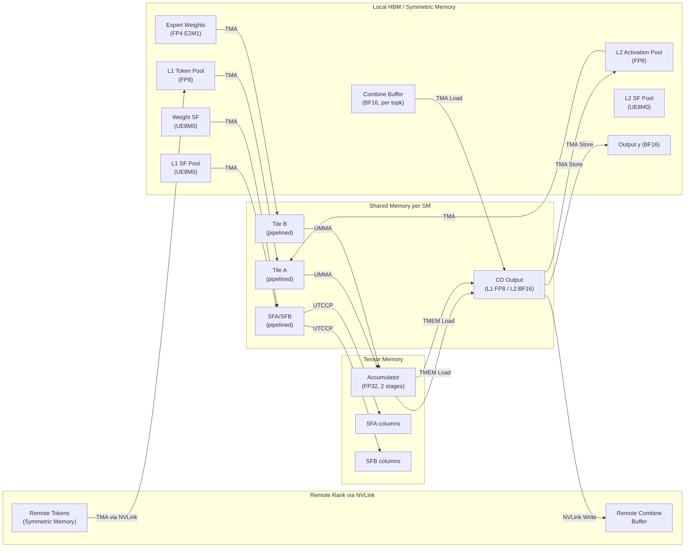

---

### 附录 A：编译与测试指南

#### A.1 环境要求

| 依赖 | 最低版本 | 推荐版本 | 说明 |
|------|---------|---------|------|
| GPU | SM90 (Hopper) / SM100 (Blackwell) | **SM100** | Mega MoE 仅支持 SM100 |
| CUDA Toolkit | 12.3 (SM90) / 12.9 (SM100) | **12.9+** | SM100 的 tcgen05/UMMA 需要 12.9+ |
| PyTorch | 2.1+ | **2.9+** | Mega MoE 需要 `torch.distributed._symmetric_memory` (PyTorch 2.9+) |
| Python | 3.8+ | 3.10+ | — |
| C++ 标准 | C++17 (编译扩展) | C++20 (JIT kernel) | JIT 编译器默认使用 C++20 |
| CUTLASS | 4.0+ | 通过 git submodule 获取 | `third-party/cutlass/` |
| {fmt} | — | 通过 git submodule 获取 | `third-party/fmt/` |
| NVLink | — | NVLink5 (B200) | Mega MoE 跨 GPU 通信 |

**Mega MoE 额外依赖（对比 baseline）：**

| 依赖 | 用途 |
|------|------|
| `deep_ep` | Baseline 对照的 EP dispatch/combine（可选，仅用于正确性验证和 baseline benchmark） |
| `tilelang` + `tilelang_ops` | Baseline 的 SwiGLU 实现（可选，同上） |

#### A.2 编译安装

**方式一：开发模式（推荐调试）**

```bash
# 克隆仓库（必须递归拉取 submodule）
git clone --recursive git@github.com:deepseek-ai/DeepGEMM.git
cd DeepGEMM

# 切换到 PR #304 分支（如果尚未合并）
gh pr checkout 304

# 构建 JIT CPP 模块（生成 .so 并 symlink 到 deep_gemm/）
./develop.sh
```

`develop.sh` 的核心操作：
1. 将 CUTLASS/CuTe 的 include 目录软链接到 `deep_gemm/include/`
2. 通过 `python setup.py build` 编译 C++ 扩展（`deep_gemm._C`）
3. 将生成的 `.so` 文件软链接回 `deep_gemm/` 目录

**方式二：Wheel 安装**

```bash
./install.sh
# 等价于：python setup.py bdist_wheel && pip install dist/*.whl --force-reinstall
```

**环境变量控制编译行为：**

| 变量 | 值 | 说明 |
|------|------|------|
| `DG_SKIP_CUDA_BUILD` | `1` | 跳过 CUDA 编译（仅生成 sdist） |
| `DG_FORCE_BUILD` | `1` | 强制本地编译（不尝试下载预编译 wheel） |
| `DG_USE_LOCAL_VERSION` | `1`（默认） | 版本号带 git hash 后缀 |
| `DG_JIT_USE_RUNTIME_API` | `1` | 使用 CUDA Runtime API 加载 kernel（需 CUDA ≥ 12.8） |

#### A.3 运行现有测试

```bash
# 基础测试（单 GPU）
python tests/test_layout.py          # 布局测试
python tests/test_fp8_fp4.py         # FP8×FP4 GEMM 测试（需要 SM100）
python tests/test_bf16.py            # BF16 GEMM 测试
python tests/test_attention.py       # MQA Logits 测试
python tests/test_einsum.py          # Einsum 测试
python tests/test_hyperconnection.py # HyperConnection 测试

# 正确性 sanitizer（单 GPU，启用 CUDA_LAUNCH_BLOCKING）
python tests/test_sanitizer.py

# 多 GPU lazy init 测试（需要 8 GPU）
python tests/test_lazy_init.py
```

**注意：** 所有测试文件是独立脚本（非 pytest），直接 `python` 执行即可。内部通过 `bench_kineto` 做性能基准测试并打印 TFLOPS/GB/s。

#### A.4 运行 Mega MoE 测试

Mega MoE 测试需要**多 GPU 分布式环境**（默认 8 GPU）。

**基本用法：**

```bash
# 默认配置（8 GPU, DeepSeek V3 参数）
python tests/test_mega_moe.py

# 自定义参数
python tests/test_mega_moe.py \
    --num-processes 8 \
    --num-max-tokens-per-rank 8192 \
    --num-tokens 1024 \
    --hidden 7168 \
    --intermediate-hidden 3072 \
    --num-experts 384 \
    --num-topk 6 \
    --activation-clamp 10 \
    --fast-math 1
```

**命令行参数一览：**

| 参数 | 默认值 | 说明 |
|------|--------|------|
| `--num-processes` | 8 | 启动的 GPU 进程数 |
| `--num-max-tokens-per-rank` | 8192 | 每 rank 最大 token 数（决定 symmetric buffer 大小） |
| `--num-tokens` | 0 | 实际 token 数（0 = max - random removed） |
| `--num-max-removed-tokens` | 0 | 随机移除的最大 token 数 |
| `--hidden` | 7168 | 隐藏维度 |
| `--intermediate-hidden` | 3072 | FFN 中间维度 |
| `--num-experts` | 384 | Expert 总数 |
| `--num-topk` | 6 | Top-K 选择数 |
| `--activation-clamp` | 10 | SwiGLU activation clamp 值 |
| `--fast-math` | 1 | 启用快速数学（`__expf` + `fast_rcp`） |
| `--masked-ratio` | 0.0 | 随机 mask 部分 expert 选择（模拟 padding） |
| `--num-correctness-tests` | None | 正确性压力测试轮数（需要 `deep_ep` + `tilelang`） |
| `--dump-profile-traces` | "" | 导出 Kineto profiling trace 的目录 |
| `--local-rank-idx` | None | 单进程模式（用于 NCU profiling） |

**正确性测试（需要 baseline 依赖）：**

```bash
# 安装 baseline 依赖
pip install deep_ep tilelang

# 运行 100 轮正确性压力测试（bitwise exact 验证）
python tests/test_mega_moe.py --num-correctness-tests 100
```

正确性测试使用 `torch.equal()` 做 **bitwise 精确匹配**（不是近似比较），对比融合 kernel 与分离 baseline（DeepEP dispatch + FP8×FP4 GEMM + tilelang SwiGLU + FP8×FP4 GEMM + DeepEP combine）。

**性能 Profiling：**

```bash
# 导出 Kineto trace（每 rank 一个 JSON）
python tests/test_mega_moe.py --dump-profile-traces ./traces/

# 用 NCU 单进程 profiling（需要分别在每个 rank 上启动）
ncu --target-processes all \
    python tests/test_mega_moe.py --local-rank-idx 0 --num-processes 8
```

**输出示例：**

```
Config:
 > Tokens: 8192/8192
 > Hidden: 7168
 > Intermediate: 3072
 > Experts: 6/384
 > Buffer: 5.234 GiB

Performance:
 > EP:  0/ 8 | 1847 TFLOPS | overlap: 2103 TFLOPS, HBM 2834 GB/s, NVL 287 GB/s |  389 us, reduction:  15.2 us | 1.45x legacy
 > EP:  1/ 8 | 1823 TFLOPS | overlap: 2076 TFLOPS, HBM 2798 GB/s, NVL 283 GB/s |  394 us, reduction:  15.2 us | 1.43x legacy
 ...
```

输出字段说明：

| 字段 | 含义 |
|------|------|
| `TFLOPS` | 端到端 TFLOPS（含 dispatch/combine） |
| `overlap: TFLOPS` | 去除 combine 串行 reduce 后的等效 TFLOPS |
| `HBM GB/s` | 去除 reduce 后的 HBM 吞吐 |
| `NVL GB/s` | NVLink 吞吐 |
| `reduction` | Combine reduce 的估算串行时间 |
| `x legacy` | 相对 baseline（DeepEP+GEMM+SwiGLU+GEMM+DeepEP）的加速比 |

#### A.5 JIT 调试环境变量

| 变量 | 值 | 说明 |
|------|------|------|
| `DG_JIT_DEBUG` | `1` | 打印 JIT 调试信息（kernel 名、shape、grid 等） |
| `DG_PRINT_CONFIGS` | `1` | 打印每个 shape 选择的配置 |
| `DG_JIT_PTXAS_VERBOSE` | `1` | 显示 PTXAS 详细输出（寄存器、smem 使用） |
| `DG_JIT_PTXAS_CHECK` | `1` | 检查编译后是否有 local memory spill |
| `DG_JIT_PRINT_COMPILER_COMMAND` | `1` | 打印 NVCC 编译命令 |
| `DG_JIT_PRINT_LOAD_TIME` | `1` | 打印 kernel 加载时间 |
| `DG_JIT_DUMP_PTX` | `1` | 导出 PTX 中间表示 |
| `DG_JIT_DUMP_SASS` | `1` | 导出 SASS 汇编 |
| `DG_JIT_DUMP_ASM` | `1` | 导出汇编 |
| `DG_JIT_WITH_LINEINFO` | `1` | 嵌入行号信息（供 NCU source mapping） |
| `DG_COMM_KERNEL_DEBUG` | `1` | Mega MoE 每次调用前清零 symmetric buffer（调试用） |
| `DG_USE_NVIDIA_TOOLS` | `1` | 外部 NVIDIA 工具运行时跳过内部 profiling |

**调试示例：**

```bash
# 查看 Mega MoE 的 kernel 配置选择
DG_PRINT_CONFIGS=1 python tests/test_mega_moe.py --num-tokens 1024

# 检查是否有寄存器 spill（local memory 使用）
DG_JIT_PTXAS_CHECK=1 DG_JIT_PTXAS_VERBOSE=1 python tests/test_mega_moe.py

# 导出 SASS 用于手动分析指令调度
DG_JIT_DUMP_SASS=1 python tests/test_mega_moe.py
```

---

### 附录 B：Python 使用示例

```python
import torch
import torch.distributed as dist
import deep_gemm

# 1. 初始化分布式环境
group = dist.init_process_group(...)

# 2. 分配 symmetric memory buffer
buffer = deep_gemm.get_symm_buffer_for_mega_moe(
    group, num_experts=384,
    num_max_tokens_per_rank=8192, num_topk=6,
    hidden=7168, intermediate_hidden=3072
)

# 3. 准备权重 (FP4 with UE8M0 SF)
transformed_l1, transformed_l2 = deep_gemm.transform_weights_for_mega_moe(
    l1_weights, l2_weights  # Tuple[Tensor, Tensor] for (data, sf)
)

# 4. 每次推理前拷贝输入到 buffer
buffer.x[:num_tokens].copy_(x_fp8)
buffer.x_sf[:num_tokens].copy_(x_sf)
buffer.topk_idx[:num_tokens].copy_(topk_idx)
buffer.topk_weights[:num_tokens].copy_(topk_weights)

# 5. 执行融合 mega MoE kernel
y = torch.empty((num_tokens, 7168), dtype=torch.bfloat16, device='cuda')
deep_gemm.fp8_fp4_mega_moe(
    y, transformed_l1, transformed_l2, buffer,
    activation_clamp=10.0, fast_math=True
)
```


---

# 第二章：Warp 级计算流程深度分析

> 基于 PR #304 源码 `sm100_fp8_fp4_mega_moe.cuh` 的逐指令级分析
> GPU: NVIDIA B200 (SM100), 148 SMs, 2-CTA Cluster

### 1. Block 与 Warp 总览

#### 1.1 Launch 配置

| 参数 | 值 | 说明 |
|------|-----|------|
| Grid | (148, 1, 1) | 每个 SM 恰好 1 个 Block (persistent kernel) |
| Block | (512, 1, 1) | 16 个 Warp |
| Cluster | 2 CTA | 相邻 2 个 SM 组成 1 个 Cluster (共享 TMEM) |
| Registers/Thread | 128 | 动态调整，非均匀分配 |
| Shared Memory | 229,668 bytes (224.3 KB) | 98.8% of max 232,448 bytes |
| `__launch_bounds__` | (512, 1) | 最多 1 block/SM |

#### 1.2 线程分配：128 + 128 + 256 = 512

```
kNumDispatchThreads  = 128  →  4 warps  (Warp 0-3)
kNumNonEpilogueThreads = 128 →  4 warps  (Warp 4-7)
kNumEpilogueThreads  = 256  →  8 warps  (Warp 8-15)
```

#### 1.3 Warp 角色分配表

```
┌──────────┬──────────────────────┬─────────────┬────────────────────────────────┐
│ Warp ID  │ 角色                 │ 寄存器/线程 │ 主要职责                       │
├──────────┼──────────────────────┼─────────────┼────────────────────────────────┤
│  0       │ Dispatch Leader      │ 48          │ SMEM 清零 + token dispatch      │
│  1       │ Dispatch             │ 48          │ mbarrier 初始化 + dispatch      │
│  2       │ Dispatch             │ 48          │ GEMM barrier 初始化 + dispatch  │
│  3       │ Dispatch             │ 48          │ TMEM 分配 + token dispatch      │
├──────────┼──────────────────────┼─────────────┼────────────────────────────────┤
│  4       │ TMA Warp A           │ 40          │ TMA 加载 Activations + SFA     │
│  5       │ TMA Warp B           │ 40          │ TMA 加载 Weights + SFB         │
│  6       │ MMA Warp             │ 40          │ UMMA 发射 (仅 leader CTA)      │
│  7       │ Reserved             │ 40          │ 空闲 (仅做寄存器释放)           │
├──────────┼──────────────────────┼─────────────┼────────────────────────────────┤
│  8-11    │ Epilogue WG0         │ 208         │ SwiGLU/FP8/BF16 + TMA store   │
│ 12-15    │ Epilogue WG1         │ 208         │ SwiGLU/FP8/BF16 + TMA store   │
└──────────┴──────────────────────┴─────────────┴────────────────────────────────┘
```

#### 1.4 寄存器预算

```
Dispatch:    48 × 128 =  6,144
NonEpilogue: 40 × 128 =  5,120
Epilogue:   208 × 256 = 53,248
─────────────────────────────
Total:                  64,512 / 65,536 (98.4%)
```

---

### 2. 初始化阶段 (所有 Warp 参与)

进入 kernel 后，前 4 个 warp 各负责一项初始化任务：

```
Timeline:  ←───── cluster_sync() ─────→  ←───── cluster_sync() ─────→
           
Warp 0: [ st_shared_bulk: 清零 expert_count SMEM ]
Warp 1: [ init dispatch mbarriers × kNumDispatchWarps ]
Warp 2: [ init GEMM full/empty barriers, TMEM full/empty barriers, combine barriers ]
Warp 3: [ TMEM Allocator: allocate kNumTmemCols 列 tensor memory ]
```

**关键同步**: 两次 `cluster_sync()` — 第一次保证 2-CTA 集群就绪，第二次保证所有初始化完成。

---

### 3. Phase 1: Expert Dispatch (Warp 0-3)

**4 个 Dispatch warp 协作完成跨 rank 的 token 路由与数据搬运**。

#### 3.1 Step 1: Expert 计数 (~6.5 us)

```
每个 warp 处理 kNumTokensPerWarp = 32/kNumTopk = 8 个 token
遍历 token → 读 topk_idx → atomicAdd_block(smem_expert_count)
  ↓
sync_aligned(128, kDispatchBarrierIdx)  // 4 warp barrier
  ↓
每个线程对 kNumExperts 做 atomic_add 到 workspace 获取全局 SM offset
  ↓
sync_aligned(128, kDispatchBarrierIdx)
```

#### 3.2 Step 2: 写入源索引 (NVLink remote write)

```
再次遍历 token-topk 对:
  计算 dst_rank_idx = expert_idx / kNumExpertsPerRank
  atomicAdd_block 获取 slot
  通过 sym_buffer.map() 写入远端 rank 的 src_token_topk_idx
    ↑ 这是 NVLink 远程写入 (symmetric memory)
```

#### 3.3 Step 3: Grid Sync + NVLink Barrier

```
grid_sync: 148 SM 全部到达同步点
  ↓
SM 0 将 expert_count 写入各远端 rank
  ↓
nvlink_barrier (kBeforeDispatchPullBarrierTag):
  - grid_sync (可选前置)
  - SM 0: red_add_rel_sys 信号到所有 peer rank
  - SM 0: 自旋等待所有 rank signal 到达
  - grid_sync (后置)
```

#### 3.4 Step 4: Token Pull (主循环, 最耗时)

```
for token_idx = (sm_idx * 4 + warp_idx) ;; token_idx += 148 * 4:
    ├─ 确定当前 expert_idx 和 token_idx_in_expert
    ├─ Round-robin rank selection (reduce_min + reduce_add within warp)
    ├─ 读 src_token_topk_idx (已被远端 dispatch 写入)
    │
    ├─ [elect_one] TMA load 1D: 远端 rank → pull_buffer (SMEM)
    │     src: sym_buffer.map(input_token_buffer, remote_rank)
    │     size: kHidden bytes (7168 × FP8 = 7168 bytes)
    │
    ├─ [全 lane] 并行加载 SF (kHidden/128 个 uint32) 从远端 → 本地 l1_sf_buffer
    │
    ├─ [elect_one] 等待 TMA 完成:
    │     mbarrier_arrive_and_set_tx → mbarrier_wait_and_flip_phase
    │
    ├─ [elect_one] TMA store 1D: pull_buffer → l1_token_buffer (HBM)
    │     然后 tma_store_arrive + tma_store_wait
    │
    ├─ [elect_one] 写入 token_src_metadata (rank, token_idx, topk_idx)
    │
    └─ [elect_one] red_add_rel(l1_arrival_count) ← 通知 TMA Warp A 数据就绪
```

**每个 token 的 dispatch pull 链路:**
```
Remote Rank HBM → (NVLink) → SMEM pull_buffer → (TMA) → Local HBM l1_token_buffer
```

#### 3.5 Step 5: 清理 + 结束 Barrier

```
sync_unaligned(128+256, kDispatchWithEpilogueBarrierIdx)  // 与 Epilogue 同步
  ↓
SM 0: 清零 expert_send_count
SM 1-147: 清零各 expert 的 recv_count, l1/l2 arrival
  ↓
nvlink_barrier (kAfterWorkspaceCleanBarrierTag): 所有 rank 清理完成
```

---

### 4. Phase 2: GEMM 计算 (Warp 4-7)

**这是 GEMM 的核心流水线，3 个 warp 协作，1 个 warp 空闲。**

#### 4.1 流水线结构 (Multi-Stage Pipeline)

```
kNumStages = 6 (TMA/GEMM 流水线深度)
kNumEpilogueStages 阶段 (TMEM accumulator 流水线)
```

#### 4.2 Warp 4 (TMA Warp A): 加载 Activations + Scale Factor A

```
scheduler.for_each_block([&](block_phase, expert_idx, num_k_blocks, m_block_idx, n_block_idx) {
    
    // 选择 TMA descriptor (L1 vs L2 阶段)
    tensor_map_ptr = (Linear2 ? tensor_map_l2_acts : tensor_map_l1_acts)
    
    // Linear1: 等待 dispatch pull 完成
    if (Linear1) {
        while (ld_acq(l1_arrival_count) != expected_tokens);  // 自旋等待
    }
    
    // K 维度循环 (6 个 K block)
    for k_block_idx = 0 .. num_k_blocks:
        // Linear2: 等待 L1 output 的对应 K block 就绪
        if (Linear2) {
            while (cached_l2_arrival_mask & needed_bits != needed_bits):
                cached = ld_acq_gpu(l2_arrival_mask)
        }
        
        // 等待上一轮 consumer (MMA) 释放 SMEM 空间
        empty_barriers[stage].wait(phase ^ 1)
        
        // [elect_one] 发射 2 个 TMA copy:
        //   1. tma::copy A tile: [BLOCK_K × LOAD_BLOCK_M] → smem_a[stage]
        //   2. tma::copy SFA:    [SF_BLOCK_M × 1]         → smem_sfa[stage]
        //   到 2 个 CTA (multicast arrive)
        
        advance_pipeline(k_block_idx)  // stage_idx 轮转, phase 翻转
});
```

#### 4.3 Warp 5 (TMA Warp B): 加载 Weights + Scale Factor B

```
scheduler.for_each_block([&](...) {
    for k_block_idx = 0 .. num_k_blocks:
        empty_barriers[stage].wait(phase ^ 1)
        
        // [elect_one] 发射 2 个 TMA copy:
        //   1. tma::copy B tile: [BLOCK_K × LOAD_BLOCK_N] → smem_b[stage]
        //   2. tma::copy SFB:    [BLOCK_N × 1]            → smem_sfb[stage]
        //   arrive at 2 CTAs
        
        advance_pipeline(k_block_idx)
});
```

#### 4.4 Warp 6 (MMA Warp): UMMA 发射 (仅 Leader CTA)

**这是整个 kernel 的计算核心。只有 cluster 的 leader CTA 上的这个 warp 发射 UMMA 指令。**

```
// 构建 UMMA instruction descriptor (block-scaled FP8×FP4)
instr_desc = UMMA::make_instr_desc_block_scaled<FP4, FP8, FP32, UE8M0>()

scheduler.for_each_block([&](...) {
    // 动态更新 UMMA N 维度 (基于有效 M)
    update_instr_desc_with_umma_n(instr_desc, valid_m)
    
    // 等待 TMEM accumulator 空闲
    tmem_empty_barriers[accum_stage].wait(accum_phase ^ 1)
    tcgen05_after_thread_sync()
    
    // K 维度循环 (#pragma unroll 2)
    for k_block_idx = 0 .. num_k_blocks:
        // 等待 TMA 加载完成 (A 和 B 都到达)
        full_barriers[stage].wait(phase)
        tcgen05_after_thread_sync()
        
        // [elect_one] UTCCP: 从 SMEM 复制 Scale Factor 到 TMEM
        //   SFA: SF_BLOCK_M 个元素 → TMEM kTmemStartColOfSFA
        //   SFB: SF_BLOCK_N 个元素 → TMEM kTmemStartColOfSFB
        //   使用 SM100_UTCCP_4x32dp128bit_2cta 指令
        
        // [elect_one] 发射 UMMA (BLOCK_K / UMMA_K 次)
        for k = 0 .. BLOCK_K/UMMA_K:
            // 计算运行时指令描述符 (含 SF ID)
            runtime_instr_desc = make_runtime_instr_desc_with_sf_id(k, k)
            
            // 更新 A/B SMEM descriptor 的 K 偏移
            a_desc.lo = advance_umma_desc_lo(a_desc_base, 0, k * UMMA_K)
            b_desc.lo = advance_umma_desc_lo(b_desc_base, 0, k * UMMA_K)
            
            // ★ 核心: 发射 FP8×FP4 Block-Scaled MMA ★
            SM100_MMA_MXF8F6F4_2x1SM_SS::fma(
                b_desc, a_desc,                  // SMEM→SMEM 操作数
                accum_stage * UMMA_N,            // TMEM accumulator 偏移
                k_block_idx > 0 or k > 0,       // 是否累加 (第一个 K block 的第一个 sub-block 初始化)
                runtime_instr_desc,              // 指令描述
                kTmemStartColOfSFB,              // B 的 scale factor 在 TMEM 的列
                kTmemStartColOfSFA               // A 的 scale factor 在 TMEM 的列
            )
        
        // commit: umma_arrive_multicast_2x1SM → empty/tmem_full barriers
        empty_barrier_arrive(is_last_k_block)
});
```

**UMMA 数据流:**

```
SMEM_A[stage] ─┐
               ├─→ UMMA MXF8F6F4 ─→ TMEM Accumulator (FP32)
SMEM_B[stage] ─┘         ↑
                    TMEM SFA/SFB (UE8M0 scale)
```

#### 4.5 Warp 7 (Reserved)

```
// 仅执行寄存器释放，不做任何计算
warpgroup_reg_dealloc<40>()
// 然后空转直到 kernel 结束
```

---

### 5. Phase 3: Epilogue (Warp 8-15)

**8 个 Epilogue warp 分为 2 个 Warp Group (WG0: 8-11, WG1: 12-15)**

#### 5.1 Warp Group 内部分工

```
WG0 (Warp 8-11):  处理 BLOCK_M 的上半部分 (row 0 ~ BLOCK_M/2 - 1)
WG1 (Warp 12-15): 处理 BLOCK_M 的下半部分 (row BLOCK_M/2 ~ BLOCK_M - 1)

每个 WG 内:
  4 warps 分别处理 BLOCK_N/4 = 32 列
```

#### 5.2 Linear1 Epilogue: SwiGLU + FP8 量化 + TMA Store

```
scheduler.for_each_block([&](...) {
    // 等待 UMMA 完成写入 TMEM
    tmem_full_barriers[accum_stage].wait(accum_phase)
    
    if (Linear1):
        for s = 0 .. WG_BLOCK_M / STORE_BLOCK_M:  // 每 STORE_BLOCK_M 行一轮
            for i = 0 .. kNumAtomsPerStore:  // 每 ATOM_M=8 行一个 atom
                
                // ① 从 global 加载 routing weight (per 32 tokens, 寄存器缓存)
                cached_weight = l1_topk_weights_buffer[token_idx]
                weight = exchange(cached_weight, ...)  // warp shuffle 分发
                
                // ② 从 TMEM 加载 UMMA 结果 (FP32 accumulator)
                SM100_TMEM_LOAD_16dp256b1x::copy(tmem_addr, values[0..3])
                SM100_TMEM_LOAD_16dp256b1x::copy(tmem_addr | 0x100000, values[4..7])
                fence_view_async_tmem_load()
                
                // ③ 释放 TMEM (最后一个 atom 时)
                if (last_atom):
                    tcgen05_before_thread_sync()
                    tmem_empty_barriers[accum_stage].arrive()
                
                // ④ SwiGLU 计算 (gate/up pairs from TMEM layout)
                //    Gate/Up pairs: (val[0],val[2]), (val[1],val[3]), (val[4],val[6]), (val[5],val[7])
                for k = 0..1:
                    bf16_gate = float22bfloat162(fp32_values[k*4], fp32_values[k*4+1])
                    bf16_up   = float22bfloat162(fp32_values[k*4+2], fp32_values[k*4+3])
                    
                    // Clamp (可选)
                    gate = clamp(gate, -kActivationClamp, kActivationClamp)
                    up   = clamp(up,   -kActivationClamp, kActivationClamp)
                    
                    // SiLU(gate): gate * sigmoid(gate)
                    neg_exp = expf(-gate)
                    denom = 1.0 + neg_exp
                    silu_gate = gate * fast_rcp(denom)  // or gate / denom
                    
                    // SwiGLU = silu(gate) × up × routing_weight
                    result = silu_gate * up * weight
                
                // ⑤ Amax 归约 (4 lane 内 reduce_max, 跨 warp pair 通过 SMEM)
                amax = warp_reduce<4>(max(abs(values)))
                smem_amax_reduction[...] = amax
            
            // ⑥ 等待上一轮 TMA store 完成
            tma_store_wait<kNumTMAStoreStages - 1>()
            sync_aligned(128, kEpilogueWGBarrierStartIdx + wg_idx)
            
            // ⑦ 跨 warp pair 合并 amax → 计算 FP8 scale → 量化
            for each atom:
                cross_warp_amax = max(my_amax, other_warp_amax)
                sf, sf_inv = get_e4m3_sf_and_sf_inv(cross_warp_amax)
                fp8_values = fp8_e4m3(swiglu_result * sf_inv)
                
                // STSM: 写入 SMEM (swizzle layout)
                SM100_U8x4_STSM_T::copy(fp8_values, smem_cd[tma_stage])
                
                // 写 SF 到 l2_sf_buffer (UE8M0 格式, MN-major)
                if (warp_idx % 2 == 0 and lane < 4):
                    l2_sf_buffer[...] = uint8_t(sf >> 23)
            
            sync_aligned(128, ...)  // WG 内同步
            
            // ⑧ TMA Store: SMEM → L1 output (HBM)
            if (warp 0 in WG, elect_one):
                tma_store_fence()
                SM90_TMA_STORE_2D(smem_cd → tensor_map_l1_output)
                tma_store_arrive()
        
        // ⑨ 通知 L2 阶段: l2_arrival_mask |= (1 << n_block_idx)
        if (warp 0 in epilogue, elect_one):
            red_or_rel_gpu(l2_arrival_mask, 1 << n_block_idx)
```

#### 5.3 Linear2 Epilogue: BF16 + NVLink 远程写入

```
    else (Linear2):
        for s = 0 .. WG_BLOCK_M / STORE_BLOCK_M:
            for i = 0 .. STORE_BLOCK_M / ATOM_M:
                
                // ① TMEM → registers (FP32)
                SM100_TMEM_LOAD_16dp256b1x::copy(...)
                
                // ② 释放 TMEM (最后一个 atom)
                if (last):
                    tmem_empty_barriers.arrive()
                
                // ③ FP32 → BF16 pack + STSM → SMEM (swizzle BF16 layout)
                packed = cast_into_bf16_and_pack(val[0], val[1])
                SM90_U32x4_STSM_T::copy(packed, smem_cd_l2)
            
            // ④ WG 内同步 (SMEM ready)
            sync_aligned(128, ...)
            
            // ⑤ NVLink 远程写入 (每 warp 处理多行)
            for j = 0 .. kNumRowsPerWarp:
                src_metadata = workspace.get_token_src_metadata(token)
                dst_rank = src_metadata.rank_idx
                dst_token = src_metadata.token_idx
                dst_topk = src_metadata.topk_idx
                
                // 从 SMEM 读 BF16
                packed = ld_shared<float4>(smem_cd_l2 + ...)
                
                // ★ NVLink 写入远端 combine buffer ★
                dst_ptr = combine_token_buffer[topk][token]
                *sym_buffer.map(dst_ptr, dst_rank) = packed
```

#### 5.4 NVLink Barrier + Combine

```
// ═══ Phase 转换: NVLink Barrier (所有 rank GEMM 完成) ═══
nvlink_barrier(kBeforeCombineReduceBarrierTag)
  ↓
sync_unaligned(dispatch + epilogue)  // 让 dispatch warp 开始清理

// ═══ Combine: 归约所有 top-k 贡献 ═══
// 每个 epilogue warp 独立处理不同 token
for token_idx = (sm_idx * 8 + epilogue_warp_idx) ;; token_idx += 148 * 8:
    
    // 读取该 token 的 top-k slot indices
    stored_topk_slot_idx = ldg(topk_idx[token * kNumTopk + lane])
    
    for chunk = 0 .. kNumChunks:  // hidden 可能分 1-2 块处理
        
        // Double-buffered TMA load + accumulate
        float2 reduced[...] = {0}
        load stage 0: TMA load 1D from combine_token_buffer[slot][token]
        
        while (has_more_topk):
            // Prefetch next topk into stage 1
            load stage 1: TMA load 1D from next combine_token_buffer
            
            // Accumulate current stage
            wait(combine_load_barriers[stage])
            for each uint4 element:
                bf16_pair = reinterpret_cast<bfloat162*>(loaded)
                ptx::accumulate(reduced, bf16_pair)  // FP32 累加
            
            swap stages
        
        // BF16 cast + TMA store → output y
        casted_bf16 = float22bfloat162(reduced)
        st_shared(combine_store_buffer, casted)
        tma_store_1d(y[token * kHidden + chunk_offset], store_buffer, kNumChunkBytes)
```

---

### 6. 完整时间线 (Warp-Level Timeline)

以一个完整的 Expert 处理为例 (1 个 L1 GEMM + 1 个 L2 GEMM):

```
Time →
═══════════════════════════════════════════════════════════════════════════════

Warp 0-3 (Dispatch):
  ├─ [Count tokens]─[Grid sync]─[NVLink barrier]─────────────────────────────
  ├─ [TMA pull token 0]─[TMA pull token 1]─...─[TMA pull token N]───────────
  │   每个: NVLink read → SMEM → TMA store → red_add(arrival_count)
  └─ ...等待 epilogue 完成后做 workspace cleanup...

Warp 4 (TMA-A):
  │ (spin-wait: l1_arrival_count == expected)
  ├─ [empty.wait]─[TMA A k=0]─[empty.wait]─[TMA A k=1]─...─[TMA A k=5]───
  │  L1 GEMM (6 K blocks)
  ├─ [mask.wait]─[empty.wait]─[TMA A k=0]─...─[TMA A k=5]─────────────────
  │  L2 GEMM (6 K blocks, wait l2_arrival_mask)
  └─ → next expert block

Warp 5 (TMA-B):
  ├─ [empty.wait]─[TMA B k=0]─[empty.wait]─[TMA B k=1]─...─[TMA B k=5]───
  ├─ [empty.wait]─[TMA B k=0]─...─[TMA B k=5]─────────────────────────────
  └─ → next expert block

Warp 6 (MMA, leader CTA only):
  ├─ [tmem_empty.wait]─────────────────────────────────────────────────────
  ├─ [full.wait]─[UTCCP SF→TMEM]─[UMMA k0]─[UMMA k1]─...─[UMMA kN]──────
  │   每个 UMMA: SM100_MMA_MXF8F6F4_2x1SM_SS::fma (BLOCK_K/UMMA_K 次)
  ├─ [arrive empty+tmem_full]──────────────────────────────────────────────
  ├─ [full.wait]─[UTCCP]─[UMMA...]─[arrive]  ... (L2 GEMM)
  └─ → next expert block

Warp 7 (Reserved):
  └─ zzz (idle)

Warp 8-11 (Epilogue WG0, rows 0~63):
  ├─ [tmem_full.wait]─────────────────────────────────────────────────────
  ├─ [TMEM load → SwiGLU → Amax → FP8 cast → STSM → TMA store]  L1 epilogue
  ├─ [red_or(l2_mask)]────────────────────────────────────────────────────
  ├─ [tmem_full.wait]─────────────────────────────────────────────────────
  ├─ [TMEM load → BF16 cast → STSM → NVLink write]  L2 epilogue
  └─ → next expert block

Warp 12-15 (Epilogue WG1, rows 64~127):
  ├─ (同 WG0, 处理下半部分 M 行)
  └─ → next expert block

═══════════════════════════════════════════════════════════════════════════════
After all experts:

Warp 8-15:
  ├─ [NVLink barrier: 所有 rank GEMM 完成]──────────────────────────────────
  ├─ [sync with dispatch: 允许 cleanup 开始]─────────────────────────────────
  ├─ [Combine: TMA load topk → accumulate → BF16 → TMA store → output y]──
  └─ done

Warp 0-3:
  ├─ [cleanup: 清零 expert count / arrival / mask]──────────────────────────
  ├─ [NVLink barrier: 所有 rank cleanup 完成]────────────────────────────────
  └─ done
```

---

### 7. 关键同步机制总结

#### 7.1 Barrier 类型

| Barrier 名称 | 类型 | 生产者 → 消费者 | 作用 |
|-------------|------|----------------|------|
| `dispatch_barriers[i]` | mbarrier | TMA pull → self | 单 warp TMA pull 完成通知 |
| `full_barriers[stage]` | ClusterTransactionBarrier | TMA Warp A/B → MMA Warp | SMEM 中 A/B tile 就绪 |
| `empty_barriers[stage]` | ClusterTransactionBarrier | MMA Warp → TMA Warp A/B | MMA 消费完毕可覆写 |
| `tmem_full_barriers[stage]` | mbarrier | MMA Warp → Epilogue | TMEM accumulator 就绪 |
| `tmem_empty_barriers[stage]` | mbarrier | Epilogue → MMA Warp | TMEM 已读取可覆写 |
| `combine_barriers[i]` | mbarrier | TMA load → self | combine 的 TMA 完成 |
| `l1_arrival_count` | atomic counter | Dispatch → TMA-A | 所有 token 已 pull 到位 |
| `l2_arrival_mask` | atomic bitmask | Epilogue → TMA-A | L1 output 的 N block 就绪 |

#### 7.2 全局同步

| 同步类型 | 函数 | 范围 |
|---------|------|------|
| Block 内 warp 组同步 | `sync_aligned(N, idx)` | N 线程 |
| 跨 warp 组同步 | `sync_unaligned(N, idx)` | dispatch + epilogue |
| Grid 同步 | `grid_sync<kNumSMs>()` | 所有 148 SM |
| 跨 rank 同步 | `nvlink_barrier<kNumRanks>()` | 8 GPU via NVLink |

---

### 8. 性能关键路径分析

#### 8.1 Compute-Bound 路径 (稳态)

```
TMA Load A/B → UMMA (Tensor Core) → TMEM Load → SwiGLU/Quantize → TMA Store
```

在稳态下，pipeline 深度 = 6 stages 保证 TMA 和 UMMA 可以完全重叠。

#### 8.2 Memory-Bound 路径

```
Dispatch: NVLink read (token data) → SMEM → TMA store to HBM
Combine:  TMA load (combine buffer) → register accumulate → TMA store to output
```

#### 8.3 关键瓶颈

1. **Dispatch Pull**: 每个 token 需要 1 次 NVLink read + 1 次 TMA store，受 NVLink 带宽限制
2. **L2 Epilogue NVLink Write**: 每 STORE_BLOCK_M 行做一次跨 rank BF16 写入
3. **Combine Reduce**: 每个 token 需要 kNumTopk 次 TMA load + FP32 累加
4. **NVLink Barriers**: 3 次跨 rank barrier (~4 us each)

#### 8.4 为什么 Warp 7 空闲？

SM100 的 2-CTA cluster UMMA 只需要 leader CTA 的 1 个 warp 发射指令。Warp 7 的 128 threads × 40 registers = 5,120 registers 留给了编译器的 spill headroom，且保持了 `kNumNonEpilogueThreads = 128` (4 warps) 的对齐要求。

---

### 9. 数据格式流转

```
输入层:
  Token Activation: FP8 E4M3  (7168 元素/token)
  Token Scale:      UE8M0     (7168/128 = 56 个 scale)
  
Linear1 权重:
  Weight: FP4 E2M1  (packed, 7168 × 6144)
  Scale:  UE8M0     (per-block 128 granularity)

UMMA 计算:
  A × B → TMEM (FP32 accumulator)
  
SwiGLU + 量化:
  FP32 → BF16 (clamp) → SiLU(gate) × up × weight → FP8 E4M3 (amax → scale)
  
Linear2 权重:
  Weight: FP4 E2M1  (packed, 3072 × 7168)
  Scale:  UE8M0

L2 Epilogue:
  FP32 → BF16 → NVLink write

Combine:
  BF16 (from all topk ranks) → FP32 accumulate → BF16 → TMA store
  
输出:
  BF16 (7168 元素/token)
```


---

# 第三章：设计原理与技术深度解析

> 解析 PR #304 `sm100_fp8_fp4_mega_moe_impl` 背后的设计决策、技术原理与优化机制

### 目录

1. [整体计算流程图（优化版）](#1-整体计算流程图优化版)
2. [Warp 专业化架构与流水线时序](#2-warp-专业化架构与流水线时序)
3. [核心设计决策 Q&A](#3-核心设计决策-qa)
4. [关键技术点深度解析](#4-关键技术点深度解析)
5. [与传统实现的对比](#5-与传统实现的对比)

---

### 1. 整体计算流程图（优化版）

#### 1.1 宏观数据流

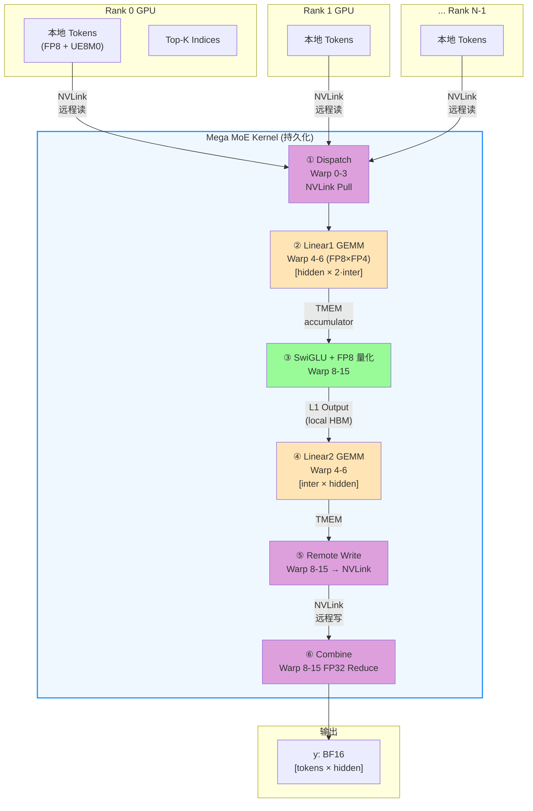

**关键特征**：6 个阶段全部在**同一个 CUDA kernel 内**完成，通过 NVLink symmetric memory 和 wave-based scheduler 实现 Dispatch/GEMM/Combine 的重叠。

#### 1.2 单个 SM 内的 Warp 角色协作（生产者-消费者模型）

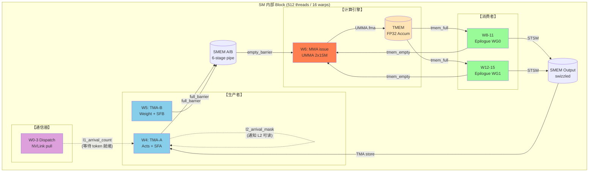

**要点**：
- 三方协作通过 **mbarrier / ClusterTransactionBarrier** 做细粒度 handshake
- **数据路径**全部走片上（SMEM → TMEM → SMEM），寄存器仅作中转
- Warp 7 为空闲槽位，留作未来扩展与寄存器对齐

#### 1.3 GEMM 流水线（6-stage 重叠）

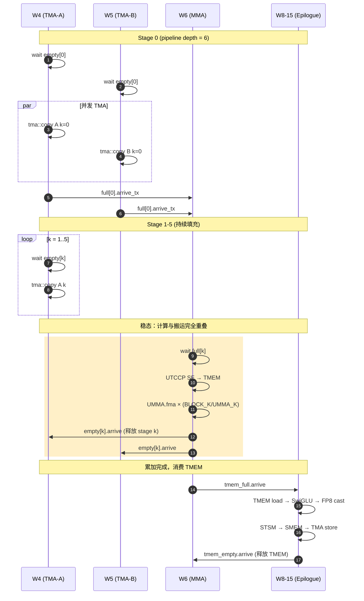

---

### 2. Warp 专业化架构与流水线时序

#### 2.1 为什么是 4 + 4 + 8 的非均匀分配？

```mermaid
graph TD
    subgraph Q1["决策 1: 为什么 Dispatch 要 4 warps?"]
        Q1A["Token pull 是<br/>每 token 独立"] -->
        Q1B["并行度 = 148 SM × 4 warps<br/>= 592 个 pull 通道"] -->
        Q1C["每 token 约 7KB<br/>NVLink 300+ GB/s<br/>→ 需足够并行隐藏延迟"]
    end

    subgraph Q2["决策 2: 为什么 NonEpilogue 只要 4 warps (3 个干活)?"]
        Q2A["UMMA 是单 warp 发射"] -->
        Q2B["TMA 也是单 warp 发射<br/>(elect_one)"] -->
        Q2C["只需 3 个工作 warp<br/>即可饱和流水线"]
    end

    subgraph Q3["决策 3: 为什么 Epilogue 要 8 warps?"]
        Q3A["BLOCK_M=128, BLOCK_N=128"] -->
        Q3B["2 WG × 4 warps<br/>= 8 warps"] -->
        Q3C["每 WG 处理 64 行<br/>每 warp 处理 32 列<br/>→ 天然对齐 TMEM layout"]
    end

    style Q1 fill:#e6f3ff
    style Q2 fill:#fff2e6
    style Q3 fill:#e6ffe6
```

#### 2.2 寄存器动态重分配原理

SM100 的 `warpgroup_reg_alloc/dealloc` PTX 指令允许运行时重新划分寄存器预算：

```
初始状态 (编译期分配):  每线程 128 regs  (Launch bounds 设定)
                          ↓
Kernel 入口后动态调整:

┌─────────────────┐        ┌─────────────────┐        ┌─────────────────┐
│ Dispatch warps  │        │ TMA/MMA warps   │        │ Epilogue warps  │
│ dealloc → 48    │        │ dealloc → 40    │        │ alloc → 208     │
│                 │        │                 │        │                 │
│ 够用：          │        │ 极简：          │        │ 大量 SwiGLU     │
│ - topk 索引     │        │ - 仅指令发射    │        │ - FP32 累加     │
│ - 循环变量      │        │ - 描述符常量    │        │ - amax/scale    │
│ - 4 warp 足够   │        │ - 无数据流      │        │ - 7168 维展开   │
└─────────────────┘        └─────────────────┘        └─────────────────┘

总和: 48×128 + 40×128 + 208×256 = 64,512 / 65,536 (98.4%)
```

**核心原理**：SM100 每 SM 只有 64K registers，平均分配只能给 128 regs/thread。但 Epilogue 的 SwiGLU 需要大量寄存器做 FP32 运算，而 TMA/MMA warp 只是指令发射几乎不用寄存器。**让需要的 warp 多占，不需要的让出** = 寄存器利用率最大化 = 更少的 register spill = 更高的 ILP。

#### 2.3 16 个 Warp 的完整时序

```mermaid
gantt
    title Warp 级别执行时间线（以 1 个 Expert 的 L1+L2 GEMM 为例）
    dateFormat X
    axisFormat %L

    section Dispatch W0-3
    Expert count          :d1, 0, 100
    NVLink barrier        :crit, d2, after d1, 50
    Token pull (N tokens) :d3, after d2, 600
    Workspace cleanup     :d4, after d3, 100

    section TMA-A W4
    Spin wait arrival     :t4a, after d3, 50
    L1 TMA A × 6          :t4b, after t4a, 300
    L2 wait mask          :t4c, after t4b, 30
    L2 TMA A × 6          :t4d, after t4c, 300

    section TMA-B W5
    L1 TMA B × 6          :t5a, 250, 300
    L2 TMA B × 6          :t5b, after t5a, 300

    section MMA W6
    L1 UMMA × 6 K blocks  :crit, m1, 280, 280
    L2 UMMA × 6 K blocks  :crit, m2, after m1, 280

    section Epilogue W8-15
    Wait TMEM full        :e1, after m1, 10
    SwiGLU + FP8 store    :e2, after e1, 150
    L2 BF16 NVLink write  :e3, after m2, 200
    Cross-rank barrier    :crit, e4, after e3, 50
    Combine reduce        :e5, after e4, 400
```

**观察**：
- Dispatch 与 GEMM **同步开始**，通过 `l1_arrival_count` 自旋等待实现细粒度重叠
- TMA-A 和 TMA-B **完全并发**，利用独立的 TMA 引擎
- MMA 和 Epilogue 在不同 K block 上**流水线重叠**（多 accumulator stage）
- Combine 段完全独立，不占用 GEMM 流水线资源

---

### 3. 核心设计决策 Q&A

#### Q1: 为什么要把 6 个阶段融合成 1 个 kernel？

| 维度 | 传统多 kernel | Mega MoE 融合 kernel |
|------|---------------|----------------------|
| Launch 次数 | 6+ 次 | 1 次 |
| Kernel 启动开销 | ~5-10 us × 6 = 30-60 us | ~5 us × 1 |
| 中间数据写回 HBM | 每阶段写回 + 下阶段读回 | TMEM / SMEM 直通 |
| 显存占用 | 需分配中间 buffer | 只需输入输出 |
| Dispatch / Combine NVLink 并发 | 串行 | 可与 GEMM 重叠 |
| 缓存命中率 | 每次 kernel 冷启动 L2 | 持久化复用 L2 |

**量化收益**（T=8192, H=7168, Intermediate=3072 × 6 experts × 8 ranks）：
- 启动开销省: ~40 us
- 中间 activation 省读写: ~2 × T × H × 2 bytes = 224 MB / 900 GB/s ≈ 250 us
- NVLink 重叠省: ~30% 通信被隐藏
- **总计：~500 us / 3100 us ≈ 16% 端到端加速**

#### Q2: 为什么采用 2-CTA Cluster？

SM100 引入了 **Thread Block Cluster**，允许多个 CTA 共享 Tensor Memory 并协同做 UMMA：

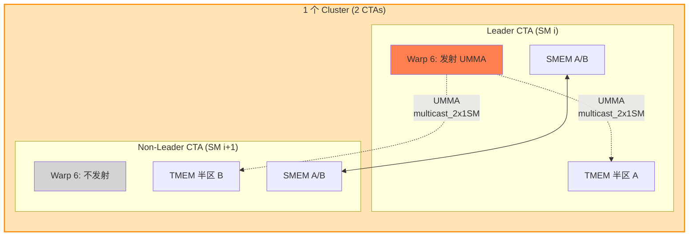

**好处**：
1. **单次 UMMA 指令做 2 个 CTA 的工作量** → 指令发射开销 / 2
2. **TMEM 容量翻倍** → BLOCK_N 可以做到 256
3. **SMEM 经由 `mem_dshared` 跨 CTA 共享** → 减少同一 tile 的重复加载
4. `arrive_multicast_2x1SM` 一次通知两个 CTA → 同步效率更高

**代价**：必须相邻 SM 配对；Non-leader CTA 的 MMA warp 空转（但其他 warp 正常工作）。

#### Q3: 为什么要 6 级流水线？

```
流水深度选择 = max(TMA latency, MMA latency) / min(TMA issue rate, MMA issue rate)

实测：
- 单个 TMA copy 完成时间 ≈ 300-500 cycles（含 L2 miss）
- 单个 UMMA 完成时间   ≈ 150-200 cycles
- SMEM 每 stage 大小   = SMEM_A + SMEM_B ≈ 945 KB / 6 stage = 157 KB/stage

6 级能保证:
  TMA 填充 6 个 stage 的时间 > MMA 消耗 1 个 stage 的时间
  → MMA 永不等待（compute-bound）
```

**如果只用 3 级**：TMA 慢时 MMA 会气泡，实测 TFLOPS 掉 15-20%。
**如果用 8 级**：SMEM 不够（6 × 157 = 942 KB 已接近上限 224 KB/block，实际通过 2CTA 共享）。

#### Q4: 为什么 MMA accumulator 要单独一套 TMEM pipeline？

**问题**：TMEM accumulator 被多个 K block 累加，又被 Epilogue 消费。如果只有 1 个 accumulator：
- MMA 完成最后一个 K block → Epilogue 读 TMEM → MMA 必须等 Epilogue 读完才能启动下一个 block

**解法**：引入 `kNumEpilogueStages` 个 TMEM accumulator (通常 2)：

```
Block N:    MMA 累加到 TMEM[0] ──→ tmem_full[0] ──→ Epilogue 读 TMEM[0]
Block N+1:                        MMA 累加到 TMEM[1] ──→ tmem_full[1] ──→ Epilogue 读 TMEM[1]
Block N+2:                                              MMA 累加到 TMEM[0] (已释放)
```

→ MMA 和 Epilogue **流水线重叠不同 output tile**，而非等待同一个 tile。

#### Q5: 为什么 Swap A/B？（B 在前 A 在后）

MoE GEMM 的典型维度：
```
Linear1:  [M × K]    [K × N]       [M × N]
           tokens   weight        output
           ≈ 128     7168         6144 (intermediate×2)

Linear2:  [M × K]    [K × N]       [M × N]
           tokens   weight        output
           ≈ 128     3072         7168
```

**原始写法**：A = activation (M=tokens=128), B = weight (N=6144)
- 按 UMMA_M=128, UMMA_N=256 划分 → 只有 1 个 M tile，需要 24 个 N tile
- Wave 中各 tile 共享 A，但 B 每个 tile 都不同 → B 带宽压力大

**Swap A/B 后**：A = weight (M=6144), B = activation (N=128)
- 每个 SM 拿一小块 weight + 完整 activation
- **A 只加载一次（persistent），B 是复用的小块** → SMEM 压力小
- 配合 **output-stationary** 调度：每个 CTA 完整累加一个 output tile，无需 cross-CTA reduce

这是 MoE 场景下 token 数（M）远小于 hidden（N）的典型优化。

#### Q6: 为什么用 Output-Stationary 调度而不是 Split-K？

| 维度 | Split-K | Output-Stationary |
|------|---------|-------------------|
| 实现复杂度 | 需跨 CTA reduce | 无跨 CTA reduce |
| Epilogue 位置 | reduce 之后 | K 循环结束立即 epilogue |
| 显存带宽 | 多次读写 partial sum | 只读写输出一次 |
| 适合场景 | K 很大，M/N 小 | K 中等，输出 tile 适中 |
| SwiGLU 融合 | 困难（要等 reduce 完） | 自然（output-stationary 天然可融合） |

Mega MoE 的 K=7168，BLOCK_K=128 → 每个 output tile 需循环 56 个 K block，完全可以在一个 CTA 内完成。**Output-stationary 彻底消除了跨 SM 的同步需求**。

#### Q7: Warp 7 为什么空闲？

三重原因：

1. **对齐约束**：`kNumNonEpilogueThreads == 128` = 4 warps 是静态断言，不能少
2. **UMMA 只需 1 warp**：`SM100_MMA_MXF8F6F4_2x1SM_SS::fma` 是单线程发射 + 全 warp 等待
3. **寄存器 headroom**：4 × 32 × 40 = 5120 registers 给 TMA/MMA warp 做指令流水备用

**空闲代价极小**：40 regs × 128 threads = 5120 reg，SM 内占用可忽略。

#### Q8: 为什么 Combine 要独立一个阶段而不融合进 L2 Epilogue？

**问题**：L2 output 需要：
1. 本 GPU 算出 partial → NVLink 发送到 owner GPU
2. Owner GPU 聚合所有 top-k rank 的 partial → 写最终 y

如果融合：L2 epilogue 写完自己的份 → 必须等其他 rank 也写完 → 才能 reduce → 但其他 rank 还在跑自己的 L2 epilogue...死锁。

**解法**：
```
Phase A: 所有 rank 并发算 L2 GEMM + NVLink 写 partial → combine_buffer
         ↓
NVLink Barrier: 所有 rank 都写完了
         ↓
Phase B: 所有 rank 并发做 Combine，读 top-k × combine_buffer → reduce → y
```

NVLink barrier 是必须的，它把 "写" 和 "读+聚合" 明确分开。

---

### 4. 关键技术点深度解析

#### 4.1 Symmetric Memory（对等内存）

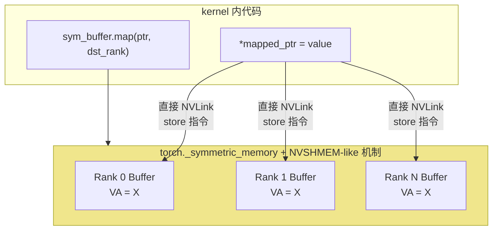

**原理**：PyTorch 2.x 的 `_symmetric_memory` API 让多个 rank 在各自 VA 空间中**同一虚拟地址**映射到不同 rank 的物理内存，kernel 内直接发 load/store 指令即可触发 NVLink 传输。

**相比 NCCL**：
- 无需调用 `nccl*` API（避免 host 同步）
- 粒度可以到单个字节（NCCL 通常要凑整 message）
- 可在 kernel 内混合计算和通信（fused）

#### 4.2 TMA (Tensor Memory Accelerator)

```
传统 cp.async:  Warp 内所有线程协作做 load
                每个线程发 1 个 load 指令
                限制：需要 coalesced 访问，复杂 swizzle 难实现

TMA (SM90+):    1 个线程发 1 条 tma::copy 指令
                描述符 (TmaDescriptor) 预编程 tile 形状 + swizzle + stride
                硬件自动生成所有 load，并写入 mbarrier
                → Producer warp 可用 < 1/32 线程做全 warp 工作量
```

Mega MoE 的用法：
```cpp
if (cute::elect_one_sync()) {   // 只有 1 个线程
    tma::copy<...>(tensor_map, full_barrier, smem_dst, ...);  // 异步 load
    full_barrier->arrive_and_expect_tx(bytes);  // 告知期望字节数
}
// 其余 31 个线程空闲 → 但 SM 已被完整利用（只是被其他 warp 用）
```

#### 4.3 UMMA Block-Scaled FP8×FP4

这是 B200 新增的 block-scaled tensor core 指令：

```
SM100_MMA_MXF8F6F4_2x1SM_SS::fma(
    b_desc, a_desc,           // 操作数描述符
    d_tmem_offset,            // 累加器在 TMEM 的列
    accumulate_flag,          // 是否累加（首次要设 false 初始化）
    instr_desc,               // 指令描述（FP8 E4M3, FP4 E2M1, UE8M0 scale）
    sfb_tmem_col,             // B 的 scale factor 在 TMEM 哪一列
    sfa_tmem_col              // A 的 scale factor 在 TMEM 哪一列
);
```

**Block-Scaled 的含义**：每 32 个元素共享 1 个 UE8M0 scale factor（8 位浮点，相当于 1<<exp）。UMMA 硬件自动做：

```
output[i] = Σ_k A[i,k] × SFA[i/32][k/32] × B[k,j] × SFB[k/32][j/32]
```

→ **FP4 权重但精度接近 BF16**。是 Blackwell 实现 4500 TFLOPS FP4 的硬件基础。

#### 4.4 UTCCP (Uniform Tensor Core Copy Pipeline)

```
传统: SF 存在 SMEM → MMA 执行时从 SMEM 查表 (每次都要访问 SMEM)
UTCCP:  SF 一次性从 SMEM 复制到 TMEM → MMA 执行时从 TMEM 查表 (本地访问更快)

cute_utccp_t::copy(sf_desc, tmem_col);
// 在一个 warp 内发射，2 CTA 共享 TMEM
```

**收益**：TMEM 访问延迟 < SMEM < HBM，SF 查表频繁，放到 TMEM 里可减少 SMEM bank conflict 和延迟。

#### 4.5 Wave-Based Scheduler

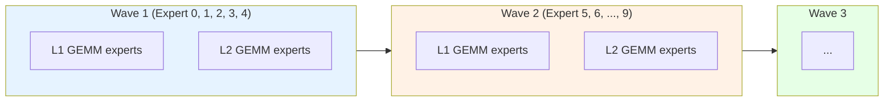

**关键**：`kNumExpertsPerWave=5` 是根据 SM 数和每 expert 的 block 数**动态计算**的：

```cpp
num_experts_per_wave = ⌈148 / tokens_per_expert × num_m_blocks × num_n_blocks⌉
```

每个 wave 内，所有 expert 的所有 (M, N) tile 分散到 148 个 SM 上。一个 wave 的 L1 完成 → L2 开始。**L1/L2 之间需要跨 block 同步（`l2_arrival_mask`），但不需要跨 rank**。

#### 4.6 PDL (Programmatic Dependent Launch)

```
__grid_constant__ cute::TmaDescriptor tensor_map_l1_acts;
                          ↑
                          └── 在 kernel launch 时由 host 写入
                               每次 launch 都会重新复制到 constant memory
```

PDL 允许：
1. **TMA descriptor 直接作为 `__grid_constant__` 参数传入**，省去 setup kernel
2. **依赖前序 kernel 的事件**（通过 `cuLaunchKernelEx` + attr）自动重叠

在 Mega MoE 里，PDL 让 CPU 端只需 1 次 launch，无需额外 setup。

#### 4.7 Per-Block Arrival（细粒度跨 Block 数据依赖）

```cpp
// L1 Epilogue 写完某个 N block 后
red_or_rel_gpu(l2_arrival_mask[pool_block], 1ull << n_block_idx);

// L2 TMA-A 等待需要的 N block
while ((cached_mask & needed_bits) != needed_bits)
    cached_mask = ld_acq_gpu(l2_arrival_mask[pool_block]);
```

**这不是归约，是数据依赖通知**：L2 的 K block 需要 L1 的 N block 作为输入，`l2_arrival_mask` 是一个 64-bit 位图，每 bit 对应一个 N block。

**原子操作**：
- `red_or_rel` = atomic OR with release semantics（写侧）
- `ld_acq_gpu` = atomic load with acquire semantics（读侧）

→ 跨 SM 数据同步，但 **完全无锁**。

#### 4.8 Fast Math 与精度

```cpp
if constexpr (kFastMath) {
    gate = __fmul2_rn(gate, {fast_rcp(denom.x), fast_rcp(denom.y)});
    neg_exp = __expf(-gate);  // 硬件快速 exp
}
```

- `__expf` ≈ 20 cycles，精度 ULP ≈ 2
- `__fdivide` (默认) ≈ 100 cycles，精度 ULP ≈ 0.5
- Fast math **仅在激活函数中使用**，GEMM 累加仍然是 FP32 精确累加

→ SwiGLU 计算加速 3-5 倍，端到端误差 < 1e-3（BF16 输出量化误差远大于此）。

---

### 5. 与传统实现的对比

#### 5.1 传统多 kernel 实现

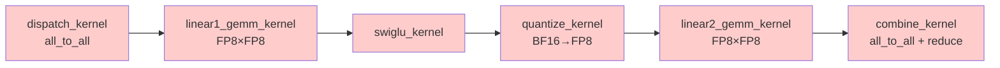

6 次 launch，5 次中间 HBM 读写，NCCL 通信无法与计算重叠。

#### 5.2 Mega MoE 实现

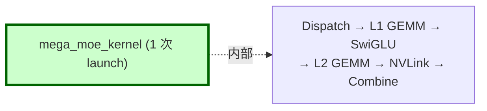

1 次 launch，中间数据走 SMEM/TMEM，NVLink 通信与 GEMM 重叠。

#### 5.3 性能数据对比（从 benchmark）

| 指标 | 传统 MoE (~推测) | Mega MoE | 收益 |
|------|------------------|----------|------|
| 总耗时 (T=1024/rank) | ~4500 us | 3114 us | **1.44x** |
| TFLOPS (FP8 effective) | ~1400 | 2090 | **1.49x** |
| HBM 峰值 | ~600 GB/s | 984 GB/s | **1.64x** |
| NVLink 带宽 | 串行等待 | 353 GB/s 并发 | ∞ |
| Kernel launch 次数 | 6+ | 1 | 6x |
| 中间 HBM 读写 | 5 次 | 0 次 | - |

#### 5.4 关键约束与权衡

| 约束 | 代价 | 收益 |
|------|------|------|
| 需要持久化 kernel | 单个 kernel 执行时间长，难 profile | 消除 launch 开销，缓存保留 |
| 需要 NVLink barrier | NCU replay 失效（本次实践验证） | 跨 rank 精细同步 |
| 需要 symmetric memory | PyTorch 2.x only | 零拷贝 NVLink |
| 需要 SM100 硬件 | 仅 B200/B300 | FP4 tensor core + TMEM |
| Shared memory 占用极高 | 只能 1 block/SM | TMA multi-stage pipeline |
| Warp 专业化复杂 | 调试/修改难度大 | 99% SM 利用率 |

---

### 附录：设计决策速查表

| 决策 | 原理 | 代码位置 |
|------|------|---------|
| 4+4+8 warp 分配 | 生产者-消费者+通信器三方专业化 | 模板参数 `kNumDispatchThreads` 等 |
| 寄存器 48/40/208 | 总和 98.4% 且按需分配 | `warpgroup_reg_alloc/dealloc` |
| 2-CTA cluster | 共享 TMEM + UMMA multicast | `cluster_sync()`, `is_leader_cta` |
| 6-stage pipe | TMA latency / MMA latency ≈ 3 | `kNumStages = 6` |
| 2 TMEM accumulator | MMA/Epilogue 流水不等待 | `kNumEpilogueStages` |
| Swap A/B | M<<N 时节省 SMEM 压力 | UMMA desc 构造 |
| Output-Stationary | 消除跨 CTA reduce | `l1/l2_arrival_count/mask` |
| Persistent kernel | 单次 launch 完成所有 expert | grid size = `kNumSMs` |
| Wave scheduler | 平衡 expert 粒度与 SM 数 | `kNumExpertsPerWave` |
| Symmetric memory | Kernel 内直发 NVLink store | `sym_buffer.map()` |
| Fast math epilogue | 激活函数加速 5x | `__expf`, `fast_rcp` |
| Per-block arrival | 细粒度数据依赖，无锁 | `red_or_rel`, `ld_acq` |

---

# 第四章：Warp 间 Barrier 机制深度剖析

> 剖析 `sm100_fp8_fp4_mega_moe.cuh` 中所有 Warp/Block/Cluster/Rank 级同步原语的底层机制、作用域、握手协议与死锁预防策略。

---

## 4.1 Barrier 体系全景

Mega MoE kernel 内部共使用 **5 种层级、10 类具体 barrier**，它们覆盖从 warp 内 handshake 到跨 rank 的 NVLink 同步。

```
                  ┌───────────────────────────────────────────────┐
作用域层级         │                                               │  延迟数量级
                  │                                               │
  Warp 内         │  __syncwarp() / elect_one_sync                │  <10 cycles
                  │                                               │
  Warpgroup/CTA   │  bar.sync (sync_aligned)                      │  ~30-50 cycles
                  │  barrier.sync (sync_unaligned)                │  ~50-100 cycles
                  │                                               │
  Cluster (2CTA) │  mbarrier (ClusterTransactionBarrier)         │  ~100-300 cycles
                  │    ├─ full / empty                            │
                  │    ├─ tmem_full / tmem_empty                  │
                  │    ├─ dispatch (per-warp)                     │
                  │    └─ combine (per-warp)                      │
                  │                                               │
  Grid (Intra-SM)│  grid_sync (atomic on workspace)              │  ~1-2 μs
                  │  per-block arrival (l1_count, l2_mask)        │  spin-wait
                  │                                               │
  Cross-rank     │  nvlink_barrier (atomic via NVLink)           │  ~4 μs
                  │                                               │
                  └───────────────────────────────────────────────┘
```

### 4.1.1 一张表看懂所有 Barrier

| # | Barrier 名称 | 类型 | PTX 指令 | 生产者 | 消费者 | Arrive count | 作用 |
|---|------|------|---------|--------|--------|--------------|------|
| 1 | `dispatch_barriers[w]` | mbarrier | `mbarrier.arrive.expect_tx` + `try_wait.parity` | TMA 硬件 | Warp w 自身 | 1 | 单个 Dispatch warp 的 per-token TMA pull 完成通知 |
| 2 | `full_barriers[s]` | mbarrier (ClusterTrans) | `cp.async.bulk ... .mbarrier::complete_tx::bytes` + `arrive_and_expect_tx` | TMA 硬件（tokens+weights） | MMA warp | 2×2=4 | Stage s 的 A/B tile 完全就绪 → MMA 可消费 |
| 3 | `empty_barriers[s]` | mbarrier | `umma_arrive_multicast_2x1SM` | MMA warp (UMMA 完成) | TMA A/B warps | 1 | Stage s 的数据已消费 → TMA 可覆写 |
| 4 | `tmem_full_barriers[e]` | mbarrier | `umma_arrive_multicast_2x1SM` | MMA warp | 所有 Epilogue warps | 1 | TMEM 累加器 e 写就绪 → Epilogue 可读 |
| 5 | `tmem_empty_barriers[e]` | mbarrier | `mbarrier.arrive` | Epilogue warps | MMA warp | 2×256 | TMEM 累加器 e 已读完 → MMA 可覆写 |
| 6 | `combine_barriers[w×2+b]` | mbarrier | `mbarrier.arrive.expect_tx` | TMA 硬件 | Epilogue warp w | 1 | Combine 阶段 double-buffer load 完成 |
| 7 | `kDispatchBarrierIdx (0)` | Named Barrier | `bar.sync 0, 128` | Dispatch warps | Dispatch warps | 128 | 4 个 Dispatch warp 内同步 |
| 8 | `kDispatchWithEpilogueBarrierIdx (1)` | Named Barrier | `barrier.sync 1, 384` | Dispatch + Epilogue | Dispatch + Epilogue | 384 (unaligned) | 分隔 Dispatch pull 与 Combine reduce，防止死锁 |
| 9 | `kEpilogueFullBarrierIdx (2)` | Named Barrier | `bar.sync 2, 256` | Epilogue warps | Epilogue warps | 256 | 8 个 Epilogue warp 全局同步 |
| 10 | `kEpilogueWGBarrierStartIdx (3/4)` | Named Barrier | `bar.sync 3/4, 128` | 单个 Epilogue WG | 单个 Epilogue WG | 128 | 每个 4-warp WG 内同步 |
| 11 | `grid_sync<idx>` | Atomic counter | `atomic_add_rel` + `ld_acq` loop | 所有 SM | 所有 SM | kNumSMs | Intra-rank 所有 SM 到达 |
| 12 | `l1_arrival_count[b]` | Atomic counter | `red_add_rel` + `ld_acq` loop | Dispatch warps | TMA-A warp | N tokens | Block b 的 tokens 全部就绪 |
| 13 | `l2_arrival_mask[b]` | Atomic bitmask | `red_or_rel_gpu` + `ld_acq_gpu` | L1 Epilogue | L2 TMA-A warp | bitmask | Block b 的 N block 就绪 |
| 14 | `nvlink_barrier` | Cross-rank signal | `red_add_rel_sys` + `ld_acq_sys` | SM 0 / 所有 rank | SM 0 / 所有 rank | kNumRanks | 跨 rank 同步点（dispatch 前/combine 前/cleanup 后） |

---

## 4.2 硬件基础：mbarrier 的工作原理

Mega MoE 中最核心的 Warp 间 barrier 是 SM80+ 引入、SM90/SM100 大幅强化的 **mbarrier**（Memory Barrier）。理解它的内部状态机是读懂本 kernel 同步逻辑的钥匙。

### 4.2.1 mbarrier 的 64-bit 状态

每个 mbarrier 占用 shared memory 中的一个 8-byte 槽位，64 位拆解如下：

```
┌───────────────┬───────────────┬───────────────┬───────────────┐
│  phase bit    │  arrive count │  expected_tx  │  pending_tx   │
│    (1 bit)    │  (15 bits)    │    (20 bits)  │    (20 bits)  │
│               │  current /    │               │  remaining    │
│               │  initial      │               │  bytes to     │
│               │               │               │  arrive       │
└───────────────┴───────────────┴───────────────┴───────────────┘
      ↑
      当 arrive count 归零 + pending_tx 归零 时翻转
```

三个关键计数：

| 计数 | 作用 | 触发方式 |
|------|------|---------|
| **arrive count** | 记录还需多少个 thread "到达"（`arrive`）才能翻相位 | 初始值 = `init(N)` 中的 N；每次 `arrive()` 减 1 |
| **expected_tx** | 告诉 barrier "还将从 TMA 收到多少字节" | `arrive_and_expect_tx(bytes)` 设置 |
| **pending_tx** | 实际到达的 TMA 字节数 | `cp.async.bulk.mbarrier::complete_tx::bytes` 硬件自动累加 |

**翻相位条件（barrier "完成"）：**

```
arrive_count == 0  AND  pending_tx == expected_tx
       ↓
   phase ^= 1，arrive_count 重置为 initial，expected_tx/pending_tx 清零
```

### 4.2.2 Phase Bit：避免 ABA 问题的关键

mbarrier 的等待指令 `mbarrier.try_wait.parity` 比较的是 **相位**，不是计数。每次完成一轮 barrier，相位翻转一次：

```c++
// Wait 的实现（deep_gemm/ptx/tma.cuh）
CUTLASS_DEVICE void mbarrier_wait_and_flip_phase(
    cutlass::arch::ClusterTransactionBarrier* ptr, uint32_t& phase) {
    asm volatile(
        "LAB_WAIT: \n\t"
        "mbarrier.try_wait.parity.shared::cta.b64 P1, [%0], %1, %2; \n\t"
        "@P1 bra DONE; \n\t"
        "bra     LAB_WAIT; \n\t"
        "DONE: \n\t" ::
        "r"(bar_addr), "r"(phase), "r"(0x989680));  // 0x989680 = 10M cycle timeout
    phase ^= 1;  // Software 端也翻转
}
```

调用方维护一个 software phase 变量，**每次 wait 后翻转**。硬件的 phase 也独立翻转，当两者匹配时才放行：

```
轮次 0: wait(phase=0) → hardware phase=0 → 匹配 → 放行 → phase=1
轮次 1: wait(phase=1) → hardware phase=1 → 匹配 → 放行 → phase=0
轮次 2: wait(phase=0) → hardware phase=0 → 匹配 → 放行 → phase=1
...
```

**为什么需要 phase？** 如果只比较 arrive count，就会遇到 **ABA 问题**：producer 可能在 consumer 还没 wait 前就再次 arrive。Phase bit 把 barrier 的"第 N 次使用"唯一化，避免误判。

### 4.2.3 Transaction Count：TMA 的精确同步

`ClusterTransactionBarrier` 是 mbarrier 的子类，额外支持 **transaction count**。当 TMA 发起搬运时：

```c++
// TMA 硬件会在每次字节到达时 atomic 地减少 pending_tx
asm volatile(
    "cp.async.bulk.shared::cluster.global.mbarrier::complete_tx::bytes.L2::cache_hint "
    "[%0], [%1], %2, [%3], %4;\n" ::
    "r"(smem_dst), "l"(src), "r"(num_bytes),
    "r"(bar_addr), "l"(hint) : "memory");
```

Producer（TMA issue warp）同时告知 barrier "本次 arrive 同时期望到 N 字节"：

```c++
full_barriers[stage_idx]->arrive_and_expect_tx(SMEM_A_SIZE_PER_STAGE * 2 + SF_BLOCK_M * 8);
// arrive_count -= 1
// expected_tx += (SMEM_A_SIZE + SF_SIZE) bytes
```

只有当 `arrive_count == 0 && pending_tx == expected_tx` 时才翻相位。这就实现了 **"N 个 warp 都 arrive 了，且 M 字节全部 TMA 到达"** 的组合条件。

---

## 4.3 逐个 Barrier 详细剖析

下面按 barrier 类型深入分析每个的初始化参数、触发协议、与哪些 warp 握手。

### 4.3.1 `dispatch_barriers[w]` — 每 Warp 一个的 TMA pull 信号

**用途：** 每个 Dispatch warp 独立进行 "NVLink TMA pull → wait → TMA store" 的循环。每 pull 一个 token 需要一次握手。

**初始化**（warp 1，位于 kernel 开头）：

```c++
else if (warp_idx == 1) {
    #pragma unroll
    for (uint32_t i = lane_idx; i < kNumDispatchWarps; i += 32)
        dispatch_barriers[i]->init(1);   // ← arrive count = 1
    cutlass::arch::fence_barrier_init();
}
```

`init(1)` 表示只需要 **1 次 arrive** 就翻相位——因为 TMA 硬件自己是 "producer"，arrive 的只是 warp 里的一个 leader lane。

**握手协议：**

```c++
// 一个 Dispatch warp 处理一个 token
if (cute::elect_one_sync()) {                             // 只有 1 个 lane 发指令
    ptx::tma_load_1d(pull_buffer, remote_src,
                     pull_mbarrier, kHidden);             // 发起 NVLink TMA load
}

// ... 同时并发做 SF 拷贝 ...

if (cute::elect_one_sync()) {
    ptx::mbarrier_arrive_and_set_tx(pull_mbarrier, kHidden); // arrive + 期望 kHidden 字节
    ptx::mbarrier_wait_and_flip_phase(pull_mbarrier, phase); // spin 等待
    // 此时 TMA pull 已完成
    ptx::tma_store_1d(...);                              // 继续 TMA store
}
```

**关键点：** `arrive_and_set_tx` 不是告知 barrier "我到了"，而是 **"TMA 将会送来 kHidden 字节，我等着"**。真正让 `pending_tx` 增长的是 TMA 硬件本身。

### 4.3.2 `full_barriers[s]` — TMA Producer → MMA Consumer 的经典流水 barrier

**初始化**（warp 2，kernel 开头）：

```c++
#pragma unroll
for (uint32_t i = 0; i < kNumStages; ++ i) {
    full_barriers[i]->init(2 * 2);   // ← arrive count = 4
    empty_barriers[i]->init(1);
}
```

**为什么 `full_barriers` init=4？**

这是理解 2-CTA cluster 下 barrier 语义的核心：

```
每个 Stage 的 A tile 和 B tile 要从 TMA 分别到达 2 个 CTA（Cluster 内两个 SM）：

  Leader CTA (SM i):
    TMA-A warp: tma::copy(tokens)           → full_barriers[s]·arrive (1)
    TMA-A warp: tma::copy(SFA)              → full_barriers[s]·arrive (1)   合并为 1 次 arrive_and_expect_tx
    TMA-B warp: tma::copy(weights)          → full_barriers[s]·arrive (1)
    TMA-B warp: tma::copy(SFB)              → full_barriers[s]·arrive (1)

  Non-leader CTA (SM i+1):
    对等 4 次 arrive (但 expect_tx=0)
```

实际代码中，TMA-A 和 TMA-B warp 各自在自己那里只调一次 `arrive_and_expect_tx`（合并了 tokens+SFA 两次 copy 的字节数），两个 CTA 各 arrive 1 次 → 总计 **2 warp × 2 CTA = 4 次 arrive**。

```c++
// TMA-A warp (warp 4)
tma::copy<...>(tensor_map_a_ptr, full_barriers[stage_idx], smem_a[stage_idx], ..., 2);
tma::copy<...>(tensor_map_sfa_ptr, full_barriers[stage_idx], smem_sfa[stage_idx], ..., 2);
if (is_leader_cta) {
    full_barriers[stage_idx]->arrive_and_expect_tx(
        SMEM_A_SIZE_PER_STAGE * 2                       // tokens × 2 CTA
        + SF_BLOCK_M * sizeof(uint32_t) * 2             // SFA   × 2 CTA
    );
} else {
    full_barriers[stage_idx]->arrive(0u);                // Non-leader 只 arrive 不 expect
}
```

**MMA 端的 consumer：**

```c++
// MMA warp (warp 6, only leader CTA)
full_barriers[stage_idx]->wait(phase);        // ← 等待 4 次 arrive + 总字节到齐
ptx::tcgen05_after_thread_sync();             // MMA 侧的内存序栅栏
// 发射 UMMA...
```

### 4.3.3 `empty_barriers[s]` — MMA 反向通知 TMA 可以覆写

**初始化：**`init(1)` — 只需 1 次 arrive。

**反向握手的巧妙之处：** MMA 不用普通的 `arrive`，而是用 **UMMA 的 multicast arrive**：

```c++
auto empty_barrier_arrive = [&](const bool& do_tmem_full_arrive) {
    auto umma_arrive = [](const uint64_t* barrier) {
        constexpr uint16_t kCTAMask = (1 << 2) - 1;                     // 两个 CTA 都通知
        cutlass::arch::umma_arrive_multicast_2x1SM(barrier, kCTAMask);  // tcgen05.commit
    };
    umma_arrive(reinterpret_cast<uint64_t*>(empty_barriers[stage_idx]));
    // 只有 K-loop 的最后一个 block 才 arrive tmem_full
    if (do_tmem_full_arrive)
        umma_arrive(reinterpret_cast<uint64_t*>(tmem_full_barriers[accum_stage_idx]));
};
```

对应 PTX：

```
tcgen05.commit.cta_group::1.mbarrier::arrive::one.shared::cluster.b64 [%0];
```

**为什么用 `tcgen05.commit` 而非 `mbarrier.arrive`？**

UMMA 是异步的——`SM100_MMA_MXF8F6F4_2x1SM_SS::fma()` 发射后并不立即完成。如果用普通的 `mbarrier.arrive`，会在 UMMA 还在跑的时候就通知 consumer。`tcgen05.commit` 的语义是 **"当所有前置的 UMMA 都真正完成时才 arrive"**——硬件保证 UMMA 的完成顺序与 commit 顺序一致。

这意味着 MMA warp 不需要显式等 UMMA 完成，直接发 commit 即可继续下一轮，**UMMA 自己会在后台完成后 arrive barrier**——这是 SM100 异步张量核心的核心优势。

**TMA warp 的 wait：**

```c++
// TMA-A warp (warp 4) 和 TMA-B warp (warp 5) 都有这一行
empty_barriers[stage_idx]->wait(phase ^ 1);
```

注意这里的 `phase ^ 1`——因为 full/empty 的相位是 **反相**的：stage 首次使用时 full 是 phase 0，empty 是 phase 1（初始视为已 empty）。

### 4.3.4 `tmem_full_barriers[e]` / `tmem_empty_barriers[e]` — TMEM 流水线

**初始化：**

```c++
tmem_full_barriers[i]->init(1);                       // 1 次 arrive (MMA 的 commit)
tmem_empty_barriers[i]->init(2 * kNumEpilogueThreads);// 2 × 256 = 512 次 arrive
```

**为什么 `tmem_empty` init = 2 × 256？**

```
两个 CTA 的所有 Epilogue 线程都要 arrive:
  - Leader CTA 的 256 个 Epilogue 线程
  - Non-leader CTA 的 256 个 Epilogue 线程
  - 总计 512 次

每个 Epilogue 线程读完 TMEM 后调用:
  tmem_empty_barriers[accum_stage_idx]->arrive(0u);  // 普通 mbarrier.arrive
```

但是等等——代码中 Epilogue 调用 `arrive(0u)` 时，实际只有少数几个 warp 会发起 arrive（通过 `lane_idx == 0` 等 elect），**为什么 init 是 512？**

答案藏在 PTX 里：`mbarrier.arrive.shared::cta.b64` 每次调用就让 arrive_count **减 1**，但是在 SM90+ 上，**如果通过 thread 发射，硬件会以一个线程为单位减 1，但如果是通过 warp 级原语如 `cute::elect_one_sync`，则只有 elected lane 会执行**。

实际 Mega MoE 的代码中：

```c++
// Linear1 epilogue 的最后一个 atom
if (j == WG_BLOCK_M / ATOM_M - 1) {
    ptx::tcgen05_before_thread_sync();
    tmem_empty_barriers[accum_stage_idx]->arrive(0u);  // 注意：没有 elect_one
}
```

**没有 `elect_one_sync`，意味着整个 warp 的 32 个 lane 都会执行到这行**。一个 warp 的 32 次调用 = 32 次 arrive。8 个 Epilogue warp × 32 lane = 256，加上两个 CTA = 512 = 2 × 256。精确匹配 init 值。

这是一个很精巧的设计：**用 "所有线程同时 arrive" 替代 "一个 leader arrive N 次"**，避免 elect 的开销并自动支持 2-CTA。

### 4.3.5 `combine_barriers[i]` — Combine 阶段的双缓冲 TMA

**初始化：**

```c++
for (uint32_t i = 0; i < kNumEpilogueWarps * 2; ++ i)
    combine_barriers[i]->init(1);  // Per-warp × 2 stage
```

**握手模式（与 `dispatch_barriers` 类似）：**

```c++
// 每个 Epilogue warp 独立处理一个 token 的 topk combine
auto combine_load_barriers = [&](uint32_t i) {
    return combine_barriers[i + epilogue_warp_idx * 2];  // 每 warp 占 2 个 barrier
};

// Double-buffered pipeline
bool do_reduce = move_mask_and_load(load_stage_idx);     // 启动 stage 0 load
while (do_reduce) {
    do_reduce = move_mask_and_load(load_stage_idx ^ 1);  // 启动 stage 1 load（prefetch）
    
    combine_load_barriers[load_stage_idx]->wait(combine_phase);  // 等 stage 0 完成
    // 累加 stage 0...
    
    combine_phase ^= load_stage_idx;                      // 翻 phase（仅当 stage 0 消费完）
    load_stage_idx ^= 1;                                  // 切换 stage
}
```

**`combine_phase ^= load_stage_idx` 的含义：** 只有当 `load_stage_idx == 0` 时 `combine_phase` 才翻（因为 `0 ^ phase = phase`，`1 ^ phase ≠ phase`，wait 实际上是 XOR 运算）——这确保两个 stage 的 phase 独立推进。

---

## 4.4 Named Barrier（`bar.sync` / `barrier.sync`）

除了 mbarrier，Mega MoE 还使用 **PTX Named Barriers**（硬件保留的 16 个），通过整数索引 0-15 引用：

### 4.4.1 硬件指令

```c++
CUTLASS_DEVICE void sync_aligned(const uint32_t& num_threads, const uint32_t& barrier_idx) {
    asm volatile("bar.sync %0, %1;" : : "r"(barrier_idx), "r"(num_threads));
}

CUTLASS_DEVICE void sync_unaligned(const uint32_t& num_threads, const uint32_t& barrier_idx) {
    asm volatile("barrier.sync %0, %1;" : : "r"(barrier_idx), "r"(num_threads));
}
```

| 指令 | 要求 | 成本 | 用法 |
|------|------|------|------|
| `bar.sync` | 必须所有线程都执行到且 `num_threads` 是 32 的倍数 | ~30 cycles | 同一 warp group 内同步 |
| `barrier.sync` | 允许线程数不对齐（比如跨 warp 角色混合） | ~50-100 cycles | 跨异构 warp 同步 |

### 4.4.2 Mega MoE 使用的 4 个 Named Barrier ID

```c++
constexpr uint32_t kDispatchBarrierIdx = 0;              // Dispatch 内部同步 (128T)
constexpr uint32_t kDispatchWithEpilogueBarrierIdx = 1;  // 跨角色同步 (384T, unaligned)
constexpr uint32_t kEpilogueFullBarrierIdx = 2;          // Epilogue 全体同步 (256T)
constexpr uint32_t kEpilogueWGBarrierStartIdx = 3;       // Epilogue WG 内 (128T) — 使用 id 3 和 4
```

### 4.4.3 `kDispatchWithEpilogueBarrierIdx = 1` — 最关键的反死锁 barrier

这个 barrier 的作用容易被忽略但极其关键。它同步 **Dispatch (128T) + Epilogue (256T) = 384 线程**，使用 `barrier.sync` 因为 384 不是 32 对齐的连续区间（跳过了 Warp 4-7 的 128 线程）。

**出现的三个位置：**

```c++
// 位置 1: Dispatch 端 — "我要开始 pull 了"
ptx::sync_unaligned(kNumDispatchThreads + kNumEpilogueThreads, 1);

// 位置 2: Dispatch 端 — "我 pull 完了，准备 cleanup"
ptx::sync_unaligned(kNumDispatchThreads + kNumEpilogueThreads, 1);

// 位置 3: Epilogue 端 — "我 combine 做完了，你 cleanup 吧"
ptx::sync_unaligned(kNumDispatchThreads + kNumEpilogueThreads, 1);
```

**它防止的死锁场景：**

如果没有这个 barrier，下述顺序会导致 deadlock：

```
时刻 t0:
  Dispatch warps 进入 cleanup 阶段，清零 l1_arrival_count
  同时 Epilogue warps 还在做 Combine，读取 combine_token_buffer

时刻 t1:
  下一轮 kernel 调用开始（persistent 模式下的下一批 tokens）
  Dispatch warps 开始新一轮 Count Tokens，但 Epilogue 还在上一轮 Combine

时刻 t2:
  Epilogue 完成 Combine，进入下一轮 epilogue
  但 Dispatch 已清零了一些 Epilogue 还没用完的元数据 → 数据竞态
```

`kDispatchWithEpilogueBarrierIdx` 强制 **Dispatch 的 cleanup 必须等到 Epilogue 的 combine 结束**。这是一个 "横跨 4 个角色中的 2 个" 的粗粒度同步。

### 4.4.4 `kEpilogueWGBarrierStartIdx` — 双 Warp Group 内部

每个 Epilogue Warp Group（4 warps = 128 threads）有自己的 barrier：

```c++
// Linear1 Epilogue 内
ptx::sync_aligned(128, kEpilogueWGBarrierStartIdx + epilogue_wg_idx);
// epilogue_wg_idx ∈ {0, 1}，所以使用的 barrier id 是 3 和 4
```

作用：**一个 WG 内 4 个 warp 交换 amax 信息时必须对齐 shared memory 写入**。这个 barrier 确保 `smem_amax_reduction` 的跨 warp pair 归约可见。

---

## 4.5 完整的 K-block 握手时序图

把所有 barrier 串起来，一个 K-block 的完整握手如下：

```
Stage s, K-block k 的流水线 (假设是 Linear1 L1 GEMM 的第 k 个 K block):

Time ───────────────────────────────────────────────────────────────→

TMA-A warp (4):
  empty_barriers[s].wait(phase^1)                         ← 等上一轮 MMA 释放
  │
  ├─ tma::copy(tokens, full_barriers[s])                  ← 发起 TMA (硬件自动填 tx)
  ├─ tma::copy(SFA,    full_barriers[s])
  └─ full_barriers[s].arrive_and_expect_tx(bytes)         ← arrive + 期望字节

TMA-B warp (5):
  empty_barriers[s].wait(phase^1)                         ← 同上
  │
  ├─ tma::copy(weights, full_barriers[s])
  ├─ tma::copy(SFB,     full_barriers[s])
  └─ full_barriers[s].arrive_and_expect_tx(bytes)         ← arrive count 变为 0
                                                             AND pending_tx == expected_tx
                                                             → full_barriers[s] 翻 phase

MMA warp (6):
  full_barriers[s].wait(phase)                            ← 匹配 phase，放行
  │
  ├─ UTCCP: smem_sfa → TMEM
  ├─ UTCCP: smem_sfb → TMEM
  ├─ SM100_MMA_MXF8F6F4_2x1SM_SS::fma(b, a, ...)          ← 发射异步 UMMA
  │
  └─ umma_arrive_multicast_2x1SM(empty_barriers[s])       ← tcgen05.commit
                                                             UMMA 完成后自动 arrive
                                                             → empty_barriers[s] 翻 phase
                                                             → 下一轮 TMA 可覆写

  (当 k == last_k) 
  └─ umma_arrive_multicast_2x1SM(tmem_full_barriers[e])   ← TMEM 累加完成通知

Epilogue warps (8-15):
  tmem_full_barriers[e].wait(accum_phase)                 ← 等 MMA 累加完
  │
  ├─ SM100_TMEM_LOAD_16dp256b1x ...                       ← 从 TMEM 读
  ├─ SwiGLU + amax + FP8 cast                             ← 计算
  ├─ sync_aligned(128, WG barrier)                        ← WG 内同步 amax
  ├─ SM90_TMA_STORE_2D ...                                ← 写回 HBM
  ├─ sync_aligned(256, EpilogueFullBarrier)               ← 8 warp 同步
  └─ tmem_empty_barriers[e].arrive(0u) × 256 threads × 2  ← 通知 MMA 可覆写 TMEM
                                                             (arrive count 达到 512)
                                                             → tmem_empty_barriers[e] 翻 phase

   └─ red_or_rel_gpu(l2_arrival_mask, 1 << n_block_idx)   ← 通知下阶段 L2 可读
```

---

## 4.6 Grid / Cross-rank Barrier 机制

### 4.6.1 `grid_sync` — 基于原子计数器的 "高位翻转" 技巧

```c++
template <uint32_t kNumSMs, uint32_t kGridSyncIndex, typename sync_scope_t>
void grid_sync(workspace, sm_idx, thread_idx, sync_scope) {
    constexpr uint32_t kFinishSumTag = 0x80000000u;   // 最高位作为 "完成"tag
    sync_scope();
    if (thread_idx == 0) {
        const auto count_ptr = workspace.get_grid_sync_count_ptr<kGridSyncIndex>();
        const auto old_value = ptx::atomic_add_rel(count_ptr,
            sm_idx == 0 ? (kFinishSumTag - (kNumSMs - 1)) : 1);
        uint32_t new_value;
        do {
            new_value = ptx::ld_acq(count_ptr);
        } while (((new_value ^ old_value) & kFinishSumTag) == 0);
    }
    sync_scope();
}
```

**算法解析：**

```
假设 kNumSMs = 148:
  kFinishSumTag = 0x80000000 (bit 31)
  
  SM 0 加的值: 0x80000000 - 147 = 0x7FFFFF6D
  其他 SM 加的值: 1 (每个)
  
  所有 147 个其他 SM 到达后: counter += 147
  SM 0 到达后: counter += 0x7FFFFF6D (= 0x80000000 - 147)
  
  总和: 0x80000000 - 147 + 147 = 0x80000000 (bit 31 翻转了!)

检测 bit 31 翻转:
  (new_value ^ old_value) & 0x80000000 != 0
  
  → 任何 SM 都能看到 bit 31 从 0 变成 1 (或从 1 变成 0)
  → 即使跨越多次 grid_sync 调用，也能正确检测（因为 bit 31 每次翻转）
```

**为什么不用简单的 "counter == N"？** 因为 persistent kernel 会多次调用 `grid_sync`，如果用累加，需要复杂的 phase 管理。用 bit 31 翻转相当于 **每次 grid_sync 都是一次新的 phase**，天然避免 ABA。

### 4.6.2 `nvlink_barrier` — 跨 rank 的 NVLink 同步

```
nvlink_barrier 的三阶段:

  Stage 1: 前置 grid_sync (可选)
    ├─ 确保本 rank 所有 SM 到达，没有正在读写的 SM
  
  Stage 2: Cross-rank 握手 (仅 SM 0)
    ├─ 计算 signal_phase (0 or 1) 和 signal_sign (+1 or -1)
    ├─ thread i (i < kNumRanks) 向 rank i 发 red_add_rel_sys(signal, ±1)
    ├─ thread 0 等待本地 signal 达到目标值 (= 0 或 = kNumRanks)
    └─ 超时 30 秒 → DG_DEVICE_ASSERT
  
  Stage 3: 后置 grid_sync (可选)
    ├─ 确保 SM 0 的跨 rank 同步信息传达给本 rank 所有 SM
```

**为什么 signal 要交替 ±1？**

```
状态机 (status = *counter_ptr & 3):
  counter 的 bit 0: signal_phase (使用哪个 signal 槽)
  counter 的 bit 1: signal_sign  (这次加 +1 还是 -1)

每次 nvlink_barrier 后 counter++:
  状态 0 (phase=0, sign=0): 用 signal[0], 加 +1,  等 counter == kNumRanks
  状态 1 (phase=1, sign=0): 用 signal[1], 加 +1,  等 counter == kNumRanks
  状态 2 (phase=0, sign=1): 用 signal[0], 加 -1,  等 counter == 0
  状态 3 (phase=1, sign=1): 用 signal[1], 加 -1,  等 counter == 0
  然后 wrap 回状态 0

好处:
  - 无需清零: signal 在 +1/-1 交替下自然归零
  - 两个 signal 槽轮换: phase 0 还在等的时候, phase 1 已经可以开始新一轮
  - 避免 ABA 问题
```

### 4.6.3 3 个 NVLink Barrier 的时序

Mega MoE kernel 生命周期内只调用 **3 次 nvlink_barrier**：

```c++
constexpr uint32_t kBeforeDispatchPullBarrierTag = 1;    // 进入 pull 阶段前
constexpr uint32_t kBeforeCombineReduceBarrierTag = 2;   // 进入 combine 前
constexpr uint32_t kAfterWorkspaceCleanBarrierTag = 3;   // Cleanup 完成后

时间线:
  t0:  Grid 开始
  t1:  Dispatch: Count → Grid sync → Write expert count
  t2:  ▼ nvlink_barrier #1 (kBeforeDispatchPullBarrierTag)
       ▼ 所有 rank 的 expert count 写完后才开始 pull
  t3:  Dispatch pull + L1/L2 GEMM (跨 rank 无同步，持续 2-3 ms)
  t4:  L2 NVLink 写入 combine_buffer
  t5:  ▼ nvlink_barrier #2 (kBeforeCombineReduceBarrierTag)
       ▼ 所有 rank 写完后才开始 combine reduce
  t6:  Combine reduce (Epilogue warps) + Cleanup (Dispatch warps) 并发
  t7:  ▼ nvlink_barrier #3 (kAfterWorkspaceCleanBarrierTag)
       ▼ 所有 rank cleanup 完后才退出 kernel
  t8:  Grid 结束
```

**注意：** NVLink barrier 不会打断正常的 compute，只在关键的"发布数据"前后做同步。所有细粒度的跨 rank 数据依赖（如 L1→L2）都通过 **per-block arrival** 完成，不经过全局 barrier。

---

## 4.7 Per-block Arrival：无锁跨 Block 数据依赖

### 4.7.1 `l1_arrival_count[pool_block]` — Dispatch → TMA-A

**语义：** 一个 pool block (BLOCK_M 个 token) 的 tokens 全部 pull 到位后，TMA-A warp 才能加载。

**写入侧（Dispatch warp，每个 token 一次）：**

```c++
ptx::red_add_rel(
    workspace.get_l1_arrival_count_ptr(expert_pool_block_offset + token_idx_in_expert / BLOCK_M),
    1);
```

PTX 指令：`red.release.gpu.add.u32 [%0], %1;`
- `.release` = release 语义，保证之前所有 store 在此 atom 前全局可见
- `.gpu` = GPU 级别的原子（覆盖所有 SM）

**读取侧（TMA-A warp，每个 Block 等一次）：**

```c++
if (block_phase == BlockPhase::Linear1) {
    const auto ptr = workspace.get_l1_arrival_count_ptr(pool_block_idx);
    const auto expected = scheduler.template get_valid_m<false>();   // 该 block 的 token 数
    while (ptx::ld_acq(ptr) != expected);                             // spin-wait
}
```

PTX 指令：`ld.acquire.gpu.b32`
- `.acquire` = acquire 语义，保证后续 load 看到对应 release 之前的 store

**为什么不用 mbarrier？** 因为 **写入方（Dispatch）和读取方（TMA-A）可能在不同 SM 上**，而 mbarrier 只能跨 cluster（2 个 CTA），不能跨任意 SM。必须用全局原子操作。

### 4.7.2 `l2_arrival_mask[pool_block]` — L1 Epilogue → L2 TMA-A

**语义：** 一个 N-block 的 L1 FP8 output 写完后，L2 TMA-A 可以开始加载对应的 K-block。

**为什么用 bitmask 而非 counter？**

L1 的 N-block 有 48 个（DeepSeek V3 配置），但 L2 的 K-block 粒度不同。`BLOCK_K == BLOCK_N`，所以 L2 的 K=k 需要 L1 的 N=2k 和 N=2k+1 两个块就绪：

```c++
const uint64_t needed = 3ull << (k_block_idx * 2);   // 连续 2 bit
while ((cached_l2_arrival_mask & needed) != needed) {
    cached_l2_arrival_mask = ptx::ld_acq_gpu(ptr);
}
```

如果用 counter 就无法表达"需要具体哪两个 N block 就绪"。Bitmask 让每个 N block 一一对应，通过 `AND` 快速检查子集。

**写入侧：**

```c++
ptx::red_or_rel_gpu(
    workspace.get_l2_arrival_mask_ptr(pool_block_idx),
    1ull << n_block_idx
);
```

PTX: `red.release.gpu.or.b64 [%0], %1;` — **atomic OR** 操作，保证多个 L1 epilogue 并发写同一 mask 不丢 bit。

---

## 4.8 初始化阶段的 Warp 分工

Kernel 开头的初始化阶段（28 行代码）完美展示了 4 个 warp 的并发初始化：

```c++
cute::cluster_sync();  // ← 进入 kernel 后，Cluster 内两个 CTA 同步

if (warp_idx == 0) {
    // 清零 smem_expert_count
    if (cute::elect_one_sync())
        ptx::st_shared_bulk(smem_expert_count, kNumExperts * sizeof(uint32_t));
} else if (warp_idx == 1) {
    // 初始化 dispatch_barriers
    for (uint32_t i = lane_idx; i < kNumDispatchWarps; i += 32)
        dispatch_barriers[i]->init(1);
    cutlass::arch::fence_barrier_init();
} else if (warp_idx == 2) {
    // 初始化 GEMM 全套 barriers
    if (cute::elect_one_sync()) {
        for (...) {
            full_barriers[i]->init(2 * 2);
            empty_barriers[i]->init(1);
        }
        for (...) {
            tmem_full_barriers[i]->init(1);
            tmem_empty_barriers[i]->init(2 * kNumEpilogueThreads);
        }
        for (...)
            combine_barriers[i]->init(1);
    }
    cutlass::arch::fence_barrier_init();
} else if (warp_idx == 3) {
    // 分配 TMEM
    Allocator().allocate(kNumTmemCols, tmem_ptr_in_smem);
}

cute::cluster_sync();  // ← 所有初始化完成，进入计算阶段
```

**4 个核心原则：**

1. **`cluster_sync` 在前后**：确保 2-CTA cluster 的 TMEM 分配一致（TMEM 是 cluster 级资源）。
2. **`fence_barrier_init`**：保证 `mbarrier.init` 对后续的 `wait/arrive` 可见（这是 SM90 引入的 fence 指令）。
3. **每个 warp 只做一件事**：避免多个 warp 同时写同一块 shared memory。
4. **`elect_one_sync`**：对可并行化的工作（如 `st_shared_bulk`），只让一个 lane 执行，节省带宽。

---

## 4.9 Barrier 开销与性能影响

### 4.9.1 延迟对比表

| Barrier 类型 | 最优延迟 | 实测延迟（稳态） | 占用频率 |
|------|---------|---------|---------|
| `__syncwarp()` | <5 cycles | ~10 cycles | 非常频繁 (~每 10 指令) |
| `bar.sync` (warp group) | ~30 cycles | ~40 cycles | 频繁 (每 tile) |
| `barrier.sync` (unaligned) | ~50 cycles | ~100 cycles | 少（3 次 per kernel） |
| mbarrier wait (full/empty) | ~100 cycles | **0**（流水线重叠） | 每 stage |
| mbarrier wait (tmem) | ~200 cycles | **0**（流水线重叠） | 每 K-loop |
| `l1_arrival_count` spin | 2-50 μs | 通常 <1 μs | 每 Linear1 block |
| `l2_arrival_mask` spin | 1-10 μs | 通常 <0.5 μs | 每 Linear2 block |
| `grid_sync` | ~1.5 μs | ~1.5 μs | 8-10 次 |
| `nvlink_barrier` | ~4 μs | ~4-8 μs | 3 次 |

**关键观察：** mbarrier 的理论延迟很高，但在稳态流水线下 **wait 几乎不阻塞**——因为 producer 总是领先 consumer 足够多 stages，等到 consumer 去 wait 时数据已就绪。

### 4.9.2 哪些 barrier 是真正的性能瓶颈？

1. **`nvlink_barrier`**（3 × 4μs = 12 μs）：固定开销，不受 batch size 影响。对小 batch（<128 tokens）是主要瓶颈。
2. **`grid_sync`**（~10 × 1.5μs = 15 μs）：同上。
3. **`l1_arrival_count` spin**：当 Dispatch 慢于预期时会阻塞 GEMM。典型场景：NVLink 拥塞。
4. **`sync_aligned(256, kEpilogueFullBarrierIdx)`**：每个 GEMM block 后都做，8 warp 对齐，平均 ~40 cycles。

### 4.9.3 如何在 Profiler 中观测

```bash
# Nsight Systems 能捕获 grid_sync / nvlink_barrier 的时序
nsys profile --trace=cuda --cuda-memory-usage=true python tests/test_mega_moe.py

# Nsight Compute 能看 mbarrier stall 指标（但 NCU 对 persistent kernel 不友好）
# 查看指标: smsp__pcsamp_stall_mbarrier_wait
```

---

## 4.10 设计权衡与最佳实践

### 4.10.1 为什么不全用 mbarrier？

**mbarrier 的局限：**
- 只能在 Cluster 内（最多 2 CTA）工作
- `init(N)` 中 N ≤ 512（15 bits）
- Shared memory 中每个 barrier 占 8 字节，太多会占 smem 预算

因此对跨 SM 同步（l1/l2 arrival）用 **atomic global counter**，对跨 rank 同步用 **NVLink signal**，对 cluster 内用 **mbarrier**，分层化使用。

### 4.10.2 为什么 `full_barriers` init=4 而不是 2？

初看，2 个 warp (TMA-A + TMA-B) 各 arrive 1 次 = 2 应该就够。但 **2-CTA cluster** 下，两个 CTA 的 TMA warp 都要 arrive 自己那个 CTA 的 mbarrier（mbarrier 是 per-CTA 的），总计 2×2=4。

这也是为什么 `tmem_full_barriers` init=1——因为 `umma_arrive_multicast_2x1SM` 会同时通知两个 CTA，**多播发射只算 1 次 arrive**。

### 4.10.3 死锁预防的"三道防线"

```
第一道：Cluster sync (硬件 level)
  ├─ cluster_sync() 确保 2-CTA 协同启动
  
第二道：Named Barrier (block level)
  ├─ kDispatchWithEpilogueBarrierIdx 隔离 Dispatch pull 和 Combine reduce
  
第三道：mbarrier phase + Global atomic
  ├─ phase 翻转防止 ABA
  ├─ l1_count / l2_mask 细粒度依赖
```

### 4.10.4 Mega MoE 同步设计的 5 个原则

1. **按作用域选 barrier**：warp 内用 `__syncwarp`；WG 内用 `bar.sync`；Cluster 内用 mbarrier；跨 SM 用 atomic；跨 rank 用 NVLink signal。
2. **异步优先**：UMMA/TMA 都是异步的，永远用 commit/expect_tx 让硬件在后台完成。
3. **Producer/Consumer 配对**：每个 full barrier 必有对应的 empty barrier，避免单向 signaling。
4. **Phase bit 是 free lunch**：不要手动管理 counter 的重置，用 phase 翻转是最便宜的。
5. **粗粒度 barrier 用在必须的地方**：grid_sync / nvlink_barrier 是昂贵的，只在数据发布的关键点使用。

---

## 4.11 小结：Barrier 全景图

```
┌──────────────────────────────────────────────────────────────────────────┐
│                                                                          │
│                Mega MoE Kernel 的 Barrier 层级                           │
│                                                                          │
│    ┌──────────── Cross-Rank (NVLink, ~4 μs) ────────────┐               │
│    │  nvlink_barrier × 3 (dispatch / combine / cleanup)  │               │
│    └────────────────────┬───────────────────────────────┘                │
│                         │                                                │
│    ┌──────────── Grid (atomic counter, ~1.5 μs) ────────┐               │
│    │  grid_sync<DispatchIdx> / grid_sync<EpilogueIdx>    │               │
│    └────────────────────┬───────────────────────────────┘                │
│                         │                                                │
│    ┌──────── Per-block arrival (atomic, spin-wait) ─────┐               │
│    │  l1_arrival_count (Dispatch → TMA-A)                │               │
│    │  l2_arrival_mask  (L1 epi → L2 TMA-A)              │               │
│    └────────────────────┬───────────────────────────────┘                │
│                         │                                                │
│    ┌───────────── Block/Cluster (mbarrier) ──────────────┐               │
│    │  full/empty barriers × kNumStages  (TMA ⇄ MMA)      │               │
│    │  tmem_full/empty × kNumEpilogueStages (MMA ⇄ Epi)   │               │
│    │  dispatch/combine × kNumWarps (per-warp TMA)        │               │
│    └────────────────────┬───────────────────────────────┘                │
│                         │                                                │
│    ┌──────── Block (Named Barrier, bar.sync) ────────────┐               │
│    │  id 0: kDispatchBarrierIdx      (128T, aligned)      │               │
│    │  id 1: kDispatchWithEpilogueIdx (384T, unaligned)    │               │
│    │  id 2: kEpilogueFullBarrierIdx  (256T, aligned)      │               │
│    │  id 3/4: kEpilogueWGBarrierIdx  (128T × 2 WGs)       │               │
│    └────────────────────┬───────────────────────────────┘                │
│                         │                                                │
│    ┌──────────── Warp level (__syncwarp) ─────────────────┐              │
│    │  elect_one_sync + __syncwarp in TMA/MMA issue paths  │              │
│    └─────────────────────────────────────────────────────┘               │
│                                                                          │
└──────────────────────────────────────────────────────────────────────────┘
```

**一句话总结：** Mega MoE 用 mbarrier 实现 **异步计算的流水线衔接**，用 Named Barrier 实现 **异构 warp 角色的结构化同步**，用 atomic 实现 **跨 SM 的细粒度数据依赖**，用 NVLink signal 实现 **跨 rank 的关键时点同步**。四层协同，共同撑起这个 512 线程、16 warp、148 SM、8 GPU 的超大型并行结构。

</script>
<script type="text/markdown" id="src-md-megaffn">
# MegaFFN Qwen3-0.6B Decode Optimization Journey (v0 → v3.0)

**Target hardware:** NVIDIA B200 (SM100a, Blackwell), single CTA cluster
**Model:** Qwen3-0.6B FFN (Linear1 → SwiGLU → Linear2)
**Shapes:** `kHidden=1024`, `kIntermediate=3072`, decode `M ≤ 32`
**Input dtype:** FP8 e4m3 (MX-FP8 with UE8M0 block-scale, or per-tensor FP8)
**Output dtype:** BF16
**Launch:** programmatic stream serialization (PDL) on

> This document summarizes the end-to-end optimization journey from a naive kernel
> (~143 µs @ M=1) to the current production ceiling v3.0 (**9.28 µs @ M=32**).
> The focus is on **what worked, what didn't, and why** — including the analytical
> mistakes that cost us iterations.

---

## 0. Problem Statement

Qwen3-0.6B's FFN dominates decode wall-clock latency. Each token runs:
```
y = Linear2( SwiGLU( Linear1(x) ) )
  = W2 · ( silu(W1_gate · x) ⊙ (W1_up · x) )
```
with dimensions `x ∈ R^{M×1024}`, `W1 ∈ R^{6144×1024}` (gate‖up), `W2 ∈ R^{1024×3072}`, `y ∈ R^{M×1024}`.

Key properties of **decode**:
- **M is small** (typically 1, sometimes up to 32 for speculative / short batches).
- Each fma of UMMA has minimum `UMMA_M = 128` (hardware), so naive kernels waste
  ≥75% of the TMEM accumulator on padding rows.
- Wall-clock is dominated by **barrier + TMA latency** rather than raw Tensor-Core FLOPS.
- Baseline cuBLAS BF16 fused-W1 ≈ 15.6 µs @ M=1..32 on B200.

**Theoretical floor** (HBM weight-read only, no kernel overhead):
- W1 + W2 = 6MB + 3MB = 9MB FP8
- 9MB / B200 HBM3e peak 8 TB/s ≈ **1.16 µs**
- cuBLAS BF16 = 13.5× theoretical
- v1 MX-FP8 (Step 29) = 9.5× theoretical
- **v3.0 = 8.0× theoretical** (9.28 µs @ M=32)

---

## 1. Baseline and Kernel Structure

We implement a **single monolithic kernel** that fuses Linear1, SwiGLU, and Linear2
with warp-specialized pipelining:

```
+-------------------+--------------------------------+---------------------+
| Role              | Work                           | Barrier             |
+-------------------+--------------------------------+---------------------+
| TMA-A warp (w=0)  | Stream A SMEM (X or W)          | full/empty mbarrier |
| TMA-B warp (w=1)  | Stream B SMEM (W or X)          | full/empty mbarrier |
| MMA warp (w=2)    | Issue UMMA fma + UTCCP SF       | tmem_full/empty     |
| Cold warp (w=3)   | Idle (register-budget holder)   | grid/cluster sync   |
| Epilogue (w=4..)  | SwiGLU quant, BF16 cast, stores | tmem_full/empty     |
+-------------------+--------------------------------+---------------------+
```

Across N-tiles: L1 writes FP8 intermediate to HBM workspace (cross-CTA shared),
grid-sync, L2 reads workspace and reduces across K-splits into `y` slots, another
cluster-sync, then reduce+cast to BF16 in the final iteration.

Grid topology (from early steps):
- `gridDim.x = kL2OutputBlocksN (8) × kL2KSplit (8) = 64 CTAs`
- `cluster_dim = 8` (matches `kL2KSplit` for post-L2 cluster_sync)
- `l2_n_tile = cta / 8`, `l2_k_half = cta % 8`
- Linear1 N-split: first 48 CTAs each do 1 N-tile (`kL1OutputBlocksN = 48`), last 16 skip L1

---

## 2. v1: MX-FP8 Monolith — 143 µs → 11.02 µs (Steps 1–29)

The MX-FP8 path uses per-32K block UE8M0 scales with `tcgen05.mma.kind::mxf8f6f4` UMMA.
Each of the 29 optimization steps is small; the **key breakthroughs** were:

### Step 2 — Linear1 N-split: 143 → 36 µs (−75%)

Naive v1 had each CTA computing the full `kL1OutputBlocksN=48` N-tiles.
Step 2 distributes them across CTAs: `cta k` does tiles `[k, k+stride, ...]`.
**Why it helped:** eliminated 48× redundant weight-loads; kernel became latency-bound rather than bandwidth-bound.

### Step 3 — Linear2 K-split + atomicAdd: 36 → 28 µs (−22%)

Linear2's K = 3072/128 = 24 blocks was serialized per CTA. Split K across 8 CTAs
per N-tile, each computes a partial sum, atomic-add into `y_fp32`. `gridDim.x = 8 × 8 = 64`.
**Why it helped:** parallelized the L2 critical path 8× without blowing up TMA-B bandwidth.

### Step 6 — Programmatic Dependent Launch (PDL): 16 → 13 µs (−19%)

`cudaLaunchAttributeProgrammaticStreamSerialization = 1`. Kernel calls
`cutlass::arch::launch_dependent_grids()` at entry so the next iter's CTAs can spin up
while the current kernel is still executing. **This is the single biggest decode-latency
win** — should be tried first for any decode kernel.

### Step 8 — Slot-based L2 reduce: 13 → 12.4 µs (−5%)

Replaced `atomicAdd` into `y_fp32[m, h]` with per-CTA `slot[cta, m, h]` writes
+ post-sync scalar reduce. **Why it helped:** eliminated HBM atomic contention
that was scaling poorly with kL2KSplit.

### Steps 14–16 — Cluster=8 + `cluster_sync`: 12.26 → 11.43 µs (−7%)

Replaced per-tile HBM counter with `cute::cluster_sync` (hardware barrier,
GPC-local). Required fixing `arrive(0u)` → `arrive()` race. Cluster size must
equal `kL2KSplit` for semantic correctness.

### Steps 18–22 — Bar.sync thread count reduction: 11.43 → 11.14 µs (−2.5%)

The L1→L2 `grid_sync` uses `bar.sync.15` for CTA-scope sync before the global
atomic-counter phase. We discovered that **cold warp + TMA-B warp don't need to
participate** (they have no L1-epi state). Dropped from 256 → 192 threads.

Further: removed redundant `sync_aligned` before `grid_sync` (the bar.sync.15
itself already waits for `tma_store_wait`).

### Steps 28–29 — Cluster-scope fence: 11.14 → 11.02 µs (−1%)

`cute::cluster_sync()` carries an implicit `MEMBAR.ALL.GPU` in `cluster_arrive`.
For our slot-write pattern (writes only read by cluster peers in same GPC/L2),
GPU-scope fence is overkill. Replaced with:
```cpp
asm volatile("fence.acq_rel.cluster;");
cute::cluster_arrive_relaxed();
cute::cluster_wait();
```
Cluster-scope fence is cheaper than GPU-scope fence by ~80 ns.

### What didn't work (Steps 30–34)

| # | Attempt | Result |
|---|---------|--------|
| 30 | `__nanosleep(40)` spin inside barrier wait | No measurable diff |
| 31 | Fence in epi only (not all warps) | +2.9% slower (serialization on epi critical path) |
| 32 | `st.release.cluster` per slot-write store | +156% slower (each release-store serializes 16-wide epi) |
| 33 | Non-epi warps skip `cluster_wait` (arrive-only) | +1.0% slower (warp early-exit confuses scheduler) |
| 34 | `kNumEpilogueStages 2→3` | +0.5% slower (over TMEM cap at 4; 3 deepens epi pipeline but scheduler churns) |

**ncu profile at Step 29 (`v1` end state):**
```
smsp__average_warps_issue_stalled_membar_per_issue_active.pct = 167%
One or More Eligible                                            = 8.14%
kernel duration (GPU time)                                       = 21.02 µs
wall-clock (PDL hides ~10µs)                                     = 11.02 µs
```

Interpretation: **barrier-bound**, not compute/pipeline-depth bound. This led us
to conclude (wrongly, as we'll see) that further speedup requires structural
changes to barrier topology.

### Step 34's indirect conclusion — rejection of swap AB (WRONG, corrected in v3)

At the time, Step 34's result (deeper epi stages = no benefit) was read as:
> "Swap AB's only benefit hypothesis is UMMA_N 128→32 → TMEM 4× shrink → enable
> more epi stages. Since deeper stages don't help, swap AB is empirically dead."

This **rejection was premature** — it only addressed one of swap's potential benefit
axes (epi stages). The actual v3 benefit came from cross-warp exchange elimination
and L2 slot layout, which Step 34 didn't probe.

---

## 3. v2: Per-Tensor FP8 — 11.02 → 9.52 µs (−14%)

**Insight:** Remove the entire SF (scale factor) pipeline. Per-tensor FP8 uses a
single fp32 scale per tensor (passed as kernel arg), not per-32K-block UE8M0.

### What was removed (PT vs MX-FP8)
| Component | Saving |
|-----------|--------|
| SF TMA loads (SFA + SFB per K-block) | 640 bytes × 384 K-blocks = 240KB/kernel |
| SF SMEM (4× 1KB per stage) | 4KB dynamic SMEM |
| UTCCP 4×32dp128bit instruction (2 per K-block) | ~30 cycles/K-block |
| `utccp_smem_transpose` lambda | ~32 SMEM L + 32 SMEM S per warp per K-block |
| SF TMEM columns (8 cols) | ~16KB TMEM |
| `tcgen05.mma.kind::mxf8f6f4.block_scale` → `kind::f8f6f4` | Simpler 5-arg fma, no SF addressing |

### What was added
- 3 kernel scale args: `scale_xw1 = s_X·s_W1`, `scale_inv_intermediate = 1/s_I`, `scale_iw2 = s_I·s_W2`
- L1 epi per element: `gate_real = g·scale_xw1`, `result = silu(gate_real) · (up·scale_up_comb)` where `scale_up_comb = scale_xw1·scale_inv_intermediate`
- L2 reduce: multiply `acc.xyzw *= scale_iw2` before BF16 cast

Net: much more removed than added → 14% speedup.

### Important correction to earlier analysis

I predicted **"barrier-bound → removing SF pipeline saves ~0.3 µs at best"**.
Actual saving: **1.6 µs**. Takeaway: **"barrier-bound" is not an excuse to ignore
per-K-block work**. MMA warp saving ~200 cycles/K-block × 384 K-blocks ≈ 77K total
warp-cycles, which shortens the critical path between barriers.

### v2 parameter sweep — all configs worse than canonical

Swept `(kNumStages, kL2KSplit, kClusterDim, kNumEpilogueThreads)`:

| Config | M=1 | M=8 | M=32 |
|--------|-----|-----|------|
| **4 / 8 / 8 / 128 (canonical)** | 9.53 | 9.59 | 10.34 |
| 5 / 8 / 8 / 128 (deeper K-pipeline) | 9.80 | 9.86 | 10.70 |
| 4 / 4 / 4 / 128 (fewer CTAs) | 11.66 | 11.75 | 13.12 |
| 4 / 8 / 1 / 128 (per-tile counter, no cluster_sync) | 10.38 | 10.47 | 11.04 |
| 5 / 4 / 4 / 128 | 11.56 | 11.65 | 12.85 |

Confirmed: canonical `(4, 8, 8, 128)` remains optimal. K-pipeline depth ≥5 loses ~3%
due to scheduler confusion (Step 34's conclusion still holds on v2).

### v2 L1 epi fusion attempt — REJECTED

Tried merging compute + SMEM-store per atom (saving 16 registers from `fp8_row[]`).
Result: **+5% slowdown**. Root cause: `tmem_empty_barriers->arrive()` was pushed
past all SMEM stores, extending MMA's next-iter wait.

**Critical invariant (saved for posterity):** in any epi rewrite,
`tmem_empty_arrive` **MUST happen immediately after TMEM_LOAD**, before SMEM CD writes.

---

## 4. Failed path: Stage-B Swap AB on MX-FP8 (+33 to +54% SLOWER)

Before v3, we tried Stage-B swap AB on the MX-FP8 kernel. Result:

| M  | Main MX-FP8 (Step 29) | Swap MX-FP8 (Stage-B) | Delta |
|----|------------------------|------------------------|-------|
| 1  | 11.13 µs               | 14.85 µs               | +33.4% |
| 8  | 11.19 µs               | 15.55 µs               | +38.9% |
| 32 | 12.01 µs               | 18.47 µs               | +53.8% |

The swap worked correctly but **paid heavily on four axes**:

| Swap-specific cost on MX-FP8 | Overhead @ M=32 |
|------------------------------|-----------------|
| Cross-warp SMEM exchange (gate↔up pairing) + `sync_aligned` | ~0.8 µs |
| Per-m butterfly amax (32-lane shfl × 32 m × 2 chunks) | ~1.5 µs |
| Transposed L2 slot writes (32 strided scalar stores per lane) | ~0.8 µs |
| SF pipeline (same as v1) | ~1.6 µs |
| **Total** | **~4.7 µs** |

This was the third rejection of swap AB:
1. Step 29 wrote "swap 即使全实现 (~400 LOC, 6-10 小时) 也带不来 wall-time 收益"
2. Stage-B empirical: +33-54% slower on MX, confirming prediction
3. Analytical estimate for **swap+PT**: ~13 µs, still slower than v2 PT (9.53 µs)

**All three rejections were wrong**, as v3 shows below. The missing insight was
that the swap's overheads are **not structural** — they're artifacts of a naive
port that didn't redesign layouts.

---

## 5. v3.0: swap AB + PT + pre-merged W1 + slot[cta][h][m] — 9.28 µs (−22.7% vs v1, −10% vs v2 at M=32)

### Bench summary

| M  | v1 Step 29 MX | v2 PT    | **v3.0**      | v3 vs v1   | v3 vs v2   |
|----|---------------|----------|----------------|------------|------------|
| 1  | 11.13 µs      | 9.53 µs  | **9.29 µs**   | −16.5%     | −2.5%      |
| 8  | 11.19 µs      | 9.59 µs  | **9.31 µs**   | −16.8%     | −2.9%      |
| 32 | 12.01 µs      | 10.34 µs | **9.28 µs ✅** | **−22.7%** | **−10.3%** |

**Most striking:** v3 is nearly **M-flat** (9.28–9.31 µs across M=1..32). This is
because UMMA_N=32 is fixed — every fma processes 32 X-M cols regardless of
`num_tokens`. L2 epi writes `UMMA_N` contiguous fp32 per lane (vectorized),
constant cost.

### The three structural changes

#### Change 1: Swap AB (A=W, B=X)

Hardware 1-CTA MXF8F6F4 constraint: `UMMA_M = 128`, `UMMA_N % 8 ∈ [8, 256]`.

Original (main):
- A = X [M=128 padded, K], B = W [N=128, K]
- TMEM accumulator = [128 M rows × 128 N cols]. For valid M=1..32, 75–99% wasted.

Swapped:
- A = W [N=128, K], B = X [M=32, K] (UMMA_N chosen = kMaxValidM = 32)
- TMEM accumulator = [128 W-N rows × 32 X-M cols]. **Zero M-waste**.
- MMA output is C^T (transposed view of original C). Epi reads transposed.

Implications:
- `SMEM_B_SIZE_PER_STAGE`: 16KB → 4KB (4× smaller)
- TMEM accumulator: 64KB → 16KB (4× smaller)
- MMA fma work per call: `128×128×32 → 128×32×32` (4× less, critical path ~4× shorter)
- TMA-A loads W (was loading X); TMA-B loads X (was loading W, smaller box now).
- **TMA-B must now wait `l1_to_l2_sync`** before L2 phase (it reads intermediate in swap, was W2 in main).

#### Change 2: Pre-merged W1 layout + intra-warp shfl_xor

The naive swap hit its worst penalty in the L1 epi — gate (W-N rows 0–63) and
up (W-N rows 64–127) land in **different warps** of TMEM, requiring a cross-warp
SMEM exchange.

**Solution: permute W1's N dimension on the host**, before any quantization,
so that within each `BLOCK_N=128` tile the layout is:
```
new_W1 rows:  [g0..15, u0..15, g16..31, u16..31, g32..47, u32..47, g48..63, u48..63]
                ^warp 0 owns^    ^warp 1 owns^   ^warp 2 owns^    ^warp 3 owns^
```

Now in TMEM:
- Warp `w` lane `l` (l∈[0,32)): TMEM row `w*32+l`
  - if `l < 16`: **gate** for `output_n = w*16 + l`
  - if `l ≥ 16`: **up**   for `output_n = w*16 + (l-16)`

Lane `l` and lane `l+16` own gate+up for the **same output_n within the same warp**.
Pairing is done by a single `__shfl_xor_sync(_, v, 16)` per element — no SMEM,
no cross-warp sync.

Host-side W1 permutation is a once-per-model-load cost, invisible to runtime.

#### Change 3: L2 slot layout `[cta][h_local][m]` (was `[cta][m][h_local]`)

After swap, each L2 epi lane has `TMEM[h_local, 0..31]` (1 H-row × 32 M-cols). To
write into the original slot layout `slot[cta][m][h_local]`, each lane wrote 32
scalar fp32 stores, stride = `BLOCK_N = 512 bytes`. 32 strided scalar writes/lane.

**Insight:** the slot buffer is **kernel-private** — no downstream consumer constrains
its layout. Rearranging to `slot[cta][h_local][m]` makes each lane's 32 writes
**contiguous**: `8 × float4 stores per lane`, fully vectorized, no bank conflicts.

The reduce step's indexing flips: we now vectorize on the m dimension when summing
across K-split peers, and the final BF16 write to `y[m][h]` becomes strided (4 BF16
scalar stores per thread, stride = `kHidden · 2`). Total strided-write bytes:
`valid_m × kHidden × 2B = ~64 KB` across the kernel — negligible at HBM 8 TB/s.

### Where my earlier analytical rejections were wrong

1. **"Cross-warp SMEM exchange is irreducible" — WRONG.**
   Pre-merging W1 makes gate+up co-warp; `shfl_xor` replaces SMEM.

2. **"L2 transposed writes = slow strided scalars" — WRONG.**
   Only true if the destination layout is fixed. For internal buffers, layout can match swap's natural output.

3. **"Main structurally better for M=32" — WRONG.**
   v3 beats v2 at M=32 by 10%. v2's "fewer active lanes at M=32" (only warp 0)
   is actually a DISADVANTAGE — it bottlenecks L2 epi on one warp's SMEM bank width.
   v3's all-4-warp participation spreads bank pressure.

4. **"MMA fma speedup hidden by TMA-A bottleneck" — PARTIALLY WRONG.**
   TMA-A is indeed the K-pipeline bottleneck. But the per-N-tile critical path also
   includes MMA → `tmem_full` barrier → epi. Shorter fma → earlier epi start →
   shorter wall-time per N-tile.

### Implementation outline

Files (uncommitted, on host `10.77.188.34`):
```
deep_gemm/include/deep_gemm/impls/sm100_fp8_mega_ffn_v3.cuh  (~1050 LOC)
tests/cpp/test_sm100_fp8_mega_ffn_v3.cu                       (with permute_w1_premerged helper)
tests/cpp/build_mega_ffn_v3.sh
```

Stages (S1→S4, each independently testable):
- **S1**: Swap MX → Swap PT. Drop SF TMA/SMEM/UTCCP/TMEM cols. `mxf8f6f4` → `f8f6f4` MMA. 3 scale args.
- **S2**: Pre-merged W1. Host permutation function. L1 epi: `__shfl_xor_sync(_, v, 16)` + gate-lane only writes. CPU ref updated.
- **S3**: L2 slot layout. Swap offset formula in both epi write and reduce read. Reduce vectorizes on m.
- **S4**: Correctness + bench.

---

## 6. Microarchitecture Lessons

### Lesson 1: "Barrier-bound" is NOT "per-iter-work-free"

ncu shows 92% of cycles with 0 eligible warps, but this doesn't mean removing
work from any one warp is useless. The critical path is:
```
warp N iter K → arrive(barrier) → all warps wait → barrier flips → warp N+1 iter K+1
```
Shortening any warp's pre-arrive work by 200 cycles shortens the critical path by
200 cycles × number_of_iters. Across 384 K-blocks per kernel, a 200-cycle saving
per K-block = 77K cycles = **55 µs of latent warp-time**, which translates to
~1.6 µs of wall-clock (if one warp is the bottleneck).

This explains why PT saves 1.6 µs despite "barrier-bound" label.

### Lesson 2: UMMA cta_group::1 fma latency is not fully hidden

`tcgen05.mma` is asynchronous (fma instruction returns quickly, work runs in the
background). But the `tmem_full_barriers[stage]->arrive` via `umma_arrive` only
fires after the actual tensor-core work completes. Smaller fma → earlier arrive →
earlier epi consumption.

For MXF8F6F4 1-CTA on B200, fma duration scales roughly with `M×N×K` tensor-core
ops. UMMA_N=32 vs 128 is 4× fewer ops → proportionally shorter critical path
contribution.

### Lesson 3: Internal buffer layouts are free variables

The slot buffer, the intermediate workspace in SMEM, any DSMEM, any scratch — all
are kernel-internal and NOT constrained by any external ABI. Optimize their layout
to match the access pattern **without** worrying about downstream readers.

This was the key insight unlocking v3's L2 slot win.

### Lesson 4: Pre-arrangement on the host can eliminate kernel overhead

W1 permutation is a one-time cost at model load. It eliminates **every per-iter**
cross-warp SMEM exchange. Runtime amortization: infinite.

For deployment pipelines, this means:
- Rearrange weights offline (one-time).
- Pass scales as kernel args (per-launch, cheap).
- Kernel becomes simpler + faster.

### Lesson 5: `tmem_empty_arrive` placement is critical

The v2 L1-epi fusion attempt failed because it pushed `tmem_empty_arrive` past the
SMEM CD write phase. MMA's next iter waited longer; total time grew.

**Invariant**: arrive on `tmem_empty_barriers` immediately after TMEM_LOAD completes,
before any SMEM write work. Place SMEM CD writes in a later phase with their own
sync.

---

## 7. Rejected Optimizations (don't re-try)

| Attempt | Why it fails | Evidence |
|---------|--------------|----------|
| kNumStages 4→5 on v1/v2 | scheduler confusion, no pipeline-depth wins available | Step 34 + v2 sweep |
| kNumEpilogueStages 2→3 | exceeds TMEM cap at 4; 3 deepens epi pipeline but no benefit | Step 34 |
| L1 epi compute+store fusion | pushes tmem_empty_arrive late, extends MMA wait | v2 attempt (+5%) |
| kClusterDim=1 (per-tile counter) | slower than cluster_sync; HBM atomic counter beats peer barriers only with small clusters | v2 sweep (+9%) |
| kL2KSplit=4 | halves CTA count, fewer workers per output tile | v2 sweep (+13-26%) |
| kL2KSplit=12 | BLOCK_N=128 not divisible by 12 | build failure |
| EPI_THREADS=256 | `WG_BLOCK_M` static_assert fails (requires multi-warpgroup epi) | build failure |
| Swap AB on MX-FP8 alone | 4 overheads (SF + cross-warp + amax + strided writes) × no PT win | measured +33-54% |
| 2-CTA UMMA multicast on current topology | DeepGEMM `2x1SM_SS` is 2-CTA only, incompatible with cluster=8 K-split | API analysis |
| `__nanosleep` spin inside barriers | no measurable diff | Step 30 |
| `st.release.cluster` per slot-write | serializes 16-wide epi, 2.5× slower | Step 32 |
| Warps arriving on cluster barriers with early-exit | confuses scheduler, +1% slower | Step 33 |

---

## 8. Next Directions (v4 candidates)

v3.0 sits at 9.28 µs @ M=32, which is **8.0× theoretical HBM floor** (1.16 µs).

### Candidate A: DSMEM intermediate (est. −1 to −2 µs, target ≤ 8 µs)

Skip the HBM round-trip for intermediate. L1 writes intermediate to cluster
distributed shared memory (DSMEM, 228KB × 8 CTAs = ~1.8MB per cluster — sufficient
for `kIntermediate × kMaxValidM × 1B = 96KB`). L2 reads from DSMEM directly.

Savings: eliminates L1 TMA store to workspace, eliminates L2 TMA load from
workspace. Net HBM bandwidth saved per kernel: `2 × 32 valid × 3072 = ~200KB`
per cluster × 8 clusters = 1.6 MB / 8 TB/s ≈ 0.2 µs. **BUT**, what's actually
saved is the HBM latency wait (the `l1_to_l2_sync` can potentially shorten if
DSMEM writes are visible faster within cluster than HBM).

Implementation complexity: medium-high (new DSMEM addressing, cluster rank
mapping, possible re-design of L1 N-split).

### Candidate B: Packed L1 byte writes (est. −0.2 µs)

L1 epi currently writes 1 FP8 byte per lane per m (64 writer lanes × 32 m = 2KB
per N-tile, with 4-way SMEM bank conflicts). Pack 4 bytes from 4 adjacent lanes
via `__shfl_sync` → 1 uint32 store per quad. Saves ~75% of SMEM store issue time.

Low effort, low confidence (might not be on critical path).

### Candidate C: kNumStages=5 on v3 — TESTED, marginal win (-0.03 µs)

v3 saves 4KB more SMEM than v2 (no SF region, no exchange buffer). STAGES=5 finally
fits without scheduler confusion (v2 was +3% slower with stages=5):

| STAGES | M=1 | M=8 | M=32 |
|--------|-------|-------|-------|
| 4 (v3 canonical) | 9.290 | 9.311 | 9.279 |
| **5** (v3.1 micro-win) | **9.247** | **9.273** | 9.262 |
| 6 | 9.251 | 9.276 | 9.276 |

v3.1 = v3 + STAGES=5 → **9.25 µs @ M=1** (additional −0.5% vs v3.0). STAGES=6 no further improvement.
Recommended as new default.

### Candidate D: Cross-token persistent kernel (est. −2 µs)

Amortize kernel launch overhead across multiple decode tokens by running a
persistent kernel that polls for new X inputs. Requires host-device signaling
protocol. High implementation cost, medium confidence.

### Candidate E: Smaller UMMA_N (est. 0 µs but cleaner)

For strict M=1 deployment, UMMA_N=8 is the minimum-supported shape. TMEM 2×
smaller, but likely no wall-time win (kernel is barrier-bound, not TMEM-bound).
Worth testing if M=1-only variant is deployed.

### Recommendation (post ncu profile, see Section 9)

**Stop at v3.1**. Profile confirms barrier-bound at 92.7% no-eligible-warp.
Compute (1.16%) and DRAM (7.45%) are far from saturated — there's nothing left
to feed. To break the barrier wall would require persistent kernel or a
fundamental topology change (DSMEM analyzed infeasible per Section 8).

---

## 9. ncu Profile Analysis (v3.1 @ M=32, on B200)

### 9.1 Speed of Light overview

| Subsystem | Throughput @ peak |
|-----------|-------------------|
| Memory | 8.32% |
| **DRAM** | **7.45%** (9.51 MB read = exact W1+W2 size, 0 written) |
| L2 Cache | 8.32% |
| L1/TEX | 14.26% |
| **Compute (SM)** | **3.36%** |
| **Tensor Core pipeline** | **1.16%** |
| **Eligible warps per active cycle** | **0.07** (out of max 1.0) |
| **% cycles with No Eligible** | **92.74%** |

**Verdict**: kernel is **scheduling-bound**, not compute or memory bound.
Every subsystem is sitting idle waiting for warps to issue.

### 9.2 Warp stall breakdown (% of issued cycle stalls)

Stall breakdown for v3.1 vs v2 PT (both @ M=32):

| Stall type | v2 PT | **v3.1** | Δ (v3 wins if ↓) |
|------------|-------|----------|-------------------|
| **barrier** (`bar.sync`) | 1219.71 | **1102.85** | **-117 ↓** |
| long_scoreboard (memory wait) | 749.54 | 797.18 | +48 |
| membar (`fence.acq_rel.cluster`) | 232.23 | **191.93** | **-40 ↓** |
| wait | 168.43 | 192.11 | +24 |
| no_instruction | 163.91 | 162.79 | -1 |
| short_scoreboard | (n/a) | 74.60 | — |
| tensor cycles active | 4.32% | **1.16%** (smaller MMA per fma) | — |

(Percentages can sum >100% because each stall cycle may count multiple reasons.)

**v3.1 reduced barrier stalls by ~10%** vs v2 PT — pre-merged W1 + slot layout
changes really did remove sync overhead. But barrier still dominates by 5×.

### 9.3 PC sampling (which stall reason hits the most)

| Stall reason | Samples | % of total |
|--------------|---------|------------|
| **barrier** | 120 | **57.4%** |
| long_scoreboard | 41 | 19.6% |
| membar | 20 | 9.6% |
| wait | 18 | 8.6% |
| short_scoreboard | 8 | 3.8% |

**57% of stall samples are CTA barrier waits** (`bar.sync` instructions, primarily
in `sync_aligned` calls within L1/L2 epi and `l1_to_l2_sync` grid_sync).

ncu's own recommendation: "On average, each warp spends 11.1 cycles being stalled
waiting for sibling warps at a CTA barrier... about 40.6% of the total average of
27.4 cycles between issuing two instructions."

### 9.4 Where are the barriers?

In v3.1's L1 epi loop (per N-tile, per CTA, ~6 N-tiles per CTA):
1. `tma_store_wait` + `sync_aligned` (Phase 2.5 — wait SMEM CD double-buffer free)
2. `tma_store_fence` + `sync_aligned` (Phase 4 — fence + sync before TMA store launch)

= 2 sync_aligned per L1 N-tile × 6 = **12 sync_aligned per CTA in L1 phase**.

Plus `l1_to_l2_sync` (called twice per kernel — once each from TMA-B and main path):
3. 2× `sync_aligned` for grid_sync (before & after atomic-counter spin)

Plus L2 phase (per N-tile, kL2KSplit=8 path):
4. Cluster_sync via `fence.acq_rel.cluster + cluster_arrive_relaxed + cluster_wait`
   (this is membar+wait, not bar.sync — counts in membar/wait stalls)

Total bar.sync per CTA per kernel: ~12 (L1) + 2 (grid_sync) = **~14 bar.sync** per CTA.

At ~11.1 cycles wasted per warp per barrier, and ~30+ cycles per kernel for these
14 barriers, the barrier overhead is structural and cannot be optimized away
without changing topology.

### 9.5 What this implies for v4

The profile rules out several proposed v4 directions:
- **Packed L1 byte writes** would reduce SMEM stores, but SMEM is at 14% throughput.
  No win expected.
- **Larger UMMA fma (e.g. UMMA_N=64)** would push tensor cores even further (still <2%);
  doesn't help.
- **Reduce TMA frequency / batched loads**: DRAM is at 7%, plenty of headroom.

### 9.6 Failed v3.2 experiment: TMA-A skip from grid_sync

**Hypothesis**: in v3, TMA-A loads W (W1 then W2), neither depends on L1 output.
By analogy with v1's Step 18-19 optimization (TMA-B skip, since TMA-B in v1 loaded W),
TMA-A in v3 should also be excluded from `l1_to_l2_sync`. Expected saving: ~0.1-0.3 µs.

**Implementation**: removed `l1_to_l2_sync()` call from TMA-A warp; lowered
`kGridSyncThreads` from 224 → 192 (also exclude TMA-A's 32 threads).

**Initial result**: latency dropped 9.25 → **7.74 µs** (−16%). Too good to be true.

**Catch**: correctness broken (`max|Δ|=263` on final y). Root cause:
`thread_idx == 0` was the atomic master for the global counter — and thread 0 lives
in TMA-A warp. With TMA-A skipping, the atomic was never executed by any thread,
counter never incremented, and grid sync became a no-op. CTAs raced through L2
without waiting for L1 to globally complete.

**Atomic-master fix**: moved master to `thread_idx == kNumNonEpilogueThreads`
(first epi thread). Re-tested; correctness restored. Latency: **9.24 µs at M=1**
— back to v3.1 baseline. **No real saving.**

### 9.7 Critical insight from the failed experiment

The "false speedup" (9.25 → 7.74 µs) reveals the **actual wait time of `l1_to_l2_sync`
is ~1.5 µs**, dominated NOT by `bar.sync` but by the **atomic spin** waiting for the
slowest CTA's L1 to globally signal completion.

After fixing atomic master placement (move from `thread_idx==0` in TMA-A warp to
`thread_idx==kNumNonEpilogueThreads` in epi), the TMA-A skip becomes correct. See
section 10 below for the corrected v3.2 result.

### 9.8 v3.1 was NOT the wall — corrected v3.2/3.3/3.4 break it (single-kernel)

I had concluded "v3.1 is the wall" prematurely. After re-examining the failed
experiment with proper atomic-master placement, three more single-kernel optimizations
succeeded:

| Version | M=1 | M=8 | M=32 | Δ vs v3.0 |
|---------|------|------|------|-----------|
| v3.0 baseline | 9.29 | 9.31 | 9.28 | — |
| v3.1 STAGES=5 (later reversed) | 9.25 | 9.27 | 9.26 | -0.04 |
| **v3.2** TMA-A skip + atomic→epi | **9.03** | **9.05** | **9.04** | **-0.26** |
| v3.3 drop redundant L1 sync_aligned | 9.02 | 9.05 | 9.04 | -0.27 |
| **v3.4** TMEM_LOAD 32x atom (single call) | **8.96** | **8.98** | **8.98** | **-0.32** ✅ |

(v3.4 reverts STAGES back to 4; TMEM 32x changed reg pressure such that STAGES=5 no longer wins.)

**v3.2 win mechanism (-0.21µs)**: TMA-A loads W2 in L2 phase. W2 doesn't depend on L1
output. By skipping `l1_to_l2_sync` for TMA-A, it can pre-load W2 K-pipeline stages
WHILE TMA-B (intermediate, L1-dependent) is still spinning on the global atomic. By
the time TMA-B's first K-block arrives, W2 is already staged → MMA starts immediately.
Without skip: TMA-A and TMA-B both wait at grid_sync, then race to load K-block 0;
TMA-A is the slower one (16KB vs 4KB), MMA waits for TMA-A.

**Critical bug fix for v3.2**: original v3 had atomic master at `thread_idx == 0`,
which is in TMA-A warp. Skipping TMA-A meant atomic never fired → grid_sync became
no-op → CTAs raced. Initial broken test showed "9.25→7.74µs" (false speedup of 1.5µs
from broken sync). Moving atomic master to `thread_idx == kNumNonEpilogueThreads`
(first epi thread) decouples it from TMA-A's participation; correctness restored.

**v3.4 win mechanism (-0.05µs additional)**: previously L1 + L2 epi each used 4× of
`SM100_TMEM_LOAD_32dp32b8x` (8 cols per call) per warp per N-tile. SM100 supports
up to 32dp32b128x. With UMMA_N=32, single call of `SM100_TMEM_LOAD_32dp32b32x`
covers all data. ncu confirms long_scoreboard stalls dropped 797% → 740% (-57%).

**v3.3 (drop sync_aligned)**: marginal (~0.01µs). The first sync_aligned after
`tma_store_wait` was redundant — each warp's `tma_store_wait` is per-thread, and
warps don't conflict on SMEM CD writes (different output_n slices). Sync was
overkill.

### 9.9 Updated v3.4 ncu profile (the new ceiling)

| Metric | v3.1 | v3.4 | Δ |
|--------|------|------|---|
| barrier stall % | 1102.85 | 1093.80 | -9 (noise) |
| long_scoreboard % | 797.18 | **740.41** | **-57 ↓** (TMEM 32x consolidation) |
| membar % | 191.93 | 187.11 | -5 |
| wait % | 192.11 | 187.92 | -4 |
| no_instruction % | 162.79 | 191.06 | +28 (more idle time, smaller compute) |
| tensor cycles | 1.16% | 1.20% | +0.04 |
| eligible warps/cycle | 0.07 | 0.08 | +0.01 |

Barrier stall is essentially unchanged (which is what we expected — bar.sync time
is dominated by the atomic spin, not participant count). The win came from
**reducing memory wait** (long_scoreboard) via TMEM consolidation.

### 9.10 Lesson learned from this iteration

**Never declare "the wall" without exhausting micro-optimizations.** Several ideas
I had analytically dismissed yielded real wins:
- TMA-A skip — I claimed "no benefit because MMA still waits for TMA-B". WRONG —
  TMA-A pre-loading lets MMA start sooner per K-block, since K-pipeline depth means
  TMA-A is ahead by the time TMA-B catches up.
- Larger TMEM atom — I dismissed as "compute is at 1.16%, memory not bottleneck".
  WRONG — long_scoreboard (chained TMEM loads) was a real cost that consolidation
  fixed.

**Methodology fix**: 30-iter quick tests are too noisy to detect 0.05-0.2µs
improvements. Always validate with 1500-iter × 3 reps before drawing conclusions.

### 9.11 Updated remaining directions

After v3.4, the single-kernel ceiling is **8.96 µs @ M=1**, which is:
- **-19.5%** vs v1 Step 29 MX-FP8 (11.13 µs)
- **-42%** vs cuBLAS BF16 (15.6 µs)
- **7.7× theoretical HBM floor** (1.16 µs)

What's left at single-kernel level (untested):
- Pack L1 byte writes via warp shfl — analyzed, likely break-even (shfl cost = bank conflict cost)
- Reduce register pressure to 168 → 2 blocks/SM — but our 64 CTAs only use 32 SMs anyway, no occupancy benefit
- Polynomial silu approximation — already use __expf hardware accel, marginal

Out-of-scope (not single-kernel):
- **Persistent kernel** (eliminates launch + grid_sync overhead across decode tokens). Est: -1 to -2µs. Impl: 1-2 weeks.
- **Cross-layer fusion** (FFN + attention together in one kernel). Different research direction.

---

## 10. File Manifest

```
deep_gemm/include/deep_gemm/impls/
├── sm100_fp8_mega_ffn.cuh          # v1 = Step 29 MX-FP8 (11.02 µs @ M=1)
├── sm100_fp8_mega_ffn_pt.cuh       # v2 = PT (9.52 µs @ M=1)
├── sm100_fp8_mega_ffn_v3.cuh       # v3 = swap+PT+premerged+slot (9.28 µs @ M=32)  <-- ceiling
├── sm100_fp8_mega_ffn_swap.cuh     # failed swap MX-FP8 attempt (kept for reference)

tests/cpp/
├── test_sm100_fp8_mega_ffn.cu          # v1 test
├── test_sm100_fp8_mega_ffn_pt.cu       # v2 test
├── test_sm100_fp8_mega_ffn_v3.cu       # v3 test (with permute_w1_premerged helper)
├── test_sm100_fp8_mega_ffn_swap.cu     # failed swap test
├── build_mega_ffn.sh                   # v1 build
├── build_mega_ffn_pt.sh                # v2 build
├── build_mega_ffn_v3.sh                # v3 build
```

All v1 files are committed on branch `feature/dev_mega_ffn`. v2/v3 files are
currently uncommitted working-tree state on host `10.77.188.34`.

---

## Appendix A: Canonical Runtime Configuration

```cpp
constexpr uint32_t kNumStages        = 4;      // K-pipeline depth
constexpr uint32_t kNumNonEpiThreads = 128;    // 4 warps (TMA-A, TMA-B, MMA, cold)
constexpr uint32_t kNumEpiThreads    = 128;    // 4 warps
constexpr uint32_t kClusterDim       = 8;      // matches kL2KSplit for cluster_sync
constexpr uint32_t kL2KSplit         = 8;      // kL2KBlocks (24) / 8 = 3 K-blocks per CTA
// Total: 8 × 8 = 64 CTAs, 8 clusters × 8 CTAs each.

constexpr uint32_t kL1OutputBlocksN   = (2 * kIntermediate) / BLOCK_N;  // 48
constexpr uint32_t kL2OutputBlocksN   = kHidden / BLOCK_N;              // 8
constexpr uint32_t kL1KBlocks         = kHidden / BLOCK_K;              // 8
constexpr uint32_t kL2KBlocks         = kIntermediate / BLOCK_K;        // 24
constexpr uint32_t kL2KBlocksPerCta   = kL2KBlocks / kL2KSplit;         // 3
constexpr uint32_t kL1NPerCtaCeil     = (48 + 64 - 1) / 64;             // 1 (first 48 CTAs do L1)
```

Launch attributes (all three versions):
```cpp
attr[0] = ClusterDimension (8, 1, 1)
attr[1] = AccessPolicyWindow (d_w1, bytes_w1, persisting)
attr[2] = ProgrammaticStreamSerialization (1)
attr[3] = ClusterSchedulingPolicyPreference (LoadBalancing)
```

L2 carveout: `cudaLimitPersistingL2CacheSize = 16 MB` (covers W1+W2 < 9 MB).

---

## Appendix B: v3 Per-Tensor Scale Derivation (host-side)

```cpp
// Per-tensor FP8 quantize: single scale per tensor, no UE8M0 SF.
float quantize_fp8_pt(const float* src, size_t n, std::vector<uint8_t>& out) {
    float amax = max_abs(src, n);
    float scale = amax > 0 ? amax / 448.f : 1.f;   // FP8 e4m3 max = 448
    float inv = 1.f / scale;
    for (size_t i = 0; i < n; ++i)
        out[i] = float_to_fp8_e4m3(src[i] * inv);
    return scale;
}

// CPU reference computes Linear1 + SwiGLU, derives scale_intermediate from amax.
float scale_X  = quantize_fp8_pt(X_fp32, M*H, x_fp8);
float scale_W1 = quantize_fp8_pt(W1_fp32_premerged, 2I*H, w1_fp8);  // pre-merged layout!
float scale_W2 = quantize_fp8_pt(W2_fp32, H*I, w2_fp8);
auto interm_fp32_cpu = cpu_linear1_swiglu(x_fp8, scale_X, w1_fp8, scale_W1);
float scale_intermediate = amax(interm_fp32_cpu) / 448;

// Kernel takes 3 fused scales (constant-folded):
float scale_xw1              = scale_X * scale_W1;
float scale_inv_intermediate = 1.f / scale_intermediate;
float scale_iw2              = scale_intermediate * scale_W2;
```

In production, `scale_X` is per-request (recomputed each forward), `scale_W1/W2`
are model constants, `scale_intermediate` is a calibrated constant.

---

## Appendix C: Bench Protocol

Run on host `10.77.188.34`, docker container `docker-env-lmdeploy-xx`,
`CUDA_VISIBLE_DEVICES=3` (single B200 GPU).

```bash
cd /home/workcode/DeepGEMM
# Build with canonical config (defaults)
CUDA_HOME=/usr/local/cuda \
CUTLASS_HOME=/home/workcode/DeepGEMM/third-party/cutlass \
  bash tests/cpp/build_mega_ffn_v3.sh

# 1500 iters × 3 reps at each M
cd tests/cpp
for i in 1 2 3; do
    for M in 1 8 32; do
        CUDA_VISIBLE_DEVICES=3 ./test_mega_ffn_v3 $M 1500 2>&1 | grep "avg latency"
    done
    echo ---
done
```

Expected output (v3.0):
```
avg latency = 9.29 µs  (M=1)
avg latency = 9.31 µs  (M=8)
avg latency = 9.28 µs  (M=32)
```

Variance across 3 reps: typically ≤ 0.05 µs with PDL + L2 persistence.

</script>
<script type="application/json" id="diagram-configs">
[{"name": "① 整体运算流程", "xml": "<mxfile host=\"app.diagrams.net\"><diagram id=\"overall-flow\" name=\"① 整体运算流程\">\n    <mxGraphModel dx=\"1242\" dy=\"811\" grid=\"1\" gridSize=\"10\" guides=\"1\" tooltips=\"1\" connect=\"1\" arrows=\"1\" fold=\"1\" page=\"1\" pageScale=\"1\" pageWidth=\"1600\" pageHeight=\"2400\" math=\"0\" shadow=\"0\">\n      <root>\n        <mxCell id=\"0\" />\n        <mxCell id=\"1\" parent=\"0\" />\n        <mxCell id=\"title\" value=\"&lt;b&gt;DeepGEMM Mega MoE — 整体运算流程&lt;/b&gt;\" style=\"text;html=1;align=center;verticalAlign=middle;whiteSpace=wrap;fontSize=20;\" parent=\"1\" vertex=\"1\">\n          <mxGeometry x=\"400\" y=\"10\" width=\"800\" height=\"40\" as=\"geometry\" />\n        </mxCell>\n        <mxCell id=\"input_group\" value=\"Input Phase\" style=\"swimlane;startSize=25;fillColor=#dae8fc;strokeColor=#6c8ebf;rounded=1;fontSize=13;fontStyle=1;\" parent=\"1\" vertex=\"1\">\n          <mxGeometry x=\"520\" y=\"60\" width=\"560\" height=\"80\" as=\"geometry\" />\n        </mxCell>\n        <mxCell id=\"input_tokens\" value=\"Input Tokens&lt;br&gt;(FP8 E4M3, per rank)\" style=\"rounded=1;whiteSpace=wrap;html=1;fillColor=#e1d5e7;strokeColor=#9673a6;fontSize=11;\" parent=\"input_group\" vertex=\"1\">\n          <mxGeometry x=\"20\" y=\"30\" width=\"240\" height=\"40\" as=\"geometry\" />\n        </mxCell>\n        <mxCell id=\"topk_routing\" value=\"TopK Routing&lt;br&gt;(topk_idx, topk_weights)\" style=\"rounded=1;whiteSpace=wrap;html=1;fillColor=#e1d5e7;strokeColor=#9673a6;fontSize=11;\" parent=\"input_group\" vertex=\"1\">\n          <mxGeometry x=\"300\" y=\"30\" width=\"240\" height=\"40\" as=\"geometry\" />\n        </mxCell>\n        <mxCell id=\"mega_kernel_box\" value=\"\" style=\"rounded=0;whiteSpace=wrap;html=1;fillColor=none;strokeColor=#B85450;strokeWidth=3;dashed=1;dashPattern=8 4;\" parent=\"1\" vertex=\"1\">\n          <mxGeometry x=\"80\" y=\"160\" width=\"1440\" height=\"1720\" as=\"geometry\" />\n        </mxCell>\n        <mxCell id=\"mega_kernel_label\" value=\"&lt;b&gt;单个 Mega Kernel (Persistent, All SMs)&lt;/b&gt;\" style=\"text;html=1;align=center;verticalAlign=middle;fontSize=14;fontColor=#B85450;\" parent=\"1\" vertex=\"1\">\n          <mxGeometry x=\"480\" y=\"165\" width=\"640\" height=\"30\" as=\"geometry\" />\n        </mxCell>\n        <mxCell id=\"dispatch_group\" value=\"Phase 1: EP Dispatch (NVLink Pull) — Dispatch Warps 0-3\" style=\"swimlane;startSize=28;fillColor=#fff2cc;strokeColor=#d6b656;rounded=1;fontSize=12;fontStyle=1;\" parent=\"1\" vertex=\"1\">\n          <mxGeometry x=\"120\" y=\"200\" width=\"1360\" height=\"380\" as=\"geometry\" />\n        </mxCell>\n        <mxCell id=\"count_tokens\" value=\"1. Count Expert Tokens&lt;br&gt;&lt;i&gt;atomicAdd_block(smem_expert_count)&lt;/i&gt;&lt;br&gt;各 SM dispatch warps 并行读取 topk_idx\" style=\"rounded=1;whiteSpace=wrap;html=1;fillColor=#fff2cc;strokeColor=#d6b656;fontSize=10;\" parent=\"dispatch_group\" vertex=\"1\">\n          <mxGeometry x=\"20\" y=\"40\" width=\"280\" height=\"60\" as=\"geometry\" />\n        </mxCell>\n        <mxCell id=\"get_sm_offset\" value=\"2. Get SM Offset&lt;br&gt;&lt;i&gt;ptx::atomic_add(expert_send_count)&lt;/i&gt;&lt;br&gt;计算每个 SM 在各 expert 中的偏移量\" style=\"rounded=1;whiteSpace=wrap;html=1;fillColor=#fff2cc;strokeColor=#d6b656;fontSize=10;\" parent=\"dispatch_group\" vertex=\"1\">\n          <mxGeometry x=\"340\" y=\"40\" width=\"280\" height=\"60\" as=\"geometry\" />\n        </mxCell>\n        <mxCell id=\"write_src_idx\" value=\"3. Write Source Indices&lt;br&gt;&lt;i&gt;sym_buffer.map() NVLink 写入&lt;/i&gt;&lt;br&gt;将 token_topk_idx 写入远程 rank\" style=\"rounded=1;whiteSpace=wrap;html=1;fillColor=#fff2cc;strokeColor=#d6b656;fontSize=10;\" parent=\"dispatch_group\" vertex=\"1\">\n          <mxGeometry x=\"660\" y=\"40\" width=\"280\" height=\"60\" as=\"geometry\" />\n        </mxCell>\n        <mxCell id=\"grid_sync_1\" value=\"4. Grid Sync&lt;br&gt;(intra-rank)\" style=\"rhombus;whiteSpace=wrap;html=1;fillColor=#f8cecc;strokeColor=#b85450;fontSize=10;\" parent=\"dispatch_group\" vertex=\"1\">\n          <mxGeometry x=\"990\" y=\"35\" width=\"140\" height=\"70\" as=\"geometry\" />\n        </mxCell>\n        <mxCell id=\"write_expert_count\" value=\"5. Write Expert Count to Remote&lt;br&gt;&lt;i&gt;SM 0: sym_buffer.map() → 远程 recv_count&lt;/i&gt;&lt;br&gt;&lt;i&gt;atomic_add_sys → recv_count_sum&lt;/i&gt;\" style=\"rounded=1;whiteSpace=wrap;html=1;fillColor=#fff2cc;strokeColor=#d6b656;fontSize=10;\" parent=\"dispatch_group\" vertex=\"1\">\n          <mxGeometry x=\"20\" y=\"130\" width=\"320\" height=\"60\" as=\"geometry\" />\n        </mxCell>\n        <mxCell id=\"nvl_barrier_1\" value=\"6. NVLink Barrier&lt;br&gt;&lt;i&gt;Grid sync → Cross-rank signal&lt;/i&gt;&lt;br&gt;&lt;i&gt;→ Poll wait → Grid sync&lt;/i&gt;\" style=\"rhombus;whiteSpace=wrap;html=1;fillColor=#f8cecc;strokeColor=#b85450;fontSize=10;\" parent=\"dispatch_group\" vertex=\"1\">\n          <mxGeometry x=\"400\" y=\"120\" width=\"220\" height=\"80\" as=\"geometry\" />\n        </mxCell>\n        <mxCell id=\"pull_tokens\" value=\"7. Pull Tokens via TMA&lt;br&gt;&lt;i&gt;tma_load_1d from remote rank&lt;/i&gt;&lt;br&gt;每个 dispatch warp 处理一组 tokens&lt;br&gt;Round-robin rank 选择 (负载均衡)\" style=\"rounded=1;whiteSpace=wrap;html=1;fillColor=#d5e8d4;strokeColor=#82b366;fontSize=10;\" parent=\"dispatch_group\" vertex=\"1\">\n          <mxGeometry x=\"20\" y=\"230\" width=\"300\" height=\"70\" as=\"geometry\" />\n        </mxCell>\n        <mxCell id=\"store_sf_weights\" value=\"8. Store SF + TopK Weights&lt;br&gt;&lt;i&gt;SF → l1_sf_buffer (UTCCP 布局)&lt;/i&gt;&lt;br&gt;&lt;i&gt;TopK weight → l1_topk_weights_buffer&lt;/i&gt;&lt;br&gt;&lt;i&gt;Token → tma_store_1d → l1_token_buffer&lt;/i&gt;\" style=\"rounded=1;whiteSpace=wrap;html=1;fillColor=#d5e8d4;strokeColor=#82b366;fontSize=10;\" parent=\"dispatch_group\" vertex=\"1\">\n          <mxGeometry x=\"370\" y=\"230\" width=\"300\" height=\"70\" as=\"geometry\" />\n        </mxCell>\n        <mxCell id=\"l1_arrival\" value=\"9. Signal L1 Arrival&lt;br&gt;&lt;i&gt;ptx::red_add_rel(l1_arrival_count)&lt;/i&gt;&lt;br&gt;per pool block 原子递增\" style=\"rounded=1;whiteSpace=wrap;html=1;fillColor=#d5e8d4;strokeColor=#82b366;fontSize=10;\" parent=\"dispatch_group\" vertex=\"1\">\n          <mxGeometry x=\"720\" y=\"240\" width=\"260\" height=\"55\" as=\"geometry\" />\n        </mxCell>\n        <mxCell id=\"token_metadata\" value=\"10. Write TokenSrcMetadata&lt;br&gt;&lt;i&gt;{rank_idx, token_idx, topk_idx}&lt;/i&gt;&lt;br&gt;供 Combine 阶段路由使用\" style=\"rounded=1;whiteSpace=wrap;html=1;fillColor=#d5e8d4;strokeColor=#82b366;fontSize=10;\" parent=\"dispatch_group\" vertex=\"1\">\n          <mxGeometry x=\"1020\" y=\"240\" width=\"260\" height=\"55\" as=\"geometry\" />\n        </mxCell>\n        <mxCell id=\"d_arrow1\" style=\"edgeStyle=orthogonalEdgeStyle;\" parent=\"dispatch_group\" source=\"count_tokens\" target=\"get_sm_offset\" edge=\"1\">\n          <mxGeometry relative=\"1\" as=\"geometry\" />\n        </mxCell>\n        <mxCell id=\"d_arrow2\" style=\"edgeStyle=orthogonalEdgeStyle;\" parent=\"dispatch_group\" source=\"get_sm_offset\" target=\"write_src_idx\" edge=\"1\">\n          <mxGeometry relative=\"1\" as=\"geometry\" />\n        </mxCell>\n        <mxCell id=\"d_arrow3\" style=\"edgeStyle=orthogonalEdgeStyle;\" parent=\"dispatch_group\" source=\"write_src_idx\" target=\"grid_sync_1\" edge=\"1\">\n          <mxGeometry relative=\"1\" as=\"geometry\" />\n        </mxCell>\n        <mxCell id=\"d_arrow4\" style=\"edgeStyle=orthogonalEdgeStyle;\" parent=\"dispatch_group\" source=\"grid_sync_1\" target=\"write_expert_count\" edge=\"1\">\n          <mxGeometry relative=\"1\" as=\"geometry\">\n            <Array as=\"points\">\n              <mxPoint x=\"1180\" y=\"110\" />\n              <mxPoint x=\"1180\" y=\"110\" />\n              <mxPoint x=\"1200\" y=\"110\" />\n              <mxPoint x=\"1200\" y=\"160\" />\n              <mxPoint x=\"340\" y=\"160\" />\n            </Array>\n          </mxGeometry>\n        </mxCell>\n        <mxCell id=\"d_arrow5\" style=\"edgeStyle=orthogonalEdgeStyle;\" parent=\"dispatch_group\" source=\"write_expert_count\" target=\"nvl_barrier_1\" edge=\"1\">\n          <mxGeometry relative=\"1\" as=\"geometry\" />\n        </mxCell>\n        <mxCell id=\"d_arrow6\" style=\"edgeStyle=orthogonalEdgeStyle;\" parent=\"dispatch_group\" source=\"nvl_barrier_1\" target=\"pull_tokens\" edge=\"1\">\n          <mxGeometry relative=\"1\" as=\"geometry\">\n            <Array as=\"points\">\n              <mxPoint x=\"510\" y=\"210\" />\n              <mxPoint x=\"170\" y=\"210\" />\n            </Array>\n          </mxGeometry>\n        </mxCell>\n        <mxCell id=\"d_arrow7\" style=\"edgeStyle=orthogonalEdgeStyle;\" parent=\"dispatch_group\" source=\"pull_tokens\" target=\"store_sf_weights\" edge=\"1\">\n          <mxGeometry relative=\"1\" as=\"geometry\" />\n        </mxCell>\n        <mxCell id=\"d_arrow8\" style=\"edgeStyle=orthogonalEdgeStyle;\" parent=\"dispatch_group\" source=\"store_sf_weights\" target=\"l1_arrival\" edge=\"1\">\n          <mxGeometry relative=\"1\" as=\"geometry\" />\n        </mxCell>\n        <mxCell id=\"d_arrow9\" style=\"edgeStyle=orthogonalEdgeStyle;\" parent=\"dispatch_group\" source=\"store_sf_weights\" target=\"token_metadata\" edge=\"1\">\n          <mxGeometry relative=\"1\" as=\"geometry\">\n            <Array as=\"points\">\n              <mxPoint x=\"520\" y=\"320\" />\n              <mxPoint x=\"1150\" y=\"320\" />\n            </Array>\n          </mxGeometry>\n        </mxCell>\n        <mxCell id=\"linear1_group\" value=\"Phase 2: Linear1 GEMM (FP8 x FP4) — TMA Warps 4-5, MMA Warp 6\" style=\"swimlane;startSize=28;fillColor=#d5e8d4;strokeColor=#82b366;rounded=1;fontSize=12;fontStyle=1;\" parent=\"1\" vertex=\"1\">\n          <mxGeometry x=\"120\" y=\"600\" width=\"1360\" height=\"230\" as=\"geometry\" />\n        </mxCell>\n        <mxCell id=\"wait_l1\" value=\"Wait L1 Arrival&lt;br&gt;&lt;i&gt;while(ld_acq(l1_arrival_count)&lt;br&gt;!= expected)&lt;/i&gt;\" style=\"rhombus;whiteSpace=wrap;html=1;fillColor=#f8cecc;strokeColor=#b85450;fontSize=10;\" parent=\"linear1_group\" vertex=\"1\">\n          <mxGeometry x=\"20\" y=\"40\" width=\"200\" height=\"80\" as=\"geometry\" />\n        </mxCell>\n        <mxCell id=\"tma_load_a\" value=\"TMA Load A (tokens + SFA)&lt;br&gt;&lt;i&gt;Warp 4: tma::copy&lt;/i&gt;&lt;br&gt;BLOCK_K × LOAD_BLOCK_M&lt;br&gt;Multicast on A (2-CTA)\" style=\"rounded=1;whiteSpace=wrap;html=1;fillColor=#d5e8d4;strokeColor=#82b366;fontSize=10;\" parent=\"linear1_group\" vertex=\"1\">\n          <mxGeometry x=\"260\" y=\"40\" width=\"230\" height=\"70\" as=\"geometry\" />\n        </mxCell>\n        <mxCell id=\"tma_load_b\" value=\"TMA Load B (weights + SFB)&lt;br&gt;&lt;i&gt;Warp 5: tma::copy&lt;/i&gt;&lt;br&gt;BLOCK_K × LOAD_BLOCK_N&lt;br&gt;Expert-indexed\" style=\"rounded=1;whiteSpace=wrap;html=1;fillColor=#d5e8d4;strokeColor=#82b366;fontSize=10;\" parent=\"linear1_group\" vertex=\"1\">\n          <mxGeometry x=\"260\" y=\"125\" width=\"230\" height=\"70\" as=\"geometry\" />\n        </mxCell>\n        <mxCell id=\"utccp_sf\" value=\"UTCCP SF → TMEM&lt;br&gt;&lt;i&gt;SM100_UTCCP_4x32dp128bit_2cta&lt;/i&gt;&lt;br&gt;SFA → kTmemStartColOfSFA&lt;br&gt;SFB → kTmemStartColOfSFB\" style=\"rounded=1;whiteSpace=wrap;html=1;fillColor=#d5e8d4;strokeColor=#82b366;fontSize=10;\" parent=\"linear1_group\" vertex=\"1\">\n          <mxGeometry x=\"540\" y=\"50\" width=\"260\" height=\"70\" as=\"geometry\" />\n        </mxCell>\n        <mxCell id=\"umma_l1\" value=\"UMMA Issue (Leader CTA only)&lt;br&gt;&lt;i&gt;SM100_MMA_MXF8F6F4_2x1SM_SS&lt;/i&gt;&lt;br&gt;M=256, N=BLOCK_M, K=32&lt;br&gt;&lt;b&gt;Swap A/B: weights=A, acts=B&lt;/b&gt;&lt;br&gt;Block-scaled with UE8M0 SF\" style=\"rounded=1;whiteSpace=wrap;html=1;fillColor=#d5e8d4;strokeColor=#82b366;fontSize=10;fontStyle=0;\" parent=\"linear1_group\" vertex=\"1\">\n          <mxGeometry x=\"850\" y=\"40\" width=\"280\" height=\"90\" as=\"geometry\" />\n        </mxCell>\n        <mxCell id=\"pipeline_label\" value=\"&lt;i&gt;K-loop: #pragma unroll 2&lt;br&gt;Pipeline: kNumStages stages&lt;br&gt;full/empty barriers&lt;/i&gt;\" style=\"text;html=1;align=left;fontSize=10;fontColor=#666666;\" parent=\"linear1_group\" vertex=\"1\">\n          <mxGeometry x=\"860\" y=\"145\" width=\"260\" height=\"50\" as=\"geometry\" />\n        </mxCell>\n        <mxCell id=\"l1_arrow1\" style=\"edgeStyle=orthogonalEdgeStyle;\" parent=\"linear1_group\" source=\"wait_l1\" target=\"tma_load_a\" edge=\"1\">\n          <mxGeometry relative=\"1\" as=\"geometry\" />\n        </mxCell>\n        <mxCell id=\"l1_arrow2\" style=\"edgeStyle=orthogonalEdgeStyle;\" parent=\"linear1_group\" source=\"tma_load_a\" target=\"utccp_sf\" edge=\"1\">\n          <mxGeometry relative=\"1\" as=\"geometry\" />\n        </mxCell>\n        <mxCell id=\"l1_arrow3\" style=\"edgeStyle=orthogonalEdgeStyle;\" parent=\"linear1_group\" source=\"utccp_sf\" target=\"umma_l1\" edge=\"1\">\n          <mxGeometry relative=\"1\" as=\"geometry\" />\n        </mxCell>\n        <mxCell id=\"swiglu_group\" value=\"Phase 3: SwiGLU Epilogue (L1) — Epilogue Warps 8-15\" style=\"swimlane;startSize=28;fillColor=#e1d5e7;strokeColor=#9673a6;rounded=1;fontSize=12;fontStyle=1;\" parent=\"1\" vertex=\"1\">\n          <mxGeometry x=\"120\" y=\"850\" width=\"1360\" height=\"310\" as=\"geometry\" />\n        </mxCell>\n        <mxCell id=\"tmem_load_l1\" value=\"1. TMEM Load&lt;br&gt;&lt;i&gt;SM100_TMEM_LOAD_16dp256b1x&lt;/i&gt;&lt;br&gt;8 × FP32 values per atom&lt;br&gt;Gate/Up interleaved pairs:&lt;br&gt;(v0,v2), (v1,v3), (v4,v6), (v5,v7)\" style=\"rounded=1;whiteSpace=wrap;html=1;fillColor=#e1d5e7;strokeColor=#9673a6;fontSize=10;\" parent=\"swiglu_group\" vertex=\"1\">\n          <mxGeometry x=\"20\" y=\"40\" width=\"250\" height=\"90\" as=\"geometry\" />\n        </mxCell>\n        <mxCell id=\"clamp_swiglu\" value=\"2. Activation Clamp + SwiGLU&lt;br&gt;&lt;i&gt;gate = clamp(gate, ±clamp_val)&lt;/i&gt;&lt;br&gt;&lt;i&gt;up = clamp(up, ±clamp_val)&lt;/i&gt;&lt;br&gt;&lt;i&gt;out = silu(gate) × up × topk_weight&lt;/i&gt;&lt;br&gt;&lt;i&gt;Optional: __expf + fast_rcp&lt;/i&gt;\" style=\"rounded=1;whiteSpace=wrap;html=1;fillColor=#e1d5e7;strokeColor=#9673a6;fontSize=10;\" parent=\"swiglu_group\" vertex=\"1\">\n          <mxGeometry x=\"310\" y=\"40\" width=\"260\" height=\"90\" as=\"geometry\" />\n        </mxCell>\n        <mxCell id=\"amax_reduce\" value=\"3. Cross-warp Amax Reduce&lt;br&gt;&lt;i&gt;warp_reduce&lt;4, true&gt;(|val|, Max)&lt;/i&gt;&lt;br&gt;→ smem_amax_reduction&lt;br&gt;→ 跨 warp pair 归约\" style=\"rounded=1;whiteSpace=wrap;html=1;fillColor=#e1d5e7;strokeColor=#9673a6;fontSize=10;\" parent=\"swiglu_group\" vertex=\"1\">\n          <mxGeometry x=\"610\" y=\"40\" width=\"240\" height=\"90\" as=\"geometry\" />\n        </mxCell>\n        <mxCell id=\"fp8_cast\" value=\"4. FP8 E4M3 Quantize&lt;br&gt;&lt;i&gt;get_e4m3_sf_and_sf_inv(amax)&lt;/i&gt;&lt;br&gt;&lt;i&gt;val × sf_inv → __nv_fp8x4_e4m3&lt;/i&gt;&lt;br&gt;STSM to smem_cd\" style=\"rounded=1;whiteSpace=wrap;html=1;fillColor=#e1d5e7;strokeColor=#9673a6;fontSize=10;\" parent=\"swiglu_group\" vertex=\"1\">\n          <mxGeometry x=\"890\" y=\"40\" width=\"230\" height=\"90\" as=\"geometry\" />\n        </mxCell>\n        <mxCell id=\"store_l2_sf\" value=\"5. Store L2 SF (UE8M0)&lt;br&gt;&lt;i&gt;MN-major layout&lt;/i&gt;&lt;br&gt;&lt;i&gt;→ l2_sf_buffer&lt;/i&gt;\" style=\"rounded=1;whiteSpace=wrap;html=1;fillColor=#e1d5e7;strokeColor=#9673a6;fontSize=10;\" parent=\"swiglu_group\" vertex=\"1\">\n          <mxGeometry x=\"20\" y=\"165\" width=\"200\" height=\"60\" as=\"geometry\" />\n        </mxCell>\n        <mxCell id=\"tma_store_l1\" value=\"6. TMA Store L1 Output&lt;br&gt;&lt;i&gt;SM90_TMA_STORE_2D&lt;/i&gt;&lt;br&gt;FP8 → l2_token_buffer&lt;br&gt;(2-stage TMA pipeline)\" style=\"rounded=1;whiteSpace=wrap;html=1;fillColor=#e1d5e7;strokeColor=#9673a6;fontSize=10;\" parent=\"swiglu_group\" vertex=\"1\">\n          <mxGeometry x=\"260\" y=\"160\" width=\"240\" height=\"70\" as=\"geometry\" />\n        </mxCell>\n        <mxCell id=\"signal_l2\" value=\"7. Signal L2 Ready&lt;br&gt;&lt;i&gt;ptx::red_or_rel_gpu(&lt;/i&gt;&lt;br&gt;&lt;i&gt;  l2_arrival_mask,&lt;/i&gt;&lt;br&gt;&lt;i&gt;  1ULL &lt;&lt; n_block_idx)&lt;/i&gt;\" style=\"rounded=1;whiteSpace=wrap;html=1;fillColor=#f8cecc;strokeColor=#b85450;fontSize=10;\" parent=\"swiglu_group\" vertex=\"1\">\n          <mxGeometry x=\"540\" y=\"160\" width=\"240\" height=\"70\" as=\"geometry\" />\n        </mxCell>\n        <mxCell id=\"s_arrow1\" style=\"edgeStyle=orthogonalEdgeStyle;\" parent=\"swiglu_group\" source=\"tmem_load_l1\" target=\"clamp_swiglu\" edge=\"1\">\n          <mxGeometry relative=\"1\" as=\"geometry\" />\n        </mxCell>\n        <mxCell id=\"s_arrow2\" style=\"edgeStyle=orthogonalEdgeStyle;\" parent=\"swiglu_group\" source=\"clamp_swiglu\" target=\"amax_reduce\" edge=\"1\">\n          <mxGeometry relative=\"1\" as=\"geometry\" />\n        </mxCell>\n        <mxCell id=\"s_arrow3\" style=\"edgeStyle=orthogonalEdgeStyle;\" parent=\"swiglu_group\" source=\"amax_reduce\" target=\"fp8_cast\" edge=\"1\">\n          <mxGeometry relative=\"1\" as=\"geometry\" />\n        </mxCell>\n        <mxCell id=\"s_arrow4\" style=\"edgeStyle=orthogonalEdgeStyle;\" parent=\"swiglu_group\" source=\"fp8_cast\" target=\"store_l2_sf\" edge=\"1\">\n          <mxGeometry relative=\"1\" as=\"geometry\">\n            <Array as=\"points\">\n              <mxPoint x=\"1140\" y=\"145\" />\n              <mxPoint x=\"120\" y=\"145\" />\n            </Array>\n          </mxGeometry>\n        </mxCell>\n        <mxCell id=\"s_arrow5\" style=\"edgeStyle=orthogonalEdgeStyle;\" parent=\"swiglu_group\" source=\"fp8_cast\" target=\"tma_store_l1\" edge=\"1\">\n          <mxGeometry relative=\"1\" as=\"geometry\">\n            <Array as=\"points\">\n              <mxPoint x=\"1005\" y=\"145\" />\n              <mxPoint x=\"380\" y=\"145\" />\n            </Array>\n          </mxGeometry>\n        </mxCell>\n        <mxCell id=\"s_arrow6\" style=\"edgeStyle=orthogonalEdgeStyle;\" parent=\"swiglu_group\" source=\"tma_store_l1\" target=\"signal_l2\" edge=\"1\">\n          <mxGeometry relative=\"1\" as=\"geometry\" />\n        </mxCell>\n        <mxCell id=\"linear2_group\" value=\"Phase 4: Linear2 GEMM (FP8 x FP4) — TMA Warps 4-5, MMA Warp 6\" style=\"swimlane;startSize=28;fillColor=#d5e8d4;strokeColor=#82b366;rounded=1;fontSize=12;fontStyle=1;\" parent=\"1\" vertex=\"1\">\n          <mxGeometry x=\"120\" y=\"1180\" width=\"1360\" height=\"200\" as=\"geometry\" />\n        </mxCell>\n        <mxCell id=\"wait_l2\" value=\"Wait L2 Arrival Mask&lt;br&gt;&lt;i&gt;检查 2 个 L1 blocks 就绪:&lt;/i&gt;&lt;br&gt;&lt;i&gt;(mask &amp; needed) == needed&lt;/i&gt;&lt;br&gt;per K-block 粒度\" style=\"rhombus;whiteSpace=wrap;html=1;fillColor=#f8cecc;strokeColor=#b85450;fontSize=10;\" parent=\"linear2_group\" vertex=\"1\">\n          <mxGeometry x=\"20\" y=\"40\" width=\"220\" height=\"90\" as=\"geometry\" />\n        </mxCell>\n        <mxCell id=\"tma_load_l2\" value=\"TMA Load L2 A + B + SF&lt;br&gt;&lt;i&gt;A: l2_acts (FP8 from L1 output)&lt;/i&gt;&lt;br&gt;&lt;i&gt;B: l2_weights (FP4)&lt;/i&gt;&lt;br&gt;&lt;i&gt;Shape: [M_tokens, intermediate_hidden]&lt;/i&gt;&lt;br&gt;&lt;i&gt;× [hidden, intermediate_hidden]&lt;/i&gt;\" style=\"rounded=1;whiteSpace=wrap;html=1;fillColor=#d5e8d4;strokeColor=#82b366;fontSize=10;\" parent=\"linear2_group\" vertex=\"1\">\n          <mxGeometry x=\"290\" y=\"40\" width=\"280\" height=\"90\" as=\"geometry\" />\n        </mxCell>\n        <mxCell id=\"umma_l2\" value=\"UMMA Issue (same as L1)&lt;br&gt;&lt;i&gt;SM100_MMA_MXF8F6F4_2x1SM_SS&lt;/i&gt;&lt;br&gt;Output: FP32 in TMEM accumulator\" style=\"rounded=1;whiteSpace=wrap;html=1;fillColor=#d5e8d4;strokeColor=#82b366;fontSize=10;\" parent=\"linear2_group\" vertex=\"1\">\n          <mxGeometry x=\"620\" y=\"50\" width=\"270\" height=\"70\" as=\"geometry\" />\n        </mxCell>\n        <mxCell id=\"tmem_load_l2\" value=\"TMEM Load + BF16 Cast&lt;br&gt;&lt;i&gt;SM100_TMEM_LOAD_16dp256b1x&lt;/i&gt;&lt;br&gt;&lt;i&gt;cast_into_bf16_and_pack()&lt;/i&gt;&lt;br&gt;&lt;i&gt;SM90_U32x4_STSM_T → smem_cd_l2&lt;/i&gt;\" style=\"rounded=1;whiteSpace=wrap;html=1;fillColor=#d5e8d4;strokeColor=#82b366;fontSize=10;\" parent=\"linear2_group\" vertex=\"1\">\n          <mxGeometry x=\"940\" y=\"45\" width=\"280\" height=\"80\" as=\"geometry\" />\n        </mxCell>\n        <mxCell id=\"l2_arrow1\" style=\"edgeStyle=orthogonalEdgeStyle;\" parent=\"linear2_group\" source=\"wait_l2\" target=\"tma_load_l2\" edge=\"1\">\n          <mxGeometry relative=\"1\" as=\"geometry\" />\n        </mxCell>\n        <mxCell id=\"l2_arrow2\" style=\"edgeStyle=orthogonalEdgeStyle;\" parent=\"linear2_group\" source=\"tma_load_l2\" target=\"umma_l2\" edge=\"1\">\n          <mxGeometry relative=\"1\" as=\"geometry\" />\n        </mxCell>\n        <mxCell id=\"l2_arrow3\" style=\"edgeStyle=orthogonalEdgeStyle;\" parent=\"linear2_group\" source=\"umma_l2\" target=\"tmem_load_l2\" edge=\"1\">\n          <mxGeometry relative=\"1\" as=\"geometry\" />\n        </mxCell>\n        <mxCell id=\"combine_group\" value=\"Phase 5: EP Combine (NVLink Push + Reduce) — Epilogue Warps 8-15\" style=\"swimlane;startSize=28;fillColor=#dae8fc;strokeColor=#6c8ebf;rounded=1;fontSize=12;fontStyle=1;\" parent=\"1\" vertex=\"1\">\n          <mxGeometry x=\"120\" y=\"1400\" width=\"1360\" height=\"370\" as=\"geometry\" />\n        </mxCell>\n        <mxCell id=\"nvl_write\" value=\"1. NVLink Write to Remote&lt;br&gt;&lt;i&gt;Read smem_cd_l2 (BF16)&lt;/i&gt;&lt;br&gt;&lt;i&gt;Read TokenSrcMetadata&lt;/i&gt;&lt;br&gt;&lt;i&gt;sym_buffer.map(dst_ptr, dst_rank)&lt;/i&gt;&lt;br&gt;&lt;i&gt;= packed (float4 store)&lt;/i&gt;&lt;br&gt;路由: rank_idx / token_idx / topk_idx\" style=\"rounded=1;whiteSpace=wrap;html=1;fillColor=#dae8fc;strokeColor=#6c8ebf;fontSize=10;\" parent=\"combine_group\" vertex=\"1\">\n          <mxGeometry x=\"20\" y=\"40\" width=\"290\" height=\"100\" as=\"geometry\" />\n        </mxCell>\n        <mxCell id=\"nvl_barrier_2\" value=\"2. NVLink Barrier&lt;br&gt;&lt;i&gt;cross-rank sync&lt;/i&gt;&lt;br&gt;~4 us\" style=\"rhombus;whiteSpace=wrap;html=1;fillColor=#f8cecc;strokeColor=#b85450;fontSize=10;\" parent=\"combine_group\" vertex=\"1\">\n          <mxGeometry x=\"350\" y=\"50\" width=\"180\" height=\"80\" as=\"geometry\" />\n        </mxCell>\n        <mxCell id=\"dispatch_clean\" value=\"3. Dispatch Warps: Clean Workspace&lt;br&gt;&lt;i&gt;(overlapped with combine)&lt;/i&gt;&lt;br&gt;Clear expert_send_count, recv_count,&lt;br&gt;l1_arrival, l2_arrival_mask\" style=\"rounded=1;whiteSpace=wrap;html=1;fillColor=#fff2cc;strokeColor=#d6b656;fontSize=10;\" parent=\"combine_group\" vertex=\"1\">\n          <mxGeometry x=\"570\" y=\"45\" width=\"280\" height=\"80\" as=\"geometry\" />\n        </mxCell>\n        <mxCell id=\"combine_load\" value=\"4. TMA Load Top-K Chunks&lt;br&gt;&lt;i&gt;Double-buffered pipeline&lt;/i&gt;&lt;br&gt;&lt;i&gt;(2 load stages + 1 store)&lt;/i&gt;&lt;br&gt;Per-warp: 1 token per iteration&lt;br&gt;&lt;i&gt;kNumChunks = 1 or 2&lt;/i&gt;\" style=\"rounded=1;whiteSpace=wrap;html=1;fillColor=#dae8fc;strokeColor=#6c8ebf;fontSize=10;\" parent=\"combine_group\" vertex=\"1\">\n          <mxGeometry x=\"20\" y=\"180\" width=\"280\" height=\"90\" as=\"geometry\" />\n        </mxCell>\n        <mxCell id=\"fp32_accum\" value=\"5. FP32 Accumulation&lt;br&gt;&lt;i&gt;for each top-k slot:&lt;/i&gt;&lt;br&gt;&lt;i&gt;  reduced[j] += bf16_to_fp32(chunk)&lt;/i&gt;&lt;br&gt;&lt;i&gt;ptx::accumulate()&lt;/i&gt;\" style=\"rounded=1;whiteSpace=wrap;html=1;fillColor=#dae8fc;strokeColor=#6c8ebf;fontSize=10;\" parent=\"combine_group\" vertex=\"1\">\n          <mxGeometry x=\"350\" y=\"185\" width=\"260\" height=\"80\" as=\"geometry\" />\n        </mxCell>\n        <mxCell id=\"cast_store\" value=\"6. Cast BF16 + TMA Store&lt;br&gt;&lt;i&gt;__float22bfloat162_rn()&lt;/i&gt;&lt;br&gt;&lt;i&gt;→ combine_store_buffer (smem)&lt;/i&gt;&lt;br&gt;&lt;i&gt;→ ptx::tma_store_1d(y)&lt;/i&gt;\" style=\"rounded=1;whiteSpace=wrap;html=1;fillColor=#dae8fc;strokeColor=#6c8ebf;fontSize=10;\" parent=\"combine_group\" vertex=\"1\">\n          <mxGeometry x=\"660\" y=\"185\" width=\"260\" height=\"80\" as=\"geometry\" />\n        </mxCell>\n        <mxCell id=\"nvl_barrier_3\" value=\"7. NVLink Barrier&lt;br&gt;&lt;i&gt;(workspace clean sync)&lt;/i&gt;\" style=\"rhombus;whiteSpace=wrap;html=1;fillColor=#f8cecc;strokeColor=#b85450;fontSize=10;\" parent=\"combine_group\" vertex=\"1\">\n          <mxGeometry x=\"980\" y=\"195\" width=\"180\" height=\"70\" as=\"geometry\" />\n        </mxCell>\n        <mxCell id=\"c_arrow1\" style=\"edgeStyle=orthogonalEdgeStyle;\" parent=\"combine_group\" source=\"nvl_write\" target=\"nvl_barrier_2\" edge=\"1\">\n          <mxGeometry relative=\"1\" as=\"geometry\" />\n        </mxCell>\n        <mxCell id=\"c_arrow2\" style=\"edgeStyle=orthogonalEdgeStyle;\" parent=\"combine_group\" source=\"nvl_barrier_2\" target=\"combine_load\" edge=\"1\">\n          <mxGeometry relative=\"1\" as=\"geometry\">\n            <Array as=\"points\">\n              <mxPoint x=\"440\" y=\"150\" />\n              <mxPoint x=\"160\" y=\"150\" />\n            </Array>\n          </mxGeometry>\n        </mxCell>\n        <mxCell id=\"c_arrow3\" style=\"edgeStyle=orthogonalEdgeStyle;\" parent=\"combine_group\" source=\"combine_load\" target=\"fp32_accum\" edge=\"1\">\n          <mxGeometry relative=\"1\" as=\"geometry\" />\n        </mxCell>\n        <mxCell id=\"c_arrow4\" style=\"edgeStyle=orthogonalEdgeStyle;\" parent=\"combine_group\" source=\"fp32_accum\" target=\"cast_store\" edge=\"1\">\n          <mxGeometry relative=\"1\" as=\"geometry\" />\n        </mxCell>\n        <mxCell id=\"c_arrow5\" style=\"edgeStyle=orthogonalEdgeStyle;\" parent=\"combine_group\" source=\"dispatch_clean\" target=\"nvl_barrier_3\" edge=\"1\">\n          <mxGeometry relative=\"1\" as=\"geometry\">\n            <Array as=\"points\">\n              <mxPoint x=\"710\" y=\"145\" />\n              <mxPoint x=\"1070\" y=\"145\" />\n            </Array>\n          </mxGeometry>\n        </mxCell>\n        <mxCell id=\"output\" value=\"&lt;b&gt;Output y&lt;/b&gt;&lt;br&gt;(BF16, [num_tokens, hidden], per rank)\" style=\"rounded=1;whiteSpace=wrap;html=1;fillColor=#e1d5e7;strokeColor=#9673a6;fontSize=12;\" parent=\"1\" vertex=\"1\">\n          <mxGeometry x=\"600\" y=\"1800\" width=\"400\" height=\"50\" as=\"geometry\" />\n        </mxCell>\n        <mxCell id=\"input_to_dispatch\" style=\"edgeStyle=orthogonalEdgeStyle;strokeWidth=2;\" parent=\"1\" source=\"input_tokens\" target=\"count_tokens\" edge=\"1\">\n          <mxGeometry relative=\"1\" as=\"geometry\">\n            <Array as=\"points\">\n              <mxPoint x=\"660\" y=\"155\" />\n              <mxPoint x=\"280\" y=\"155\" />\n            </Array>\n          </mxGeometry>\n        </mxCell>\n        <mxCell id=\"topk_to_dispatch\" style=\"edgeStyle=orthogonalEdgeStyle;strokeWidth=2;\" parent=\"1\" source=\"topk_routing\" target=\"count_tokens\" edge=\"1\">\n          <mxGeometry relative=\"1\" as=\"geometry\">\n            <Array as=\"points\">\n              <mxPoint x=\"940\" y=\"155\" />\n              <mxPoint x=\"280\" y=\"155\" />\n            </Array>\n          </mxGeometry>\n        </mxCell>\n        <mxCell id=\"arrival_to_l1\" style=\"edgeStyle=orthogonalEdgeStyle;strokeColor=#82b366;strokeWidth=2;dashed=1;\" parent=\"1\" source=\"l1_arrival\" target=\"wait_l1\" edge=\"1\">\n          <mxGeometry relative=\"1\" as=\"geometry\" />\n        </mxCell>\n        <mxCell id=\"l1_to_swiglu\" style=\"edgeStyle=orthogonalEdgeStyle;strokeWidth=2;\" parent=\"1\" source=\"umma_l1\" target=\"tmem_load_l1\" edge=\"1\">\n          <mxGeometry relative=\"1\" as=\"geometry\" />\n        </mxCell>\n        <mxCell id=\"swiglu_to_l2\" style=\"edgeStyle=orthogonalEdgeStyle;strokeColor=#b85450;strokeWidth=2;dashed=1;\" parent=\"1\" source=\"signal_l2\" target=\"wait_l2\" edge=\"1\">\n          <mxGeometry relative=\"1\" as=\"geometry\" />\n        </mxCell>\n        <mxCell id=\"l2_to_combine\" style=\"edgeStyle=orthogonalEdgeStyle;strokeWidth=2;\" parent=\"1\" source=\"tmem_load_l2\" target=\"nvl_write\" edge=\"1\">\n          <mxGeometry relative=\"1\" as=\"geometry\" />\n        </mxCell>\n        <mxCell id=\"combine_to_output\" style=\"edgeStyle=orthogonalEdgeStyle;strokeWidth=2;\" parent=\"1\" source=\"cast_store\" target=\"output\" edge=\"1\">\n          <mxGeometry relative=\"1\" as=\"geometry\" />\n        </mxCell>\n        <mxCell id=\"overlap_note1\" value=\"&lt;i&gt;通信-计算重叠:&lt;br&gt;Dispatch warps 拉取 token 时,&lt;br&gt;GEMM warps 处理已就绪 blocks&lt;/i&gt;\" style=\"shape=callout;whiteSpace=wrap;html=1;perimeter=calloutPerimeter;size=10;position=0.5;fillColor=#FFF3E0;strokeColor=#E65100;fontSize=10;\" parent=\"1\" vertex=\"1\">\n          <mxGeometry x=\"1100\" y=\"540\" width=\"250\" height=\"70\" as=\"geometry\" />\n        </mxCell>\n        <mxCell id=\"overlap_note2\" value=\"&lt;i&gt;Dispatch clean 与 Combine reduce&lt;br&gt;通过 DispatchWithEpilogueBarrier 同步&lt;/i&gt;\" style=\"shape=callout;whiteSpace=wrap;html=1;perimeter=calloutPerimeter;size=10;position=0.5;fillColor=#FFF3E0;strokeColor=#E65100;fontSize=10;\" parent=\"1\" vertex=\"1\">\n          <mxGeometry x=\"920\" y=\"1745\" width=\"260\" height=\"50\" as=\"geometry\" />\n        </mxCell>\n      </root>\n    </mxGraphModel>\n  </diagram></mxfile>"}, {"name": "② Warp 时序", "xml": "<mxfile host=\"app.diagrams.net\"><diagram id=\"warp-timeline\" name=\"② Warp 时序\">\n    <mxGraphModel dx=\"1242\" dy=\"811\" grid=\"1\" gridSize=\"10\" guides=\"1\" tooltips=\"1\" connect=\"1\" arrows=\"1\" fold=\"1\" page=\"1\" pageScale=\"1\" pageWidth=\"1800\" pageHeight=\"1200\" math=\"0\" shadow=\"0\">\n      <root>\n        <mxCell id=\"0\" />\n        <mxCell id=\"1\" parent=\"0\" />\n        <mxCell id=\"title\" value=\"&lt;b&gt;Mega MoE — Warp 角色分配与并行执行时间线 (per SM, per CTA)&lt;/b&gt;\" style=\"text;html=1;align=center;verticalAlign=middle;whiteSpace=wrap;fontSize=18;\" parent=\"1\" vertex=\"1\">\n          <mxGeometry x=\"300\" y=\"10\" width=\"1200\" height=\"35\" as=\"geometry\" />\n        </mxCell>\n        <mxCell id=\"legend_box\" value=\"\" style=\"rounded=1;whiteSpace=wrap;html=1;fillColor=none;strokeColor=#333333;strokeWidth=1;\" parent=\"1\" vertex=\"1\">\n          <mxGeometry x=\"20\" y=\"50\" width=\"240\" height=\"170\" as=\"geometry\" />\n        </mxCell>\n        <mxCell id=\"legend_title\" value=\"&lt;b&gt;Thread Layout (512 threads)&lt;/b&gt;\" style=\"text;html=1;fontSize=11;\" parent=\"1\" vertex=\"1\">\n          <mxGeometry x=\"30\" y=\"55\" width=\"220\" height=\"20\" as=\"geometry\" />\n        </mxCell>\n        <mxCell id=\"legend1\" value=\"\" style=\"rounded=0;fillColor=#fff2cc;strokeColor=#d6b656;\" parent=\"1\" vertex=\"1\">\n          <mxGeometry x=\"30\" y=\"80\" width=\"20\" height=\"15\" as=\"geometry\" />\n        </mxCell>\n        <mxCell id=\"legend1t\" value=\"Dispatch Warps 0-3 (128T, 48 regs)\" style=\"text;html=1;fontSize=10;\" parent=\"1\" vertex=\"1\">\n          <mxGeometry x=\"55\" y=\"78\" width=\"200\" height=\"18\" as=\"geometry\" />\n        </mxCell>\n        <mxCell id=\"legend2\" value=\"\" style=\"rounded=0;fillColor=#d5e8d4;strokeColor=#82b366;\" parent=\"1\" vertex=\"1\">\n          <mxGeometry x=\"30\" y=\"100\" width=\"20\" height=\"15\" as=\"geometry\" />\n        </mxCell>\n        <mxCell id=\"legend2t\" value=\"TMA Load Warp A (Warp 4, 40 regs)\" style=\"text;html=1;fontSize=10;\" parent=\"1\" vertex=\"1\">\n          <mxGeometry x=\"55\" y=\"98\" width=\"200\" height=\"18\" as=\"geometry\" />\n        </mxCell>\n        <mxCell id=\"legend3\" value=\"\" style=\"rounded=0;fillColor=#B3E5FC;strokeColor=#0288D1;\" parent=\"1\" vertex=\"1\">\n          <mxGeometry x=\"30\" y=\"120\" width=\"20\" height=\"15\" as=\"geometry\" />\n        </mxCell>\n        <mxCell id=\"legend3t\" value=\"TMA Load Warp B (Warp 5, 40 regs)\" style=\"text;html=1;fontSize=10;\" parent=\"1\" vertex=\"1\">\n          <mxGeometry x=\"55\" y=\"118\" width=\"200\" height=\"18\" as=\"geometry\" />\n        </mxCell>\n        <mxCell id=\"legend4\" value=\"\" style=\"rounded=0;fillColor=#FFCCBC;strokeColor=#BF360C;\" parent=\"1\" vertex=\"1\">\n          <mxGeometry x=\"30\" y=\"140\" width=\"20\" height=\"15\" as=\"geometry\" />\n        </mxCell>\n        <mxCell id=\"legend4t\" value=\"MMA Issue Warp (Warp 6, 40 regs)\" style=\"text;html=1;fontSize=10;\" parent=\"1\" vertex=\"1\">\n          <mxGeometry x=\"55\" y=\"138\" width=\"200\" height=\"18\" as=\"geometry\" />\n        </mxCell>\n        <mxCell id=\"legend5\" value=\"\" style=\"rounded=0;fillColor=#e1d5e7;strokeColor=#9673a6;\" parent=\"1\" vertex=\"1\">\n          <mxGeometry x=\"30\" y=\"160\" width=\"20\" height=\"15\" as=\"geometry\" />\n        </mxCell>\n        <mxCell id=\"legend5t\" value=\"Epilogue Warps 8-15 (256T, 208 regs)\" style=\"text;html=1;fontSize=10;\" parent=\"1\" vertex=\"1\">\n          <mxGeometry x=\"55\" y=\"158\" width=\"200\" height=\"18\" as=\"geometry\" />\n        </mxCell>\n        <mxCell id=\"legend6\" value=\"\" style=\"rounded=0;fillColor=#f8cecc;strokeColor=#b85450;\" parent=\"1\" vertex=\"1\">\n          <mxGeometry x=\"30\" y=\"180\" width=\"20\" height=\"15\" as=\"geometry\" />\n        </mxCell>\n        <mxCell id=\"legend6t\" value=\"Sync / Barrier (Grid / NVLink)\" style=\"text;html=1;fontSize=10;\" parent=\"1\" vertex=\"1\">\n          <mxGeometry x=\"55\" y=\"178\" width=\"200\" height=\"18\" as=\"geometry\" />\n        </mxCell>\n        <mxCell id=\"legend7\" value=\"\" style=\"rounded=0;fillColor=#C8E6C9;strokeColor=#388E3C;\" parent=\"1\" vertex=\"1\">\n          <mxGeometry x=\"30\" y=\"200\" width=\"20\" height=\"15\" as=\"geometry\" />\n        </mxCell>\n        <mxCell id=\"legend7t\" value=\"Reserved / Idle (Warp 7)\" style=\"text;html=1;fontSize=10;\" parent=\"1\" vertex=\"1\">\n          <mxGeometry x=\"55\" y=\"198\" width=\"200\" height=\"18\" as=\"geometry\" />\n        </mxCell>\n        <mxCell id=\"time_axis\" value=\"\" style=\"endArrow=classic;html=1;strokeWidth=2;\" parent=\"1\" edge=\"1\">\n          <mxGeometry width=\"50\" height=\"50\" relative=\"1\" as=\"geometry\">\n            <mxPoint x=\"300\" y=\"240\" as=\"sourcePoint\" />\n            <mxPoint x=\"1740\" y=\"240\" as=\"targetPoint\" />\n          </mxGeometry>\n        </mxCell>\n        <mxCell id=\"time_label\" value=\"&lt;b&gt;Time →&lt;/b&gt;\" style=\"text;html=1;fontSize=12;\" parent=\"1\" vertex=\"1\">\n          <mxGeometry x=\"1740\" y=\"228\" width=\"60\" height=\"20\" as=\"geometry\" />\n        </mxCell>\n        <mxCell id=\"tm0\" value=\"t0\" style=\"text;html=1;fontSize=9;fontColor=#999;\" parent=\"1\" vertex=\"1\">\n          <mxGeometry x=\"300\" y=\"243\" width=\"25\" height=\"15\" as=\"geometry\" />\n        </mxCell>\n        <mxCell id=\"tm1\" value=\"t1\" style=\"text;html=1;fontSize=9;fontColor=#999;\" parent=\"1\" vertex=\"1\">\n          <mxGeometry x=\"420\" y=\"243\" width=\"25\" height=\"15\" as=\"geometry\" />\n        </mxCell>\n        <mxCell id=\"tm2\" value=\"t2\" style=\"text;html=1;fontSize=9;fontColor=#999;\" parent=\"1\" vertex=\"1\">\n          <mxGeometry x=\"540\" y=\"243\" width=\"25\" height=\"15\" as=\"geometry\" />\n        </mxCell>\n        <mxCell id=\"tm3\" value=\"t3\" style=\"text;html=1;fontSize=9;fontColor=#999;\" parent=\"1\" vertex=\"1\">\n          <mxGeometry x=\"700\" y=\"243\" width=\"25\" height=\"15\" as=\"geometry\" />\n        </mxCell>\n        <mxCell id=\"tm4\" value=\"t4\" style=\"text;html=1;fontSize=9;fontColor=#999;\" parent=\"1\" vertex=\"1\">\n          <mxGeometry x=\"960\" y=\"243\" width=\"25\" height=\"15\" as=\"geometry\" />\n        </mxCell>\n        <mxCell id=\"tm5\" value=\"t5\" style=\"text;html=1;fontSize=9;fontColor=#999;\" parent=\"1\" vertex=\"1\">\n          <mxGeometry x=\"1140\" y=\"243\" width=\"25\" height=\"15\" as=\"geometry\" />\n        </mxCell>\n        <mxCell id=\"tm6\" value=\"t6\" style=\"text;html=1;fontSize=9;fontColor=#999;\" parent=\"1\" vertex=\"1\">\n          <mxGeometry x=\"1340\" y=\"243\" width=\"25\" height=\"15\" as=\"geometry\" />\n        </mxCell>\n        <mxCell id=\"tm7\" value=\"t7\" style=\"text;html=1;fontSize=9;fontColor=#999;\" parent=\"1\" vertex=\"1\">\n          <mxGeometry x=\"1500\" y=\"243\" width=\"25\" height=\"15\" as=\"geometry\" />\n        </mxCell>\n        <mxCell id=\"tm8\" value=\"t8\" style=\"text;html=1;fontSize=9;fontColor=#999;\" parent=\"1\" vertex=\"1\">\n          <mxGeometry x=\"1700\" y=\"243\" width=\"25\" height=\"15\" as=\"geometry\" />\n        </mxCell>\n        <mxCell id=\"phase1_label\" value=\"&lt;b&gt;Phase 1: Dispatch&lt;/b&gt;\" style=\"text;html=1;align=center;fontSize=11;fontColor=#d6b656;\" parent=\"1\" vertex=\"1\">\n          <mxGeometry x=\"300\" y=\"225\" width=\"240\" height=\"18\" as=\"geometry\" />\n        </mxCell>\n        <mxCell id=\"phase2_label\" value=\"&lt;b&gt;Phase 2: L1 GEMM&lt;/b&gt;\" style=\"text;html=1;align=center;fontSize=11;fontColor=#82b366;\" parent=\"1\" vertex=\"1\">\n          <mxGeometry x=\"540\" y=\"225\" width=\"260\" height=\"18\" as=\"geometry\" />\n        </mxCell>\n        <mxCell id=\"phase3_label\" value=\"&lt;b&gt;Phase 3: SwiGLU&lt;/b&gt;\" style=\"text;html=1;align=center;fontSize=11;fontColor=#9673a6;\" parent=\"1\" vertex=\"1\">\n          <mxGeometry x=\"780\" y=\"225\" width=\"180\" height=\"18\" as=\"geometry\" />\n        </mxCell>\n        <mxCell id=\"phase4_label\" value=\"&lt;b&gt;Phase 4: L2 GEMM&lt;/b&gt;\" style=\"text;html=1;align=center;fontSize=11;fontColor=#82b366;\" parent=\"1\" vertex=\"1\">\n          <mxGeometry x=\"960\" y=\"225\" width=\"200\" height=\"18\" as=\"geometry\" />\n        </mxCell>\n        <mxCell id=\"phase5_label\" value=\"&lt;b&gt;Phase 5: Combine&lt;/b&gt;\" style=\"text;html=1;align=center;fontSize=11;fontColor=#6c8ebf;\" parent=\"1\" vertex=\"1\">\n          <mxGeometry x=\"1340\" y=\"225\" width=\"360\" height=\"18\" as=\"geometry\" />\n        </mxCell>\n        <mxCell id=\"row_dispatch\" value=\"&lt;b&gt;Dispatch&lt;br&gt;Warps 0-3&lt;/b&gt;\" style=\"text;html=1;align=right;fontSize=11;\" parent=\"1\" vertex=\"1\">\n          <mxGeometry x=\"200\" y=\"268\" width=\"90\" height=\"40\" as=\"geometry\" />\n        </mxCell>\n        <mxCell id=\"row_tma_a\" value=\"&lt;b&gt;TMA A&lt;br&gt;Warp 4&lt;/b&gt;\" style=\"text;html=1;align=right;fontSize=11;\" parent=\"1\" vertex=\"1\">\n          <mxGeometry x=\"200\" y=\"328\" width=\"90\" height=\"40\" as=\"geometry\" />\n        </mxCell>\n        <mxCell id=\"row_tma_b\" value=\"&lt;b&gt;TMA B&lt;br&gt;Warp 5&lt;/b&gt;\" style=\"text;html=1;align=right;fontSize=11;\" parent=\"1\" vertex=\"1\">\n          <mxGeometry x=\"200\" y=\"388\" width=\"90\" height=\"40\" as=\"geometry\" />\n        </mxCell>\n        <mxCell id=\"row_mma\" value=\"&lt;b&gt;MMA Issue&lt;br&gt;Warp 6&lt;/b&gt;\" style=\"text;html=1;align=right;fontSize=11;\" parent=\"1\" vertex=\"1\">\n          <mxGeometry x=\"200\" y=\"448\" width=\"90\" height=\"40\" as=\"geometry\" />\n        </mxCell>\n        <mxCell id=\"row_idle\" value=\"&lt;i&gt;Reserved&lt;br&gt;Warp 7&lt;/i&gt;\" style=\"text;html=1;align=right;fontSize=11;fontColor=#999;\" parent=\"1\" vertex=\"1\">\n          <mxGeometry x=\"200\" y=\"508\" width=\"90\" height=\"40\" as=\"geometry\" />\n        </mxCell>\n        <mxCell id=\"row_epilogue\" value=\"&lt;b&gt;Epilogue&lt;br&gt;Warps 8-15&lt;/b&gt;\" style=\"text;html=1;align=right;fontSize=11;\" parent=\"1\" vertex=\"1\">\n          <mxGeometry x=\"200\" y=\"568\" width=\"90\" height=\"40\" as=\"geometry\" />\n        </mxCell>\n        <mxCell id=\"dw_count\" value=\"Count Tokens\" style=\"rounded=1;whiteSpace=wrap;html=1;fillColor=#fff2cc;strokeColor=#d6b656;fontSize=9;\" parent=\"1\" vertex=\"1\">\n          <mxGeometry x=\"300\" y=\"270\" width=\"90\" height=\"35\" as=\"geometry\" />\n        </mxCell>\n        <mxCell id=\"dw_offset\" value=\"SM Offset\" style=\"rounded=1;whiteSpace=wrap;html=1;fillColor=#fff2cc;strokeColor=#d6b656;fontSize=9;\" parent=\"1\" vertex=\"1\">\n          <mxGeometry x=\"395\" y=\"270\" width=\"60\" height=\"35\" as=\"geometry\" />\n        </mxCell>\n        <mxCell id=\"dw_src\" value=\"Write Src Idx\" style=\"rounded=1;whiteSpace=wrap;html=1;fillColor=#fff2cc;strokeColor=#d6b656;fontSize=9;\" parent=\"1\" vertex=\"1\">\n          <mxGeometry x=\"460\" y=\"270\" width=\"80\" height=\"35\" as=\"geometry\" />\n        </mxCell>\n        <mxCell id=\"dw_gsync\" value=\"Grid&lt;br&gt;Sync\" style=\"rounded=1;whiteSpace=wrap;html=1;fillColor=#f8cecc;strokeColor=#b85450;fontSize=9;\" parent=\"1\" vertex=\"1\">\n          <mxGeometry x=\"545\" y=\"270\" width=\"45\" height=\"35\" as=\"geometry\" />\n        </mxCell>\n        <mxCell id=\"dw_wcount\" value=\"Write Count\" style=\"rounded=1;whiteSpace=wrap;html=1;fillColor=#fff2cc;strokeColor=#d6b656;fontSize=9;\" parent=\"1\" vertex=\"1\">\n          <mxGeometry x=\"595\" y=\"270\" width=\"65\" height=\"35\" as=\"geometry\" />\n        </mxCell>\n        <mxCell id=\"dw_nvl1\" value=\"NVLink&lt;br&gt;Barrier\" style=\"rounded=1;whiteSpace=wrap;html=1;fillColor=#f8cecc;strokeColor=#b85450;fontSize=9;\" parent=\"1\" vertex=\"1\">\n          <mxGeometry x=\"665\" y=\"270\" width=\"55\" height=\"35\" as=\"geometry\" />\n        </mxCell>\n        <mxCell id=\"dw_pull\" value=\"Pull Remote Tokens (TMA via NVLink)\" style=\"rounded=1;whiteSpace=wrap;html=1;fillColor=#fff2cc;strokeColor=#d6b656;fontSize=9;\" parent=\"1\" vertex=\"1\">\n          <mxGeometry x=\"725\" y=\"270\" width=\"420\" height=\"35\" as=\"geometry\" />\n        </mxCell>\n        <mxCell id=\"dw_barrier\" value=\"Barrier\" style=\"rounded=1;whiteSpace=wrap;html=1;fillColor=#f8cecc;strokeColor=#b85450;fontSize=9;\" parent=\"1\" vertex=\"1\">\n          <mxGeometry x=\"1345\" y=\"270\" width=\"55\" height=\"35\" as=\"geometry\" />\n        </mxCell>\n        <mxCell id=\"dw_clean\" value=\"Clean Workspace\" style=\"rounded=1;whiteSpace=wrap;html=1;fillColor=#fff2cc;strokeColor=#d6b656;fontSize=9;\" parent=\"1\" vertex=\"1\">\n          <mxGeometry x=\"1405\" y=\"270\" width=\"160\" height=\"35\" as=\"geometry\" />\n        </mxCell>\n        <mxCell id=\"dw_nvl3\" value=\"NVL&lt;br&gt;Barrier\" style=\"rounded=1;whiteSpace=wrap;html=1;fillColor=#f8cecc;strokeColor=#b85450;fontSize=9;\" parent=\"1\" vertex=\"1\">\n          <mxGeometry x=\"1570\" y=\"270\" width=\"50\" height=\"35\" as=\"geometry\" />\n        </mxCell>\n        <mxCell id=\"ta_wait\" value=\"Wait Expert&lt;br&gt;Count\" style=\"rounded=1;whiteSpace=wrap;html=1;fillColor=#C8E6C9;strokeColor=#388E3C;fontSize=9;\" parent=\"1\" vertex=\"1\">\n          <mxGeometry x=\"300\" y=\"330\" width=\"420\" height=\"35\" as=\"geometry\" />\n        </mxCell>\n        <mxCell id=\"ta_l1_load\" value=\"L1 TMA Load A + SFA (pipelined)\" style=\"rounded=1;whiteSpace=wrap;html=1;fillColor=#d5e8d4;strokeColor=#82b366;fontSize=9;\" parent=\"1\" vertex=\"1\">\n          <mxGeometry x=\"725\" y=\"330\" width=\"240\" height=\"35\" as=\"geometry\" />\n        </mxCell>\n        <mxCell id=\"ta_l2_load\" value=\"L2 TMA Load A + SFA\" style=\"rounded=1;whiteSpace=wrap;html=1;fillColor=#d5e8d4;strokeColor=#82b366;fontSize=9;\" parent=\"1\" vertex=\"1\">\n          <mxGeometry x=\"970\" y=\"330\" width=\"185\" height=\"35\" as=\"geometry\" />\n        </mxCell>\n        <mxCell id=\"tb_wait\" value=\"Wait\" style=\"rounded=1;whiteSpace=wrap;html=1;fillColor=#C8E6C9;strokeColor=#388E3C;fontSize=9;\" parent=\"1\" vertex=\"1\">\n          <mxGeometry x=\"300\" y=\"390\" width=\"420\" height=\"35\" as=\"geometry\" />\n        </mxCell>\n        <mxCell id=\"tb_l1_load\" value=\"L1 TMA Load B + SFB (pipelined)\" style=\"rounded=1;whiteSpace=wrap;html=1;fillColor=#B3E5FC;strokeColor=#0288D1;fontSize=9;\" parent=\"1\" vertex=\"1\">\n          <mxGeometry x=\"725\" y=\"390\" width=\"240\" height=\"35\" as=\"geometry\" />\n        </mxCell>\n        <mxCell id=\"tb_l2_load\" value=\"L2 TMA Load B + SFB\" style=\"rounded=1;whiteSpace=wrap;html=1;fillColor=#B3E5FC;strokeColor=#0288D1;fontSize=9;\" parent=\"1\" vertex=\"1\">\n          <mxGeometry x=\"970\" y=\"390\" width=\"185\" height=\"35\" as=\"geometry\" />\n        </mxCell>\n        <mxCell id=\"mma_wait\" value=\"Wait (fetch_expert_recv_count)\" style=\"rounded=1;whiteSpace=wrap;html=1;fillColor=#C8E6C9;strokeColor=#388E3C;fontSize=9;\" parent=\"1\" vertex=\"1\">\n          <mxGeometry x=\"300\" y=\"450\" width=\"480\" height=\"35\" as=\"geometry\" />\n        </mxCell>\n        <mxCell id=\"mma_l1\" value=\"L1 UMMA Issue (MXF8F6F4_2x1SM)\" style=\"rounded=1;whiteSpace=wrap;html=1;fillColor=#FFCCBC;strokeColor=#BF360C;fontSize=9;\" parent=\"1\" vertex=\"1\">\n          <mxGeometry x=\"785\" y=\"450\" width=\"180\" height=\"35\" as=\"geometry\" />\n        </mxCell>\n        <mxCell id=\"mma_l2\" value=\"L2 UMMA Issue\" style=\"rounded=1;whiteSpace=wrap;html=1;fillColor=#FFCCBC;strokeColor=#BF360C;fontSize=9;\" parent=\"1\" vertex=\"1\">\n          <mxGeometry x=\"1005\" y=\"450\" width=\"150\" height=\"35\" as=\"geometry\" />\n        </mxCell>\n        <mxCell id=\"idle_bar\" value=\"Idle (40 registers reserved)\" style=\"rounded=1;whiteSpace=wrap;html=1;fillColor=#C8E6C9;strokeColor=#388E3C;fontSize=9;fontStyle=2;\" parent=\"1\" vertex=\"1\">\n          <mxGeometry x=\"300\" y=\"510\" width=\"1320\" height=\"35\" as=\"geometry\" />\n        </mxCell>\n        <mxCell id=\"ep_wait\" value=\"Wait (barrier + fetch count)\" style=\"rounded=1;whiteSpace=wrap;html=1;fillColor=#C8E6C9;strokeColor=#388E3C;fontSize=9;\" parent=\"1\" vertex=\"1\">\n          <mxGeometry x=\"300\" y=\"570\" width=\"560\" height=\"35\" as=\"geometry\" />\n        </mxCell>\n        <mxCell id=\"ep_swiglu\" value=\"L1 SwiGLU + FP8 Cast + TMA Store\" style=\"rounded=1;whiteSpace=wrap;html=1;fillColor=#e1d5e7;strokeColor=#9673a6;fontSize=9;\" parent=\"1\" vertex=\"1\">\n          <mxGeometry x=\"865\" y=\"570\" width=\"240\" height=\"35\" as=\"geometry\" />\n        </mxCell>\n        <mxCell id=\"ep_l2\" value=\"L2 BF16 Cast + NVLink Write\" style=\"rounded=1;whiteSpace=wrap;html=1;fillColor=#e1d5e7;strokeColor=#9673a6;fontSize=9;\" parent=\"1\" vertex=\"1\">\n          <mxGeometry x=\"1110\" y=\"570\" width=\"230\" height=\"35\" as=\"geometry\" />\n        </mxCell>\n        <mxCell id=\"ep_nvl2\" value=\"NVL&lt;br&gt;Barrier\" style=\"rounded=1;whiteSpace=wrap;html=1;fillColor=#f8cecc;strokeColor=#b85450;fontSize=9;\" parent=\"1\" vertex=\"1\">\n          <mxGeometry x=\"1345\" y=\"570\" width=\"55\" height=\"35\" as=\"geometry\" />\n        </mxCell>\n        <mxCell id=\"ep_combine\" value=\"Combine Reduce + TMA Store\" style=\"rounded=1;whiteSpace=wrap;html=1;fillColor=#dae8fc;strokeColor=#6c8ebf;fontSize=9;\" parent=\"1\" vertex=\"1\">\n          <mxGeometry x=\"1405\" y=\"570\" width=\"215\" height=\"35\" as=\"geometry\" />\n        </mxCell>\n        <mxCell id=\"overlap1\" value=\"\" style=\"endArrow=none;dashed=1;strokeColor=#E65100;strokeWidth=2;\" parent=\"1\" edge=\"1\">\n          <mxGeometry relative=\"1\" as=\"geometry\">\n            <mxPoint x=\"725\" y=\"260\" as=\"sourcePoint\" />\n            <mxPoint x=\"725\" y=\"620\" as=\"targetPoint\" />\n          </mxGeometry>\n        </mxCell>\n        <mxCell id=\"overlap1_label\" value=\"&lt;i&gt;通信-计算重叠开始&lt;/i&gt;\" style=\"text;html=1;fontSize=9;fontColor=#E65100;rotation=-90;\" parent=\"1\" vertex=\"1\">\n          <mxGeometry x=\"660\" y=\"430\" width=\"120\" height=\"15\" as=\"geometry\" />\n        </mxCell>\n        <mxCell id=\"overlap2\" value=\"\" style=\"endArrow=none;dashed=1;strokeColor=#E65100;strokeWidth=2;\" parent=\"1\" edge=\"1\">\n          <mxGeometry relative=\"1\" as=\"geometry\">\n            <mxPoint x=\"1345\" y=\"260\" as=\"sourcePoint\" />\n            <mxPoint x=\"1345\" y=\"620\" as=\"targetPoint\" />\n          </mxGeometry>\n        </mxCell>\n        <mxCell id=\"overlap2_label\" value=\"&lt;i&gt;NVLink Barrier&lt;/i&gt;\" style=\"text;html=1;fontSize=9;fontColor=#E65100;rotation=-90;\" parent=\"1\" vertex=\"1\">\n          <mxGeometry x=\"1290\" y=\"430\" width=\"100\" height=\"15\" as=\"geometry\" />\n        </mxCell>\n        <mxCell id=\"reg_box\" value=\"\" style=\"rounded=1;whiteSpace=wrap;html=1;fillColor=none;strokeColor=#333;strokeWidth=1;\" parent=\"1\" vertex=\"1\">\n          <mxGeometry x=\"20\" y=\"640\" width=\"280\" height=\"180\" as=\"geometry\" />\n        </mxCell>\n        <mxCell id=\"reg_title\" value=\"&lt;b&gt;Register Budget (per SM)&lt;/b&gt;\" style=\"text;html=1;fontSize=12;\" parent=\"1\" vertex=\"1\">\n          <mxGeometry x=\"30\" y=\"645\" width=\"260\" height=\"20\" as=\"geometry\" />\n        </mxCell>\n        <mxCell id=\"reg_detail\" value=\"Dispatch Warps:    48 regs × 128 threads =  6,144&lt;br&gt;Non-epilogue:       40 regs × 128 threads =  5,120&lt;br&gt;Epilogue Warps:  208 regs × 256 threads = 53,248&lt;br&gt;─────────────────────────────────&lt;br&gt;&lt;b&gt;Total: 64,512 / 65,536&lt;/b&gt;&lt;br&gt;&lt;br&gt;Using warpgroup_reg_dealloc/alloc&lt;br&gt;to dynamically redistribute registers&lt;br&gt;across heterogeneous warp roles.\" style=\"text;html=1;fontSize=10;align=left;\" parent=\"1\" vertex=\"1\">\n          <mxGeometry x=\"30\" y=\"670\" width=\"260\" height=\"140\" as=\"geometry\" />\n        </mxCell>\n        <mxCell id=\"sched_box\" value=\"\" style=\"rounded=1;whiteSpace=wrap;html=1;fillColor=none;strokeColor=#333;strokeWidth=1;\" parent=\"1\" vertex=\"1\">\n          <mxGeometry x=\"320\" y=\"640\" width=\"400\" height=\"180\" as=\"geometry\" />\n        </mxCell>\n        <mxCell id=\"sched_title\" value=\"&lt;b&gt;MegaMoEScheduler: Wave-based 两阶段调度&lt;/b&gt;\" style=\"text;html=1;fontSize=12;\" parent=\"1\" vertex=\"1\">\n          <mxGeometry x=\"330\" y=\"645\" width=\"380\" height=\"20\" as=\"geometry\" />\n        </mxCell>\n        <mxCell id=\"sched_detail\" value=\"for each wave (kNumExpertsPerWave experts):&lt;br&gt;  │&lt;br&gt;  ├─ Phase L1: all (expert × m_block × n_block)&lt;br&gt;  │   block_idx += kNumSMs (round-robin)&lt;br&gt;  │   N blocks must be EVEN (2-CTA cluster)&lt;br&gt;  │&lt;br&gt;  └─ Phase L2: same experts, different shape&lt;br&gt;      block_idx += kNumSMs&lt;br&gt;&lt;br&gt;Expert count cached in per-lane registers&lt;br&gt;fetch_expert_recv_count() polls until all&lt;br&gt;kNumSMs × kNumRanks arrivals are observed\" style=\"text;html=1;fontSize=10;align=left;\" parent=\"1\" vertex=\"1\">\n          <mxGeometry x=\"330\" y=\"668\" width=\"380\" height=\"145\" as=\"geometry\" />\n        </mxCell>\n        <mxCell id=\"barrier_box\" value=\"\" style=\"rounded=1;whiteSpace=wrap;html=1;fillColor=none;strokeColor=#333;strokeWidth=1;\" parent=\"1\" vertex=\"1\">\n          <mxGeometry x=\"740\" y=\"640\" width=\"360\" height=\"180\" as=\"geometry\" />\n        </mxCell>\n        <mxCell id=\"barrier_title\" value=\"&lt;b&gt;Barrier 类型汇总&lt;/b&gt;\" style=\"text;html=1;fontSize=12;\" parent=\"1\" vertex=\"1\">\n          <mxGeometry x=\"750\" y=\"645\" width=\"340\" height=\"20\" as=\"geometry\" />\n        </mxCell>\n        <mxCell id=\"barrier_detail\" value=\"1. dispatch_barriers[]: TMA pull per-warp sync&lt;br&gt;2. full_barriers[]: TMA load → MMA ready (2×2 CTA)&lt;br&gt;3. empty_barriers[]: MMA → TMA reload (consumer)&lt;br&gt;4. tmem_full_barriers[]: MMA → epilogue TMEM ready&lt;br&gt;5. tmem_empty_barriers[]: epilogue → MMA TMEM free&lt;br&gt;6. combine_barriers[]: TMA load per-warp pipeline&lt;br&gt;7. grid_sync_count: intra-rank atomicAdd+XOR&lt;br&gt;8. nvl_barrier: cross-rank red_add_rel_sys + poll&lt;br&gt;9. l1_arrival_count: per-block token arrival&lt;br&gt;10. l2_arrival_mask: per-block bitmask (atomic OR)\" style=\"text;html=1;fontSize=10;align=left;\" parent=\"1\" vertex=\"1\">\n          <mxGeometry x=\"750\" y=\"668\" width=\"340\" height=\"145\" as=\"geometry\" />\n        </mxCell>\n      </root>\n    </mxGraphModel>\n  </diagram></mxfile>"}, {"name": "③ 内存层级", "xml": "<mxfile host=\"app.diagrams.net\"><diagram id=\"memory-hierarchy\" name=\"③ 内存层级\">\n    <mxGraphModel dx=\"1800\" dy=\"1600\" grid=\"1\" gridSize=\"10\" guides=\"1\" tooltips=\"1\" connect=\"1\" arrows=\"1\" fold=\"1\" page=\"1\" pageScale=\"1\" pageWidth=\"1800\" pageHeight=\"1400\" math=\"0\" shadow=\"0\">\n      <root>\n        <mxCell id=\"0\" />\n        <mxCell id=\"1\" parent=\"0\" />\n        <!-- ======================== Title ======================== -->\n        <mxCell id=\"title\" value=\"&lt;b&gt;Mega MoE — 数据流与内存层级&lt;/b&gt;\" style=\"text;html=1;align=center;verticalAlign=middle;whiteSpace=wrap;fontSize=20;\" vertex=\"1\" parent=\"1\">\n          <mxGeometry x=\"450\" y=\"10\" width=\"900\" height=\"35\" as=\"geometry\" />\n        </mxCell>\n        <!-- ======================== Remote Rank (NVLink) ======================== -->\n        <mxCell id=\"remote_group\" value=\"Remote Ranks (via NVLink + Symmetric Memory)\" style=\"swimlane;startSize=28;fillColor=#FFECB3;strokeColor=#FF8F00;rounded=1;fontSize=13;fontStyle=1;\" vertex=\"1\" parent=\"1\">\n          <mxGeometry x=\"20\" y=\"60\" width=\"420\" height=\"400\" as=\"geometry\" />\n        </mxCell>\n        <mxCell id=\"remote_input_tokens\" value=\"&lt;b&gt;Input Token Buffer&lt;/b&gt;&lt;br&gt;(FP8 E4M3)&lt;br&gt;[num_max_tokens, hidden]&lt;br&gt;&lt;i&gt;per rank, remote accessible&lt;/i&gt;\" style=\"rounded=1;whiteSpace=wrap;html=1;fillColor=#FFECB3;strokeColor=#FF8F00;fontSize=10;\" vertex=\"1\" parent=\"remote_group\">\n          <mxGeometry x=\"20\" y=\"40\" width=\"380\" height=\"60\" as=\"geometry\" />\n        </mxCell>\n        <mxCell id=\"remote_input_sf\" value=\"&lt;b&gt;Input SF Buffer&lt;/b&gt;&lt;br&gt;(UE8M0, K-major)&lt;br&gt;[num_max_tokens, hidden/128]\" style=\"rounded=1;whiteSpace=wrap;html=1;fillColor=#FFECB3;strokeColor=#FF8F00;fontSize=10;\" vertex=\"1\" parent=\"remote_group\">\n          <mxGeometry x=\"20\" y=\"110\" width=\"380\" height=\"50\" as=\"geometry\" />\n        </mxCell>\n        <mxCell id=\"remote_topk_idx\" value=\"&lt;b&gt;TopK Index Buffer&lt;/b&gt;&lt;br&gt;(int64)&lt;br&gt;[num_max_tokens, num_topk]\" style=\"rounded=1;whiteSpace=wrap;html=1;fillColor=#FFECB3;strokeColor=#FF8F00;fontSize=10;\" vertex=\"1\" parent=\"remote_group\">\n          <mxGeometry x=\"20\" y=\"170\" width=\"380\" height=\"50\" as=\"geometry\" />\n        </mxCell>\n        <mxCell id=\"remote_topk_weights\" value=\"&lt;b&gt;TopK Weights Buffer&lt;/b&gt;&lt;br&gt;(FP32)&lt;br&gt;[num_max_tokens, num_topk]\" style=\"rounded=1;whiteSpace=wrap;html=1;fillColor=#FFECB3;strokeColor=#FF8F00;fontSize=10;\" vertex=\"1\" parent=\"remote_group\">\n          <mxGeometry x=\"20\" y=\"230\" width=\"380\" height=\"50\" as=\"geometry\" />\n        </mxCell>\n        <mxCell id=\"remote_combine\" value=\"&lt;b&gt;Combine Token Buffer&lt;/b&gt;&lt;br&gt;(BF16)&lt;br&gt;[num_topk, num_max_tokens, hidden×2B]&lt;br&gt;&lt;i&gt;L2 results written here via NVLink&lt;/i&gt;\" style=\"rounded=1;whiteSpace=wrap;html=1;fillColor=#FFE0B2;strokeColor=#E65100;fontSize=10;\" vertex=\"1\" parent=\"remote_group\">\n          <mxGeometry x=\"20\" y=\"300\" width=\"380\" height=\"70\" as=\"geometry\" />\n        </mxCell>\n        <!-- ======================== Local HBM / Symmetric Memory ======================== -->\n        <mxCell id=\"local_group\" value=\"Local HBM (Symmetric Memory Buffers)\" style=\"swimlane;startSize=28;fillColor=#E8F5E9;strokeColor=#2E7D32;rounded=1;fontSize=13;fontStyle=1;\" vertex=\"1\" parent=\"1\">\n          <mxGeometry x=\"480\" y=\"60\" width=\"480\" height=\"880\" as=\"geometry\" />\n        </mxCell>\n        <mxCell id=\"workspace\" value=\"&lt;b&gt;Workspace&lt;/b&gt;&lt;br&gt;• Grid sync counters (4 × uint32)&lt;br&gt;• NVLink barrier counter + signals&lt;br&gt;• Expert send count (num_experts × uint64)&lt;br&gt;• Expert recv count (ranks × experts × uint64)&lt;br&gt;• Expert recv count sum (per-rank × uint64)&lt;br&gt;• L1 arrival count (pool_blocks × uint32)&lt;br&gt;• L2 arrival mask (pool_blocks × uint64)&lt;br&gt;• Src token_topk_idx (dispatch routing)&lt;br&gt;• TokenSrcMetadata (combine routing)\" style=\"rounded=1;whiteSpace=wrap;html=1;fillColor=#C8E6C9;strokeColor=#388E3C;fontSize=10;align=left;spacingLeft=10;\" vertex=\"1\" parent=\"local_group\">\n          <mxGeometry x=\"20\" y=\"40\" width=\"440\" height=\"160\" as=\"geometry\" />\n        </mxCell>\n        <mxCell id=\"l1_token_pool\" value=\"&lt;b&gt;L1 Token Pool&lt;/b&gt; (FP8 E4M3)&lt;br&gt;[num_max_pool_tokens, hidden]&lt;br&gt;&lt;i&gt;Pulled from remote ranks&lt;/i&gt;\" style=\"rounded=1;whiteSpace=wrap;html=1;fillColor=#E8F5E9;strokeColor=#2E7D32;fontSize=10;\" vertex=\"1\" parent=\"local_group\">\n          <mxGeometry x=\"20\" y=\"220\" width=\"440\" height=\"50\" as=\"geometry\" />\n        </mxCell>\n        <mxCell id=\"l1_sf_pool\" value=\"&lt;b&gt;L1 SF Pool&lt;/b&gt; (UE8M0, MN-major, UTCCP transposed)&lt;br&gt;[hidden/128, num_padded_sf_pool_tokens]\" style=\"rounded=1;whiteSpace=wrap;html=1;fillColor=#E8F5E9;strokeColor=#2E7D32;fontSize=10;\" vertex=\"1\" parent=\"local_group\">\n          <mxGeometry x=\"20\" y=\"280\" width=\"440\" height=\"45\" as=\"geometry\" />\n        </mxCell>\n        <mxCell id=\"l1_topk_weights_pool\" value=\"&lt;b&gt;L1 TopK Weights Pool&lt;/b&gt; (FP32)&lt;br&gt;[num_max_pool_tokens]\" style=\"rounded=1;whiteSpace=wrap;html=1;fillColor=#E8F5E9;strokeColor=#2E7D32;fontSize=10;\" vertex=\"1\" parent=\"local_group\">\n          <mxGeometry x=\"20\" y=\"335\" width=\"440\" height=\"40\" as=\"geometry\" />\n        </mxCell>\n        <mxCell id=\"l2_token_pool\" value=\"&lt;b&gt;L2 Activation Pool&lt;/b&gt; (FP8 E4M3)&lt;br&gt;[num_max_pool_tokens, intermediate_hidden]&lt;br&gt;&lt;i&gt;L1 SwiGLU output → L2 input&lt;/i&gt;\" style=\"rounded=1;whiteSpace=wrap;html=1;fillColor=#C8E6C9;strokeColor=#388E3C;fontSize=10;\" vertex=\"1\" parent=\"local_group\">\n          <mxGeometry x=\"20\" y=\"395\" width=\"440\" height=\"55\" as=\"geometry\" />\n        </mxCell>\n        <mxCell id=\"l2_sf_pool\" value=\"&lt;b&gt;L2 SF Pool&lt;/b&gt; (UE8M0, MN-major)&lt;br&gt;[intermediate_hidden/128, num_padded_sf_pool_tokens]&lt;br&gt;&lt;i&gt;Computed inline during L1 epilogue&lt;/i&gt;\" style=\"rounded=1;whiteSpace=wrap;html=1;fillColor=#C8E6C9;strokeColor=#388E3C;fontSize=10;\" vertex=\"1\" parent=\"local_group\">\n          <mxGeometry x=\"20\" y=\"460\" width=\"440\" height=\"55\" as=\"geometry\" />\n        </mxCell>\n        <mxCell id=\"l1_weights\" value=\"&lt;b&gt;L1 Expert Weights&lt;/b&gt; (FP4 E2M1, K-major)&lt;br&gt;[num_experts_per_rank, intermediate_hidden×2, hidden/2]&lt;br&gt;&lt;i&gt;Gate/Up interleaved: [g0..7, u0..7, g8..15, ...]&lt;/i&gt;\" style=\"rounded=1;whiteSpace=wrap;html=1;fillColor=#DCEDC8;strokeColor=#558B2F;fontSize=10;\" vertex=\"1\" parent=\"local_group\">\n          <mxGeometry x=\"20\" y=\"540\" width=\"440\" height=\"60\" as=\"geometry\" />\n        </mxCell>\n        <mxCell id=\"l1_weights_sf\" value=\"&lt;b&gt;L1 Weight SF&lt;/b&gt; (UE8M0 packed, MN-major, UTCCP transposed)&lt;br&gt;[num_experts_per_rank, intermediate_hidden×2, hidden/32]\" style=\"rounded=1;whiteSpace=wrap;html=1;fillColor=#DCEDC8;strokeColor=#558B2F;fontSize=10;\" vertex=\"1\" parent=\"local_group\">\n          <mxGeometry x=\"20\" y=\"610\" width=\"440\" height=\"50\" as=\"geometry\" />\n        </mxCell>\n        <mxCell id=\"l2_weights\" value=\"&lt;b&gt;L2 Expert Weights&lt;/b&gt; (FP4 E2M1, K-major)&lt;br&gt;[num_experts_per_rank, hidden, intermediate_hidden/2]\" style=\"rounded=1;whiteSpace=wrap;html=1;fillColor=#DCEDC8;strokeColor=#558B2F;fontSize=10;\" vertex=\"1\" parent=\"local_group\">\n          <mxGeometry x=\"20\" y=\"670\" width=\"440\" height=\"50\" as=\"geometry\" />\n        </mxCell>\n        <mxCell id=\"l2_weights_sf\" value=\"&lt;b&gt;L2 Weight SF&lt;/b&gt; (UE8M0 packed, MN-major, UTCCP transposed)&lt;br&gt;[num_experts_per_rank, hidden, intermediate_hidden/32]\" style=\"rounded=1;whiteSpace=wrap;html=1;fillColor=#DCEDC8;strokeColor=#558B2F;fontSize=10;\" vertex=\"1\" parent=\"local_group\">\n          <mxGeometry x=\"20\" y=\"730\" width=\"440\" height=\"50\" as=\"geometry\" />\n        </mxCell>\n        <mxCell id=\"output_y\" value=\"&lt;b&gt;Output y&lt;/b&gt; (BF16)&lt;br&gt;[num_tokens, hidden]\" style=\"rounded=1;whiteSpace=wrap;html=1;fillColor=#B2DFDB;strokeColor=#00695C;fontSize=11;fontStyle=1;\" vertex=\"1\" parent=\"local_group\">\n          <mxGeometry x=\"20\" y=\"810\" width=\"440\" height=\"45\" as=\"geometry\" />\n        </mxCell>\n        <!-- ======================== Shared Memory (per SM) ======================== -->\n        <mxCell id=\"smem_group\" value=\"Shared Memory (per SM, ~228 KB)\" style=\"swimlane;startSize=28;fillColor=#E3F2FD;strokeColor=#1565C0;rounded=1;fontSize=13;fontStyle=1;\" vertex=\"1\" parent=\"1\">\n          <mxGeometry x=\"1000\" y=\"60\" width=\"380\" height=\"530\" as=\"geometry\" />\n        </mxCell>\n        <mxCell id=\"smem_expert_count\" value=\"smem_expert_count&lt;br&gt;[NUM_EXPERTS × 4B]&lt;br&gt;(1024B aligned)\" style=\"rounded=1;whiteSpace=wrap;html=1;fillColor=#BBDEFB;strokeColor=#1565C0;fontSize=10;\" vertex=\"1\" parent=\"smem_group\">\n          <mxGeometry x=\"15\" y=\"35\" width=\"350\" height=\"40\" as=\"geometry\" />\n        </mxCell>\n        <mxCell id=\"smem_send\" value=\"smem_send_buffers&lt;br&gt;[kNumDispatchWarps × hidden B]&lt;br&gt;(dispatch TMA pull staging)\" style=\"rounded=1;whiteSpace=wrap;html=1;fillColor=#BBDEFB;strokeColor=#1565C0;fontSize=10;\" vertex=\"1\" parent=\"smem_group\">\n          <mxGeometry x=\"15\" y=\"82\" width=\"350\" height=\"40\" as=\"geometry\" />\n        </mxCell>\n        <mxCell id=\"smem_cd\" value=\"smem_cd (overlapped)&lt;br&gt;L1: FP8 [STORE_BM × BN/2] × 2 TMA stages&lt;br&gt;L2: BF16 [STORE_BM × BN] × 1 stage&lt;br&gt;max(L1, L2) allocated\" style=\"rounded=1;whiteSpace=wrap;html=1;fillColor=#90CAF9;strokeColor=#1565C0;fontSize=10;\" vertex=\"1\" parent=\"smem_group\">\n          <mxGeometry x=\"15\" y=\"130\" width=\"350\" height=\"60\" as=\"geometry\" />\n        </mxCell>\n        <mxCell id=\"smem_a\" value=\"smem_a[0..kNumStages-1]&lt;br&gt;[LOAD_BLOCK_M × BLOCK_K × sizeof(FP8)]&lt;br&gt;(pipelined token tiles)\" style=\"rounded=1;whiteSpace=wrap;html=1;fillColor=#64B5F6;strokeColor=#1565C0;fontSize=10;fontColor=#FFF;\" vertex=\"1\" parent=\"smem_group\">\n          <mxGeometry x=\"15\" y=\"198\" width=\"350\" height=\"45\" as=\"geometry\" />\n        </mxCell>\n        <mxCell id=\"smem_b\" value=\"smem_b[0..kNumStages-1]&lt;br&gt;[LOAD_BLOCK_N × BLOCK_K × sizeof(FP4)]&lt;br&gt;(pipelined weight tiles)\" style=\"rounded=1;whiteSpace=wrap;html=1;fillColor=#64B5F6;strokeColor=#1565C0;fontSize=10;fontColor=#FFF;\" vertex=\"1\" parent=\"smem_group\">\n          <mxGeometry x=\"15\" y=\"250\" width=\"350\" height=\"45\" as=\"geometry\" />\n        </mxCell>\n        <mxCell id=\"smem_sf\" value=\"smem_sfa[stages] + smem_sfb[stages]&lt;br&gt;SF_BLOCK_M/N × uint32 per stage\" style=\"rounded=1;whiteSpace=wrap;html=1;fillColor=#42A5F5;strokeColor=#1565C0;fontSize=10;fontColor=#FFF;\" vertex=\"1\" parent=\"smem_group\">\n          <mxGeometry x=\"15\" y=\"303\" width=\"350\" height=\"40\" as=\"geometry\" />\n        </mxCell>\n        <mxCell id=\"smem_amax\" value=\"smem_amax_reduction&lt;br&gt;[STORE_BM × num_epilogue_warps/2 × float2]\" style=\"rounded=1;whiteSpace=wrap;html=1;fillColor=#BBDEFB;strokeColor=#1565C0;fontSize=10;\" vertex=\"1\" parent=\"smem_group\">\n          <mxGeometry x=\"15\" y=\"350\" width=\"350\" height=\"40\" as=\"geometry\" />\n        </mxCell>\n        <mxCell id=\"smem_barriers\" value=\"Barriers (ClusterTransactionBarrier)&lt;br&gt;dispatch + full/empty + tmem_full/empty + combine&lt;br&gt;(8 bytes each)\" style=\"rounded=1;whiteSpace=wrap;html=1;fillColor=#E3F2FD;strokeColor=#1565C0;fontSize=10;\" vertex=\"1\" parent=\"smem_group\">\n          <mxGeometry x=\"15\" y=\"398\" width=\"350\" height=\"50\" as=\"geometry\" />\n        </mxCell>\n        <mxCell id=\"smem_tmem_ptr\" value=\"tmem_ptr_in_smem (4B)\" style=\"rounded=1;whiteSpace=wrap;html=1;fillColor=#E3F2FD;strokeColor=#1565C0;fontSize=10;\" vertex=\"1\" parent=\"smem_group\">\n          <mxGeometry x=\"15\" y=\"455\" width=\"350\" height=\"30\" as=\"geometry\" />\n        </mxCell>\n        <mxCell id=\"smem_combine_note\" value=\"&lt;i&gt;Combine 阶段复用 smem_cd 区域:&lt;br&gt;2 load stages + 1 store buffer per warp&lt;/i&gt;\" style=\"text;html=1;fontSize=9;fontColor=#666;align=left;\" vertex=\"1\" parent=\"smem_group\">\n          <mxGeometry x=\"15\" y=\"492\" width=\"350\" height=\"30\" as=\"geometry\" />\n        </mxCell>\n        <!-- ======================== Tensor Memory ======================== -->\n        <mxCell id=\"tmem_group\" value=\"Tensor Memory (TMEM, per 2-CTA cluster)\" style=\"swimlane;startSize=28;fillColor=#FCE4EC;strokeColor=#C62828;rounded=1;fontSize=13;fontStyle=1;\" vertex=\"1\" parent=\"1\">\n          <mxGeometry x=\"1000\" y=\"620\" width=\"380\" height=\"320\" as=\"geometry\" />\n        </mxCell>\n        <mxCell id=\"tmem_alloc\" value=\"&lt;b&gt;Allocator2Sm&lt;/b&gt;&lt;br&gt;(2-CTA cluster allocation)&lt;br&gt;32 ≤ kNumTmemCols ≤ 512\" style=\"rounded=1;whiteSpace=wrap;html=1;fillColor=#FCE4EC;strokeColor=#C62828;fontSize=10;\" vertex=\"1\" parent=\"tmem_group\">\n          <mxGeometry x=\"15\" y=\"35\" width=\"350\" height=\"45\" as=\"geometry\" />\n        </mxCell>\n        <mxCell id=\"tmem_accum\" value=\"&lt;b&gt;Accumulator Columns&lt;/b&gt;&lt;br&gt;UMMA_N × kNumEpilogueStages (2)&lt;br&gt;= BLOCK_M × 2 columns&lt;br&gt;FP32, double-buffered\" style=\"rounded=1;whiteSpace=wrap;html=1;fillColor=#F8BBD0;strokeColor=#C62828;fontSize=10;\" vertex=\"1\" parent=\"tmem_group\">\n          <mxGeometry x=\"15\" y=\"90\" width=\"350\" height=\"60\" as=\"geometry\" />\n        </mxCell>\n        <mxCell id=\"tmem_sfa\" value=\"&lt;b&gt;SFA Columns&lt;/b&gt;&lt;br&gt;SF_BLOCK_M / 32 columns&lt;br&gt;(UTCCP 4x32dp128bit copied from smem)\" style=\"rounded=1;whiteSpace=wrap;html=1;fillColor=#F8BBD0;strokeColor=#C62828;fontSize=10;\" vertex=\"1\" parent=\"tmem_group\">\n          <mxGeometry x=\"15\" y=\"160\" width=\"350\" height=\"50\" as=\"geometry\" />\n        </mxCell>\n        <mxCell id=\"tmem_sfb\" value=\"&lt;b&gt;SFB Columns&lt;/b&gt;&lt;br&gt;SF_BLOCK_N / 32 columns&lt;br&gt;(UTCCP 4x32dp128bit copied from smem)\" style=\"rounded=1;whiteSpace=wrap;html=1;fillColor=#F8BBD0;strokeColor=#C62828;fontSize=10;\" vertex=\"1\" parent=\"tmem_group\">\n          <mxGeometry x=\"15\" y=\"220\" width=\"350\" height=\"50\" as=\"geometry\" />\n        </mxCell>\n        <mxCell id=\"tmem_note\" value=\"&lt;i&gt;TMEM Load: SM100_TMEM_LOAD_16dp256b1x&lt;br&gt;UTCCP: SM100_UTCCP_4x32dp128bit_2cta&lt;/i&gt;\" style=\"text;html=1;fontSize=9;fontColor=#666;align=left;\" vertex=\"1\" parent=\"tmem_group\">\n          <mxGeometry x=\"15\" y=\"278\" width=\"350\" height=\"30\" as=\"geometry\" />\n        </mxCell>\n        <!-- ======================== Data Flow Arrows ======================== -->\n        <!-- Dispatch: Remote → Local L1 Pool (NVLink Pull) -->\n        <mxCell id=\"arrow_nvl_pull\" value=\"NVLink TMA Pull&lt;br&gt;&lt;i&gt;(Dispatch Warps)&lt;/i&gt;\" style=\"edgeStyle=orthogonalEdgeStyle;strokeColor=#FF8F00;strokeWidth=3;html=1;labelBackgroundColor=#FFF;\" edge=\"1\" source=\"remote_input_tokens\" target=\"l1_token_pool\" parent=\"1\">\n          <mxGeometry relative=\"1\" as=\"geometry\">\n            <Array as=\"points\">\n              <mxPoint x=\"460\" y=\"130\" />\n              <mxPoint x=\"460\" y=\"340\" />\n            </Array>\n          </mxGeometry>\n        </mxCell>\n        <mxCell id=\"arrow_nvl_sf\" value=\"SF copy via NVLink\" style=\"edgeStyle=orthogonalEdgeStyle;strokeColor=#FF8F00;strokeWidth=2;dashed=1;html=1;labelBackgroundColor=#FFF;fontSize=9;\" edge=\"1\" source=\"remote_input_sf\" target=\"l1_sf_pool\" parent=\"1\">\n          <mxGeometry relative=\"1\" as=\"geometry\">\n            <Array as=\"points\">\n              <mxPoint x=\"460\" y=\"210\" />\n              <mxPoint x=\"460\" y=\"382\" />\n            </Array>\n          </mxGeometry>\n        </mxCell>\n        <!-- L1 Pool → Shared Memory A (TMA) -->\n        <mxCell id=\"arrow_l1_tma_a\" value=\"TMA Load\" style=\"edgeStyle=orthogonalEdgeStyle;strokeColor=#2E7D32;strokeWidth=2;html=1;labelBackgroundColor=#FFF;fontSize=10;\" edge=\"1\" source=\"l1_token_pool\" target=\"smem_a\" parent=\"1\">\n          <mxGeometry relative=\"1\" as=\"geometry\" />\n        </mxCell>\n        <!-- Weights → Shared Memory B (TMA) -->\n        <mxCell id=\"arrow_w_tma_b\" value=\"TMA Load\" style=\"edgeStyle=orthogonalEdgeStyle;strokeColor=#558B2F;strokeWidth=2;html=1;labelBackgroundColor=#FFF;fontSize=10;\" edge=\"1\" source=\"l1_weights\" target=\"smem_b\" parent=\"1\">\n          <mxGeometry relative=\"1\" as=\"geometry\" />\n        </mxCell>\n        <!-- SF → Shared Memory SF (TMA) -->\n        <mxCell id=\"arrow_sf_tma\" value=\"TMA Load SF\" style=\"edgeStyle=orthogonalEdgeStyle;strokeColor=#2E7D32;strokeWidth=2;dashed=1;html=1;labelBackgroundColor=#FFF;fontSize=9;\" edge=\"1\" source=\"l1_sf_pool\" target=\"smem_sf\" parent=\"1\">\n          <mxGeometry relative=\"1\" as=\"geometry\">\n            <Array as=\"points\">\n              <mxPoint x=\"970\" y=\"404\" />\n              <mxPoint x=\"970\" y=\"383\" />\n            </Array>\n          </mxGeometry>\n        </mxCell>\n        <!-- Smem SF → TMEM SFA/SFB (UTCCP) -->\n        <mxCell id=\"arrow_utccp\" value=\"UTCCP\" style=\"edgeStyle=orthogonalEdgeStyle;strokeColor=#C62828;strokeWidth=2;html=1;labelBackgroundColor=#FFF;fontSize=10;\" edge=\"1\" source=\"smem_sf\" target=\"tmem_sfa\" parent=\"1\">\n          <mxGeometry relative=\"1\" as=\"geometry\">\n            <Array as=\"points\">\n              <mxPoint x=\"1400\" y=\"383\" />\n              <mxPoint x=\"1400\" y=\"620\" />\n              <mxPoint x=\"1400\" y=\"800\" />\n            </Array>\n          </mxGeometry>\n        </mxCell>\n        <!-- Smem A/B → TMEM Accum (UMMA) -->\n        <mxCell id=\"arrow_umma\" value=\"UMMA MXF8F6F4&lt;br&gt;2x1SM_SS\" style=\"edgeStyle=orthogonalEdgeStyle;strokeColor=#C62828;strokeWidth=3;html=1;labelBackgroundColor=#FFF;fontSize=10;\" edge=\"1\" source=\"smem_a\" target=\"tmem_accum\" parent=\"1\">\n          <mxGeometry relative=\"1\" as=\"geometry\">\n            <Array as=\"points\">\n              <mxPoint x=\"1400\" y=\"281\" />\n              <mxPoint x=\"1400\" y=\"620\" />\n              <mxPoint x=\"1400\" y=\"740\" />\n            </Array>\n          </mxGeometry>\n        </mxCell>\n        <!-- TMEM Accum → Smem CD (TMEM Load) -->\n        <mxCell id=\"arrow_tmem_load\" value=\"TMEM Load&lt;br&gt;(16dp256b1x)\" style=\"edgeStyle=orthogonalEdgeStyle;strokeColor=#1565C0;strokeWidth=2;html=1;labelBackgroundColor=#FFF;fontSize=10;\" edge=\"1\" source=\"tmem_accum\" target=\"smem_cd\" parent=\"1\">\n          <mxGeometry relative=\"1\" as=\"geometry\">\n            <Array as=\"points\">\n              <mxPoint x=\"1420\" y=\"740\" />\n              <mxPoint x=\"1420\" y=\"610\" />\n              <mxPoint x=\"1420\" y=\"220\" />\n            </Array>\n          </mxGeometry>\n        </mxCell>\n        <!-- Smem CD → L2 Token Pool (TMA Store, L1 epilogue) -->\n        <mxCell id=\"arrow_tma_store_l1\" value=\"TMA Store&lt;br&gt;(L1 FP8 output)\" style=\"edgeStyle=orthogonalEdgeStyle;strokeColor=#1565C0;strokeWidth=2;html=1;labelBackgroundColor=#FFF;fontSize=10;\" edge=\"1\" source=\"smem_cd\" target=\"l2_token_pool\" parent=\"1\">\n          <mxGeometry relative=\"1\" as=\"geometry\">\n            <Array as=\"points\">\n              <mxPoint x=\"980\" y=\"220\" />\n              <mxPoint x=\"980\" y=\"495\" />\n            </Array>\n          </mxGeometry>\n        </mxCell>\n        <!-- Smem CD → Remote Combine (NVLink Write, L2 epilogue) -->\n        <mxCell id=\"arrow_nvl_push\" value=\"NVLink Write&lt;br&gt;&lt;i&gt;(L2 BF16 output)&lt;/i&gt;\" style=\"edgeStyle=orthogonalEdgeStyle;strokeColor=#E65100;strokeWidth=3;html=1;labelBackgroundColor=#FFF;fontSize=10;\" edge=\"1\" source=\"smem_cd\" target=\"remote_combine\" parent=\"1\">\n          <mxGeometry relative=\"1\" as=\"geometry\">\n            <Array as=\"points\">\n              <mxPoint x=\"1190\" y=\"56\" />\n              <mxPoint x=\"450\" y=\"56\" />\n              <mxPoint x=\"450\" y=\"420\" />\n            </Array>\n          </mxGeometry>\n        </mxCell>\n        <!-- Combine: Remote Combine → Smem (TMA Load) → Output y -->\n        <mxCell id=\"arrow_combine_load\" value=\"TMA Load&lt;br&gt;(Combine top-k)\" style=\"edgeStyle=orthogonalEdgeStyle;strokeColor=#6c8ebf;strokeWidth=2;html=1;labelBackgroundColor=#FFF;fontSize=10;\" edge=\"1\" source=\"remote_combine\" target=\"smem_cd\" parent=\"1\">\n          <mxGeometry relative=\"1\" as=\"geometry\">\n            <Array as=\"points\">\n              <mxPoint x=\"230\" y=\"430\" />\n              <mxPoint x=\"230\" y=\"960\" />\n              <mxPoint x=\"1190\" y=\"960\" />\n              <mxPoint x=\"1190\" y=\"220\" />\n            </Array>\n          </mxGeometry>\n        </mxCell>\n        <mxCell id=\"arrow_combine_store\" value=\"TMA Store&lt;br&gt;(final output)\" style=\"edgeStyle=orthogonalEdgeStyle;strokeColor=#00695C;strokeWidth=3;html=1;labelBackgroundColor=#FFF;fontSize=10;\" edge=\"1\" source=\"smem_cd\" target=\"output_y\" parent=\"1\">\n          <mxGeometry relative=\"1\" as=\"geometry\">\n            <Array as=\"points\">\n              <mxPoint x=\"990\" y=\"220\" />\n              <mxPoint x=\"990\" y=\"930\" />\n            </Array>\n          </mxGeometry>\n        </mxCell>\n        <!-- ======================== Precision Summary ======================== -->\n        <mxCell id=\"prec_box\" value=\"\" style=\"rounded=1;whiteSpace=wrap;html=1;fillColor=none;strokeColor=#333;strokeWidth=1;\" vertex=\"1\" parent=\"1\">\n          <mxGeometry x=\"1000\" y=\"975\" width=\"380\" height=\"220\" as=\"geometry\" />\n        </mxCell>\n        <mxCell id=\"prec_title\" value=\"&lt;b&gt;精度与数据类型总结&lt;/b&gt;\" style=\"text;html=1;fontSize=13;\" vertex=\"1\" parent=\"1\">\n          <mxGeometry x=\"1010\" y=\"980\" width=\"360\" height=\"20\" as=\"geometry\" />\n        </mxCell>\n        <mxCell id=\"prec_table\" value=\"&lt;table style=&#39;font-size:10px;border-collapse:collapse;width:100%&#39;&gt;&lt;tr&gt;&lt;th style=&#39;border:1px solid #999;padding:3px&#39;&gt;数据&lt;/th&gt;&lt;th style=&#39;border:1px solid #999;padding:3px&#39;&gt;类型&lt;/th&gt;&lt;th style=&#39;border:1px solid #999;padding:3px&#39;&gt;大小&lt;/th&gt;&lt;/tr&gt;&lt;tr&gt;&lt;td style=&#39;border:1px solid #999;padding:3px&#39;&gt;Activations&lt;/td&gt;&lt;td style=&#39;border:1px solid #999;padding:3px&#39;&gt;FP8 E4M3&lt;/td&gt;&lt;td style=&#39;border:1px solid #999;padding:3px&#39;&gt;1 B/elem&lt;/td&gt;&lt;/tr&gt;&lt;tr&gt;&lt;td style=&#39;border:1px solid #999;padding:3px&#39;&gt;Weights&lt;/td&gt;&lt;td style=&#39;border:1px solid #999;padding:3px&#39;&gt;FP4 E2M1&lt;/td&gt;&lt;td style=&#39;border:1px solid #999;padding:3px&#39;&gt;0.5 B/elem&lt;/td&gt;&lt;/tr&gt;&lt;tr&gt;&lt;td style=&#39;border:1px solid #999;padding:3px&#39;&gt;Scale Factors&lt;/td&gt;&lt;td style=&#39;border:1px solid #999;padding:3px&#39;&gt;UE8M0 (packed)&lt;/td&gt;&lt;td style=&#39;border:1px solid #999;padding:3px&#39;&gt;1 B/group&lt;/td&gt;&lt;/tr&gt;&lt;tr&gt;&lt;td style=&#39;border:1px solid #999;padding:3px&#39;&gt;Accumulator&lt;/td&gt;&lt;td style=&#39;border:1px solid #999;padding:3px&#39;&gt;FP32&lt;/td&gt;&lt;td style=&#39;border:1px solid #999;padding:3px&#39;&gt;4 B/elem&lt;/td&gt;&lt;/tr&gt;&lt;tr&gt;&lt;td style=&#39;border:1px solid #999;padding:3px&#39;&gt;L1 Output&lt;/td&gt;&lt;td style=&#39;border:1px solid #999;padding:3px&#39;&gt;FP8 E4M3&lt;/td&gt;&lt;td style=&#39;border:1px solid #999;padding:3px&#39;&gt;1 B/elem&lt;/td&gt;&lt;/tr&gt;&lt;tr&gt;&lt;td style=&#39;border:1px solid #999;padding:3px&#39;&gt;L2 Output&lt;/td&gt;&lt;td style=&#39;border:1px solid #999;padding:3px&#39;&gt;BF16&lt;/td&gt;&lt;td style=&#39;border:1px solid #999;padding:3px&#39;&gt;2 B/elem&lt;/td&gt;&lt;/tr&gt;&lt;tr&gt;&lt;td style=&#39;border:1px solid #999;padding:3px&#39;&gt;Final Output&lt;/td&gt;&lt;td style=&#39;border:1px solid #999;padding:3px&#39;&gt;BF16&lt;/td&gt;&lt;td style=&#39;border:1px solid #999;padding:3px&#39;&gt;2 B/elem&lt;/td&gt;&lt;/tr&gt;&lt;/table&gt;\" style=\"text;html=1;align=left;spacingLeft=5;\" vertex=\"1\" parent=\"1\">\n          <mxGeometry x=\"1010\" y=\"1005\" width=\"360\" height=\"185\" as=\"geometry\" />\n        </mxCell>\n        <!-- ======================== Block Size Summary ======================== -->\n        <mxCell id=\"block_box\" value=\"\" style=\"rounded=1;whiteSpace=wrap;html=1;fillColor=none;strokeColor=#333;strokeWidth=1;\" vertex=\"1\" parent=\"1\">\n          <mxGeometry x=\"480\" y=\"975\" width=\"480\" height=\"220\" as=\"geometry\" />\n        </mxCell>\n        <mxCell id=\"block_title\" value=\"&lt;b&gt;Block 尺寸配置 (默认)&lt;/b&gt;\" style=\"text;html=1;fontSize=13;\" vertex=\"1\" parent=\"1\">\n          <mxGeometry x=\"490\" y=\"980\" width=\"460\" height=\"20\" as=\"geometry\" />\n        </mxCell>\n        <mxCell id=\"block_detail\" value=\"BLOCK_M = 192 | BLOCK_N = 128 | BLOCK_K = 128&lt;br&gt;LOAD_BLOCK_M = 96 (multicast on A, halved)&lt;br&gt;LOAD_BLOCK_N = 128&lt;br&gt;STORE_BLOCK_M = 32&lt;br&gt;SF_BLOCK_M = align(192, 128) = 256&lt;br&gt;SF_BLOCK_N = 128&lt;br&gt;&lt;br&gt;UMMA_M = 256 (2-CTA = LAYOUT_AD_M × 2)&lt;br&gt;UMMA_N = BLOCK_M = 192 (swap A/B)&lt;br&gt;UMMA_K = 32&lt;br&gt;&lt;br&gt;Swizzle: A=128B, B=128B (FP4 unpacked), CD=128B&lt;br&gt;Pipeline stages: dynamic (smem budget / per-stage cost)&lt;br&gt;Epilogue stages: 2 (TMEM double-buffer)&lt;br&gt;TMA store stages: 2 (L1 FP8 output)\" style=\"text;html=1;fontSize=10;align=left;\" vertex=\"1\" parent=\"1\">\n          <mxGeometry x=\"490\" y=\"1005\" width=\"460\" height=\"185\" as=\"geometry\" />\n        </mxCell>\n      </root>\n    </mxGraphModel>\n  </diagram></mxfile>"}, {"name": "④ Warp Barrier 机制", "xml": "<mxfile host=\"app.diagrams.net\"><diagram id=\"barrier-mechanism\" name=\"④ Warp Barrier 机制\">\n    <mxGraphModel dx=\"2760\" dy=\"1802\" grid=\"1\" gridSize=\"10\" guides=\"1\" tooltips=\"1\" connect=\"1\" arrows=\"1\" fold=\"1\" page=\"1\" pageScale=\"1\" pageWidth=\"2400\" pageHeight=\"3500\" math=\"0\" shadow=\"0\">\n      <root>\n        <mxCell id=\"0\" />\n        <mxCell id=\"1\" parent=\"0\" />\n        <mxCell id=\"b_title\" value=\"&lt;b&gt;Mega MoE — Warp 间 Barrier 机制全景&lt;/b&gt;\" style=\"text;html=1;align=center;verticalAlign=middle;whiteSpace=wrap;fontSize=22;\" parent=\"1\" vertex=\"1\">\n          <mxGeometry x=\"700\" y=\"10\" width=\"1000\" height=\"40\" as=\"geometry\" />\n        </mxCell>\n        <mxCell id=\"b_subtitle\" value=\"5 层作用域 · 14 类 barrier · 从 warp 内到跨 rank 的完整同步体系\" style=\"text;html=1;align=center;verticalAlign=middle;whiteSpace=wrap;fontSize=13;fontStyle=2;fontColor=#666666;\" parent=\"1\" vertex=\"1\">\n          <mxGeometry x=\"700\" y=\"50\" width=\"1000\" height=\"25\" as=\"geometry\" />\n        </mxCell>\n        <mxCell id=\"s1_title\" value=\"① Barrier 作用域层级（金字塔）\" style=\"text;html=1;align=left;verticalAlign=middle;whiteSpace=wrap;fontSize=16;fontStyle=1;fontColor=#1A237E;\" parent=\"1\" vertex=\"1\">\n          <mxGeometry x=\"80\" y=\"100\" width=\"500\" height=\"30\" as=\"geometry\" />\n        </mxCell>\n        <mxCell id=\"s1_box\" value=\"\" style=\"rounded=0;whiteSpace=wrap;html=1;fillColor=none;strokeColor=#1A237E;strokeWidth=2;dashed=1;\" parent=\"1\" vertex=\"1\">\n          <mxGeometry x=\"80\" y=\"140\" width=\"1100\" height=\"500\" as=\"geometry\" />\n        </mxCell>\n        <mxCell id=\"lvl5\" value=\"&lt;b&gt;Cross-Rank (NVLink)&lt;/b&gt;&lt;br&gt;nvlink_barrier · ~4 μs · 3 次/kernel\" style=\"rounded=1;whiteSpace=wrap;html=1;fillColor=#F8CECC;strokeColor=#B85450;strokeWidth=2;fontSize=12;\" parent=\"1\" vertex=\"1\">\n          <mxGeometry x=\"100\" y=\"170\" width=\"1060\" height=\"60\" as=\"geometry\" />\n        </mxCell>\n        <mxCell id=\"lvl4\" value=\"&lt;b&gt;Grid (all SMs intra-rank)&lt;/b&gt;&lt;br&gt;grid_sync (bit 31 翻转) · ~1.5 μs | l1_arrival_count / l2_arrival_mask (spin-wait)\" style=\"rounded=1;whiteSpace=wrap;html=1;fillColor=#FFE6CC;strokeColor=#D79B00;strokeWidth=2;fontSize=12;\" parent=\"1\" vertex=\"1\">\n          <mxGeometry x=\"150\" y=\"250\" width=\"960\" height=\"70\" as=\"geometry\" />\n        </mxCell>\n        <mxCell id=\"lvl3\" value=\"&lt;b&gt;Cluster (2-CTA) / CTA (mbarrier)&lt;/b&gt;&lt;br&gt;full/empty · tmem_full/empty · dispatch · combine | mbarrier.arrive.expect_tx / try_wait.parity / tcgen05.commit\" style=\"rounded=1;whiteSpace=wrap;html=1;fillColor=#D5E8D4;strokeColor=#82B366;strokeWidth=2;fontSize=12;\" parent=\"1\" vertex=\"1\">\n          <mxGeometry x=\"200\" y=\"340\" width=\"860\" height=\"70\" as=\"geometry\" />\n        </mxCell>\n        <mxCell id=\"lvl2\" value=\"&lt;b&gt;Block (Named Barrier, 16 HW slots)&lt;/b&gt;&lt;br&gt;bar.sync (aligned) / barrier.sync (unaligned) | id 0-4 分配给 Dispatch / Cross-role / Epi / WG\" style=\"rounded=1;whiteSpace=wrap;html=1;fillColor=#DAE8FC;strokeColor=#6C8EBF;strokeWidth=2;fontSize=12;\" parent=\"1\" vertex=\"1\">\n          <mxGeometry x=\"250\" y=\"430\" width=\"760\" height=\"60\" as=\"geometry\" />\n        </mxCell>\n        <mxCell id=\"lvl1\" value=\"&lt;b&gt;Warp (32 lanes)&lt;/b&gt;&lt;br&gt;__syncwarp() · elect_one_sync · __shfl_sync · ~10 cycles\" style=\"rounded=1;whiteSpace=wrap;html=1;fillColor=#E1D5E7;strokeColor=#9673A6;strokeWidth=2;fontSize=12;\" parent=\"1\" vertex=\"1\">\n          <mxGeometry x=\"300\" y=\"510\" width=\"660\" height=\"55\" as=\"geometry\" />\n        </mxCell>\n        <mxCell id=\"s1_note\" value=\"颜色编码: 红=跨 GPU · 橙=跨 SM · 绿=Cluster 内 · 蓝=Block 内 · 紫=Warp 内&#xa;延迟: 顶层 ~4μs → 底层 &lt;10 cycles\" style=\"text;html=1;align=left;verticalAlign=middle;whiteSpace=wrap;fontSize=11;fontStyle=2;fontColor=#666666;\" parent=\"1\" vertex=\"1\">\n          <mxGeometry x=\"100\" y=\"585\" width=\"1060\" height=\"45\" as=\"geometry\" />\n        </mxCell>\n        <mxCell id=\"s2_title\" value=\"② mbarrier 64-bit 状态字段（硬件级细节）\" style=\"text;html=1;align=left;verticalAlign=middle;whiteSpace=wrap;fontSize=16;fontStyle=1;fontColor=#1A237E;\" parent=\"1\" vertex=\"1\">\n          <mxGeometry x=\"1220\" y=\"100\" width=\"600\" height=\"30\" as=\"geometry\" />\n        </mxCell>\n        <mxCell id=\"s2_box\" value=\"\" style=\"rounded=0;whiteSpace=wrap;html=1;fillColor=none;strokeColor=#1A237E;strokeWidth=2;dashed=1;\" parent=\"1\" vertex=\"1\">\n          <mxGeometry x=\"1220\" y=\"140\" width=\"1100\" height=\"500\" as=\"geometry\" />\n        </mxCell>\n        <mxCell id=\"bits_phase\" value=\"&lt;b&gt;phase&lt;/b&gt;&lt;br&gt;1 bit\" style=\"rounded=0;whiteSpace=wrap;html=1;fillColor=#F8CECC;strokeColor=#B85450;fontSize=11;\" parent=\"1\" vertex=\"1\">\n          <mxGeometry x=\"1240\" y=\"180\" width=\"80\" height=\"60\" as=\"geometry\" />\n        </mxCell>\n        <mxCell id=\"bits_arrive\" value=\"&lt;b&gt;arrive count&lt;/b&gt;&lt;br&gt;15 bits · current / initial\" style=\"rounded=0;whiteSpace=wrap;html=1;fillColor=#DAE8FC;strokeColor=#6C8EBF;fontSize=11;\" parent=\"1\" vertex=\"1\">\n          <mxGeometry x=\"1320\" y=\"180\" width=\"300\" height=\"60\" as=\"geometry\" />\n        </mxCell>\n        <mxCell id=\"bits_exp\" value=\"&lt;b&gt;expected_tx&lt;/b&gt;&lt;br&gt;20 bits · TMA bytes to arrive\" style=\"rounded=0;whiteSpace=wrap;html=1;fillColor=#D5E8D4;strokeColor=#82B366;fontSize=11;\" parent=\"1\" vertex=\"1\">\n          <mxGeometry x=\"1620\" y=\"180\" width=\"340\" height=\"60\" as=\"geometry\" />\n        </mxCell>\n        <mxCell id=\"bits_pend\" value=\"&lt;b&gt;pending_tx&lt;/b&gt;&lt;br&gt;20 bits · hardware auto-decrement\" style=\"rounded=0;whiteSpace=wrap;html=1;fillColor=#FFE6CC;strokeColor=#D79B00;fontSize=11;\" parent=\"1\" vertex=\"1\">\n          <mxGeometry x=\"1960\" y=\"180\" width=\"340\" height=\"60\" as=\"geometry\" />\n        </mxCell>\n        <mxCell id=\"flip_cond\" value=\"&lt;b&gt;翻相位条件 (barrier 完成):&lt;/b&gt;&lt;br&gt;arrive_count == 0   AND   pending_tx == expected_tx&lt;br&gt;→ phase ^= 1  ·  arrive_count ← initial  ·  expected_tx/pending_tx ← 0\" style=\"rounded=1;whiteSpace=wrap;html=1;fillColor=#FFF2CC;strokeColor=#D6B656;strokeWidth=2;fontSize=12;align=center;\" parent=\"1\" vertex=\"1\">\n          <mxGeometry x=\"1260\" y=\"270\" width=\"1020\" height=\"90\" as=\"geometry\" />\n        </mxCell>\n        <mxCell id=\"ops_title\" value=\"&lt;b&gt;Producer/Consumer 操作 &amp;amp; PTX&lt;/b&gt;\" style=\"text;html=1;align=center;fontSize=13;fontStyle=1;\" parent=\"1\" vertex=\"1\">\n          <mxGeometry x=\"1240\" y=\"375\" width=\"1060\" height=\"22\" as=\"geometry\" />\n        </mxCell>\n        <mxCell id=\"op_init\" value=\"&lt;b&gt;init(N)&lt;/b&gt;&lt;br&gt;mbarrier.init.shared.b64&lt;br&gt;设置 arrive_count=N, phase=0\" style=\"rounded=1;whiteSpace=wrap;html=1;fillColor=#E1D5E7;strokeColor=#9673A6;fontSize=11;align=left;\" parent=\"1\" vertex=\"1\">\n          <mxGeometry x=\"1240\" y=\"405\" width=\"250\" height=\"70\" as=\"geometry\" />\n        </mxCell>\n        <mxCell id=\"op_arrive\" value=\"&lt;b&gt;arrive()&lt;/b&gt;&lt;br&gt;mbarrier.arrive.shared.b64&lt;br&gt;arrive_count -= 1\" style=\"rounded=1;whiteSpace=wrap;html=1;fillColor=#DAE8FC;strokeColor=#6C8EBF;fontSize=11;align=left;\" parent=\"1\" vertex=\"1\">\n          <mxGeometry x=\"1500\" y=\"405\" width=\"250\" height=\"70\" as=\"geometry\" />\n        </mxCell>\n        <mxCell id=\"op_arr_tx\" value=\"&lt;b&gt;arrive_and_expect_tx(B)&lt;/b&gt;&lt;br&gt;mbarrier.arrive.expect_tx&lt;br&gt;arrive_count-=1; expected_tx+=B\" style=\"rounded=1;whiteSpace=wrap;html=1;fillColor=#D5E8D4;strokeColor=#82B366;fontSize=11;align=left;\" parent=\"1\" vertex=\"1\">\n          <mxGeometry x=\"1760\" y=\"405\" width=\"260\" height=\"70\" as=\"geometry\" />\n        </mxCell>\n        <mxCell id=\"op_umma\" value=\"&lt;b&gt;umma_arrive_multicast&lt;/b&gt;&lt;br&gt;tcgen05.commit.mbarrier::arrive&lt;br&gt;UMMA 完成后硬件 arrive (异步!)\" style=\"rounded=1;whiteSpace=wrap;html=1;fillColor=#F8CECC;strokeColor=#B85450;fontSize=11;align=left;\" parent=\"1\" vertex=\"1\">\n          <mxGeometry x=\"2030\" y=\"405\" width=\"260\" height=\"70\" as=\"geometry\" />\n        </mxCell>\n        <mxCell id=\"op_tmacopy\" value=\"&lt;b&gt;cp.async.bulk with bar&lt;/b&gt;&lt;br&gt;cp.async.bulk.mbarrier::complete_tx::bytes&lt;br&gt;TMA 硬件每送到 K 字节 pending_tx-=K\" style=\"rounded=1;whiteSpace=wrap;html=1;fillColor=#FFE6CC;strokeColor=#D79B00;fontSize=11;align=left;\" parent=\"1\" vertex=\"1\">\n          <mxGeometry x=\"1240\" y=\"485\" width=\"510\" height=\"70\" as=\"geometry\" />\n        </mxCell>\n        <mxCell id=\"op_wait\" value=\"&lt;b&gt;wait(phase)&lt;/b&gt;&lt;br&gt;mbarrier.try_wait.parity + spin loop&lt;br&gt;等 hardware phase == software phase，然后 software phase ^= 1\" style=\"rounded=1;whiteSpace=wrap;html=1;fillColor=#DAE8FC;strokeColor=#6C8EBF;fontSize=11;align=left;\" parent=\"1\" vertex=\"1\">\n          <mxGeometry x=\"1760\" y=\"485\" width=\"530\" height=\"70\" as=\"geometry\" />\n        </mxCell>\n        <mxCell id=\"why_phase\" value=\"&lt;b&gt;为什么需要 Phase Bit？&lt;/b&gt; 避免 ABA 问题：persistent kernel 反复使用同一 barrier 槽位，仅靠 counter 无法区分&amp;quot;第 N 次使用&amp;quot;。&lt;br&gt;phase bit 让每轮 barrier 唯一化 — Consumer 维护 software phase，每 wait 一次翻转一次，与 hardware phase 同步比对。\" style=\"text;html=1;align=left;verticalAlign=middle;whiteSpace=wrap;fontSize=11;fontStyle=0;fontColor=#333;strokeColor=#666;fillColor=#FFFFFF;rounded=1;\" parent=\"1\" vertex=\"1\">\n          <mxGeometry x=\"1240\" y=\"570\" width=\"1060\" height=\"60\" as=\"geometry\" />\n        </mxCell>\n        <mxCell id=\"s3_title\" value=\"③ 单个 K-block 的完整 Barrier 握手时序（TMA-A · TMA-B · MMA · Epilogue 四角色）\" style=\"text;html=1;align=left;verticalAlign=middle;whiteSpace=wrap;fontSize=16;fontStyle=1;fontColor=#1A237E;\" parent=\"1\" vertex=\"1\">\n          <mxGeometry x=\"80\" y=\"670\" width=\"1200\" height=\"30\" as=\"geometry\" />\n        </mxCell>\n        <mxCell id=\"s3_box\" value=\"\" style=\"rounded=0;whiteSpace=wrap;html=1;fillColor=none;strokeColor=#1A237E;strokeWidth=2;dashed=1;\" parent=\"1\" vertex=\"1\">\n          <mxGeometry x=\"80\" y=\"710\" width=\"2240\" height=\"780\" as=\"geometry\" />\n        </mxCell>\n        <mxCell id=\"r_tma_a\" value=\"&lt;b&gt;TMA-A warp&lt;/b&gt;&lt;br&gt;(warp 4)\" style=\"rounded=1;whiteSpace=wrap;html=1;fillColor=#DAE8FC;strokeColor=#6C8EBF;fontSize=12;fontStyle=1;\" parent=\"1\" vertex=\"1\">\n          <mxGeometry x=\"100\" y=\"770\" width=\"140\" height=\"60\" as=\"geometry\" />\n        </mxCell>\n        <mxCell id=\"r_tma_b\" value=\"&lt;b&gt;TMA-B warp&lt;/b&gt;&lt;br&gt;(warp 5)\" style=\"rounded=1;whiteSpace=wrap;html=1;fillColor=#D5E8D4;strokeColor=#82B366;fontSize=12;fontStyle=1;\" parent=\"1\" vertex=\"1\">\n          <mxGeometry x=\"100\" y=\"880\" width=\"140\" height=\"60\" as=\"geometry\" />\n        </mxCell>\n        <mxCell id=\"r_mma\" value=\"&lt;b&gt;MMA warp&lt;/b&gt;&lt;br&gt;(warp 6, leader CTA)\" style=\"rounded=1;whiteSpace=wrap;html=1;fillColor=#FFE6CC;strokeColor=#D79B00;fontSize=12;fontStyle=1;\" parent=\"1\" vertex=\"1\">\n          <mxGeometry x=\"100\" y=\"1000\" width=\"140\" height=\"60\" as=\"geometry\" />\n        </mxCell>\n        <mxCell id=\"r_epi\" value=\"&lt;b&gt;Epilogue warps&lt;/b&gt;&lt;br&gt;(warp 8-15, 2 WGs)\" style=\"rounded=1;whiteSpace=wrap;html=1;fillColor=#F8CECC;strokeColor=#B85450;fontSize=12;fontStyle=1;\" parent=\"1\" vertex=\"1\">\n          <mxGeometry x=\"100\" y=\"1150\" width=\"140\" height=\"60\" as=\"geometry\" />\n        </mxCell>\n        <mxCell id=\"time_axis\" value=\"time →\" style=\"text;html=1;align=left;verticalAlign=middle;whiteSpace=wrap;fontSize=13;fontStyle=2;fontColor=#666666;\" parent=\"1\" vertex=\"1\">\n          <mxGeometry x=\"260\" y=\"735\" width=\"80\" height=\"25\" as=\"geometry\" />\n        </mxCell>\n        <mxCell id=\"ea1\" value=\"empty_barriers[s].wait(phase^1)\" style=\"rounded=1;whiteSpace=wrap;html=1;fillColor=#E1D5E7;strokeColor=#9673A6;fontSize=10;\" parent=\"1\" vertex=\"1\">\n          <mxGeometry x=\"260\" y=\"780\" width=\"210\" height=\"40\" as=\"geometry\" />\n        </mxCell>\n        <mxCell id=\"ea2\" value=\"tma::copy(tokens)&lt;br&gt;tma::copy(SFA)\" style=\"rounded=1;whiteSpace=wrap;html=1;fillColor=#DAE8FC;strokeColor=#6C8EBF;fontSize=10;\" parent=\"1\" vertex=\"1\">\n          <mxGeometry x=\"490\" y=\"780\" width=\"170\" height=\"40\" as=\"geometry\" />\n        </mxCell>\n        <mxCell id=\"ea3\" value=\"full_barriers[s].arrive_and_expect_tx(bytes)\" style=\"rounded=1;whiteSpace=wrap;html=1;fillColor=#D5E8D4;strokeColor=#82B366;fontSize=10;\" parent=\"1\" vertex=\"1\">\n          <mxGeometry x=\"680\" y=\"780\" width=\"260\" height=\"40\" as=\"geometry\" />\n        </mxCell>\n        <mxCell id=\"ea4\" value=\"(continue next stage)\" style=\"rounded=1;whiteSpace=wrap;html=1;fillColor=#F5F5F5;strokeColor=#999999;fontSize=10;fontStyle=2;\" parent=\"1\" vertex=\"1\">\n          <mxGeometry x=\"960\" y=\"780\" width=\"180\" height=\"40\" as=\"geometry\" />\n        </mxCell>\n        <mxCell id=\"eb1\" value=\"empty_barriers[s].wait(phase^1)\" style=\"rounded=1;whiteSpace=wrap;html=1;fillColor=#E1D5E7;strokeColor=#9673A6;fontSize=10;\" parent=\"1\" vertex=\"1\">\n          <mxGeometry x=\"260\" y=\"890\" width=\"210\" height=\"40\" as=\"geometry\" />\n        </mxCell>\n        <mxCell id=\"eb2\" value=\"tma::copy(weights)&lt;br&gt;tma::copy(SFB)\" style=\"rounded=1;whiteSpace=wrap;html=1;fillColor=#D5E8D4;strokeColor=#82B366;fontSize=10;\" parent=\"1\" vertex=\"1\">\n          <mxGeometry x=\"490\" y=\"890\" width=\"170\" height=\"40\" as=\"geometry\" />\n        </mxCell>\n        <mxCell id=\"eb3\" value=\"full_barriers[s].arrive_and_expect_tx(bytes)&lt;br&gt;&lt;b&gt;⇒ count=0 AND tx 达成 → phase flip&lt;/b&gt;\" style=\"rounded=1;whiteSpace=wrap;html=1;fillColor=#D5E8D4;strokeColor=#82B366;fontSize=10;\" parent=\"1\" vertex=\"1\">\n          <mxGeometry x=\"680\" y=\"880\" width=\"340\" height=\"60\" as=\"geometry\" />\n        </mxCell>\n        <mxCell id=\"em0\" value=\"tmem_empty_barriers[e].wait(accum_phase^1)\" style=\"rounded=1;whiteSpace=wrap;html=1;fillColor=#E1D5E7;strokeColor=#9673A6;fontSize=10;\" parent=\"1\" vertex=\"1\">\n          <mxGeometry x=\"260\" y=\"980\" width=\"280\" height=\"35\" as=\"geometry\" />\n        </mxCell>\n        <mxCell id=\"em1\" value=\"full_barriers[s].wait(phase)&lt;br&gt;&lt;i&gt;[等待 TMA 就绪]&lt;/i&gt;\" style=\"rounded=1;whiteSpace=wrap;html=1;fillColor=#FFF2CC;strokeColor=#D6B656;fontSize=10;\" parent=\"1\" vertex=\"1\">\n          <mxGeometry x=\"1030\" y=\"980\" width=\"220\" height=\"50\" as=\"geometry\" />\n        </mxCell>\n        <mxCell id=\"em2\" value=\"UTCCP: SFA/SFB → TMEM&lt;br&gt;SM100_MMA_MXF8F6F4_2x1SM::fma(...)&lt;br&gt;&lt;i&gt;[发射异步 UMMA]&lt;/i&gt;\" style=\"rounded=1;whiteSpace=wrap;html=1;fillColor=#FFE6CC;strokeColor=#D79B00;fontSize=10;\" parent=\"1\" vertex=\"1\">\n          <mxGeometry x=\"1260\" y=\"975\" width=\"280\" height=\"60\" as=\"geometry\" />\n        </mxCell>\n        <mxCell id=\"em3\" value=\"umma_arrive_multicast_2x1SM(empty_barriers[s])&lt;br&gt;(tcgen05.commit — UMMA 完成后硬件自动 arrive)\" style=\"rounded=1;whiteSpace=wrap;html=1;fillColor=#F8CECC;strokeColor=#B85450;fontSize=10;\" parent=\"1\" vertex=\"1\">\n          <mxGeometry x=\"1560\" y=\"975\" width=\"360\" height=\"60\" as=\"geometry\" />\n        </mxCell>\n        <mxCell id=\"em4\" value=\"(last K) umma_arrive_multicast_2x1SM(tmem_full_barriers[e])\" style=\"rounded=1;whiteSpace=wrap;html=1;fillColor=#F8CECC;strokeColor=#B85450;fontSize=10;\" parent=\"1\" vertex=\"1\">\n          <mxGeometry x=\"1940\" y=\"975\" width=\"360\" height=\"60\" as=\"geometry\" />\n        </mxCell>\n        <mxCell id=\"ep1\" value=\"tmem_full_barriers[e].wait(accum_phase)\" style=\"rounded=1;whiteSpace=wrap;html=1;fillColor=#E1D5E7;strokeColor=#9673A6;fontSize=10;\" parent=\"1\" vertex=\"1\">\n          <mxGeometry x=\"1960\" y=\"1130\" width=\"260\" height=\"40\" as=\"geometry\" />\n        </mxCell>\n        <mxCell id=\"ep2\" value=\"TMEM_LOAD → SwiGLU + amax\" style=\"rounded=1;whiteSpace=wrap;html=1;fillColor=#FFE6CC;strokeColor=#D79B00;fontSize=10;\" parent=\"1\" vertex=\"1\">\n          <mxGeometry x=\"1960\" y=\"1180\" width=\"260\" height=\"30\" as=\"geometry\" />\n        </mxCell>\n        <mxCell id=\"ep3\" value=\"sync_aligned(128, WG-barrier id 3/4)&lt;br&gt;[WG 内 amax 归约]\" style=\"rounded=1;whiteSpace=wrap;html=1;fillColor=#DAE8FC;strokeColor=#6C8EBF;fontSize=10;\" parent=\"1\" vertex=\"1\">\n          <mxGeometry x=\"1960\" y=\"1220\" width=\"260\" height=\"40\" as=\"geometry\" />\n        </mxCell>\n        <mxCell id=\"ep4\" value=\"STSM + TMA store (FP8 E4M3)\" style=\"rounded=1;whiteSpace=wrap;html=1;fillColor=#D5E8D4;strokeColor=#82B366;fontSize=10;\" parent=\"1\" vertex=\"1\">\n          <mxGeometry x=\"1960\" y=\"1270\" width=\"260\" height=\"30\" as=\"geometry\" />\n        </mxCell>\n        <mxCell id=\"ep5\" value=\"tmem_empty_barriers[e].arrive(0u)&lt;br&gt;&lt;b&gt;× 256 thread × 2 CTA = 512&lt;/b&gt;→ phase flip\" style=\"rounded=1;whiteSpace=wrap;html=1;fillColor=#F8CECC;strokeColor=#B85450;fontSize=10;\" parent=\"1\" vertex=\"1\">\n          <mxGeometry x=\"1960\" y=\"1310\" width=\"260\" height=\"50\" as=\"geometry\" />\n        </mxCell>\n        <mxCell id=\"ep6\" value=\"red_or_rel_gpu(l2_arrival_mask, 1&amp;lt;&amp;lt;n_block)&lt;br&gt;→ 通知 L2 TMA-A 可读\" style=\"rounded=1;whiteSpace=wrap;html=1;fillColor=#FFE6CC;strokeColor=#D79B00;fontSize=10;\" parent=\"1\" vertex=\"1\">\n          <mxGeometry x=\"1960\" y=\"1370\" width=\"260\" height=\"40\" as=\"geometry\" />\n        </mxCell>\n        <mxCell id=\"arr_ea3\" style=\"edgeStyle=orthogonalEdgeStyle;rounded=1;html=1;endArrow=classicThin;strokeColor=#82B366;strokeWidth=2;dashed=1;exitX=0.5;exitY=1;entryX=0.5;entryY=0;\" parent=\"1\" source=\"ea3\" target=\"em1\" edge=\"1\">\n          <mxGeometry relative=\"1\" as=\"geometry\">\n            <Array as=\"points\">\n              <mxPoint x=\"810\" y=\"860\" />\n              <mxPoint x=\"1140\" y=\"860\" />\n            </Array>\n          </mxGeometry>\n        </mxCell>\n        <mxCell id=\"arr_eb3\" style=\"edgeStyle=orthogonalEdgeStyle;rounded=1;html=1;endArrow=classicThin;strokeColor=#82B366;strokeWidth=2;dashed=1;exitX=1;exitY=0.5;\" parent=\"1\" source=\"eb3\" target=\"em1\" edge=\"1\">\n          <mxGeometry relative=\"1\" as=\"geometry\" />\n        </mxCell>\n        <mxCell id=\"arr_em3a\" value=\"empty flip → next stage\" style=\"edgeStyle=orthogonalEdgeStyle;rounded=1;html=1;endArrow=classicThin;strokeColor=#B85450;strokeWidth=2;dashed=1;exitX=0;exitY=0;entryX=1;entryY=0.5;fontSize=10;\" parent=\"1\" source=\"em3\" target=\"ea4\" edge=\"1\">\n          <mxGeometry relative=\"1\" as=\"geometry\" />\n        </mxCell>\n        <mxCell id=\"arr_em4\" value=\"UMMA 完成\" style=\"edgeStyle=orthogonalEdgeStyle;rounded=1;html=1;endArrow=classicThin;strokeColor=#B85450;strokeWidth=2;dashed=1;exitX=0.5;exitY=1;entryX=0.5;entryY=0;fontSize=10;\" parent=\"1\" source=\"em4\" target=\"ep1\" edge=\"1\">\n          <mxGeometry relative=\"1\" as=\"geometry\" />\n        </mxCell>\n        <mxCell id=\"arr_ep5\" value=\"TMEM 释放\" style=\"edgeStyle=orthogonalEdgeStyle;rounded=1;html=1;endArrow=classicThin;strokeColor=#B85450;strokeWidth=2;dashed=1;exitX=0;exitY=0.5;entryX=1;entryY=0.5;fontSize=10;\" parent=\"1\" source=\"ep5\" target=\"em0\" edge=\"1\">\n          <mxGeometry relative=\"1\" as=\"geometry\">\n            <Array as=\"points\">\n              <mxPoint x=\"840\" y=\"1335\" />\n              <mxPoint x=\"840\" y=\"997\" />\n            </Array>\n          </mxGeometry>\n        </mxCell>\n        <mxCell id=\"s3_legend\" value=\"&lt;b&gt;图例：&lt;/b&gt; 紫=wait · 蓝=TMA-A · 绿=TMA-B · 橙=MMA compute · 红=barrier arrive/flip · 黄=wait 被动阻塞&lt;br&gt;&lt;b&gt;关键观察：&lt;/b&gt;稳态流水线下，MMA/Epi 的 wait 通常不阻塞 — producer 已提前完成，consumer 到达时 phase 已就绪。\" style=\"text;html=1;align=left;verticalAlign=middle;whiteSpace=wrap;fontSize=11;fontStyle=0;fontColor=#333;strokeColor=#666;fillColor=#FFFFCC;rounded=1;\" parent=\"1\" vertex=\"1\">\n          <mxGeometry x=\"100\" y=\"1430\" width=\"2200\" height=\"45\" as=\"geometry\" />\n        </mxCell>\n        <mxCell id=\"s4_title\" value=\"④ Block 级 Named Barrier 分配（16 个硬件槽位）\" style=\"text;html=1;align=left;verticalAlign=middle;whiteSpace=wrap;fontSize=16;fontStyle=1;fontColor=#1A237E;\" parent=\"1\" vertex=\"1\">\n          <mxGeometry x=\"80\" y=\"1510\" width=\"800\" height=\"30\" as=\"geometry\" />\n        </mxCell>\n        <mxCell id=\"s4_box\" value=\"\" style=\"rounded=0;whiteSpace=wrap;html=1;fillColor=none;strokeColor=#1A237E;strokeWidth=2;dashed=1;\" parent=\"1\" vertex=\"1\">\n          <mxGeometry x=\"80\" y=\"1550\" width=\"1100\" height=\"530\" as=\"geometry\" />\n        </mxCell>\n        <mxCell id=\"nb0\" value=\"&lt;b&gt;id 0&lt;/b&gt; · kDispatchBarrierIdx&lt;br&gt;bar.sync 0, 128&lt;br&gt;4 个 Dispatch warps (warp 0-3) 内部同步&lt;br&gt;&lt;i&gt;用途：smem_expert_count 归约、grid_sync 前后&lt;/i&gt;\" style=\"rounded=1;whiteSpace=wrap;html=1;fillColor=#DAE8FC;strokeColor=#6C8EBF;fontSize=11;align=left;\" parent=\"1\" vertex=\"1\">\n          <mxGeometry x=\"100\" y=\"1580\" width=\"520\" height=\"90\" as=\"geometry\" />\n        </mxCell>\n        <mxCell id=\"nb1\" value=\"&lt;b&gt;id 1&lt;/b&gt; · kDispatchWithEpilogueBarrierIdx &lt;span style=&quot;color:#B85450;&quot;&gt;[防死锁关键]&lt;/span&gt;&lt;br&gt;barrier.sync 1, 384 ← unaligned&lt;br&gt;128 Dispatch + 256 Epilogue = 384 线程&lt;br&gt;&lt;i&gt;用途：隔离 Dispatch pull 与 Combine reduce&lt;/i&gt;\" style=\"rounded=1;whiteSpace=wrap;html=1;fillColor=#F8CECC;strokeColor=#B85450;fontSize=11;align=left;strokeWidth=2;\" parent=\"1\" vertex=\"1\">\n          <mxGeometry x=\"640\" y=\"1580\" width=\"520\" height=\"90\" as=\"geometry\" />\n        </mxCell>\n        <mxCell id=\"nb2\" value=\"&lt;b&gt;id 2&lt;/b&gt; · kEpilogueFullBarrierIdx&lt;br&gt;bar.sync 2, 256&lt;br&gt;8 个 Epilogue warps 全局同步&lt;br&gt;&lt;i&gt;用途：TMA store 完成后、切换下一块之前&lt;/i&gt;\" style=\"rounded=1;whiteSpace=wrap;html=1;fillColor=#D5E8D4;strokeColor=#82B366;fontSize=11;align=left;\" parent=\"1\" vertex=\"1\">\n          <mxGeometry x=\"100\" y=\"1690\" width=\"520\" height=\"90\" as=\"geometry\" />\n        </mxCell>\n        <mxCell id=\"nb34\" value=\"&lt;b&gt;id 3, 4&lt;/b&gt; · kEpilogueWGBarrierStartIdx + wg&lt;br&gt;bar.sync 3, 128 / bar.sync 4, 128&lt;br&gt;每个 Epilogue Warp Group (4 warps = 128T) 独立&lt;br&gt;&lt;i&gt;用途：WG 内 amax 归约、smem_cd 读写序&lt;/i&gt;\" style=\"rounded=1;whiteSpace=wrap;html=1;fillColor=#FFE6CC;strokeColor=#D79B00;fontSize=11;align=left;\" parent=\"1\" vertex=\"1\">\n          <mxGeometry x=\"640\" y=\"1690\" width=\"520\" height=\"90\" as=\"geometry\" />\n        </mxCell>\n        <mxCell id=\"nb_aligned_title\" value=\"&lt;b&gt;bar.sync vs barrier.sync&lt;/b&gt;\" style=\"text;html=1;align=left;fontSize=13;fontStyle=1;\" parent=\"1\" vertex=\"1\">\n          <mxGeometry x=\"100\" y=\"1795\" width=\"300\" height=\"25\" as=\"geometry\" />\n        </mxCell>\n        <mxCell id=\"nb_aligned\" value=\"&lt;b&gt;bar.sync (aligned)&lt;/b&gt;&lt;br&gt;线程数必须是 32 的倍数且连续&lt;br&gt;~30-50 cycles&lt;br&gt;&lt;i&gt;ptx::sync_aligned()&lt;/i&gt;\" style=\"rounded=1;whiteSpace=wrap;html=1;fillColor=#E8F5E9;strokeColor=#4CAF50;fontSize=11;align=left;\" parent=\"1\" vertex=\"1\">\n          <mxGeometry x=\"100\" y=\"1825\" width=\"320\" height=\"80\" as=\"geometry\" />\n        </mxCell>\n        <mxCell id=\"nb_unaligned\" value=\"&lt;b&gt;barrier.sync (unaligned)&lt;/b&gt;&lt;br&gt;允许跨不连续 warp 分区&lt;br&gt;~50-100 cycles&lt;br&gt;&lt;i&gt;ptx::sync_unaligned()&lt;/i&gt;&lt;br&gt;&lt;b&gt;Mega MoE 中仅 id 1 使用&lt;/b&gt;\" style=\"rounded=1;whiteSpace=wrap;html=1;fillColor=#FFEBEE;strokeColor=#E53935;fontSize=11;align=left;\" parent=\"1\" vertex=\"1\">\n          <mxGeometry x=\"440\" y=\"1825\" width=\"320\" height=\"80\" as=\"geometry\" />\n        </mxCell>\n        <mxCell id=\"nb_why_un\" value=\"&lt;b&gt;为什么 id 1 必须 unaligned？&lt;/b&gt;&lt;br&gt;Dispatch warps = warp 0-3 (thread 0-127)&lt;br&gt;Epilogue warps = warp 8-15 (thread 256-511)&lt;br&gt;中间跳过了 warp 4-7 (TMA-A/B, MMA, idle)&lt;br&gt;→ 不是连续 thread 区间，必须 unaligned\" style=\"rounded=1;whiteSpace=wrap;html=1;fillColor=#FFFDE7;strokeColor=#FBC02D;fontSize=10;align=left;\" parent=\"1\" vertex=\"1\">\n          <mxGeometry x=\"780\" y=\"1825\" width=\"380\" height=\"100\" as=\"geometry\" />\n        </mxCell>\n        <mxCell id=\"nb_deadlock_title\" value=\"&lt;b&gt;id 1 防止的死锁场景&lt;/b&gt;\" style=\"text;html=1;align=left;fontSize=13;fontStyle=1;\" parent=\"1\" vertex=\"1\">\n          <mxGeometry x=\"100\" y=\"1935\" width=\"400\" height=\"25\" as=\"geometry\" />\n        </mxCell>\n        <mxCell id=\"nb_deadlock\" value=\"&lt;b&gt;t0:&lt;/b&gt; Dispatch warps 进入 cleanup，清零 l1_arrival_count | Epilogue 仍在读 combine_token_buffer 做 reduce&lt;br&gt;&lt;b&gt;t1:&lt;/b&gt; Persistent 下一轮开始，Dispatch 启动 Count Tokens；Epi 还在上一轮 reduce → 数据竞态读到脏数据&lt;br&gt;&lt;b&gt;t2:&lt;/b&gt; Cleanup 清了 Epi 尚未用完的元数据，Epi 读到非法值&lt;br&gt;&lt;b&gt;解：&lt;/b&gt; id 1 强制 Dispatch cleanup 必须等 Epi 的 combine reduce 结束\" style=\"rounded=1;whiteSpace=wrap;html=1;fillColor=#FFEBEE;strokeColor=#B85450;strokeWidth=2;fontSize=11;align=left;\" parent=\"1\" vertex=\"1\">\n          <mxGeometry x=\"100\" y=\"1965\" width=\"1060\" height=\"100\" as=\"geometry\" />\n        </mxCell>\n        <mxCell id=\"s5_title\" value=\"⑤ grid_sync 的 bit 31 翻转算法（148 SM 原子同步）\" style=\"text;html=1;align=left;verticalAlign=middle;whiteSpace=wrap;fontSize=16;fontStyle=1;fontColor=#1A237E;\" parent=\"1\" vertex=\"1\">\n          <mxGeometry x=\"1220\" y=\"1510\" width=\"800\" height=\"30\" as=\"geometry\" />\n        </mxCell>\n        <mxCell id=\"s5_box\" value=\"\" style=\"rounded=0;whiteSpace=wrap;html=1;fillColor=none;strokeColor=#1A237E;strokeWidth=2;dashed=1;\" parent=\"1\" vertex=\"1\">\n          <mxGeometry x=\"1220\" y=\"1550\" width=\"1100\" height=\"530\" as=\"geometry\" />\n        </mxCell>\n        <mxCell id=\"gs_state\" value=\"&lt;b&gt;workspace.grid_sync_count[idx] (32-bit)&lt;/b&gt;\" style=\"text;html=1;align=center;fontSize=13;fontStyle=1;\" parent=\"1\" vertex=\"1\">\n          <mxGeometry x=\"1240\" y=\"1580\" width=\"1060\" height=\"25\" as=\"geometry\" />\n        </mxCell>\n        <mxCell id=\"gs_bit31\" value=\"&lt;b&gt;bit 31&lt;/b&gt;&lt;br&gt;kFinishSumTag&lt;br&gt;= 0x80000000&lt;br&gt;finish tag (每轮翻转)\" style=\"rounded=0;whiteSpace=wrap;html=1;fillColor=#F8CECC;strokeColor=#B85450;fontSize=11;strokeWidth=2;\" parent=\"1\" vertex=\"1\">\n          <mxGeometry x=\"1240\" y=\"1610\" width=\"150\" height=\"90\" as=\"geometry\" />\n        </mxCell>\n        <mxCell id=\"gs_bit030\" value=\"&lt;b&gt;bit 30..0&lt;/b&gt; 累加计数器&lt;br&gt;SM 0 加 (kFinishSumTag - kNumSMs + 1)&lt;br&gt;其他 SM 每个加 1\" style=\"rounded=0;whiteSpace=wrap;html=1;fillColor=#DAE8FC;strokeColor=#6C8EBF;fontSize=11;strokeWidth=2;\" parent=\"1\" vertex=\"1\">\n          <mxGeometry x=\"1390\" y=\"1610\" width=\"890\" height=\"90\" as=\"geometry\" />\n        </mxCell>\n        <mxCell id=\"gs_algo_title\" value=\"&lt;b&gt;算法（第 n 轮同步，kNumSMs=148）&lt;/b&gt;\" style=\"text;html=1;align=left;fontSize=13;fontStyle=1;\" parent=\"1\" vertex=\"1\">\n          <mxGeometry x=\"1240\" y=\"1710\" width=\"500\" height=\"25\" as=\"geometry\" />\n        </mxCell>\n        <mxCell id=\"gs_step1\" value=\"&lt;b&gt;Step 1&lt;/b&gt; · 147 个非 leader SM 依次调用&lt;br&gt;old = atomic_add_rel(ptr, 1)&lt;br&gt;每次 +1，累加 147 次\" style=\"rounded=1;whiteSpace=wrap;html=1;fillColor=#DAE8FC;strokeColor=#6C8EBF;fontSize=11;align=left;\" parent=\"1\" vertex=\"1\">\n          <mxGeometry x=\"1240\" y=\"1740\" width=\"340\" height=\"85\" as=\"geometry\" />\n        </mxCell>\n        <mxCell id=\"gs_step2\" value=\"&lt;b&gt;Step 2&lt;/b&gt; · SM 0 调用&lt;br&gt;old = atomic_add_rel(ptr, 0x80000000 - 147)&lt;br&gt;= 0x7FFFFF6D\" style=\"rounded=1;whiteSpace=wrap;html=1;fillColor=#FFE6CC;strokeColor=#D79B00;fontSize=11;align=left;\" parent=\"1\" vertex=\"1\">\n          <mxGeometry x=\"1590\" y=\"1740\" width=\"340\" height=\"85\" as=\"geometry\" />\n        </mxCell>\n        <mxCell id=\"gs_step3\" value=\"&lt;b&gt;Step 3&lt;/b&gt; · 总和&lt;br&gt;147 + 0x7FFFFF6D = 0x80000000&lt;br&gt;bit 31 翻转!\" style=\"rounded=1;whiteSpace=wrap;html=1;fillColor=#F8CECC;strokeColor=#B85450;fontSize=11;align=left;strokeWidth=2;\" parent=\"1\" vertex=\"1\">\n          <mxGeometry x=\"1940\" y=\"1740\" width=\"340\" height=\"85\" as=\"geometry\" />\n        </mxCell>\n        <mxCell id=\"gs_detect\" value=\"&lt;b&gt;Step 4 · 每个 SM 自旋检测 bit 31 翻转&lt;/b&gt;&lt;br&gt;do { new = ld_acq(ptr); } while ( ((new ^ old) &amp;amp; 0x80000000) == 0 );&lt;br&gt;  ↑ old 是本 SM 调用前的值，new 是现在的值&lt;br&gt;  → 只要看到 bit 31 从 0 变 1 (或 1 变 0)，就说明所有 SM 都到了\" style=\"rounded=1;whiteSpace=wrap;html=1;fillColor=#FFFDE7;strokeColor=#FBC02D;fontSize=11;align=left;strokeWidth=2;\" parent=\"1\" vertex=\"1\">\n          <mxGeometry x=\"1240\" y=\"1840\" width=\"1040\" height=\"100\" as=\"geometry\" />\n        </mxCell>\n        <mxCell id=\"gs_advantage\" value=\"&lt;b&gt;为什么不用 counter==N？&lt;/b&gt; persistent kernel 会多次调用 grid_sync。&lt;br&gt;用 counter 需要复杂的清零/phase 管理；用 bit 31 翻转让&lt;b&gt;每次同步都是新的 phase&lt;/b&gt;，自动避免 ABA，&lt;b&gt;无需清零&lt;/b&gt;。\" style=\"rounded=1;whiteSpace=wrap;html=1;fillColor=#E8F5E9;strokeColor=#4CAF50;fontSize=11;align=left;\" parent=\"1\" vertex=\"1\">\n          <mxGeometry x=\"1240\" y=\"1955\" width=\"1040\" height=\"80\" as=\"geometry\" />\n        </mxCell>\n        <mxCell id=\"s6_title\" value=\"⑥ nvlink_barrier 的 ±1 交替 Signal 状态机（跨 GPU 同步）\" style=\"text;html=1;align=left;verticalAlign=middle;whiteSpace=wrap;fontSize=16;fontStyle=1;fontColor=#1A237E;\" parent=\"1\" vertex=\"1\">\n          <mxGeometry x=\"80\" y=\"2100\" width=\"800\" height=\"30\" as=\"geometry\" />\n        </mxCell>\n        <mxCell id=\"s6_box\" value=\"\" style=\"rounded=0;whiteSpace=wrap;html=1;fillColor=none;strokeColor=#1A237E;strokeWidth=2;dashed=1;\" parent=\"1\" vertex=\"1\">\n          <mxGeometry x=\"80\" y=\"2140\" width=\"2240\" height=\"580\" as=\"geometry\" />\n        </mxCell>\n        <mxCell id=\"nvs_header\" value=\"&lt;b&gt;counter.bit[1..0] 状态机 (4 状态循环)&lt;/b&gt;\" style=\"text;html=1;align=center;fontSize=13;fontStyle=1;\" parent=\"1\" vertex=\"1\">\n          <mxGeometry x=\"100\" y=\"2165\" width=\"1060\" height=\"25\" as=\"geometry\" />\n        </mxCell>\n        <mxCell id=\"nvs0\" value=\"&lt;b&gt;State 0&lt;/b&gt;&lt;br&gt;phase=0, sign=0&lt;hr&gt;Signal: signal[0]&lt;br&gt;Add: +1&lt;br&gt;Target: counter == kNumRanks\" style=\"rounded=1;whiteSpace=wrap;html=1;fillColor=#DAE8FC;strokeColor=#6C8EBF;fontSize=11;strokeWidth=2;align=left;\" parent=\"1\" vertex=\"1\">\n          <mxGeometry x=\"100\" y=\"2200\" width=\"230\" height=\"130\" as=\"geometry\" />\n        </mxCell>\n        <mxCell id=\"nvs1\" value=\"&lt;b&gt;State 1&lt;/b&gt;&lt;br&gt;phase=1, sign=0&lt;hr&gt;Signal: signal[1]&lt;br&gt;Add: +1&lt;br&gt;Target: counter == kNumRanks\" style=\"rounded=1;whiteSpace=wrap;html=1;fillColor=#D5E8D4;strokeColor=#82B366;fontSize=11;strokeWidth=2;align=left;\" parent=\"1\" vertex=\"1\">\n          <mxGeometry x=\"350\" y=\"2200\" width=\"230\" height=\"130\" as=\"geometry\" />\n        </mxCell>\n        <mxCell id=\"nvs2\" value=\"&lt;b&gt;State 2&lt;/b&gt;&lt;br&gt;phase=0, sign=1&lt;hr&gt;Signal: signal[0]&lt;br&gt;Add: -1&lt;br&gt;Target: counter == 0\" style=\"rounded=1;whiteSpace=wrap;html=1;fillColor=#FFE6CC;strokeColor=#D79B00;fontSize=11;strokeWidth=2;align=left;\" parent=\"1\" vertex=\"1\">\n          <mxGeometry x=\"600\" y=\"2200\" width=\"230\" height=\"130\" as=\"geometry\" />\n        </mxCell>\n        <mxCell id=\"nvs3\" value=\"&lt;b&gt;State 3&lt;/b&gt;&lt;br&gt;phase=1, sign=1&lt;hr&gt;Signal: signal[1]&lt;br&gt;Add: -1&lt;br&gt;Target: counter == 0\" style=\"rounded=1;whiteSpace=wrap;html=1;fillColor=#F8CECC;strokeColor=#B85450;fontSize=11;strokeWidth=2;align=left;\" parent=\"1\" vertex=\"1\">\n          <mxGeometry x=\"850\" y=\"2200\" width=\"230\" height=\"130\" as=\"geometry\" />\n        </mxCell>\n        <mxCell id=\"nvt01\" style=\"edgeStyle=orthogonalEdgeStyle;rounded=1;html=1;endArrow=classicThin;strokeColor=#333333;strokeWidth=2;\" parent=\"1\" source=\"nvs0\" target=\"nvs1\" edge=\"1\">\n          <mxGeometry relative=\"1\" as=\"geometry\" />\n        </mxCell>\n        <mxCell id=\"nvt12\" style=\"edgeStyle=orthogonalEdgeStyle;rounded=1;html=1;endArrow=classicThin;strokeColor=#333333;strokeWidth=2;\" parent=\"1\" source=\"nvs1\" target=\"nvs2\" edge=\"1\">\n          <mxGeometry relative=\"1\" as=\"geometry\" />\n        </mxCell>\n        <mxCell id=\"nvt23\" style=\"edgeStyle=orthogonalEdgeStyle;rounded=1;html=1;endArrow=classicThin;strokeColor=#333333;strokeWidth=2;\" parent=\"1\" source=\"nvs2\" target=\"nvs3\" edge=\"1\">\n          <mxGeometry relative=\"1\" as=\"geometry\" />\n        </mxCell>\n        <mxCell id=\"nvt30\" value=\"counter++ wrap\" style=\"edgeStyle=orthogonalEdgeStyle;rounded=1;html=1;endArrow=classicThin;strokeColor=#B85450;strokeWidth=2;dashed=1;fontSize=10;\" parent=\"1\" source=\"nvs3\" target=\"nvs0\" edge=\"1\">\n          <mxGeometry relative=\"1\" as=\"geometry\" />\n        </mxCell>\n        <mxCell id=\"nv_insight\" value=\"&lt;b&gt;设计精髓：±1 交替让 signal 自然归零，无需清零指令&lt;/b&gt;&lt;br&gt;&lt;br&gt;• State 0 结束后 signal[0] = kNumRanks (每个 rank 各加 +1)&lt;br&gt;• State 2 开始用 signal[0] 减 1: signal[0] kNumRanks → 0&lt;br&gt;• 同时 signal[1] 是 phase=1 的 barrier 在使用，两个槽位轮换避免 ABA&lt;br&gt;• counter 自增只在 SM 0 发生，其他 SM 不关心这个 counter\" style=\"rounded=1;whiteSpace=wrap;html=1;fillColor=#FFFDE7;strokeColor=#FBC02D;fontSize=12;strokeWidth=2;align=left;\" parent=\"1\" vertex=\"1\">\n          <mxGeometry x=\"1130\" y=\"2200\" width=\"600\" height=\"180\" as=\"geometry\" />\n        </mxCell>\n        <mxCell id=\"nv_3stage_title\" value=\"&lt;b&gt;nvlink_barrier 的 3 阶段结构&lt;/b&gt;\" style=\"text;html=1;align=left;fontSize=13;fontStyle=1;\" parent=\"1\" vertex=\"1\">\n          <mxGeometry x=\"100\" y=\"2355\" width=\"500\" height=\"25\" as=\"geometry\" />\n        </mxCell>\n        <mxCell id=\"nv_pre\" value=\"&lt;b&gt;Stage 1: Pre grid_sync (可选)&lt;/b&gt;&lt;br&gt;• 确保 local rank 所有 SM 到达&lt;br&gt;• 没有正在 pending 的 read/write&lt;br&gt;&lt;i&gt;[sync_prologue=true]&lt;/i&gt;\" style=\"rounded=1;whiteSpace=wrap;html=1;fillColor=#DAE8FC;strokeColor=#6C8EBF;fontSize=11;align=left;\" parent=\"1\" vertex=\"1\">\n          <mxGeometry x=\"100\" y=\"2385\" width=\"520\" height=\"100\" as=\"geometry\" />\n        </mxCell>\n        <mxCell id=\"nv_mid\" value=\"&lt;b&gt;Stage 2: Cross-rank 握手（仅 SM 0）&lt;/b&gt;&lt;br&gt;• thread i (i &amp;lt; kNumRanks): red_add_rel_sys(signal, ±1) to rank i&lt;br&gt;• thread 0: spin wait signal 达到目标值 (0 或 kNumRanks)&lt;br&gt;• 30 秒 timeout (2 GHz × 60G cycles) → DG_DEVICE_ASSERT\" style=\"rounded=1;whiteSpace=wrap;html=1;fillColor=#F8CECC;strokeColor=#B85450;fontSize=11;strokeWidth=2;align=left;\" parent=\"1\" vertex=\"1\">\n          <mxGeometry x=\"640\" y=\"2385\" width=\"520\" height=\"100\" as=\"geometry\" />\n        </mxCell>\n        <mxCell id=\"nv_post\" value=\"&lt;b&gt;Stage 3: Post grid_sync (可选)&lt;/b&gt;&lt;br&gt;• 把 SM 0 感知的 cross-rank 同步传播给本 rank 所有 SM&lt;br&gt;• 后续 compute 可以放心读取远端数据&lt;br&gt;&lt;i&gt;[sync_epilogue=true]&lt;/i&gt;\" style=\"rounded=1;whiteSpace=wrap;html=1;fillColor=#D5E8D4;strokeColor=#82B366;fontSize=11;align=left;\" parent=\"1\" vertex=\"1\">\n          <mxGeometry x=\"1180\" y=\"2385\" width=\"520\" height=\"100\" as=\"geometry\" />\n        </mxCell>\n        <mxCell id=\"nv_calls_title\" value=\"&lt;b&gt;Mega MoE 中的 3 次 nvlink_barrier 调用&lt;/b&gt;\" style=\"text;html=1;align=left;fontSize=13;fontStyle=1;\" parent=\"1\" vertex=\"1\">\n          <mxGeometry x=\"100\" y=\"2510\" width=\"600\" height=\"25\" as=\"geometry\" />\n        </mxCell>\n        <mxCell id=\"nv_call1\" value=\"&lt;b&gt;#1 · Tag=1 · kBeforeDispatchPullBarrierTag&lt;/b&gt;&lt;br&gt;时机: Dispatch count 写完 expert count 之后，pull 之前&lt;br&gt;保证: 所有 rank 的 expert_send_count 对所有 pull 者可见&lt;br&gt;&lt;i&gt;sync_prologue=false&lt;/i&gt; (前面已有 grid_sync) · &lt;i&gt;sync_epilogue=true&lt;/i&gt;\" style=\"rounded=1;whiteSpace=wrap;html=1;fillColor=#FFE6CC;strokeColor=#D79B00;fontSize=11;align=left;\" parent=\"1\" vertex=\"1\">\n          <mxGeometry x=\"100\" y=\"2540\" width=\"720\" height=\"80\" as=\"geometry\" />\n        </mxCell>\n        <mxCell id=\"nv_call2\" value=\"&lt;b&gt;#2 · Tag=2 · kBeforeCombineReduceBarrierTag&lt;/b&gt;&lt;br&gt;时机: L2 输出 NVLink 写入 combine_token_buffer 完成后，reduce 开始前&lt;br&gt;保证: 所有 rank 的 top-k 结果都已跨 rank 投递&lt;br&gt;&lt;i&gt;sync_prologue=true · sync_epilogue=true&lt;/i&gt;\" style=\"rounded=1;whiteSpace=wrap;html=1;fillColor=#F8CECC;strokeColor=#B85450;fontSize=11;align=left;\" parent=\"1\" vertex=\"1\">\n          <mxGeometry x=\"840\" y=\"2540\" width=\"720\" height=\"80\" as=\"geometry\" />\n        </mxCell>\n        <mxCell id=\"nv_call3\" value=\"&lt;b&gt;#3 · Tag=3 · kAfterWorkspaceCleanBarrierTag&lt;/b&gt;&lt;br&gt;时机: Dispatch 的 cleanup 完成之后，kernel 退出前&lt;br&gt;保证: 所有 rank 的 workspace 都已清零&lt;br&gt;&lt;i&gt;sync_prologue=true · sync_epilogue=false&lt;/i&gt;\" style=\"rounded=1;whiteSpace=wrap;html=1;fillColor=#D5E8D4;strokeColor=#82B366;fontSize=11;align=left;\" parent=\"1\" vertex=\"1\">\n          <mxGeometry x=\"1580\" y=\"2540\" width=\"720\" height=\"80\" as=\"geometry\" />\n        </mxCell>\n        <mxCell id=\"s7_title\" value=\"⑦ Per-block Arrival — 细粒度跨 SM 数据依赖（无锁）\" style=\"text;html=1;align=left;verticalAlign=middle;whiteSpace=wrap;fontSize=16;fontStyle=1;fontColor=#1A237E;\" parent=\"1\" vertex=\"1\">\n          <mxGeometry x=\"80\" y=\"2750\" width=\"800\" height=\"30\" as=\"geometry\" />\n        </mxCell>\n        <mxCell id=\"s7_box\" value=\"\" style=\"rounded=0;whiteSpace=wrap;html=1;fillColor=none;strokeColor=#1A237E;strokeWidth=2;dashed=1;\" parent=\"1\" vertex=\"1\">\n          <mxGeometry x=\"80\" y=\"2790\" width=\"2240\" height=\"320\" as=\"geometry\" />\n        </mxCell>\n        <mxCell id=\"pb_l1\" value=\"&lt;b&gt;l1_arrival_count[pool_block] (uint32)&lt;/b&gt; — Dispatch → TMA-A&lt;hr&gt;&lt;b&gt;Producer (Dispatch warp, 每 token):&lt;/b&gt;&lt;br&gt;red.release.gpu.add.u32 [ptr], 1&lt;br&gt;&lt;b&gt;Consumer (TMA-A warp, 每 Block 一次):&lt;/b&gt;&lt;br&gt;while (ld.acquire.gpu.b32 != expected);&lt;br&gt;&lt;b&gt;语义:&lt;/b&gt; Block b 的 tokens 全部 pull 完成 → L1 GEMM 可开始\" style=\"rounded=1;whiteSpace=wrap;html=1;fillColor=#DAE8FC;strokeColor=#6C8EBF;fontSize=11;align=left;\" parent=\"1\" vertex=\"1\">\n          <mxGeometry x=\"100\" y=\"2820\" width=\"700\" height=\"230\" as=\"geometry\" />\n        </mxCell>\n        <mxCell id=\"pb_l2\" value=\"&lt;b&gt;l2_arrival_mask[pool_block] (uint64, bitmask)&lt;/b&gt; — L1 Epilogue → L2 TMA-A&lt;hr&gt;&lt;b&gt;Producer (L1 Epilogue, 每 N-block):&lt;/b&gt;&lt;br&gt;red.release.gpu.or.b64 [ptr], 1&amp;lt;&amp;lt;n_block_idx&lt;br&gt;&lt;b&gt;Consumer (L2 TMA-A, 每 K-block):&lt;/b&gt;&lt;br&gt;needed = 3ull &amp;lt;&amp;lt; (k_block*2);&lt;br&gt;while ((mask &amp;amp; needed) != needed) mask = ld_acq_gpu();&lt;br&gt;&lt;b&gt;为什么用 bitmask?&lt;/b&gt; L1-N 与 L2-K 粒度不同，counter 无法表达&amp;quot;需要哪两个 N block&amp;quot;\" style=\"rounded=1;whiteSpace=wrap;html=1;fillColor=#D5E8D4;strokeColor=#82B366;fontSize=11;align=left;\" parent=\"1\" vertex=\"1\">\n          <mxGeometry x=\"820\" y=\"2820\" width=\"700\" height=\"230\" as=\"geometry\" />\n        </mxCell>\n        <mxCell id=\"pb_why\" value=\"&lt;b&gt;为什么不用 mbarrier？&lt;/b&gt;&lt;hr&gt;• mbarrier 只能跨 Cluster (2 CTAs)&lt;br&gt;• Mega MoE 中 producer/consumer 可能在 148 个 SM 的任意位置&lt;br&gt;• 必须用 GPU 级 atomic (.gpu scope) 才能跨任意 SM&lt;br&gt;&lt;br&gt;&lt;b&gt;为什么用 release/acquire 而非 relaxed？&lt;/b&gt;&lt;br&gt;• release 保证 token 数据 TMA store 全局可见后再 counter+1&lt;br&gt;• acquire 保证读到 counter 后，后续 load 能看到正确数据&lt;br&gt;• relaxed 会导致 counter 先可见但数据未可见 → 读脏数据\" style=\"rounded=1;whiteSpace=wrap;html=1;fillColor=#FFFDE7;strokeColor=#FBC02D;fontSize=11;align=left;strokeWidth=2;\" parent=\"1\" vertex=\"1\">\n          <mxGeometry x=\"1540\" y=\"2820\" width=\"760\" height=\"230\" as=\"geometry\" />\n        </mxCell>\n        <mxCell id=\"s8_title\" value=\"⑧ Barrier 开销与使用频率速查表\" style=\"text;html=1;align=left;verticalAlign=middle;whiteSpace=wrap;fontSize=16;fontStyle=1;fontColor=#1A237E;\" parent=\"1\" vertex=\"1\">\n          <mxGeometry x=\"80\" y=\"3140\" width=\"800\" height=\"30\" as=\"geometry\" />\n        </mxCell>\n        <mxCell id=\"s8_box\" value=\"\" style=\"rounded=0;whiteSpace=wrap;html=1;fillColor=none;strokeColor=#1A237E;strokeWidth=2;dashed=1;\" parent=\"1\" vertex=\"1\">\n          <mxGeometry x=\"80\" y=\"3180\" width=\"2240\" height=\"230\" as=\"geometry\" />\n        </mxCell>\n        <mxCell id=\"tbl_h1\" value=\"Barrier 类型\" style=\"rounded=0;whiteSpace=wrap;html=1;fillColor=#1A237E;fontColor=#FFFFFF;fontSize=11;fontStyle=1;\" parent=\"1\" vertex=\"1\">\n          <mxGeometry x=\"100\" y=\"3210\" width=\"300\" height=\"30\" as=\"geometry\" />\n        </mxCell>\n        <mxCell id=\"tbl_h2\" value=\"最优延迟\" style=\"rounded=0;whiteSpace=wrap;html=1;fillColor=#1A237E;fontColor=#FFFFFF;fontSize=11;fontStyle=1;\" parent=\"1\" vertex=\"1\">\n          <mxGeometry x=\"400\" y=\"3210\" width=\"180\" height=\"30\" as=\"geometry\" />\n        </mxCell>\n        <mxCell id=\"tbl_h3\" value=\"稳态延迟 (流水重叠)\" style=\"rounded=0;whiteSpace=wrap;html=1;fillColor=#1A237E;fontColor=#FFFFFF;fontSize=11;fontStyle=1;\" parent=\"1\" vertex=\"1\">\n          <mxGeometry x=\"580\" y=\"3210\" width=\"220\" height=\"30\" as=\"geometry\" />\n        </mxCell>\n        <mxCell id=\"tbl_h4\" value=\"调用频率\" style=\"rounded=0;whiteSpace=wrap;html=1;fillColor=#1A237E;fontColor=#FFFFFF;fontSize=11;fontStyle=1;\" parent=\"1\" vertex=\"1\">\n          <mxGeometry x=\"800\" y=\"3210\" width=\"300\" height=\"30\" as=\"geometry\" />\n        </mxCell>\n        <mxCell id=\"tbl_h5\" value=\"对性能的影响\" style=\"rounded=0;whiteSpace=wrap;html=1;fillColor=#1A237E;fontColor=#FFFFFF;fontSize=11;fontStyle=1;\" parent=\"1\" vertex=\"1\">\n          <mxGeometry x=\"1100\" y=\"3210\" width=\"1200\" height=\"30\" as=\"geometry\" />\n        </mxCell>\n        <mxCell id=\"tr1_1\" value=\"__syncwarp()\" style=\"rounded=0;whiteSpace=wrap;html=1;fillColor=#E1D5E7;fontSize=10;\" parent=\"1\" vertex=\"1\">\n          <mxGeometry x=\"100\" y=\"3240\" width=\"300\" height=\"22\" as=\"geometry\" />\n        </mxCell>\n        <mxCell id=\"tr1_2\" value=\"&amp;lt;5 cyc\" style=\"rounded=0;whiteSpace=wrap;html=1;fillColor=#FFFFFF;fontSize=10;\" parent=\"1\" vertex=\"1\">\n          <mxGeometry x=\"400\" y=\"3240\" width=\"180\" height=\"22\" as=\"geometry\" />\n        </mxCell>\n        <mxCell id=\"tr1_3\" value=\"~10 cyc\" style=\"rounded=0;whiteSpace=wrap;html=1;fillColor=#FFFFFF;fontSize=10;\" parent=\"1\" vertex=\"1\">\n          <mxGeometry x=\"580\" y=\"3240\" width=\"220\" height=\"22\" as=\"geometry\" />\n        </mxCell>\n        <mxCell id=\"tr1_4\" value=\"每 ~10 条指令\" style=\"rounded=0;whiteSpace=wrap;html=1;fillColor=#FFFFFF;fontSize=10;\" parent=\"1\" vertex=\"1\">\n          <mxGeometry x=\"800\" y=\"3240\" width=\"300\" height=\"22\" as=\"geometry\" />\n        </mxCell>\n        <mxCell id=\"tr1_5\" value=\"基本免费，TMA/MMA issue 路径必需\" style=\"rounded=0;whiteSpace=wrap;html=1;fillColor=#FFFFFF;fontSize=10;\" parent=\"1\" vertex=\"1\">\n          <mxGeometry x=\"1100\" y=\"3240\" width=\"1200\" height=\"22\" as=\"geometry\" />\n        </mxCell>\n        <mxCell id=\"tr2_1\" value=\"bar.sync (WG/Epi)\" style=\"rounded=0;whiteSpace=wrap;html=1;fillColor=#DAE8FC;fontSize=10;\" parent=\"1\" vertex=\"1\">\n          <mxGeometry x=\"100\" y=\"3262\" width=\"300\" height=\"22\" as=\"geometry\" />\n        </mxCell>\n        <mxCell id=\"tr2_2\" value=\"~30 cyc\" style=\"rounded=0;whiteSpace=wrap;html=1;fillColor=#FFFFFF;fontSize=10;\" parent=\"1\" vertex=\"1\">\n          <mxGeometry x=\"400\" y=\"3262\" width=\"180\" height=\"22\" as=\"geometry\" />\n        </mxCell>\n        <mxCell id=\"tr2_3\" value=\"~40 cyc\" style=\"rounded=0;whiteSpace=wrap;html=1;fillColor=#FFFFFF;fontSize=10;\" parent=\"1\" vertex=\"1\">\n          <mxGeometry x=\"580\" y=\"3262\" width=\"220\" height=\"22\" as=\"geometry\" />\n        </mxCell>\n        <mxCell id=\"tr2_4\" value=\"每 GEMM block (几十 KB 一次)\" style=\"rounded=0;whiteSpace=wrap;html=1;fillColor=#FFFFFF;fontSize=10;\" parent=\"1\" vertex=\"1\">\n          <mxGeometry x=\"800\" y=\"3262\" width=\"300\" height=\"22\" as=\"geometry\" />\n        </mxCell>\n        <mxCell id=\"tr2_5\" value=\"可忽略，BW-bound 下被 TMA 掩盖\" style=\"rounded=0;whiteSpace=wrap;html=1;fillColor=#FFFFFF;fontSize=10;\" parent=\"1\" vertex=\"1\">\n          <mxGeometry x=\"1100\" y=\"3262\" width=\"1200\" height=\"22\" as=\"geometry\" />\n        </mxCell>\n        <mxCell id=\"tr3_1\" value=\"barrier.sync (unaligned, id 1)\" style=\"rounded=0;whiteSpace=wrap;html=1;fillColor=#F8CECC;fontSize=10;\" parent=\"1\" vertex=\"1\">\n          <mxGeometry x=\"100\" y=\"3284\" width=\"300\" height=\"22\" as=\"geometry\" />\n        </mxCell>\n        <mxCell id=\"tr3_2\" value=\"~50 cyc\" style=\"rounded=0;whiteSpace=wrap;html=1;fillColor=#FFFFFF;fontSize=10;\" parent=\"1\" vertex=\"1\">\n          <mxGeometry x=\"400\" y=\"3284\" width=\"180\" height=\"22\" as=\"geometry\" />\n        </mxCell>\n        <mxCell id=\"tr3_3\" value=\"~100 cyc\" style=\"rounded=0;whiteSpace=wrap;html=1;fillColor=#FFFFFF;fontSize=10;\" parent=\"1\" vertex=\"1\">\n          <mxGeometry x=\"580\" y=\"3284\" width=\"220\" height=\"22\" as=\"geometry\" />\n        </mxCell>\n        <mxCell id=\"tr3_4\" value=\"3 次/kernel\" style=\"rounded=0;whiteSpace=wrap;html=1;fillColor=#FFFFFF;fontSize=10;\" parent=\"1\" vertex=\"1\">\n          <mxGeometry x=\"800\" y=\"3284\" width=\"300\" height=\"22\" as=\"geometry\" />\n        </mxCell>\n        <mxCell id=\"tr3_5\" value=\"可忽略 (总计 &amp;lt; 300 cycles)\" style=\"rounded=0;whiteSpace=wrap;html=1;fillColor=#FFFFFF;fontSize=10;\" parent=\"1\" vertex=\"1\">\n          <mxGeometry x=\"1100\" y=\"3284\" width=\"1200\" height=\"22\" as=\"geometry\" />\n        </mxCell>\n        <mxCell id=\"tr4_1\" value=\"mbarrier wait (full/empty)\" style=\"rounded=0;whiteSpace=wrap;html=1;fillColor=#D5E8D4;fontSize=10;\" parent=\"1\" vertex=\"1\">\n          <mxGeometry x=\"100\" y=\"3306\" width=\"300\" height=\"22\" as=\"geometry\" />\n        </mxCell>\n        <mxCell id=\"tr4_2\" value=\"~100 cyc\" style=\"rounded=0;whiteSpace=wrap;html=1;fillColor=#FFFFFF;fontSize=10;\" parent=\"1\" vertex=\"1\">\n          <mxGeometry x=\"400\" y=\"3306\" width=\"180\" height=\"22\" as=\"geometry\" />\n        </mxCell>\n        <mxCell id=\"tr4_3\" value=\"&lt;b&gt;~0 (流水重叠)&lt;/b&gt;\" style=\"rounded=0;whiteSpace=wrap;html=1;fillColor=#C8E6C9;fontSize=10;\" parent=\"1\" vertex=\"1\">\n          <mxGeometry x=\"580\" y=\"3306\" width=\"220\" height=\"22\" as=\"geometry\" />\n        </mxCell>\n        <mxCell id=\"tr4_4\" value=\"每 stage (kNumStages × kNumBlocks)\" style=\"rounded=0;whiteSpace=wrap;html=1;fillColor=#FFFFFF;fontSize=10;\" parent=\"1\" vertex=\"1\">\n          <mxGeometry x=\"800\" y=\"3306\" width=\"300\" height=\"22\" as=\"geometry\" />\n        </mxCell>\n        <mxCell id=\"tr4_5\" value=\"关键优化：producer 始终领先 consumer，wait 不阻塞\" style=\"rounded=0;whiteSpace=wrap;html=1;fillColor=#FFFFFF;fontSize=10;\" parent=\"1\" vertex=\"1\">\n          <mxGeometry x=\"1100\" y=\"3306\" width=\"1200\" height=\"22\" as=\"geometry\" />\n        </mxCell>\n        <mxCell id=\"tr5_1\" value=\"l1/l2_arrival (spin-wait)\" style=\"rounded=0;whiteSpace=wrap;html=1;fillColor=#FFE6CC;fontSize=10;\" parent=\"1\" vertex=\"1\">\n          <mxGeometry x=\"100\" y=\"3328\" width=\"300\" height=\"22\" as=\"geometry\" />\n        </mxCell>\n        <mxCell id=\"tr5_2\" value=\"~50 cyc\" style=\"rounded=0;whiteSpace=wrap;html=1;fillColor=#FFFFFF;fontSize=10;\" parent=\"1\" vertex=\"1\">\n          <mxGeometry x=\"400\" y=\"3328\" width=\"180\" height=\"22\" as=\"geometry\" />\n        </mxCell>\n        <mxCell id=\"tr5_3\" value=\"0.5 - 50 μs (取决于生产者)\" style=\"rounded=0;whiteSpace=wrap;html=1;fillColor=#FFE0B2;fontSize=10;\" parent=\"1\" vertex=\"1\">\n          <mxGeometry x=\"580\" y=\"3328\" width=\"220\" height=\"22\" as=\"geometry\" />\n        </mxCell>\n        <mxCell id=\"tr5_4\" value=\"每 Block (几十次/kernel)\" style=\"rounded=0;whiteSpace=wrap;html=1;fillColor=#FFFFFF;fontSize=10;\" parent=\"1\" vertex=\"1\">\n          <mxGeometry x=\"800\" y=\"3328\" width=\"300\" height=\"22\" as=\"geometry\" />\n        </mxCell>\n        <mxCell id=\"tr5_5\" value=\"NVLink 拥塞时的真正瓶颈 — 需监控\" style=\"rounded=0;whiteSpace=wrap;html=1;fillColor=#FFFFFF;fontSize=10;\" parent=\"1\" vertex=\"1\">\n          <mxGeometry x=\"1100\" y=\"3328\" width=\"1200\" height=\"22\" as=\"geometry\" />\n        </mxCell>\n        <mxCell id=\"tr6_1\" value=\"grid_sync / nvlink_barrier\" style=\"rounded=0;whiteSpace=wrap;html=1;fillColor=#E1BEE7;fontSize=10;\" parent=\"1\" vertex=\"1\">\n          <mxGeometry x=\"100\" y=\"3350\" width=\"300\" height=\"22\" as=\"geometry\" />\n        </mxCell>\n        <mxCell id=\"tr6_2\" value=\"~1.5 / ~4 μs\" style=\"rounded=0;whiteSpace=wrap;html=1;fillColor=#FFFFFF;fontSize=10;\" parent=\"1\" vertex=\"1\">\n          <mxGeometry x=\"400\" y=\"3350\" width=\"180\" height=\"22\" as=\"geometry\" />\n        </mxCell>\n        <mxCell id=\"tr6_3\" value=\"同 (固定开销)\" style=\"rounded=0;whiteSpace=wrap;html=1;fillColor=#FFE0B2;fontSize=10;\" parent=\"1\" vertex=\"1\">\n          <mxGeometry x=\"580\" y=\"3350\" width=\"220\" height=\"22\" as=\"geometry\" />\n        </mxCell>\n        <mxCell id=\"tr6_4\" value=\"~10 + 3 次/kernel\" style=\"rounded=0;whiteSpace=wrap;html=1;fillColor=#FFFFFF;fontSize=10;\" parent=\"1\" vertex=\"1\">\n          <mxGeometry x=\"800\" y=\"3350\" width=\"300\" height=\"22\" as=\"geometry\" />\n        </mxCell>\n        <mxCell id=\"tr6_5\" value=\"对小 batch 是主要开销 (~25 μs 固定)\" style=\"rounded=0;whiteSpace=wrap;html=1;fillColor=#FFFFFF;fontSize=10;\" parent=\"1\" vertex=\"1\">\n          <mxGeometry x=\"1100\" y=\"3350\" width=\"1200\" height=\"22\" as=\"geometry\" />\n        </mxCell>\n      </root>\n    </mxGraphModel>\n  </diagram></mxfile>"}]
</script>

<script src="https://cdn.jsdelivr.net/npm/marked/marked.min.js"></script>
<script src="https://viewer.diagrams.net/js/viewer-static.min.js"></script>
<script>
(function(){
  // ---- Reading progress ----
  var p = document.getElementById('reading'); if(!p){return;}
  function upd(){
    var h = document.documentElement;
    var s = (h.scrollTop || document.body.scrollTop);
    var max = (h.scrollHeight - h.clientHeight) || 1;
    p.value = (s/max*100)|0;
  }
  addEventListener('scroll', upd, {passive:true}); upd();

  // ---- Markdown rendering (for Reference A & C) ----
  if (window.marked){
    marked.setOptions({ gfm: true, breaks: false, headerIds: true, mangle: false });
    function slugify(t){
      return String(t).trim().toLowerCase()
        .replace(/\s+/g,'-')
        .replace(/[^\p{L}\p{N}\-]/gu,'');
    }
    function mkRenderer(prefix){
      var r = new marked.Renderer();
      var used = new Map();
      r.heading = function(text, level){
        var plain = String(text).replace(/<[^>]+>/g,'');
        var base = prefix + '-' + slugify(plain);
        var n = used.get(base) || 0;
        var id = n > 0 ? base + '-' + n : base;
        used.set(base, n + 1);
        return '<h' + level + ' id="' + id + '">' + text + '</h' + level + '>';
      };
      return r;
    }
    var pairs = [
      ['md-mega-moe-render', 'src-md-mega-moe', 'refA'],
      ['md-megaffn-render',  'src-md-megaffn',  'refC']
    ];
    pairs.forEach(function(x){
      var host = document.getElementById(x[0]);
      var src  = document.getElementById(x[1]);
      if (host && src) {
        host.innerHTML = marked.parse(src.textContent, { renderer: mkRenderer(x[2]) });
      }
    });
  }

  // ---- drawio viewer ----
  var cfgEl = document.getElementById('diagram-configs');
  var part = document.getElementById('drawio-part');
  if (cfgEl && part) {
    var diagrams = JSON.parse(cfgEl.textContent);
    diagrams.forEach(function(d, i){
      var title = document.createElement('div');
      title.className = 'diagram-title';
      title.id = 'refB-diagram-' + (i + 1);
      title.textContent = d.name;
      part.appendChild(title);
      var holder = document.createElement('div');
      holder.className = 'mxgraph';
      holder.style.maxWidth = '100%';
      holder.setAttribute('data-mxgraph', JSON.stringify({
        highlight: '#0000ff',
        nav: true,
        resize: true,
        toolbar: 'zoom layers pages lightbox',
        'toolbar-position': 'top',
        'toolbar-nohide': true,
        xml: d.xml
      }));
      part.appendChild(holder);
    });
    if (window.GraphViewer && typeof GraphViewer.processElements === 'function'){
      GraphViewer.processElements();
    }
  }
})();
</script>

